# Diet & Beauty Fair 2025 視察レポート

## 1. サマリー

2025年9月17日、東京ビッグサイトにて開催された「Diet & Beauty Fair 2025」を視察した。
美容・健康機器業界のデジタル変革とAI活用の最前線を確認することが出来た。
現状では全く関係のない業界ではあるが、何らかのヒント、あるいは直接的な事業展開の可能性はあるものと、常々考えている。

セミナーでは、集客の主戦場がSNSから個人AIへ移行しつつある現実が、具体的な数字で示された。
BtoCならではの視点で、AIの本質を垣間見たように思った。

健康機器ブースでは、プレゼンに説得され、私自身がその場で個人購入を決断するという体験をした。
商品がよくて、その場の説明に納得できれば、ある程度お金を持っている層は、購入を決める、ということ
まわりの人の多くも、涼しい顔で即決で購入していた。
人間にとって最後に残される贅沢は、自身の健康である。同時にある程度お金に余裕もある、財布の紐はゆるい、といえる。

同時開催の化学品展では、中西金属が屋外対応の無人フォークリフト新製品を発表していた。中西金属もけっこう色々なところで出展している。屋外型無人搬送車など実績もそこそこついてきているである。

---

## 2. 展示会概要・参加者

| 項目 | 内容 |
|---|---|
| 展示会名 | Diet & Beauty Fair 2025（第24回ダイエット＆ビューティーフェア）/ Wellness & Beauty Tech 2025 |
| 同時開催 | 化学品関連展示会 |
| 会場 | 東京ビッグサイト |
| 日程 | 2025年9月17日（水） |
| 主催 | Informa Markets |
| 記録者 | 山崎 |
| 同行者 | ［無し］ |

---

## 3. 視察の目的

三品業界に隣接する化粧品・健康機器市場の動向を把握する。
業界の集客・営業手法がこの30年でどう変わったかを確認する。

---

## 4. 背景（環境変化）

Web1.0（テレビ・雑誌）→ Web2.0（SNS・大手プラットフォーム）→ Web3.0（個人プラットフォーム＋AI）という構造変化が、美容業界のビジネスモデルをそのまま塗り替えている。

AI検索の台頭は、もはや無視できない数字だ。
ウェブサイトクリック数は-8.9%。上位35サイトではAI経由が90%。71.5%のユーザーがAI検索を経験済み。Z世代の採用率は82%に達している。

この流れは美容業界だけの話ではない。

マーケティングが根本から変わろうとしている。

---

## 5. 内容（時系列）

### 入場

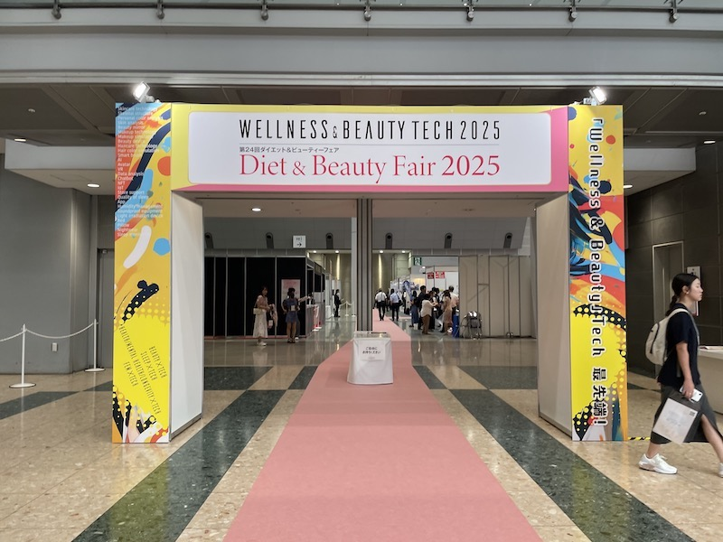
*「Wellness & Beauty Tech 2025 / 第24回ダイエット＆ビューティーフェア」の看板とピンクのレッドカーペット。平日にもかかわらず来場者が続々と入場している。*

Wellness & Beauty Tech 2025（第24回ダイエット＆ビューティーフェア）の入口ゲート。
主催はInforma Markets。平日にもかかわらず来場者は多かった。

---

### セミナー：歴史から予測する未来

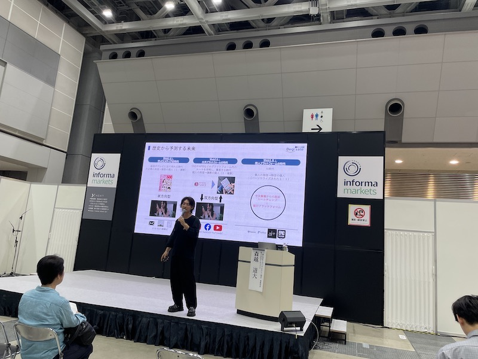
*ビジネスパーソンが着席し、大型スクリーンに映し出された「歴史から予測する未来」のスライドを視聴。ステージ両脇にInforma Marketsのロゴ。*

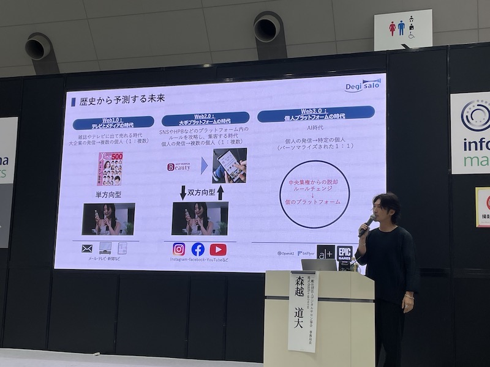
*▲ 森越道大氏（Degi Salo）のプレゼンスライド「歴史から予測する未来」。Web1.0（テレビ・単方向型）→Web2.0（Instagram/Facebook/YouTube・双方向型）→Web3.0（AI・個人プラットフォーム時代）の変遷を3列で図示。右端に登壇者が立つ。*

登壇者は森越道大氏（Degi Salo）。テーマは「歴史から予測する未来」だ。

Web1.0（テレビ・メディア時代）→ Web2.0（大手プラットフォーム時代）→ Web3.0（個人プラットフォーム時代）という変遷を、美容業界に照らして解説した。
「中央集権のルールで戦う時代は終わる。次は個のプラットフォームだ」——その一点に尽きる内容だった。

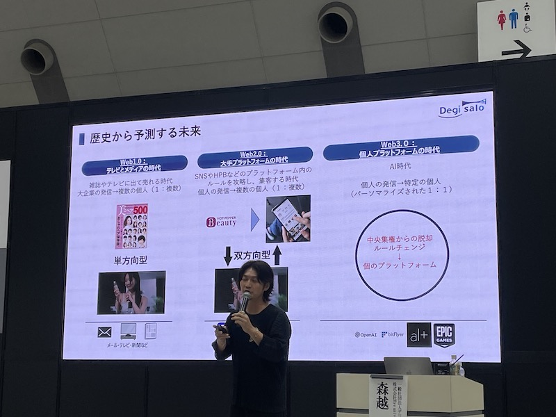
*Web3.0の欄に「中央集権からの脱却・ルールチェンジ→個のプラットフォーム」と明記。OpenAI・bitFlyer・EPIC GAMESのロゴが並ぶ。AI時代は「個人の発信→特定の個人（パーソナライズされた1:1）」と定義。*

SNSやプラットフォームへの依存から脱し、個人が独自にAIを活用する時代が来る。
業界の競争軸が根本から変わる、という主張だ。

---

### セミナー：第4次AIブームと業界への影響

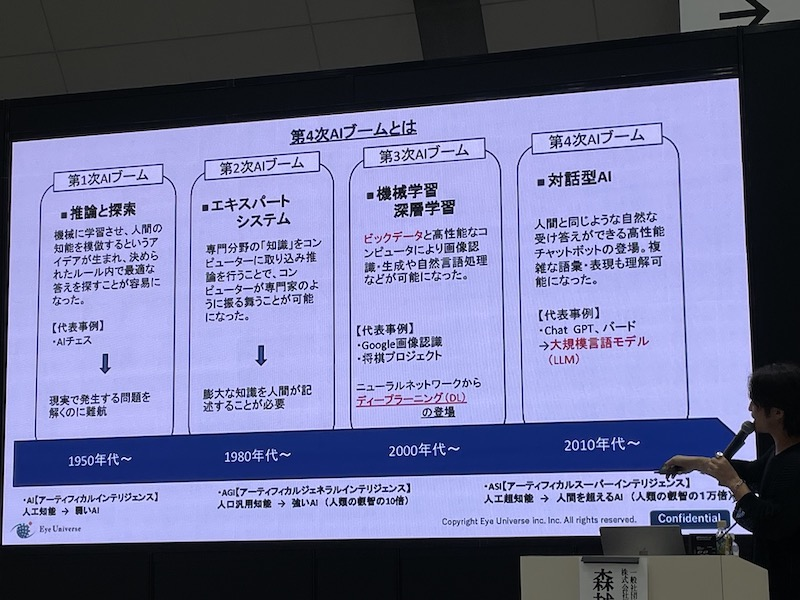
*「第4次AIブームとは」。第1次（推論・探索 1950年代）→第2次（エキスパートシステム 1980年代）→第3次（機械学習・深層学習 2000年代）→第4次（対話型AI・ChatGPT/Bard 2010年代〜）を4列で整理。下部にAI→AGI→ASIの能力軸。*

AI第1次ブーム（推論・探索）から第4次ブーム（対話型AI・LLM）までの歴史を整理した内容だ。
ChatGPT・Bardが体現する大規模言語モデルが、今まさに第4次の中心にある。

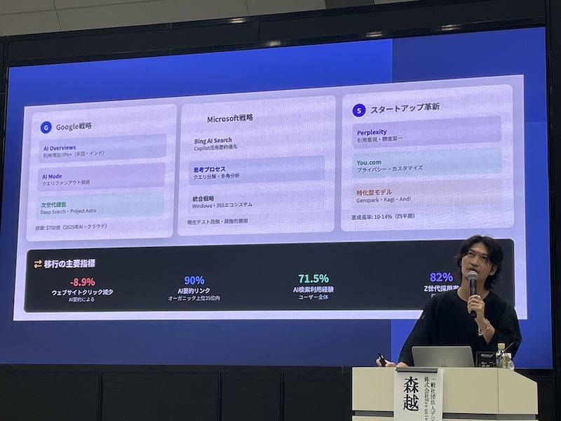
*Google（AI Overviews・AI Mode・Deep Search/Project Astra）、Microsoft（Bing AI Search・Copilot・Windows365エコシステム）、スタートアップ（Perplexity・You.com・特化型モデル）を3列で比較。移行指標としてウェブクリック-8.9%、上位35サイトのAI経由90%、全ユーザーのAI検索経験71.5%、Z世代採用82%を数値提示。*

Google・Microsoft・スタートアップそれぞれのAI戦略を比較。
-8.9%のウェブクリック減、90%のAI経由率という数字が、集客の主戦場が変わったことを示している。

---

### 美容業界の未来像

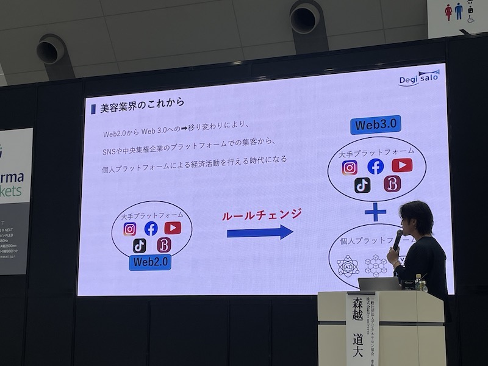
*左のWeb2.0（Instagram・Facebook・YouTube・TikTok等の大手プラットフォーム）から、右矢印「ルールチェンジ」を経て、Web3.0（大手プラットフォーム＋個人プラットフォーム）へ移行する構図を図示。*

Web2.0から Web3.0への移行により、SNS・中央集権プラットフォームでの集客から、個人プラットフォームによる経済活動の時代になる——Degi Saloの主張だ。

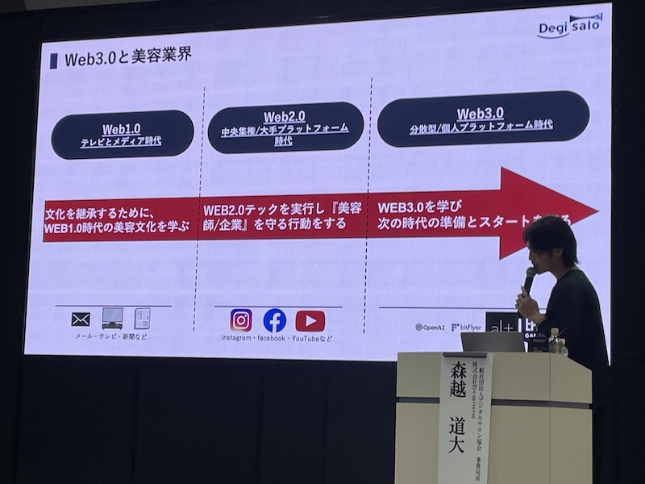
*「Web3.0と美容業界」。Web1.0（テレビとメディア時代）→Web2.0（中央集権/大手プラットフォーム時代）→Web3.0（分散型/個人プラットフォーム時代）を横軸に配置し、各時代に美容師・企業が取るべき行動を対応付けた3列レイアウト。大きな赤矢印が左から右へ。*

Web1.0のメディア文化を学び、Web2.0のテックを実行し、Web3.0で次の準備をする。
美容師に求められる行動を、時代軸で整理したスライドだ。

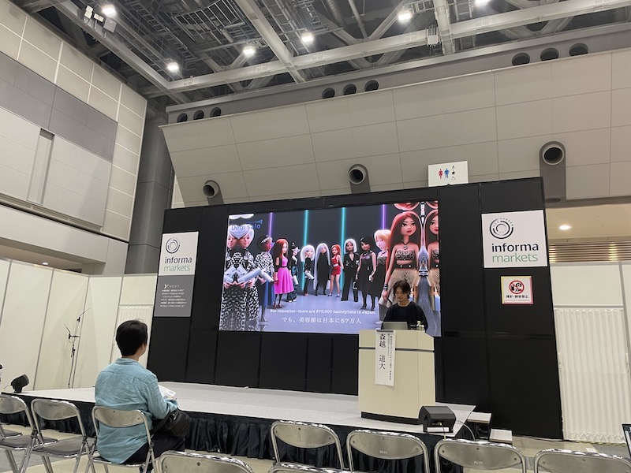
*スタイリッシュな衣装の3DCG美容師キャラクターたちが整列し、「But remember: there are 870,000 hairdressers in Japan / でも、美容師は日本に87万人」のテロップが表示されている。*

日本には87万人の美容師がいる。
その一人ひとりが個のメディアになり、AIをスタッフとして持つ——そういう未来像だ。

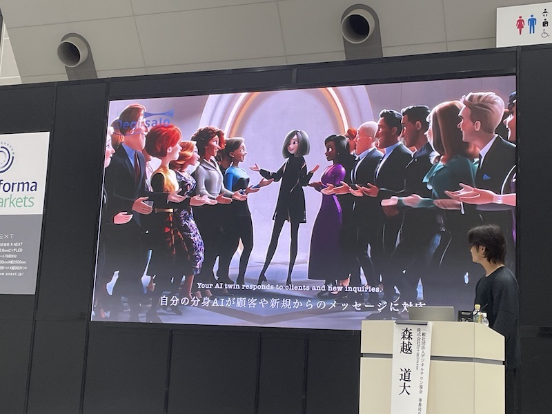
*▲ 同映像の続き。3DCGのAIアバター群が顧客を出迎えるシーン。「Your AI twin responds to clients and new inquiries / 自分の分身AIが顧客や新規からのメッセージに対応」のテロップが画面下部に表示。Degi Saloロゴ。*

「自分の分身AIが顧客や新規からのメッセージに対応する」というビジョンが映像で示された。
絵空事ではなく、すでにサービスとして動いているという話だ。

---

### 健康機器ブース視察

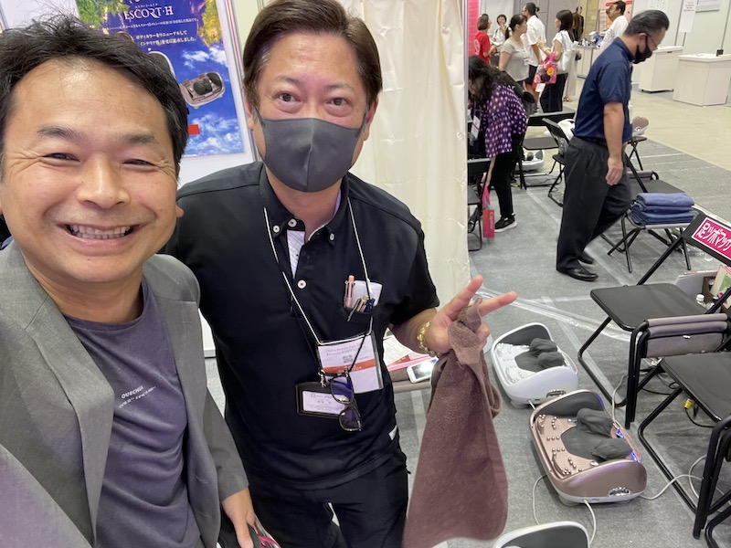
*▲ 健康機器ブースでの2ショット。左が山崎、右がブーススタッフ（黒マスク着用・ピースサイン）。背景にESCORTHブランドの健康機器が並び、フットマッサージャー系の機器が体験用として複数台設置されている。*

健康器具メーカーのブースにて、振動全身マッサージ機のプレゼンを受けた。
内容が有効と判断し、その場で個人購入を決断した。

「自分をサンプルとして考え、30万円以内で本当に効くと思えれば即決する」。
これは展示会における購買判断の一つの基準だ。
展示会でモノが売れる理由は、体験があるからだ。

---

### 化粧品ブース：エンチーム株式会社

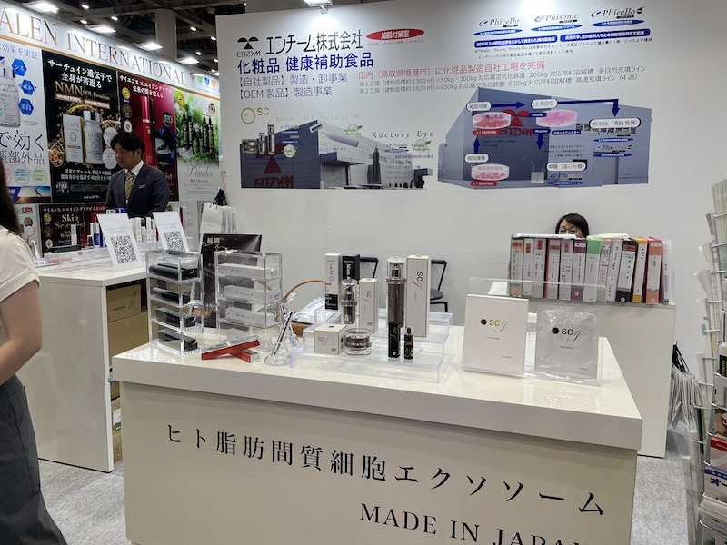
*▲ エンチーム株式会社のブース。手前のカウンターに「ヒト脂肪間質細胞エクソソーム / MADE IN JAPAN」の大型パネルとsc7・Phicella・Ructory Eyeブランドの化粧品群を陳列。右奥に製造工場のフロー図パネル（第1工場300kg/日・第2工場1,356kg/日）。*

時々床屋さんで、人細胞エクソソーム、なるものの頭皮マッサージを受けている。
去りゆく髪に、未練がましく、「待ってくれ、行かないでくれよ」と。
---

### 同時開催：化学品展示会（中西金属）

同時開催の化学品展示会では、同行グループの中で中西金属だけが出展していた。
化学品業界へのリーチを狙った出展とのこと。

**無人フォークリフトの現状：**
- 過去10年の販売実績：60〜70台
- 今回の目玉：屋外対応の無人フォークリフト（新製品）
- 屋外対応モデルの実績はまだ1台

それでも研究開発を続けている。その継続が、いずれ実績になる。

※中西金属ブースの写真なし

---

## 6. まとめ

### 気づき・所感

美容業界の変化は、われわれの業界と構造が似ているともいえる。
集客・営業の主戦場が変わり、それに乗り遅れた事業者は淘汰される。

私個人の話ではあるが、展示会で実際に１０万円ちょっとのブルブルマシーンを買ってしまった——これが自らの心に従った、マーケティング体験である。

「本当に有効」と体感させることができれば、30万円でも即決が起きる。
展示会の役割は、カタログ配布ではなく体験提供だ、と感じた。

この手の機械は、あちこちの展示会で目にすることが多く、既に概要は知っていた、というのも、購入にいたったプロセスの一つであった。

仮にその場で売れなくても、今日にように、いつかくるであろう購入への布石にはなったいたということ。

中西金属の屋外フォークリフトは実績1台。市場はまだ立ち上がっていない。
だが開発は続けている。その姿勢だけは評価に値する。

### 今後のアクション

　運搬車両協会のリフト部会であることもあり、
　後日、中西金属には訪問してみたい