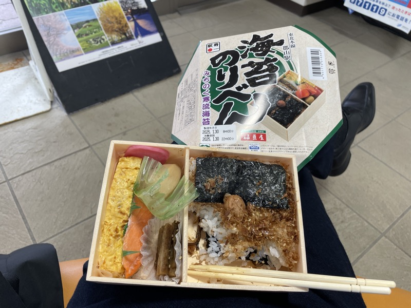
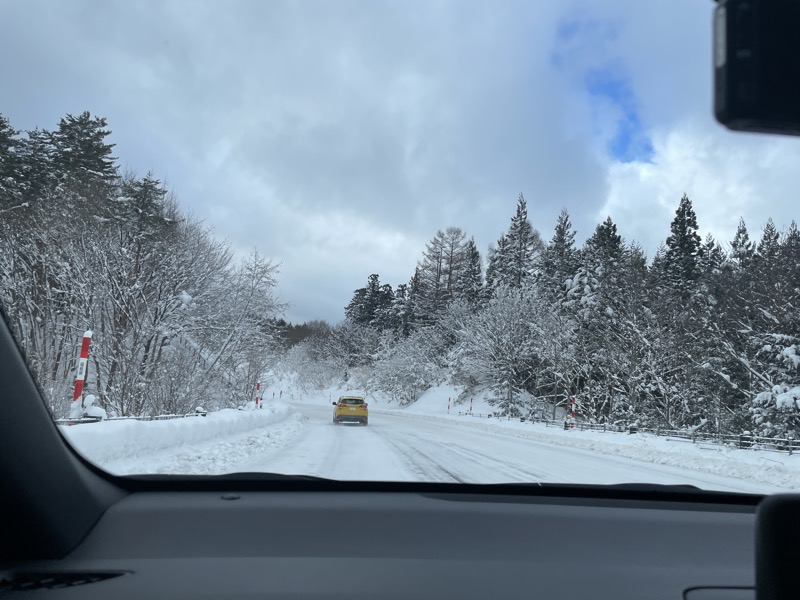
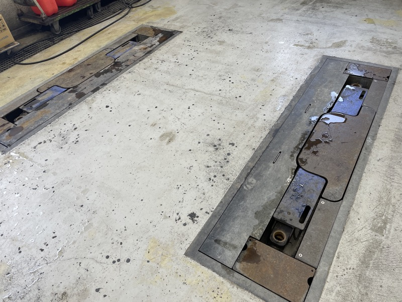
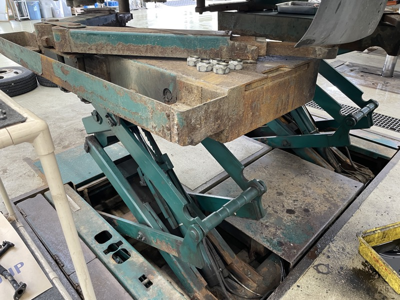
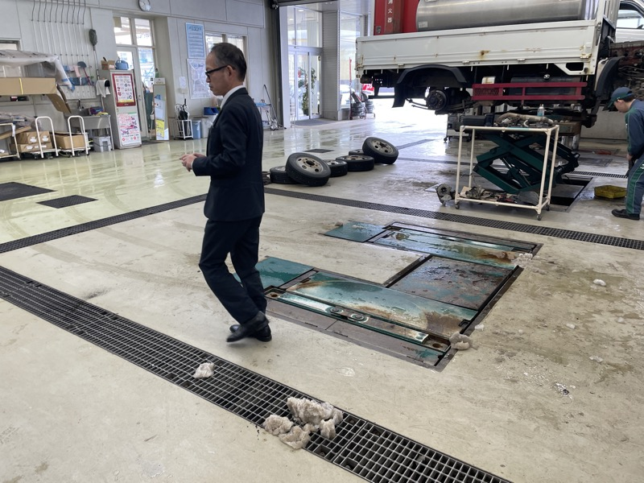
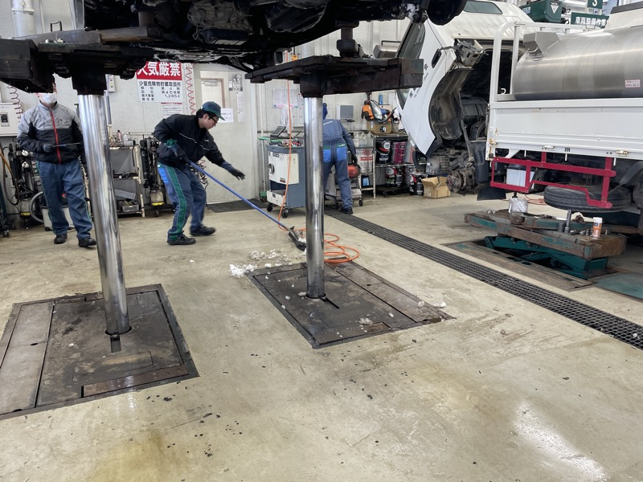
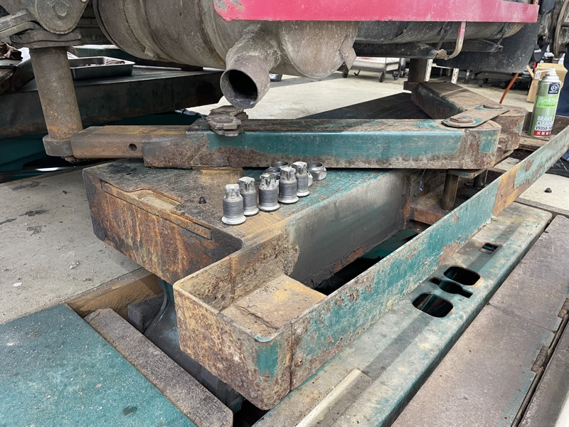
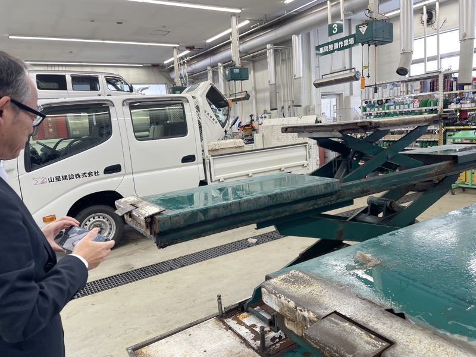
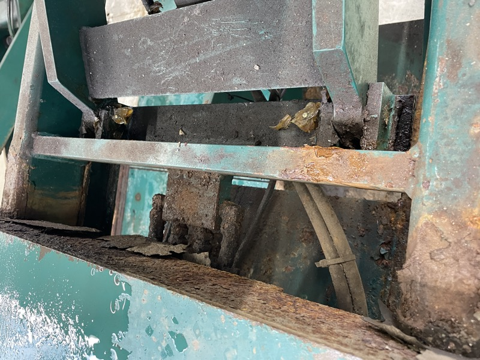
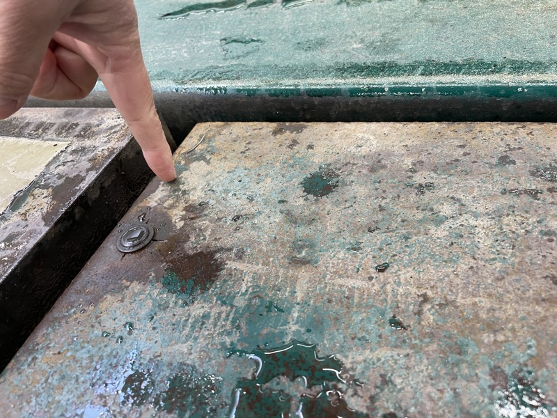

# 福島トヨペット 南会津店 視察報告

---

## サマリー

積雪の峠道を越えて南会津まで足を運んだ。
現場で見たのは、サビで完全に固着し機能を失ったリフトだった。
雪国の現場が抱える過酷さを、目の当たりにした出張だった。

---

## 出張概要・参加者

| 項目 | 内容 |
|---|---|
| 日程 | 2025年1月31日（金） |
| 訪問先 | 福島トヨペット 南会津店 |
| 参加者 | 山崎、廣田GM |
| 記入者 | 山崎 |

 

道中、郡山駅でのひととき。海苔のり弁を頬張りながら、翌日の南会津訪問に備える。

---

## 視察の目的

南会津店に設置されている整備用リフト「マルチ」「ファンタス」の稼働状況を確認するための出張である。
現地から不具合の報告を受け、廣田GM同行のもと、実機の状態を直接確認することにした。

---

## 背景（環境変化）

南会津は豪雪地帯であり、整備工場の床下ピットや屋外設置の機構には、塩カル（融雪剤）や雪解け水による腐食リスクが常につきまとう。
リフトのスイングボードやアームといった可動部は、サビによる固着が起きると機能そのものを失う。
今回の視察は、その「現場の不」が実際にどこまで進行しているかを確認する場となった。

---

## 視察内容

### 峠道を越えて南会津へ

郡山からレンタカーで、積雪の峠道を約2時間走って南会津店に到着した。

 

峠道は完全な雪道。対向車もまばらな中、慎重に車を進める。

### マルチ・ファンタスの状況確認

到着後、整備工場でマルチとファンタスの状況を確認した。
マルチは、2年前に交換したというドライブオンの上段リフトのスイングボードとアームが、サビで完全に固着し、全く機能していなかった。

 

左：床面のピットリフト用カバー。右：シザーリフトの可動部。緑色の塗装の上から、サビが広範囲に浮き出ている。

整備中の車の下部には雪が張り付いており、リフトアップした状態からまず雪落としをハンマーで行うところから作業が始まった。
落下した雪の塊は、当然のようにリフトの上に積もる。整備士がスクレーパーでグレーチングに押し込んで対応していた。

 

左：床のピットには雪解けの塊が散らばる。右：整備士がスクレーパーで雪をグレーチングへ押し込む作業。豪雪地帯ならではの日常風景だ。

スイングボードとアームの接合部を近くで見ると、サビの進行は深刻だった。
ボルト・ナット周辺まで腐食が及び、可動部としての機能はほぼ失われている状態だった。

 

スイングボード接合部のクローズアップ。サビが厚く堆積し、可動部の隙間を埋めてしまっている。

ファンタスも同様に酷いサビで、リンクの鋼材への侵食が心配になるレベルだった。
アームも設計通りに、ボードとのクリアランスを保ったまま浮いた状態での旋回ができていない。

 

左：廣田GMが実機の状態を撮影・確認する。右：旋回機構の内部。サビがリンク部の鋼材まで侵食している。

 

摩耗・腐食箇所を指差しで確認。現場での状態確認は、写真と実際に触れての判断の両方が欠かせない。

---

## まとめ

サビによる固着は、想像以上に進行していた。
2年前に交換した部品ですら、雪国の環境下では着実に蝕まれていく。

雪落とし・スクレーパーでの対応など、現場の整備士が日常的に背負っている負担の大きさも実感した。
リフトという「動いて当たり前」の機器が、豪雪地帯では一段と過酷な条件に晒されている。

今後の対応・原因の特定・改修方針については、本出張だけでは判断材料が不足しており、［要確認：マルチ・ファンタスの今後の修理・交換方針、サビの根本原因（防錆処理の有無等）］とする。
雪国仕様としての防錆対策の必要性は、今回の視察を踏まえて検討すべき論点だ。
