# 第38回 オートサービスショー2025 出展報告

---

## 出展概要

| 項目 | 内容 |
|---|---|
| 展示会名 | 第38回 オートサービスショー2025（THE 38th AUTO SERVICE SHOW 2025）|
| 会期 | 2025年6月19日（木）〜21日（土）|
| 搬入日 | 2025年6月18日（水）|
| 会場 | 東京ビッグサイト 東3ホール |
| 主催 | 一般社団法人 日本自動車整備振興会連合会（日整連）|
| ブース | スギヤス株式会社（Bishamonブランド）|
| 主要展示品 | スライドリフト SSC35LJA、コラムリフト、エリアセンサー、足挟み装置 |
| 参加者 | 山崎 |

---

## 展示会概要

 

第38回 オートサービスショー2025 公式バナー。（出典：banzai.co.jp、https://www.banzai.co.jp、2025年6月）

2年に1度、自動車整備業界が一堂に会する展示会だ。
今回、スギヤスは主力の新商品を引っさげ正式出展に臨んだ。
技術部開発担当者が会場で直接説明に立つ、初めての試みでもある。

---

## Bishamonブース

 
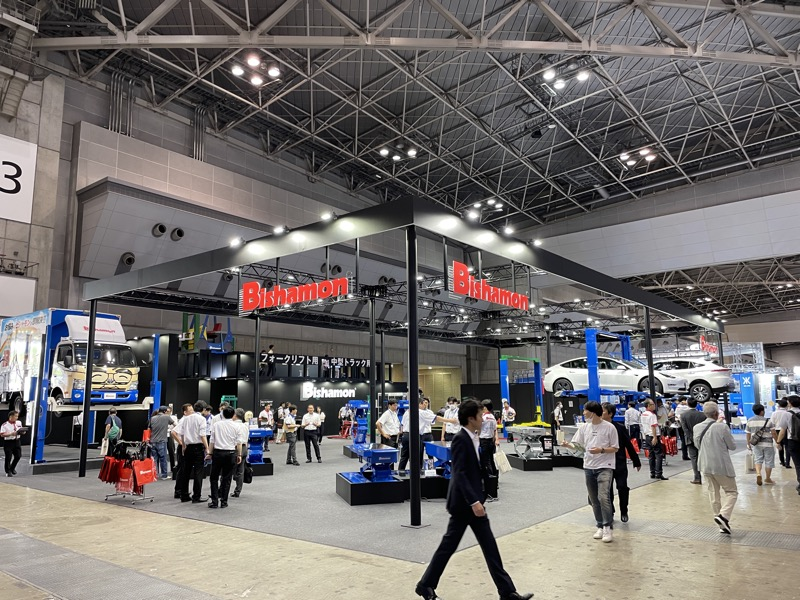

Bishamonブース全景。左にフォークリフト用・中型トラック用リフト、中央にスライドリフト、右奥に白いEVを載せた4柱リフト。多くの来場者でにぎわった。

 

Bishamonブース 4柱リフトにEVを展示。実車（Tesla）を使ったデモが来場者の目を引いた。

今回の目玉は3点だ。スライドリフト（SSC35LJA）、コラムリフト、そしてエリアセンサー・足挟み装置。
プロダクトアウト的な開発商品だったかもしれない。
だが、展示会で市場に直接問えた意義は大きい。

---

## 搬入・準備（6/18）

 
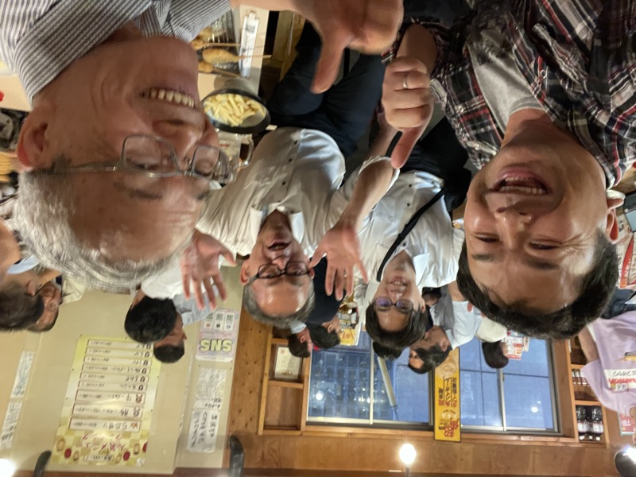

搬入日。東京ビッグサイトにBishamonトラックが横付けされ、製品搬入が進む。

 

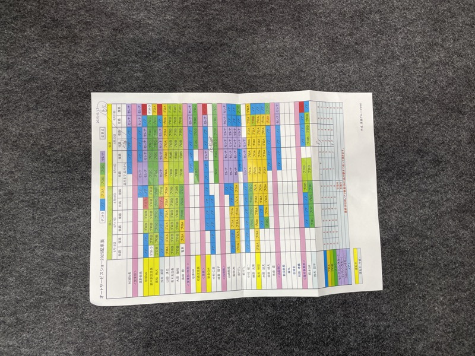

左：オートサービスショーの席次・スタッフ配置表。右：搬入完了後、技術部担当者が営業マン各位に製品の特徴を説明した。

昼頃到着。リモコンに一部プログラムバグが見つかったが、開幕前に正常化した。
4時過ぎ、技術部が営業マンへ直接説明。
技術部にとっての最初のお客様である営業マンの反応は上々だった。

---

## 展示商品

 

スライドリフト SSC35LJA。来場者が実際に動作を確認している。

 

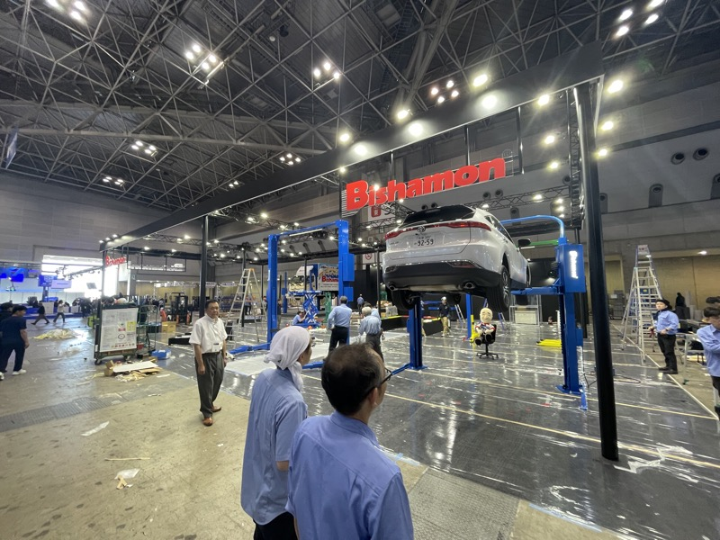
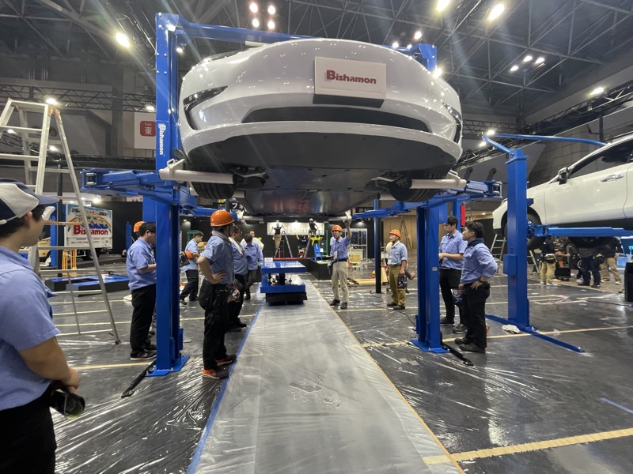

左：全景。右：テスラ。

 

展示製品の前で。

スライドリフトは今回が初公開だ。
エリアセンサーと足挟み装置は、安全コンセプトを加えた新提案。
技術部が蓄積してきた多くのシーズが、初めて市場に問われた。

---

## 初日（6/19）

 

東京ビッグサイト 東ホール内。開場と同時に多くの来場者が詰めかけた。

 

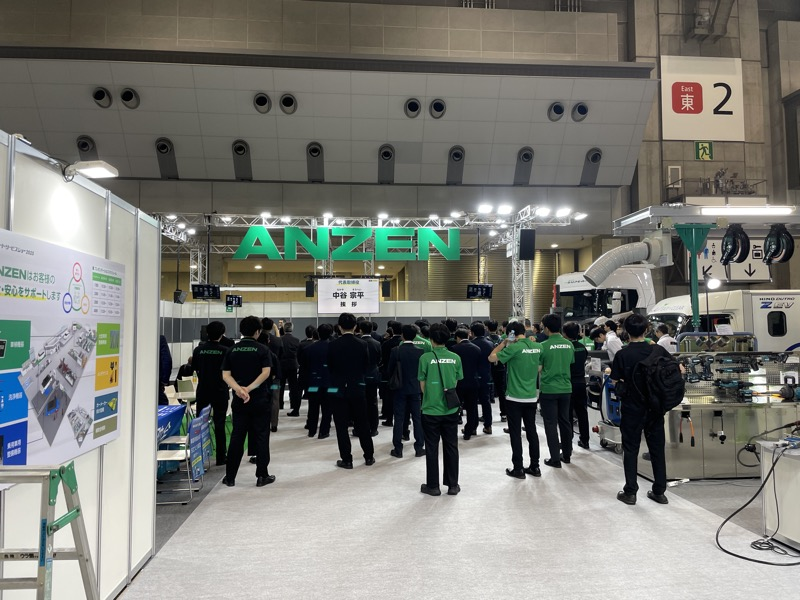
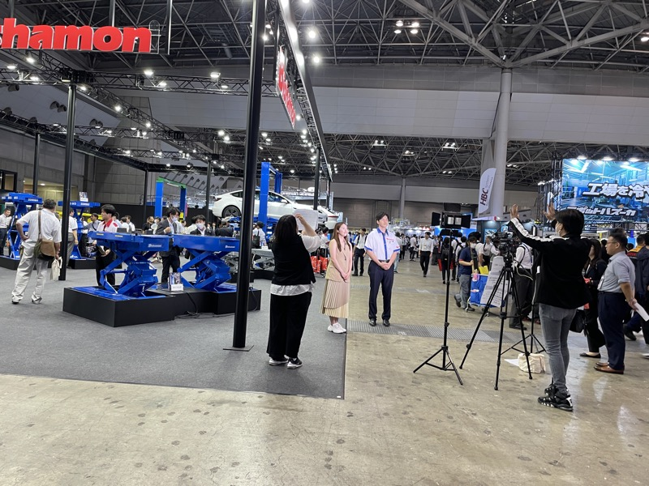

左：ANZENブース 代表挨拶（開幕セレモニー）。右：Bishamonブースにテレビカメラが入り、スライドリフトのデモが撮影された。

予想通りか、予想以上の反応を得た。
業界に長くいる代理店のベテラン営業マンが、即座に理解し前向きな意見をくれた。
展示会ならではの、生の言葉だ。

---

## 2日目（6/20）

 
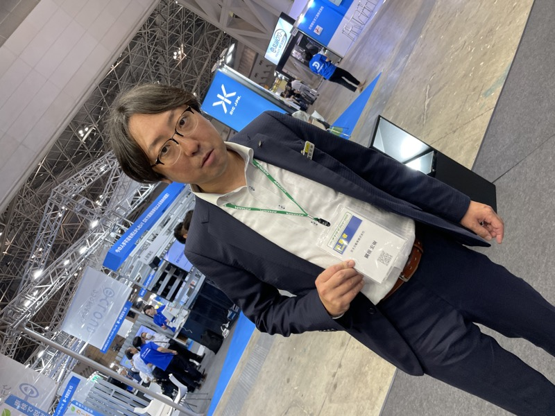

群馬カメイオート 若手創業社長（左）との一幕。道具にこだわる上級指向で、FRZコンセプトを「変態好みのリフト」と称した。

群馬トヨタの関係者がエリアセンサーと足挟み装置に強い関心を示した。
他メーカー系の関係者も同様だ。

群馬カメイオートの若手創業社長は、道具にこだわる本物の変態だ。
「変態とは最高の誉め言葉でプライド」と言い切る男が、FRZコンセプトを絶賛した。
これ以上の評価はない。

---

## 3日目（6/21）

 

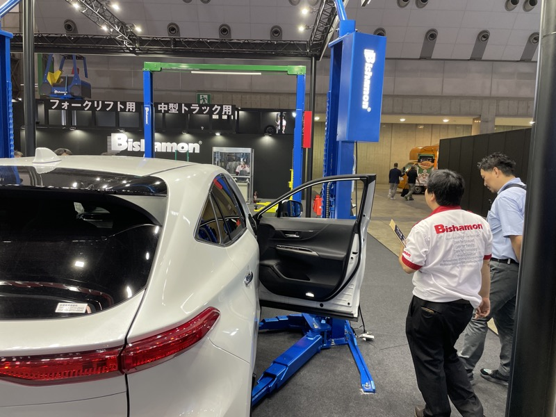
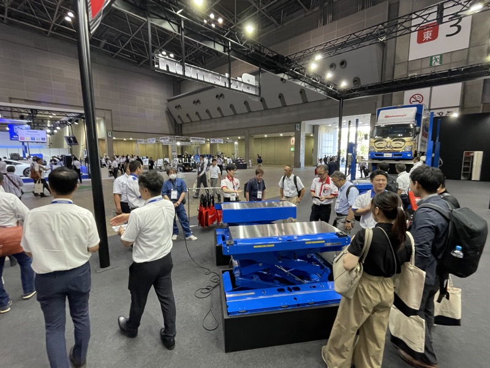

左：イヤサカ斎藤会長との再会。約20年前の中部自動車営業時代の縁が、会場で繋がった。右：ヤスイブース。堀水部長との情報交換は今回最も刺激的な時間だった。

ヤスイ堀水部長との情報交換は、3日間で最も刺激的だった。
今回までは感心させられるばかり。2年後にリベンジしたい。良きライバルだ。

イヤサカの斎藤会長とは、会場で偶然再会した。
約20年前、三重県の駐在時代に同行営業をした相手だ。
「それならぜひ開発会議に出てよ」と言われた。展示会の旧交機能は強力すぎる。

---

## 他社視察

 

左：バンザイブース全景。右：注目の「イーグルアドバンス」。社内の情報交換でこの製品名は誰からも出てこなかった。

 

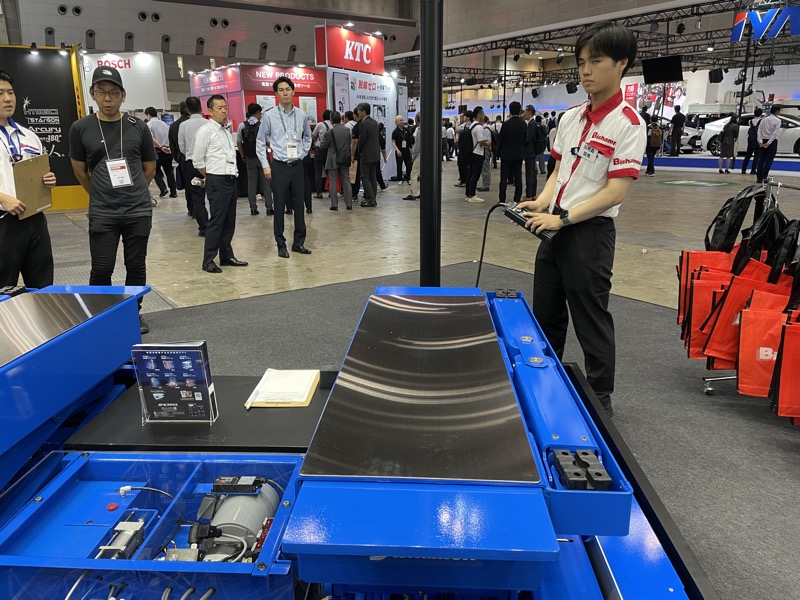
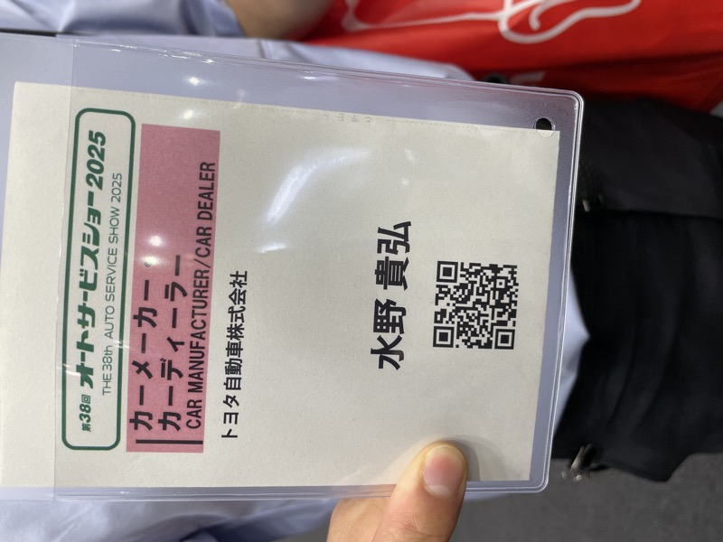

左：イヤサカブース。右：ホイール自動洗浄機（スウェーデン製）。バレル研磨機なども展示。リフト以外の発想が、もう具体化している。

バンザイのイーグルアドバンスは、社内の意見交換で誰からも名前が出なかった。
他社を見て感じたことを語れる文化が、まだない。
設計者の目ではなく、開発者の感覚で見ること。それが求められている。

イヤサカのホイール自動洗浄機はスウェーデン製だ。
リフト以外に踏み込む勇気は容易ではない。
それでも、すでに実物を出している。

---

## 懇親

 
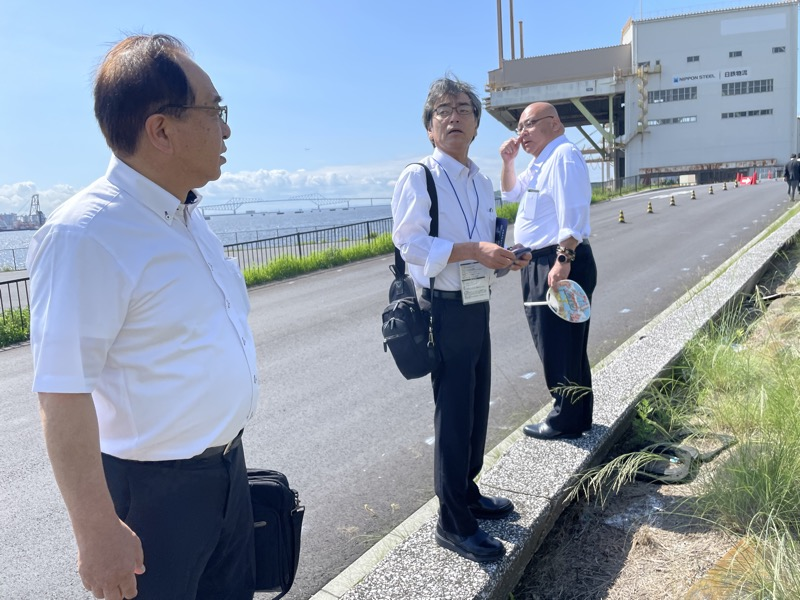

会場外、東京湾沿いにて。日本製鉄の建物を背に談話。

 

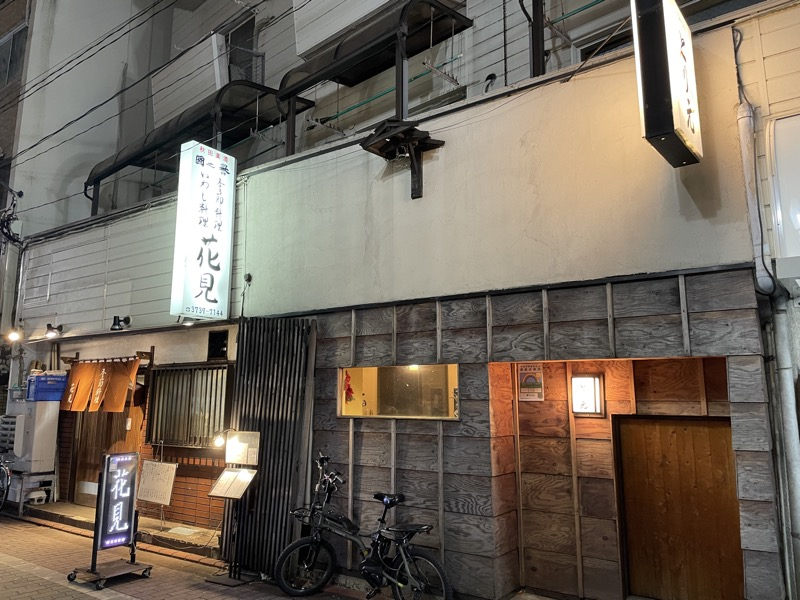

左：花見（居酒屋）外観。右：展示会期間中のチーム懇親。

展示会には、旧交を温めるという強力な機能がある。
斎藤会長との再会もそうだ。やっかいで、ありがたい機能だ。

---

## まとめ・所感

今回の出展は、技術部にとって最初の本番だった。
新商品の反応は予想通りか、それ以上だ。メーカー冥利に尽きる。

最も印象に残ったのはヤスイの堀水部長だ。
感心させられ通しの2年間だった。2年後、リベンジしたい。

カメイオートの若手社長は「変態好みのリフト」と言い切った。
あの一言は本物だ。

帰りの新幹線で、2年後の構想を始めた。
それだけの密度がある出展だった。
