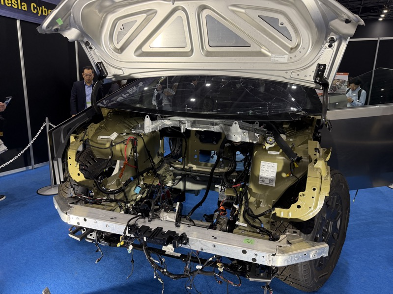
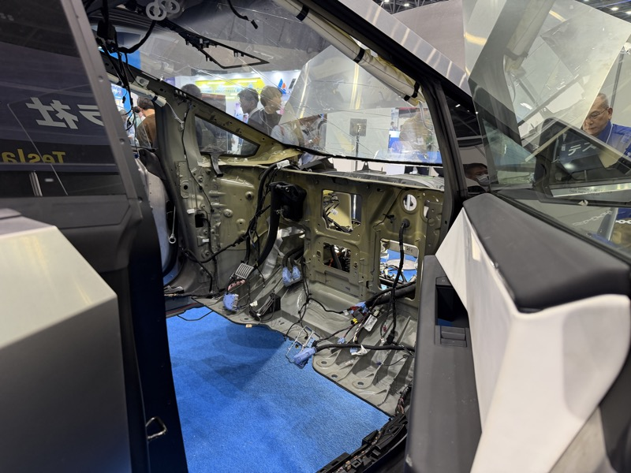
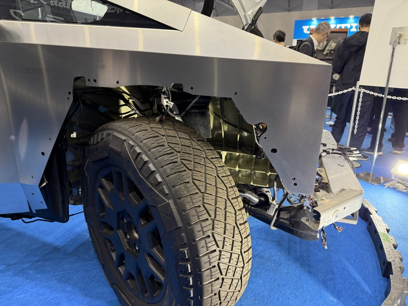
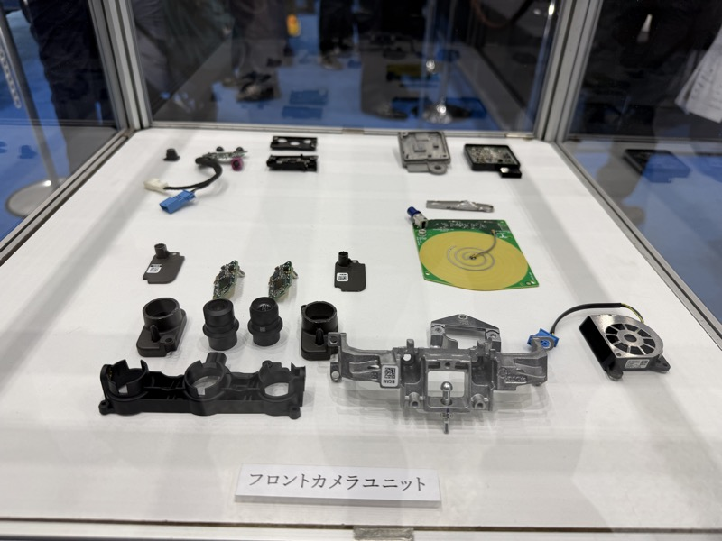
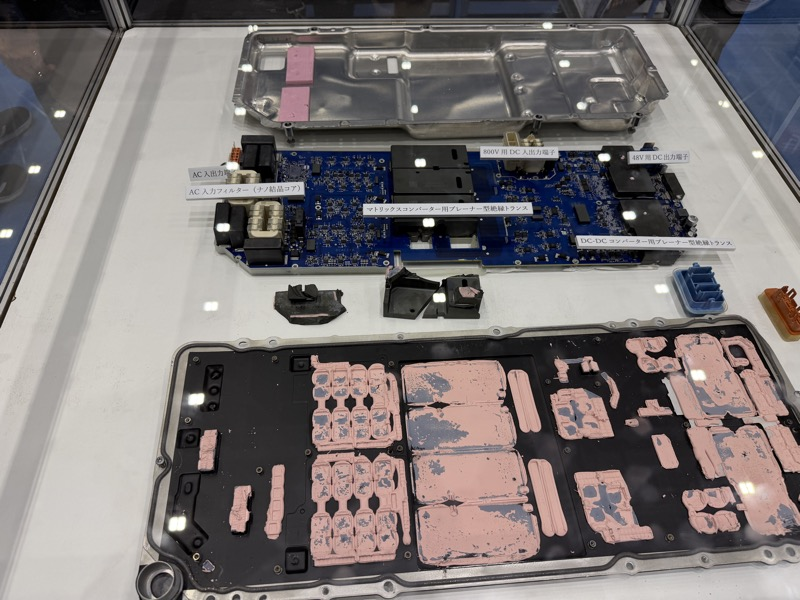
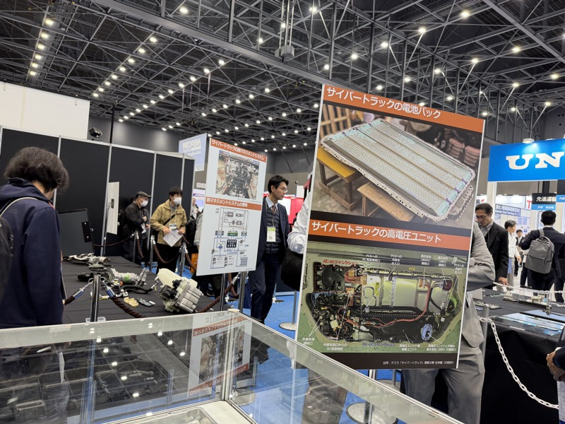
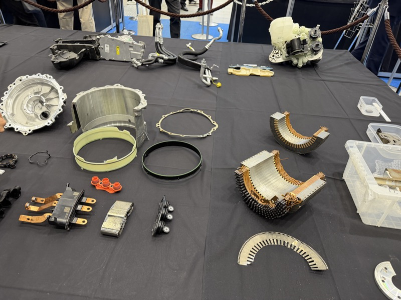
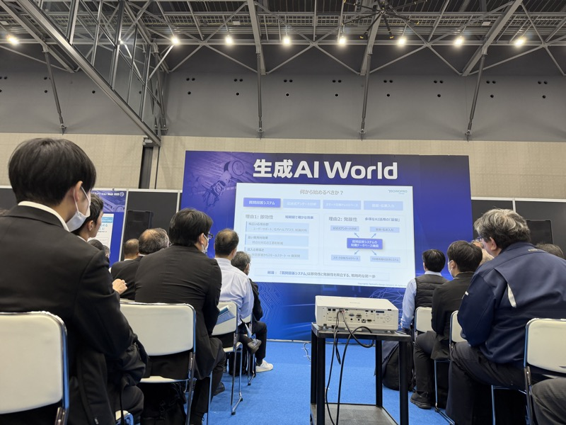
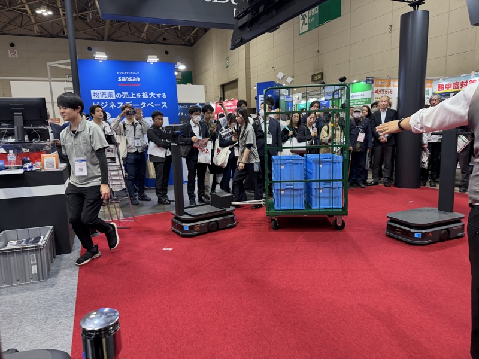

# 2025 生成AI World・ロボット展示会　視察レポート

## サマリー

テスラ・サイバートラックの完全分解展示が、まず目を引いた。
EV技術の透明性と、部品点数の少なさに、改めて衝撃を受けた。

ソフトバンクロボテクスのAMRデモは、黒山の人だかりだった。
追従・牽引・速度制御。すべてが、想像以上だった。

AMRはもはや差別化技術ではない。最低限のラインになりつつある。
その現実を直視しながら、自社の立ち位置を考え直す必要がある。

---

## 展示会概要・参加者

| 項目 | 内容 |
|------|------|
| 日時 | 2025年10月30日（木） |
| 会場 | 名古屋　[要確認：会場名が不明] |
| 展示会 | 生成AI World・ロボット関連展示会（合同開催） |
| 参加者 | 山崎 他|

---

## 視察の目的

- AMR開発に向けたパートナー企業・部品ベンダーの発掘
- ロボット・AI市場のトレンドの肌感覚を得る
- ニデックのドライブユニット活用の糸口を探る

---

## 背景

AMRは、もう珍しくない。
センサーメーカーの北陽でさえ、事例として開発・展示している。
1年ごとに、当たり前のラインが上がっていく。

本来、10年前に取り組むべきテーマだった。
だが、今だからこそ開発コストは下がり、パートナーも増えた。そこに乗っていく。

---

## 内容

### テスラ・サイバートラック 分解展示

スペースフレーム構造が剥き出しの状態。配線・ハーネスの整理が徹底されており、大電流の取り回しもシンプルに見せている。

ボンネット部を全開した状態。前後モーターの配置と電源系の全体像が確認できる。

ドア・内張りを外したキャビン内部。ハーネスの束が、最短距離で這っている。

サスペンション・ブレーキ周辺の足回り。想定より構造がシンプルだった。

フロントカメラユニットの分解展示。複数のカメラモジュールを一体化した構成で、視野・仕様・位置決めが一体設計になっている。

電源管理・インバーター回路の構成。大電流対応の銅バスバーが随所に使われている。

サイバートラックの電池パックと高電圧ユニットの詳細図が掲示されていた。ブース周辺には常に人が集まっていた。

モーター・ギアボックス・インバーターの各パーツがテーブル上に展開されていた。[要確認：製造元が特定できていない]

---

### 昭立電気

少ロットを全く厭わない基板実装メーカー。
整備業界の環境を理解しており、商社経由でイヤサカ向け車検機の基板も製作している実績がある。
弱電はNNP、大電流はここ、という棲み分けが成立しそうだ。相性が良い。

[要確認：写真が特定できない]

---

### HOKUYO（北陽電機）

ASSでのエリアセンサーに採用済みだが、価格が高い。
日立のICHIDASUも60万円超。現状の使い方では、もったいない水準だ。

[要確認：写真が特定できない]

---

### アドバンテック

AMR自社開発を研究テーマとして推進している。
ソニーの汎用カメラ・ソフトウェアとの組み合わせが、コスト面で現実的と感じた。
ニデックのドライブユニットが放置状態にある。前川TL・奥村に、一旦動かすことを指示した。

[要確認：写真が特定できない]

---

### 生成AI World

SHORITSU、AI検査 Worldなど複数ゾーンが並ぶ会場。来場者の密度が高い。

生成AI Worldのセミナーブース。座席は埋まり、立ち見も出ていた。社会的関心の高さを、数字ではなく現場で確認した。

---

### ソフトバンクロボテクス　AMRデモ

飲食店の猫型配膳ロボットから出発して、工業分野へ本格参入。
中国企業との連携とソフトバンクの知名度を武器に、1年を経ずして販売実績がついてきているとのこと。

担当者が台上に立ち、カメラに映りながらボタン一押し。追従する相手を認識し、急旋回にもついてくる。速度制御が繊細で、怖さは全くない。

300kgの台車を牽引しながら自走するデモ。観客が四方を取り囲む状況でも、安定して動いていた。

黒山の人だかりだった。世の中の関心の高さは、本物だ。

---

### IDEC・ソミックトランスフォーメーション

ナカネット展示会に続き、ここでも精力的に出展していた。

[要確認：写真が特定できない]

---

## まとめ

### 気づき・所感

戦意喪失しそうになることを、自覚した。
だが、くらいついていくしかない。

AMRは当然の方向性として定着している。今から商品化して何を差別化するか、は別問題だ。
最低限この水準に追いつかなければ、その先はない。

逆に言えば、今だからこそ環境が整ってきた。要素技術として取り組んでいく。

### 今後のアクション

- 前川TL・奥村：ニデックのドライブユニットを使ってAMRを一旦動かす
- 昭立電気との取引可能性を検討（大電流基板の受け皿として）
- アドバンテックのソニーカメラ組み合わせを調査継続

