# 2025国際ロボット展（iREX2025）視察

---

## 出張概要

| 項目 | 内容 |
|---|---|
| 展示会名 | 2025国際ロボット展（iREX2025）第26回 |
| 会期 | 2025年12月3日（水）〜6日（土）10:00〜17:00 |
| 会場 | 東京ビッグサイト 西1〜4ホール・東4〜8ホール |
| 主催 | 一般社団法人 日本ロボット工業会 / 日刊工業新聞社 |
| 出展規模 | 過去最多：673社・3,334小間（14カ国） |
| テーマ | ロボティクスが拓くサステナブルな社会 |
| 視察日 | 2025年12月3日（水）・4日（木） |
| 視察者 | 山崎 |

---

## 展示会概要

 

iREX2025 公式バナー。第26回・過去最多673社・3,334小間が出展。（出典：robot digest、https://www.robot-digest.com、2025年12月）

 
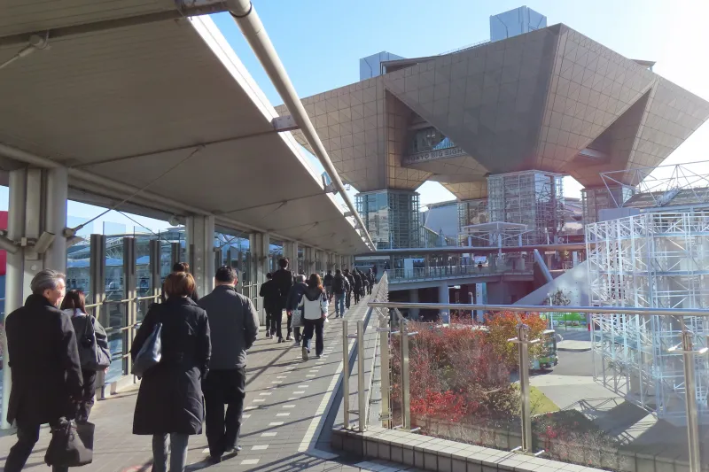

東京ビッグサイトへ向かう来場者の列。（出典：robot digest、https://www.robot-digest.com、2025年12月）

2年に1度の国際ロボット展。今回は過去最多の規模だ。
来場者・出展者ともに、今年視察した展示会の中で最高の熱量だった。
世の中のロボットへの関心が、もはや別次元に達している。

---

## 入場

 
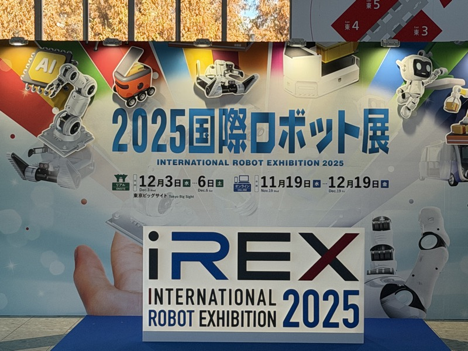

iREX2025 入場口。東京ビッグサイト 西ホール。

---

## Day 1（12/3）— IAIブース

約束していたIAIブースへ向かった。
今回の目玉はコンベアだ。
自社のシミュレーションソフトを事前公開し、顧客が十分に検討できる仕組みを整えている。
見積もりは代理店経由、設置はユーザー自身が行う。
ハードとソフトの工夫で設置コストを落とすコンセプトは、これまでにはなかった。

もう一点、防塵・防滴のロボシリンダーが目を引いた。
スクーバーのリピート改造で多段高さ制御を実現している。
水場の現場への提案可能性を感じた。

🟥🟥🟥🟥🟥🟥🟥🟥🟥🟥🟥🟥🟥🟥🟥🟥🟥🟥🟥🟥
<b>▼ 追記（AYamazaki 26/06/26）</b>

 
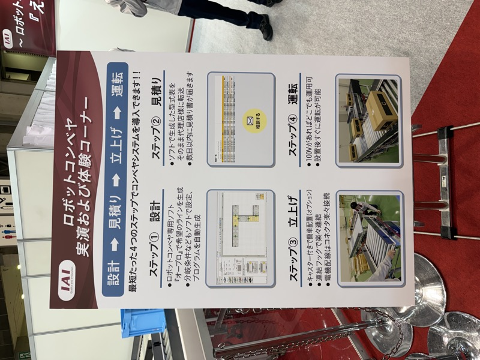

IAIブース「ロボットコンベヤ 実演および体験コーナー」の説明パネル。設計→見積り→立上げ→運転の4ステップでシステムを導入できることを図解。シミュレーションソフト「オーブロ」で自動設計・プログラム生成を行う。

 

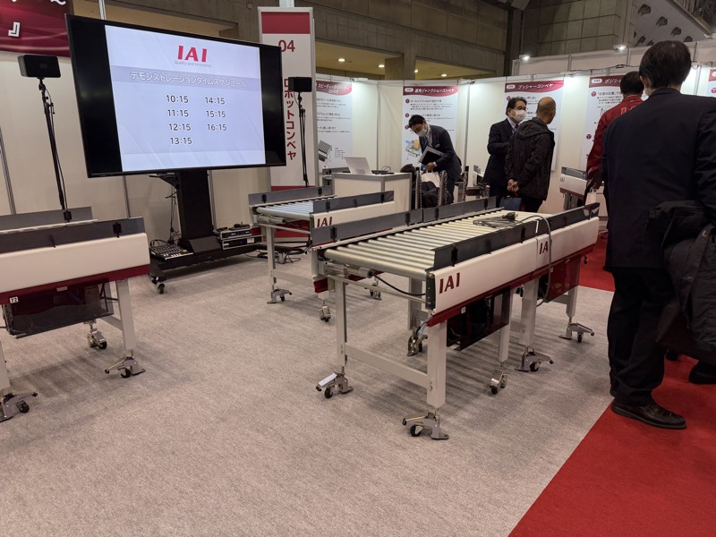
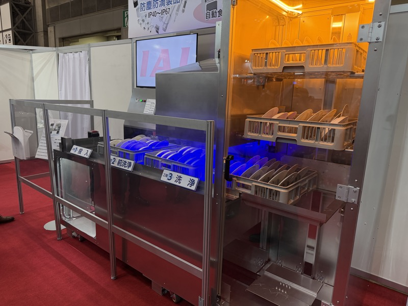

左：IAIブース ロボットコンベヤの実機展示。デモは1時間ごとに実施（10:15〜16:15）。右：IAI 防塵防滴装置（IP40〜IP67対応）。前洗入・前洗浄・洗浄の3ステップの自動洗浄システム。水場の現場に直接対応できる。

🟥🟥🟥🟥🟥🟥🟥🟥🟥🟥🟥🟥🟥🟥🟥🟥🟥🟥🟥🟥

---

## GMO AI&ロボティクス商事 ／ ものづくり太郎

会場で最も人を集めていたブースだ。

 
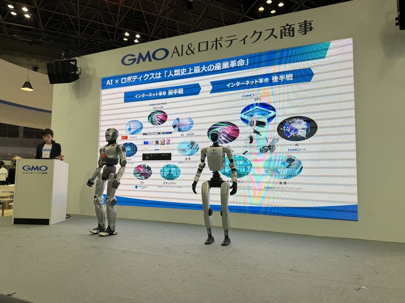

GMO AI&ロボティクス商事ブース。2台の中国製ヒューマノイドがステージに立つ。スクリーンには「AI×ロボティクスは人類史上最大の産業革命」。

ステージには2台の中国製ヒューマノイドが静止していた。
スライドは「インターネット革命の前半戦（インフラ・EC）」と「後半戦（AI・ロボティクス）」の対比だ。
GMOグループは「ロボティクス商事」として本格参入している。

 

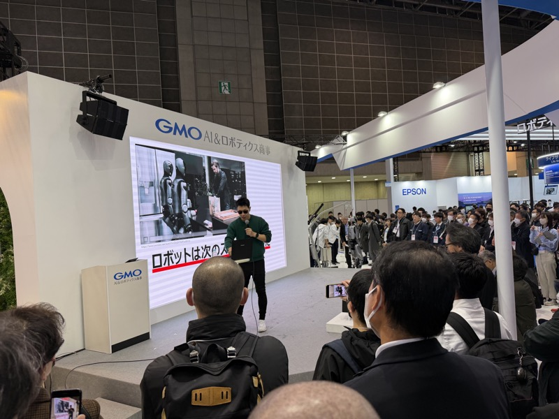

GMOブースのステージ。登壇者はYouTubeチャンネル「ものづくり太郎」。「ロボットは次のステージへ」をテーマに講演。来場者がステージを取り囲んでいた。

 

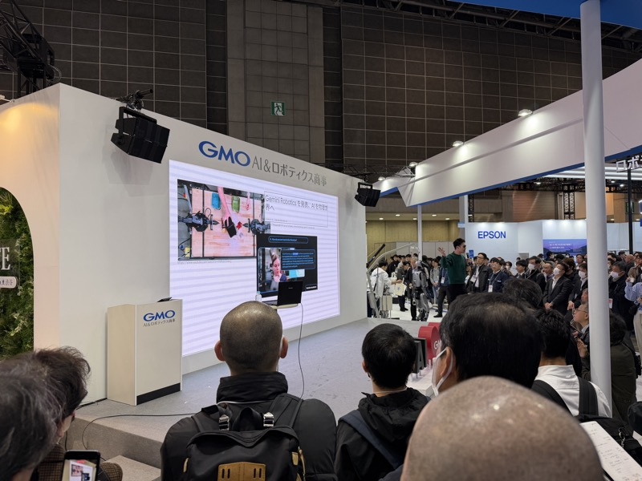

左：「Gemini Robotics を活用した社会へ」スライド。右：スクリーンにヒューマノイドロボットの実演動画。会場全体が前のめりになっていた。

ものづくり太郎の言葉は明快だった。
「この分野のスピードは、NCなんかの年単位とはレベルが違う」。
まさにその通りだ。

 
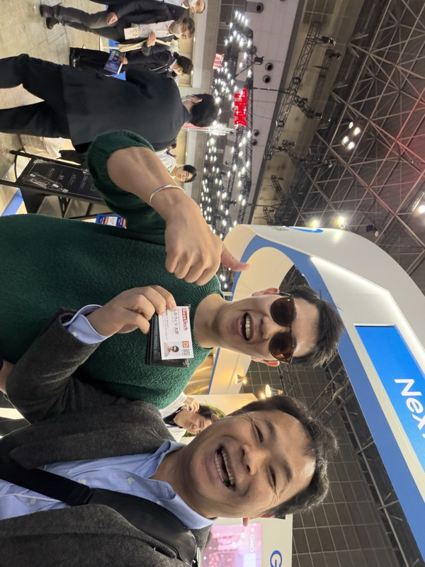

ものづくり太郎氏（サングラス）と山崎。来場者でごった返す会場の一角にて。

 
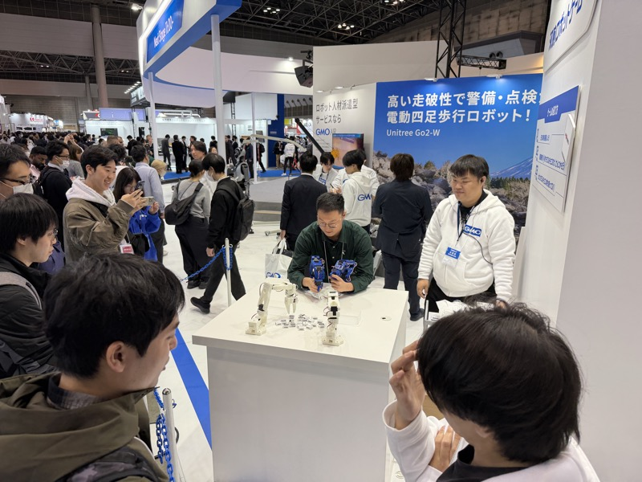

GMOブース展示：Unitree Go2-W（電動四足歩行ロボット）。「高い走破性で警備・点検」を訴求。

---

## 中国製ヒューマノイドの衝撃

人型・犬型ロボットは、中国の独壇場だ。
動画では半信半疑だった。
実物の滑らかなダンスを目の当たりにして、絶望的な差を感じた。

日本の有名メーカーが出しているのは、相変わらずの6軸か、せいぜい双腕だ。
中国との差は10年以上ある。対抗しようとする意味すら薄い。

---

## マテハン・AMR各社

マテハン関連も多数出展していた。
これまで聞いたことのない会社が、着実に販売実績をつくりつつある。

 
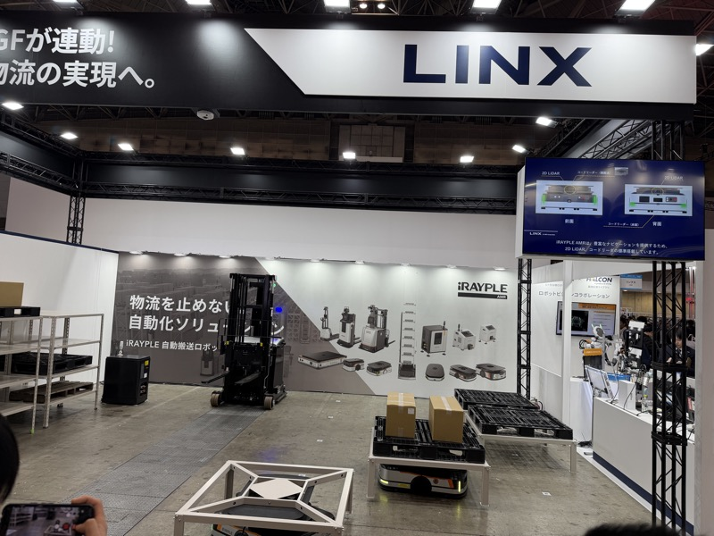

LINXブース：iRAYPLE AMR。「物流を止めない自動化ソリューション」を掲げ、自動搬送ロボットから自動フォークリフトまでラインナップを展示。

 
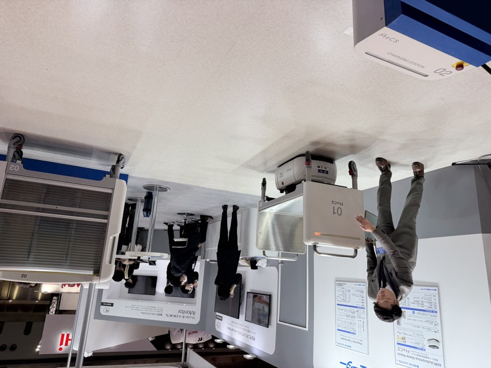

MoCS（Autonomous Mobile Robot）のデモ。カートを牽引して走行する。NACHiブースとの隣接エリア。

 

KAIZEN Mobile Robots / Doogブース。「2025年12月4日」のカウンター表示が見える。国内AMRメーカーが着実に存在感を上げている。

---

## SEERコントローラー ─ AMRのスタンダード

 
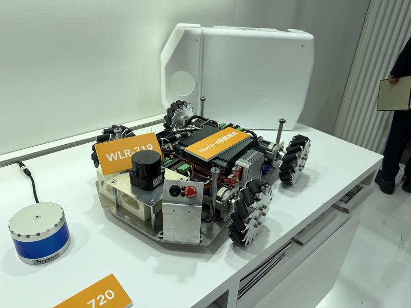

SEER製 WLR-719コントローラー（メカナムホイール搭載AMRシャーシ）。左は2D LIDARセンサー。「Naviho搬送単元」として中国AMR市場に浸透している。

中国AMRのコアを握っているのがSEERというコントローラーメーカーだ。
昔の「インテル入ってる？」と同じ構図でスタンダードになっている。
基礎知識があるエンジニアなら、このコントローラーでAMRを組める。
廣田GMはショールーム見学を既に約束している（2026年3月予定）。

---

## DMP商社からの情報

数ヶ月前の展示会で接触したDMPという商社兼メーカーから、有益な情報を得た。
パチンコ関連の半導体に強みがあり、今後の成長柱に搬送装置を考えている会社だ。
台湾・中国の事情に明るい。
今後も継続的にフォローする価値がある接点だ。

---

## その他展示

 

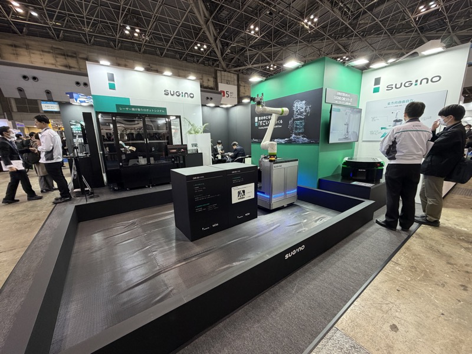
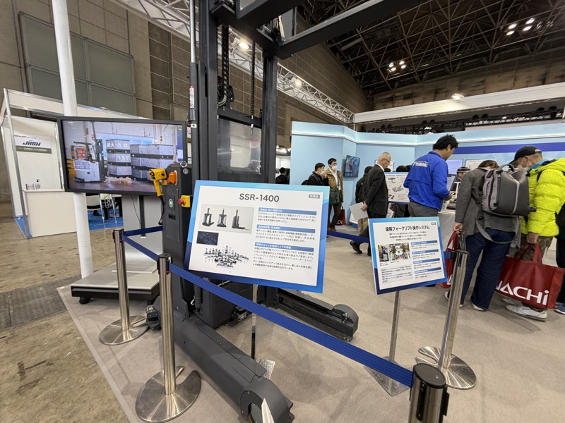

左：SUGINOブース。協働ロボットアームと全方向自走型プラットフォームを組み合わせたシステム。右：SSR-1400 自律走行フォークリフト。通路フォークリフト省力システムとして展示。

 
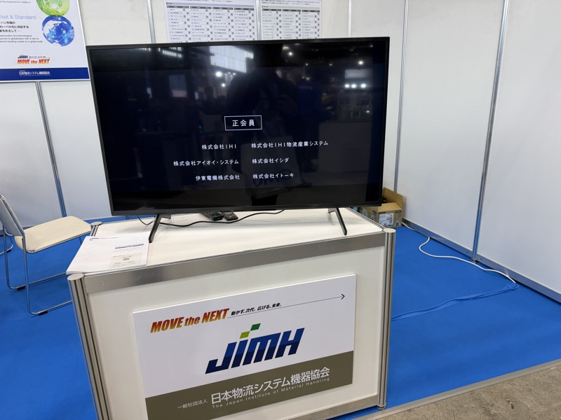

JIMH（日本物流システム機器協会）ブース。「MOVE the NEXT」をテーマに、IHI・アイオイ・システム・伊東電機・イシダなど会員各社の紹介映像を放映。

 
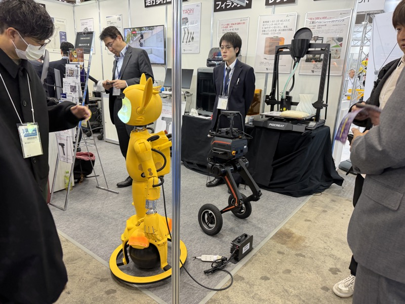

黄色い人型ロボットと一輪型モビリティが並んで展示。中小・スタートアップの出展も目立った。奥はPIOCREATの3Dプリンターブース。

 
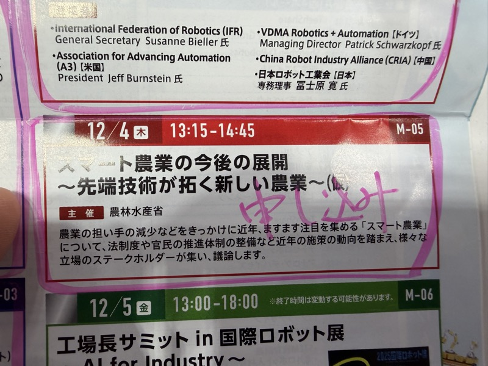

展示会プログラム冊子。12/4（木）13:15〜「スマート農業の今後の展開」（農林水産省主催）に申し込みのメモ。12/5（金）には「工場長サミット in 国際ロボット展 AI for Industry」も開催予定。

 
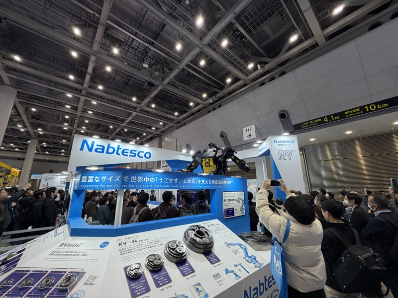

Nabtescoブース。精密減速機RV®シリーズ（RVmini〜RV-3200N）を一堂に展示。「豊富なサイズで世界中のうごかす・とめるを支える」。頭上には巨大ロボット型モニュメント。来場者で溢れかえっていた。

 
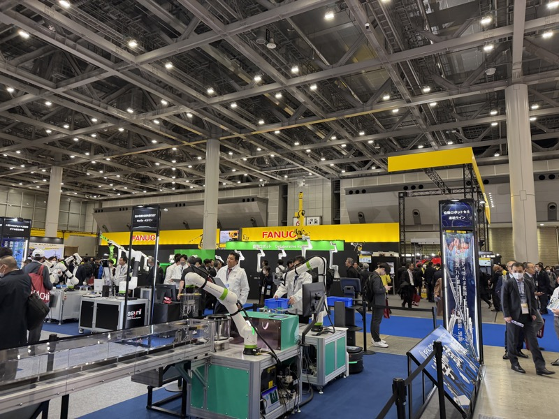

FANUCブース。黄色いボディの産業用ロボットと協働ロボットのデモラインが並ぶ。国内大手の貫禄だ。

 
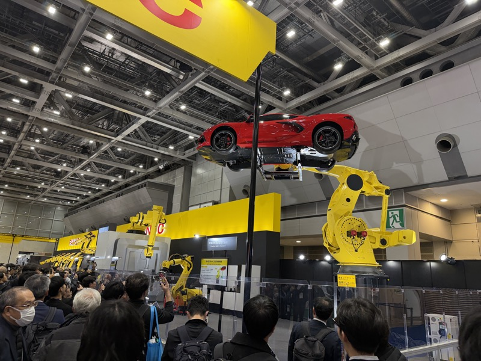

FANUCの巨大ロボットアームが赤いスポーツカーを持ち上げるデモ。会場で最もインパクトのある展示の一つ。来場者が大挙して集まっていた。

🟦🟦🟦🟦🟦🟦🟦🟦🟦🟦🟦🟦🟦🟦🟦🟦🟦🟦🟦🟦
<b>▼ 追記（AYamazaki 26/06/26）</b>

 

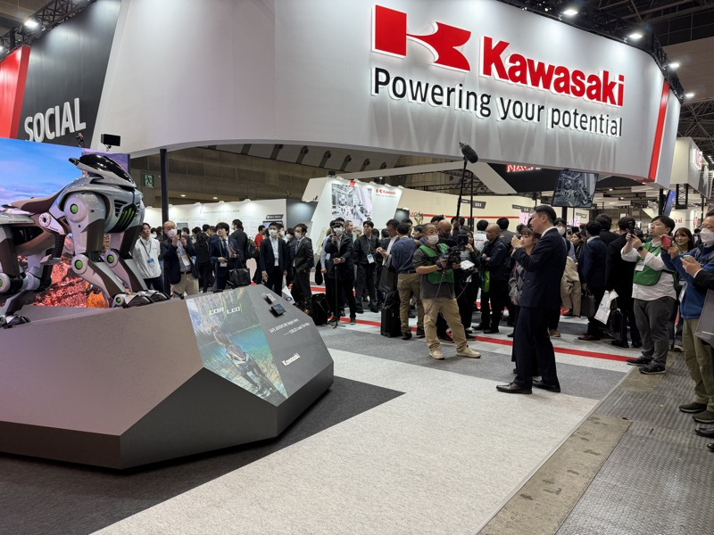
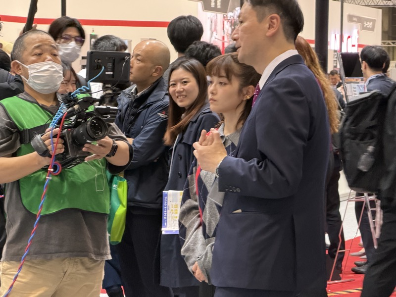

Kawasakiブース（「Powering your potential」）。CORLEOと思われる展示に来場者が殺到。TVカメラが入っていた。Nippouにある「タレントの井上さくらさん」もいた！！他の展示会ではあまりこういった目撃は無い。

🟦🟦🟦🟦🟦🟦🟦🟦🟦🟦🟦🟦🟦🟦🟦🟦🟦🟦🟦🟦

---

## まとめ・所感

今回のiREX2025は、これまで視察した展示会の中で別格だった。
密度が違う。世の中のロボットへの関心が、もはや産業の主役になっていることを、身体で感じた。

最大の衝撃は、中国製ヒューマノイドだ。
10年以上の差がある。対抗することは意味のない戦いだ。
日本の大手が6軸や双腕を展示している間に、中国はAIと融合したヒューマノイドを量産体制に入れている。

SEERのAMRコントローラーは要注目だ。
「インテル入ってる？」的なポジションを中国AMR市場で確立している。
廣田GMとのショールーム見学（2026年3月）で実態を掴む。

DMPとの接点は継続的に深める価値がある。
台湾・中国の最前線情報を持っている商社だ。

IAIのコンベア事業は新しいコンセプトだ。
シミュレーション先行・代理店見積・ユーザー設置という流れは、従来にはなかった。
水場対応ロボシリンダーは、提案の幅を広げる可能性がある。

---

## その他の写真

本編の流れには収めなかった写真・動画サムネイルを収録する。

 

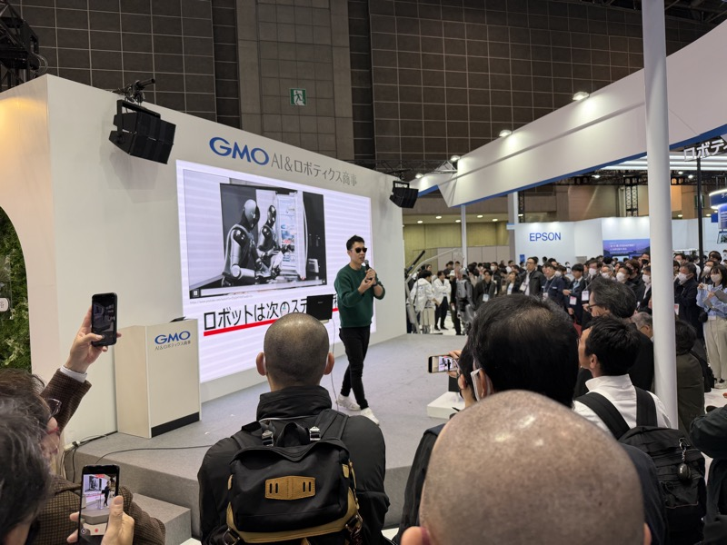
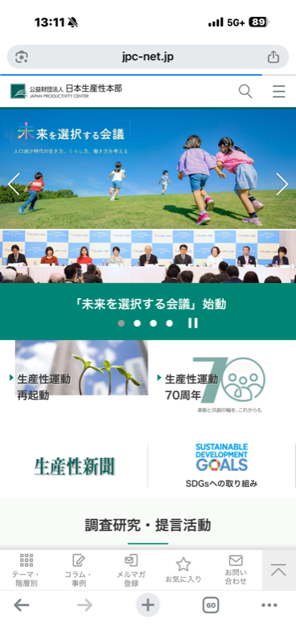

