# Electric China 2025 出張報告（上海・天津）

> 期間：2025年4月15日（火）〜4月18日（金）
> 参加者：山崎（記入者）、奥村
> 目的：Electric China 2025（慕尼黑上海電子展／electronica China）の視察、天津マーケティングリサーチ、NIDECドライブ・テクノロジー（中国）工場見学
> 本報告書は、現地で記録した日報（`Nippou.txt`）の内容をそのままの構成・表現を基本としつつ、見出しによる整理と、写真・技術的考察・新商品開発への示唆を加えたものです。日報本文の事実・所感・評価は変更していません。

---

## Day1：2025年4月15日（火） 上海到着・Electric China展示会初日

### 移動・到着

セントレアから2時間半で、上海浦東空港に到着。中国東方航空であったが、短いフライトの間にも美味しい機内食が提供されるなど、思いの外快適であった。

到着してからが長い。巨大な空港でとにかく歩く、エスカレーターで上がって下がって、地下鉄に乗ってようやくイミグレーションにて至る。

ガタガタと揺れの激しい、時速300キロのリニアに乗って約10分で展示会場の最寄駅に到着。ヨーロッパに比べれば、はるかに楽な道中であった。

 
*時速301kmを示すリニアの車内表示*

### 展示会場の下見

既に夕方であったが下見がてら、展示会場に入場した。半導体にまつわる会社が集まっている。出展企業はめちゃくちゃ多い。来場者も、とんでもなく多い。

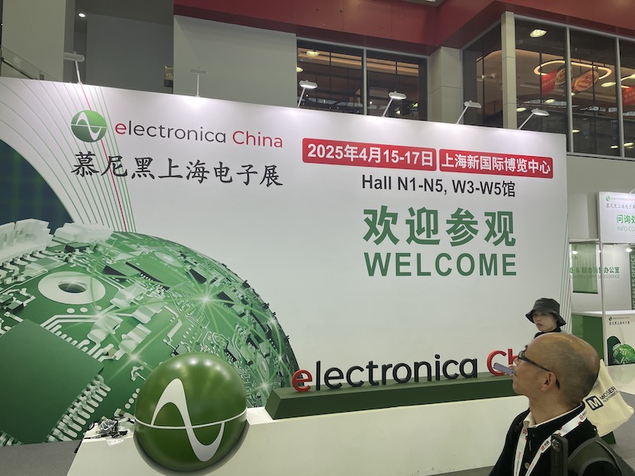 
*electronica China（慕尼黑上海電子展）の案内バナー。会期2025年4月15〜17日、Hall N1-N5・W3-W5館*

 
*上海新国際博覧中心（SNIEC）入口にて*

全体の2割ほどを足早にみて回っただけであるが、パッと見て、知っている日本の会社は、日立、muRata、TDKくらい。

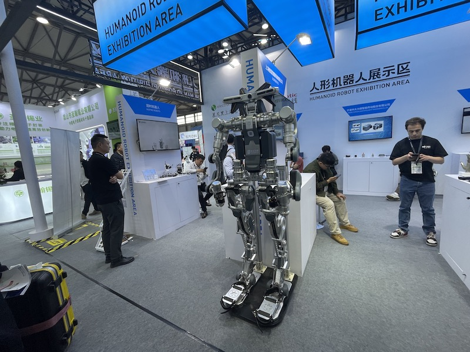 
*会場内「人形机器人展示区（Humanoid Robot Exhibition Area）」*

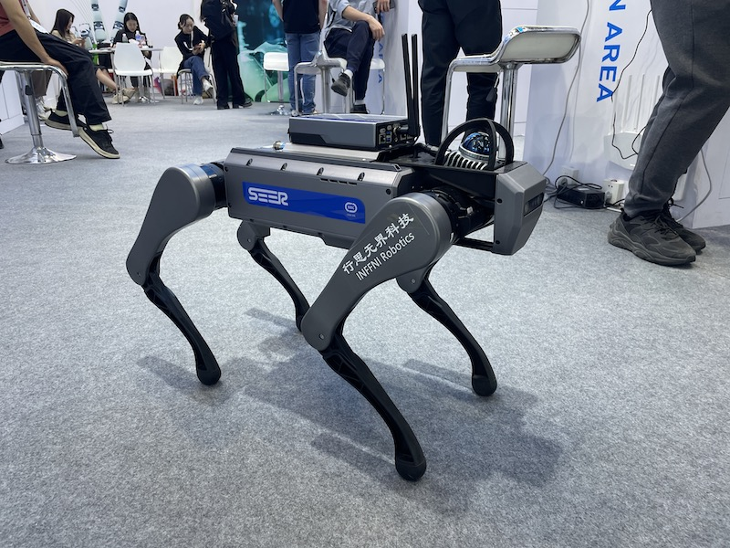 
*SEER（行启无界科技／INFINI Robotics）ブースの四脚ロボット*

 
*半導体企業ブースに併設展示されていたEV（小米／Xiaomi）*

ドイツでも感じたことであるが、これほどまでに、知らない会社が、派手に活躍しているのを見ると、自分の無知を思い知らされる。

半導体だけでこれほどの規模の展示会ということは、中国全体の経済がおして図られる。トランプ大統領が、あれほどまでにムキになるのもわかる、とてつもない脅威である。

外国人は少なかった。基本的には、中国国内で多くの取引が完結しているような印象を受けた。

EPほかの電動車メーカーも、上海近郊に拠点があり、当然にこうした半導体企業との交流もあるのであろう。以前、ノブリフトに訪問した時には、日本人の改善や、ヨーロッパ人のデザインの話もあった。足りない資源は、外部から調達している。

### 所感

同行している奥村くんは優秀ではあるが、技術レベルには限界がある。奥村くんと話をしていても、若手を育てると言っても、10年かけてモノになるかどうか、であろう。

自分としては、物流商品開発の方向性として岡目八目で、電動化からモーターの内製に向かっていくのが、一つの方向性では？と考えていたが、現状、かなり険しい道であると、感じさせられた展示会初日となった。

明日はじっくりと見てまわる予定。

> 激混みの、上海地下鉄2号線内より

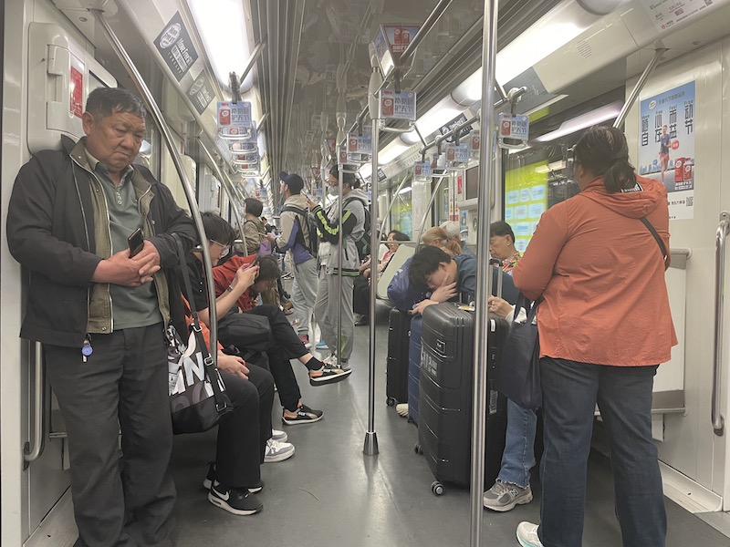 
*上海地下鉄2号線、ラッシュ時の車内*

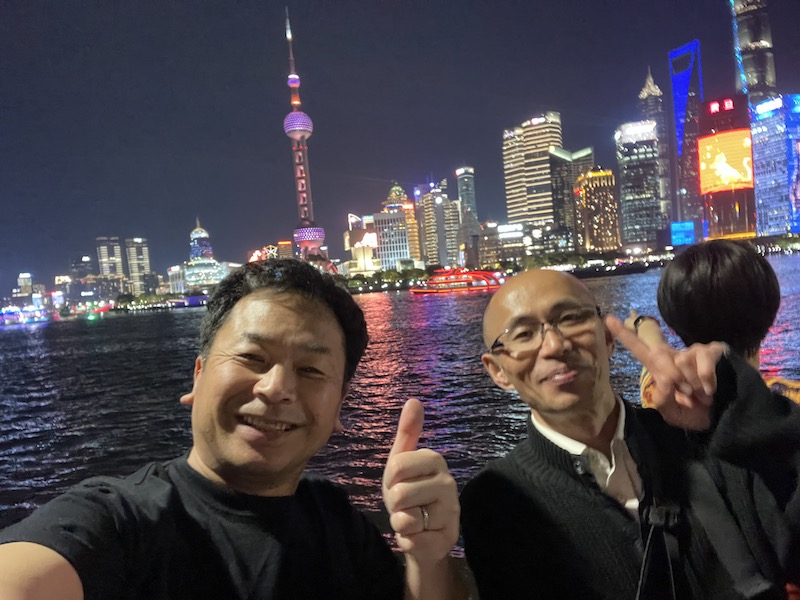 
*上海の夜景ポイントへ*

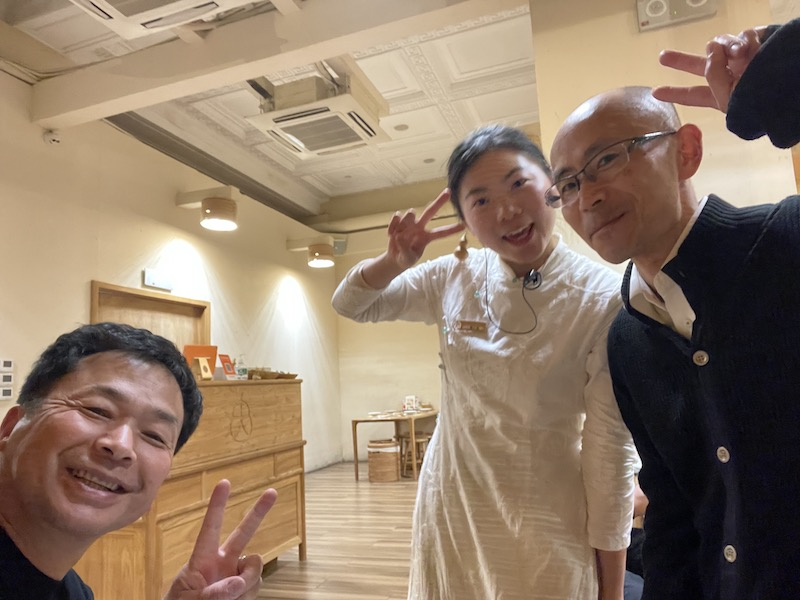 
*上海蟹の有名店で、お店の人と記念撮影、みないい感じ*

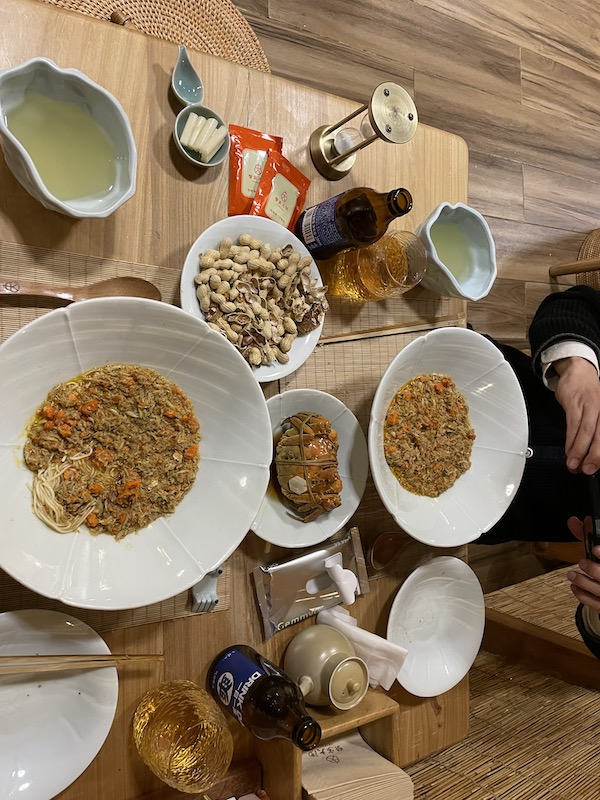 
*上海蟹ののった麺なんだけど、、、*

 
*奥村さん、英語で仕様を尋ねてる*

 
*とにかくみんな、気が良くて、楽しくなってくる*

### 技術的考察

- **半導体・電子部品展示会としての規模そのものが、中国の電子部品サプライチェーンの集積度・自己完結度の高さを示している。** 出展企業・来場者ともに非常に多い一方で外国人が少ないという事実は、設計から部品調達、生産までの大部分が中国国内で完結する構造が既に確立していることを意味する。
- **「知らない会社が派手に活躍している」という所感は、部品レベル（基板・半導体・モジュール等）での技術力・コスト競争力において、無名でも世界的な供給力を持つ中国企業が多数存在することを示している。** 日本企業（日立、muRata、TDK等）はその中の一部にとどまる。
- **ロボティクス（人形機器人展示区、SEERの四脚ロボット等）の存在感は、AGV/AMR・サービスロボット領域の要素技術（センシング、駆動、制御）が、汎用部品の組み合わせとして実用段階に入っていることを示している。**
- **EVメーカー（小米／Xiaomi等）のブースが半導体企業の近接エリアに展開されていたことは、電動車の電動化・電子化が、自動車メーカー単独ではなく電子部品サプライチェーンと一体になって進んでいることを物語る。**

### 新商品開発への示唆

- **AGV/AMR**：人形机器人展示区やSEERの四脚ロボットなど、ロボティクス関連の出展密度の高さから、駆動部・センシング部の汎用部品調達先として中国サプライチェーンを継続的にウォッチする価値がある。
- **物流搬送機器・自動車整備リフト**：半導体企業の隣にEVメーカーのブースが並ぶ構図は、EVの電動化・電子化が車体構造（バッテリー搭載位置、配線・センサー類）に影響を与えることを示す。リフト・整備機器のEV対応設計（リフトアーム干渉、車体下部センサーへの配慮等）を検討する材料となる。
- **IoT／AI活用**：半導体・基板関連企業の集積は、当社のIoT機器（センサー、コントローラー基板）の部品調達・コストダウンの選択肢を広げる可能性がある。

---

## Day2：2025年4月16日（水） Electric China展示会2日目

奥村くんと2人で一通りめぐり終えた。

来る前、昨年の動画などから、モーターなどの展示があるものと考えていたが、全くなかった。海外展示会アルアルというものであろう。

目的のドライブユニットの観点から言えば、もう一つ下のレベルの、基板、トランジスタ、マイコン、抵抗、コンデンサ、など、の展示ばかりであった。

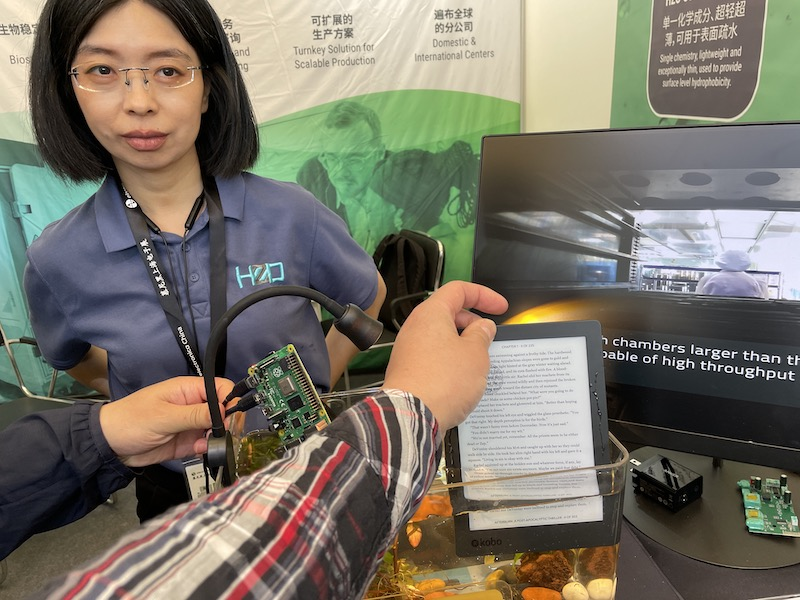 
*防水加工済の基板・センサーモジュール等を展示するブース（H2O関連企業）*

 
*HTDisplay（北京華田信科電子）ブース。LCDモジュール等を展示*

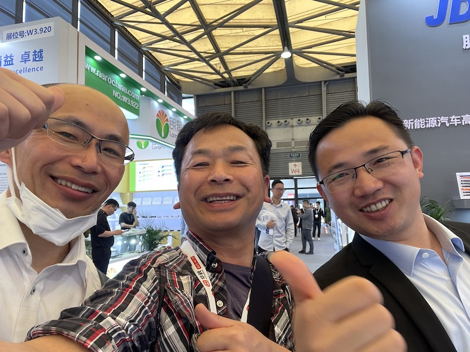 
*Bellweather（OCP Solution）ブース付近を巡回する搬送ロボット*

 
*上海新国際博覧中心（SNIEC）の建物外観*

しかし、これらの要素部品を、地球的規模の集積地で、奥村くんと共に見学できたことは、とても良かった。

自分としては、初めてモーターを内製するイメージをリアリティを持つことが出来た。最低でも、月に100台以上の生産が必要となるが、そうした商品をマーケティングしていく、だけのこととも言える。

コントローラーも、この展示会に出されている部品で、製作出来るはず。この展示会の来場者の多くは、そういった心づもりなのであろう。彼らを見ていても、手が届かないほど優秀であるようには見えない。

奥村くんとここまで深く技術的な話が出来たのは、初めてのこと。もしも、当初考えていたようなニデック相当品が簡単に見つかってしまったら、こうした考えには至らなかった。

実際の進め方は、色々と考えられるが、最終的なイメージが浮かびつつあるように感じる。

明日は奥村くんとは別行動、知人のつてで、天津にまで足を伸ばし中国のリアルについてリサーチを行う。

> 上海虹橋空港第二ターミナル、国内線出発ロビーにて

### 技術的考察

- **「モーターそのものの展示は無く、一段下のレベルの部品（基板、トランジスタ、マイコン、抵抗、コンデンサ）の展示が中心だった」という事実は、中国の電子部品展示会のエコシステムが、完成品モーター・ドライブユニットよりも、それらを構成するコンポーネントの供給に強みを持つことを示している。** ドライブユニットは、それらの部品を「インテグレーション」することで成立する商品であるという見方が裏付けられた。
- **「最低でも月100台以上の生産が必要」という具体的な閾値が得られたことは大きい。** モーター内製の経済性を判断する上での出発点となる、現実的なロット規模の目安である。
- **「コントローラーもこの展示会の部品で製作できるはず」という所感は、制御基板の自社設計・小ロット生産が現実的な選択肢になり得ることを示している。**

### 新商品開発への示唆

- **AGV/AMR・物流搬送機器**：駆動ユニット（モーター＋コントローラー）の内製は、AGV/AMRや搬送機器の足回りコストダウンに直結する。確認できた部品サプライチェーン（基板、マイコン、抵抗、コンデンサ等）を用いたコントローラーの自社設計・試作を検討課題とする。
- **自動車整備リフト・階段昇降機**：モーター内製の議論は、リフトの昇降用モーターや階段昇降機の駆動ユニットにも横展開できる可能性がある。「月100台」という生産規模の閾値は、これら製品群の駆動ユニット内製化を検討する際の最初の判断基準として活用できる。
- **IoT／AI活用**：マイコン・基板レベルの部品が容易に入手可能な環境は、自社製IoTセンサーボードや状態監視ユニットの試作・量産コストを下げる機会となる。

---

## Day3：2025年4月17日（木） 天津大学・天津マーケティングリサーチ

### 天津大学

知人のつてで潜入調査を実施。

優秀な学生への支援が素晴らし過ぎる。学生寮は、年間なんと1000元。学食は、一食20から30元。数十はあろうかという業者が、様々なメニューを提供する。信じられない高レベルの食事を提供している。

現在に至る中国の強さの根源を見た気がした。しかし色々な面で羨ましい。やり直したくなってくる。

一方では、天津大学を出ても就職出来ない者もいるとか。ハノイ大学とかでも同じ話を聞いたことがある。なるほど、色々と考えさせられる。

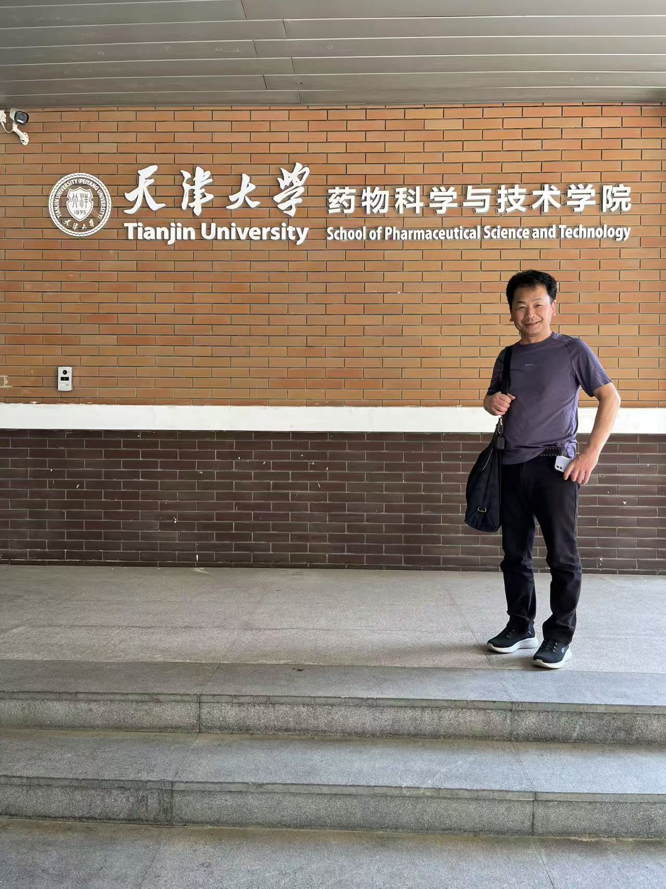 
*天津市内の大学正門前*

### 天津マーケティングリサーチ

いまさら自分が言うのは、とても薄っぺらいが、中国の勢いは凄い。

それだけではなく、昔に比べたら少しお行儀よくなっている。あちこちにゴミが散乱していたり、交通ルールはメチャクチャだったり、満員の地下鉄に、我先など乗り込んできたり、といったことは依然としてあるにせよ、ショッピングモールや駅構内の洗練された雰囲気は、日本やドイツの上をいってしまっている。

 
*[どれもうまくて安い。学書もまた未来ある学生への投資の一貫]*

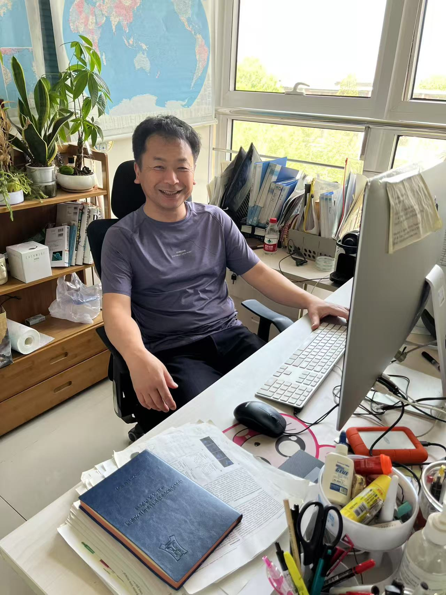 
*[天津大学の教授気分]*

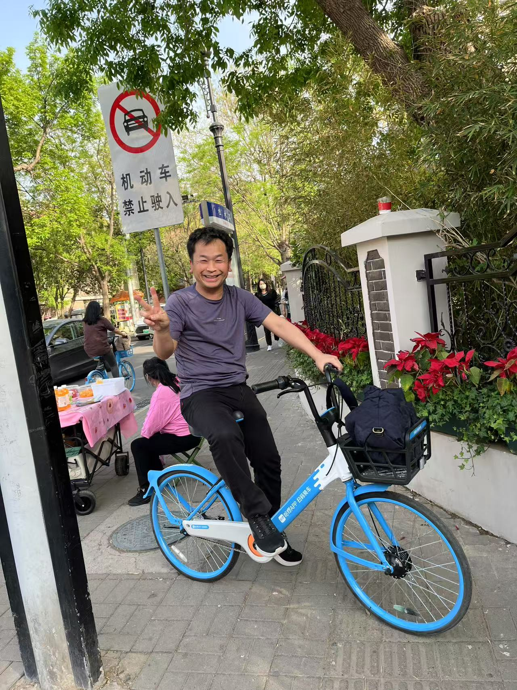 
*[ALIpayでレンタル自転車に乗ってみた]*

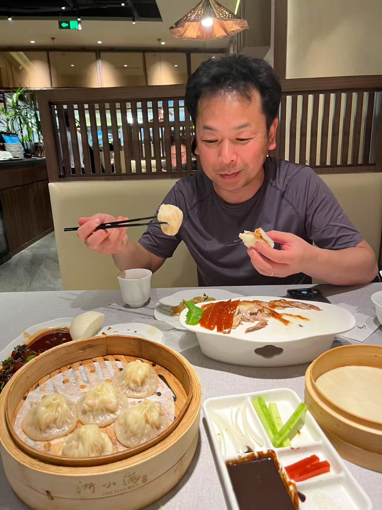 
*[ショッピングセンターのレストランは、うまい！]*

 
*[ショッピングセンターは、どこも日本よりも凝った作りでおしゃれ]*

平日にもかかわらず、買い物意欲は相当高く感じられた。モールでの食事は、ほとんど日本と同じ価格である。平日の夕方5時半から、庶民がこぞって夕食を食べ始めている。まったく特別感はない。

天津だけでも東京並の経済規模と思われる。このような都市が、中国国内にいくつもいくつもある。

ここ天津は、ほんの20〜30年前には、高層ビルやショッピングモールなどは一つもなかった。何も無かったからこそ、ゼロベースで社会主義体制で街づくりを行えた。

人口10億のパワーは凄まじい。中国だけが世界のモノづくりのノウハウと設備とサプライチェーンを押さえている。内需と友好国との貿易を拡大する、だけと考えて当然にも感じられた。

走っている車のブランドは本当に多様である。トヨタやホンダも走ってはいるが数は少ない。

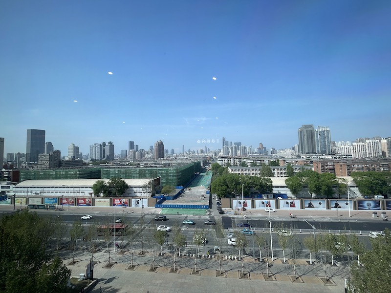 
*[天津の街並み、、、東京クラス]*

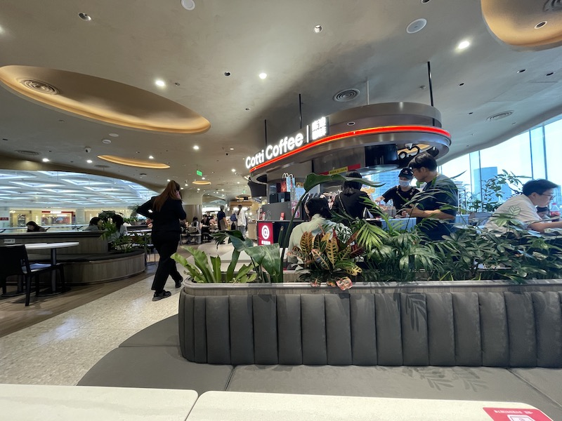 
*[ショッピングセンターは本当におしゃれで人が多い]*

 
*[コーヒーチェーン店も多い]*

 
*[ローカル料理もおいしそう]*

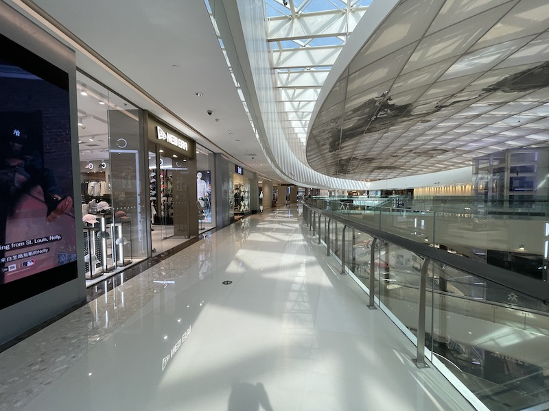 
*[曲線を多様した複雑な造形の建物が多い]*

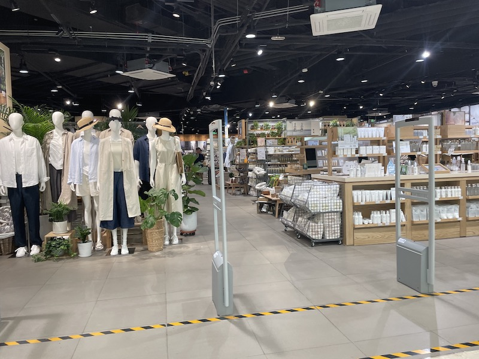 
*[言っては失礼でも無知なんだけど、中国のイメージではないよね]*

 
*[せっかくなので北京ダックも食べてみた]*

 
*[夜中にタクシーのおじさんに変な所で降ろされて途方にくれていたら、このお兄さんが助けてくれた]*

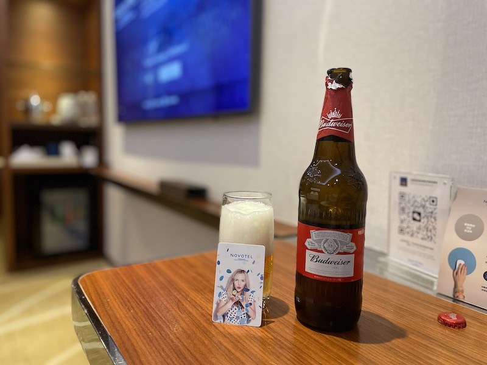 
*[お礼にバドワイザーを購入]*

 
*[ホテルの部屋で一人、ご苦労さん会　中国のホテルはどこも豪華(Nobotel)]*

しかし、どのメーカーもシェアは10%未満であろう。ガソリン車は本当に少ない。街中しか見ていないが、唯一発見したガソリンスタンドはクローズであった。

自動車は擦り合わせ技術で、かつメンテナンスがあるから、新規参入は困難と言われていたように記憶しているが、そんなことは、全く関係無さそうである。また中国の一般人はブランドや歴史も関係無いと考えている。

EVが優遇され、価格も安いなら、特に若い人はなんの抵抗も無いのではとのこと。ただし、どのメーカーのEVも例外なくかっこいいデザインである。また古くてボロボロという車もほとんど走っていない。

日本の自動車や家電製品のメーカーは、技術力やブランド力を過信しすぎたのかもしれない。

国際情勢によるが、中国も強気の姿勢を崩すことはないであろう。また、アメリカの政策で経済の縮小することを看過するはずもない。

アメリカが、中国に対する関税政策を貫くなら、アメリカは高いものを買うしかなくなる。しかしアメリカ国内には、既に生産体制は無いに等しい。

巡り巡って日本に、スギヤスにチャンスあり、となるのかもしれない。

> 天津の空港にて

### 技術的考察

- **天津大学の事例は、中国が優秀な人材への投資（低コストかつ高品質な学生生活環境）を惜しまない一方で、新卒就職市場には供給過多のミスマッチも存在することを示している。** 人材獲得・技術提携の観点からは、優秀な若手中国人エンジニアとの連携（共同研究、技術交流等）の余地が大きいことを意味する。
- **「天津だけで東京並みの経済規模」という所感は、中国国内に同規模の都市が多数存在することを踏まえると、物流・自動車整備・建設機械（リフト等）の需要規模が、単純な人口比以上に大きいことを示唆する。**
- **EV普及の実態（ブランド忠誠度の低さ、デザイン重視、価格優位、ガソリン車・古い車の少なさ）は、自動車整備・周辺機器市場が、構造変化（バッテリー搭載位置、車体下部のセンサー・配線レイアウトの変化等）への対応を前提に再構築されつつあることを示している。**
- **「自動車は擦り合わせ技術＋メンテナンスがあるため新規参入は困難」という従来の見方が、中国EV市場では当てはまらなかったという観察は、モジュール化・標準部品の組み合わせによる新規参入が、自動車以外の分野（AGV/AMR、搬送機器等）でも同様に進む可能性を示している。**

### 新商品開発への示唆

- **自動車整備リフト**：中国市場で急速に普及するEV（ブランド多様・デザイン重視・低価格）に対応するため、リフトアーム形状やセンサー干渉対策などEV対応仕様の標準化を検討する。中国市場そのものへの展開可能性も視野に入れる価値がある。
- **物流搬送機器・AGV/AMR**：天津クラスの都市が多数存在する中国国内市場の物流需要規模は、AGV/AMRや搬送機器の市場として大きな potential を持つ。また、自動車分野で見られた「擦り合わせ不要・モジュール組み合わせでの新規参入」という構造は、AGV/AMR分野でも標準化されたコンポーネントの組み合わせによる新規参入が進む可能性を示唆しており、当社の商品設計にも応用できる視点である。
- **IoT／AI活用**：ショッピングモールや交通インフラの「洗練」は、キャッシュレス決済・シェアサイクル・各種センサー等のIoT基盤の上に成立している。当社のIoT機器開発の参考として、現地のUI/UXやインフラ連携の事例を継続的にウォッチする価値がある。

---

## Day4：2025年4月18日（金） NIDECドライブ・テクノロジー訪問

上海の虹橋駅から高速鉄道で約30分の立地。

 
*上海虹橋駅にてローカルの朝ごはんを*

 
*上海の高速鉄道*

 
*高速鉄道のホーム*

2002年頃から進出して、徐々に売上を伸ばし現在では100億円を上回っている。

総経理、副総経理、以下6名の日本人が対応をしてくれた。うち二人は、駐在できている間に、現地の女性と結婚してしまい、家まで購入してしまったとか。ほとんどが、60歳前後。最近の傾向として、若手が海外勤務を嫌がるとのこと。海外勤務しても、個人としてのデメリットばかりでメリットが無いとの内部事情も大きい、らしい。

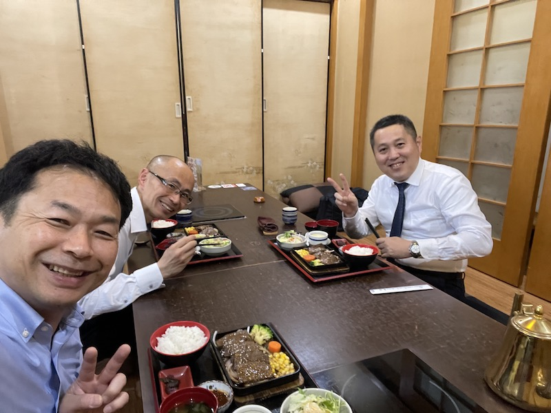 
*NIDECドライブ・テクノロジー訪問時、現地スタッフとともに*

遊星歯車の加工から組み付けまでの一貫生産工場を見学。様々なサイズで、量もバラバラで、けっこうな混流生産を行っている。

中国国内向けが半数（多くはロボット向け）とのことで短納期が求められることが多く、見込み生産で対応している。

 
*NIDEC社内のショールーム。「高精度減速机」コーナー*

 
*ショールームに並ぶ各種減速機の展示ケース*

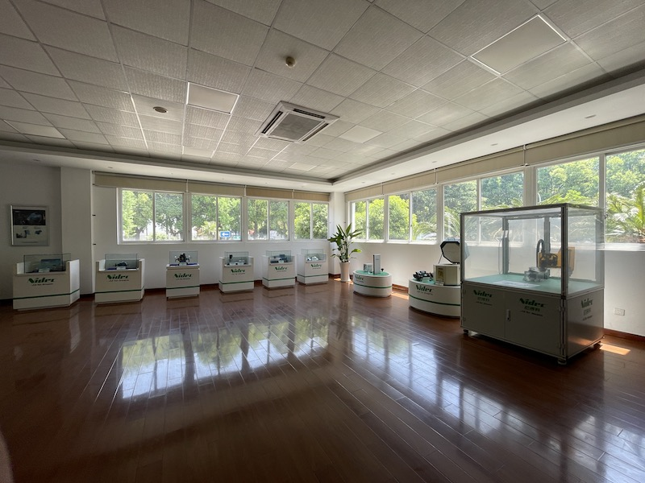 
*遊星歯車減速機（VR系列）・波動歯車減速機（WP系列）の製品ラインナップを示すパネル*

モーターは一部のみ内製しており、日本メーカーの高速シャッターに使われ、600個／月とのこと。見学した限り、大した装置は使用しておらず、我々でもできそうな印象は受ける。

キモは、誘導加熱による焼き嵌めや歯車の軸の圧入となる。これらには高い精度が求められるので、見た目ほど簡単ではないであろう。

数年前に、アメリカ向けの特需があり、尋ねるとAmazonに商社経由で収めたギヤードモータードライブホイールとのこと。どうやら、例の棚を運搬する自動搬送機は、Amazonが自ら開発して、ドライブホイールなどは部品として調達しているらしい。採用された理由は、ドライブホイールの停止精度であったとか。

たまたま1月の展示会で、リーズナブルなドライブホイール・コントローラーセットを発見した。初回の打ち合わせ時に、上海出張が決まった直後であったこともあり、訪問を打診。そして本日の訪問が実現し、リアルに考えられるようになった。ヒトもコトもモノも、偶然の出会いが大切と、つくづく思う。

今回の出張を通じて、物流商品の課題である電動化のイメージを、リアルに持つことができるようになった。奥村くんの、静かなる闘志もわかった。

### 帰路（参考）

帰国時、空港で見かけた高所作業用シザーリフトと清掃ロボットを参考として記録した。

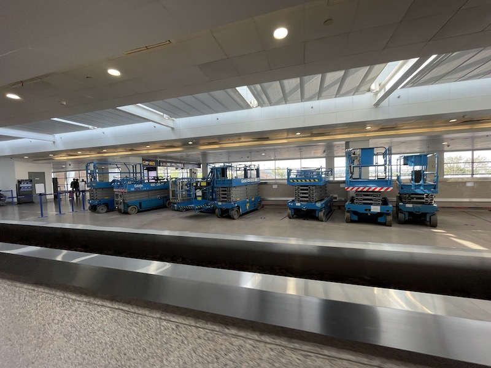 
*空港施設内に並ぶシザーリフト（Genie製）*

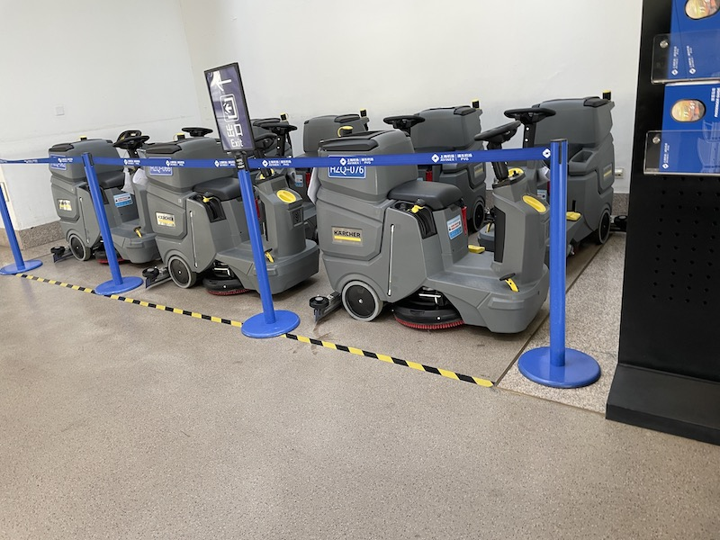 
*自動清掃ロボット（Karcher製）*

### 技術的考察

- **NIDECドライブ・テクノロジーは20年超かけて、遊星歯車減速機の加工〜組み付けの一貫生産体制を中国国内に構築し、100億円規模の事業に成長させている。** 見学した限りでは「大した装置は使用していない」という所感とは裏腹に、競争力の核心は**誘導加熱による焼き嵌めと歯車軸の圧入という「工程の精度管理ノウハウ」**にある。これは、設備投資の規模ではなく、工程ノウハウの蓄積こそが減速機事業の競争力の源泉であることを示す好例である。
- **Amazonのドライブホイールのケースは、AGV/AMR業界における「インテグレーターと部品メーカーの分業」モデルの典型例である。** Amazonは自動搬送機（棚運搬ロボット）を自社開発し、要素部品（ギヤードモーター＋ドライブホイール）のみを外部（NIDEC等）から調達している。
- **「ドライブホイールの停止精度」が採用理由だったという事実は、AGV/AMRの位置決め精度が、モーター単体の性能だけでなく、ギヤ・ベアリング・取付精度を含めたユニット全体の精度で決まることを示している。**
- **中国国内向け需要の半数がロボット向けであり、短納期・見込み生産で対応しているという点は、中国国内のロボット産業の需要量と納期要求の厳しさを物語っている。**

### 新商品開発への示唆

- **AGV/AMR**：NIDECのギヤードモータードライブホイール（Amazon採用実績あり）は、当社AGV/AMRの駆動ユニットとして直接の検討候補となる。1月の展示会で見つけた「リーズナブルなドライブホイール・コントローラーセット」の仕様確認・サンプル評価を次のアクションとする。停止精度を含むユニット単位での評価基準を整理する必要がある。
- **物流搬送機器**：遊星歯車減速機の混流生産体制（様々なサイズ・量に対応、短納期の見込み生産）は、当社の搬送機器（コンベア、リフト等）の減速機調達先として活用できる可能性がある。
- **自動車整備リフト・階段昇降機**：誘導加熱焼き嵌め・歯車軸圧入という高精度工程は、リフトの昇降機構や階段昇降機の駆動部の小型化・高精度化・静音化に応用できる可能性がある。また、空港で見かけたシザーリフト（Genie製）は、当社リフト製品との設計比較対象として参考になる。
- **IoT／AI活用**：モーター・ドライブユニットの内製を進める場合、各ユニットの稼働状態（温度・振動・停止精度等）をモニタリングするIoTセンサーをセットで設計することで、品質保証・保守性の面で差別化が図れる。空港で見かけた清掃ロボット（Karcher製）のような自律走行型サービス機器も、当社のAGV/AMR・福祉機器開発における周辺領域として参考になる。

---

## 総括

4日間の出張を通じて、以下の点が明確になった。

1. **中国の電子部品サプライチェーンは、モーター・ドライブユニットそのものではなく、その一段下のコンポーネント（基板、半導体、抵抗、コンデンサ等）に強みを持ち、地球規模の集積地として機能している。** これにより、モーター・コントローラーの内製は「部品を組み合わせる」レベルでは現実的な選択肢になり得ることが、現場でのリアリティを持って確認できた。
2. **「月100台」という生産ロットの目安、「ドライブホイールの停止精度」という具体的な評価基準など、内製化・部品調達を検討する上での実務的な手がかりが複数得られた。**
3. **NIDECドライブ・テクノロジーの遊星歯車減速機事業は、設備の大小ではなく工程ノウハウ（焼き嵌め・圧入の精度管理）に競争力の源泉があることを示しており、Amazon向けドライブホイールの事例は、当社がAGV/AMRの駆動ユニット供給者・統合者のいずれの立場を取るにせよ、参考となるビジネスモデルである。**
4. **天津での市場観察からは、EVの急速な普及とブランド構造の変化、都市規模の物流需要のポテンシャルが確認でき、自動車整備リフト・物流搬送機器・AGV/AMRいずれの分野においても、中国市場の構造変化を前提とした商品設計・市場戦略の見直しが必要であることが示された。**

これらの知見は、`中期商品開発戦略_Draft.md` で示した「次世代AMR/AGV」「スマートリフト／フォークリフト」「画像認識AI基盤」の3本柱の検討において、特に駆動ユニット（モーター・減速機・コントローラー）の内製・調達戦略を具体化する上での重要な現場情報として活用したい。

---

## 写真について

- `Photos_Used/`：本報告書で使用した写真
- `Photos_Unused/`：今回使用しなかった写真（個人の記録・移動・食事等を含む）
- `2025EleCN-Images/`：元の写真データ（変更なし）
