# IMS Manutention 工場視察・商談レポート

---

## 会社概要・訪問概要

| 項目 | 内容 |
|---|---|
| 訪問先 | IMS Manutention |
| 業種 | 電動牽引トラクター・マテハン機器メーカー（フランス）|
| 設立 | 1973年 |
| 所在地 | Bonneval, Eure-et-Loir, France |
| 日時 | 2026年4月24〜25日 |
| 担当者 | ビンセント（Vincent）|
| 出張者 | 山崎・橋本GM |
| 目的 | 工場視察・製品デモ・商談（重量物牽引装置の販売代理検討）|
| 作成 | 山崎 |

情報ソース：[IMS Manutention 公式サイト](https://www.imsmanut.com/)（2026年7月）

---

## 訪問の目的

2025年3月の LogiMAT（シュトゥットガルト）で気になっていた **重量物牽引装置「DTR」シリーズ**のメーカー、IMS Manutention を訪問した。
1 トンから 10 トンまでの電動牽引トラクターを 2003 年から製造し続けているフランスの専業メーカーだ。

スギヤスの既存ラインナップに DTR を加えることで、重量物搬送領域での商品力を補強できるかどうかを見極める。

---

## 1. ランチミーティング（ボンヌヴァル旧市街）

 

IMS Manutention のビンセントが出迎えてくれたボンヌヴァル。1000年以上前から続く城壁に囲まれた歴史的な村で、観光地でもある。（2026年4月）

 

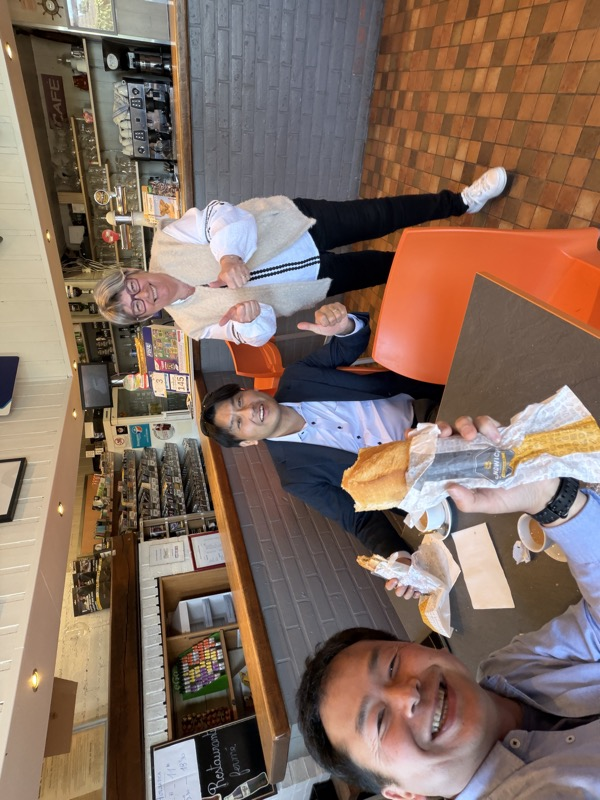
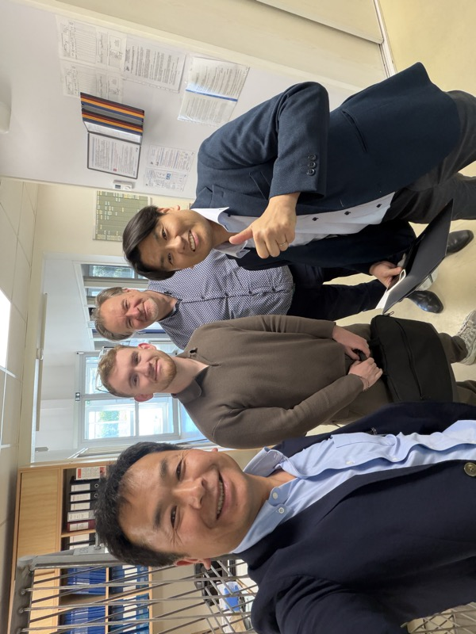

工場のすぐ近くにある旧市街のレストランでランチミーティング。こうした小さなレストランが村には必ずあり、どこも昼から繁盛している。（2026年4月24日）

昼に到着し、ビンセントに出迎えてもらってランチミーティングから始まった。
工場のすぐ近くにある歴史的な村だ。美しい旧市街の街並みが広がり、観光地でもあるという。

ヨーロッパは、どこに行っても大体こんな感じで、だんだんと見慣れてきた。有り難みも薄れてくる。

フランス人は、目が合うとなんとなく会釈っぽい感じがある。馴染みやすさを感じる。

---

## 2. 工場見学

 

IMS Manutention 工場。製品を自社設計・製造・組み立てている。（2026年4月24日）

 

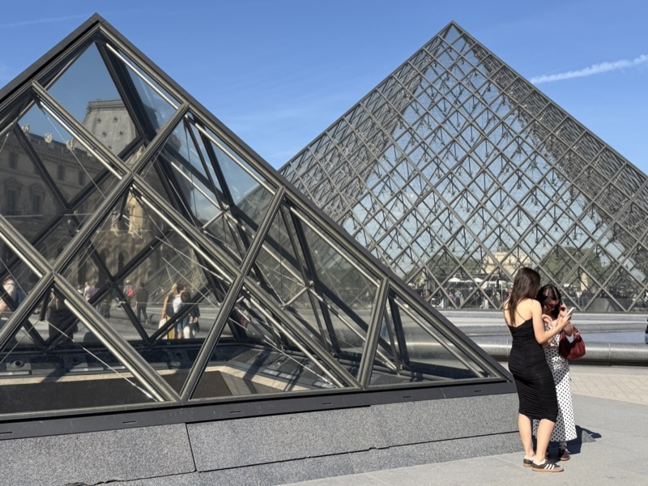

工場内の製造ライン。電動牽引トラクターを 2003 年から製造し続けている。（2026年4月24日）

 

組み立てエリア。コントローラーと駆動部の配線・組み付け工程。（2026年4月24日）

---

## 3. 製品「DTR」シリーズ

 

DTR（Demi Tracteur Roulant）シリーズ。1 トンから 10 トンまでの 4 タイプを展開。（2026年4月24日）

 

DTR シリーズのコンパクトモデル。小回りが利き、狭い工場通路でも使いやすい設計。（2026年4月24日）

 

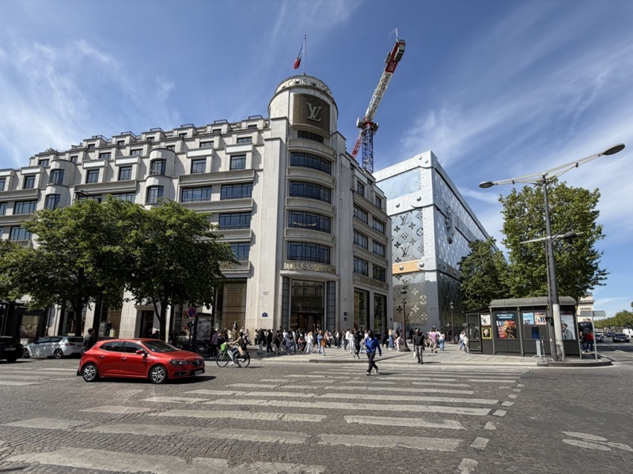

各モデルの比較。売れ筋は 1.5 トン〜3 トンクラスとのこと。（2026年4月24日）

**DTR は昨年の LogiMAT から気になっていた商品だ。**
ラインナップは、1 トンから 10 トンまでの 4 種類。2003 年から作り続けている。
売れ筋は中間の **1.5 トンから 3 トン**くらいの牽引能力だという。

スギヤスの既存 DTR ラインナップ（「[要確認：DTR は既存で持っているか？]」）との重複確認が必要だが、商品力の補強になる。

### バッテリー

基本はリチウムイオン。ただし、**鉛蓄電池でも対応できる**という。
これはかなり柔軟だ。日本市場の一部ユーザーは依然として鉛を選ぶため、選択肢の広さはセールスポイントになる。

### コントローラー

採用しているのは **PG ドライブ（PG Drive Technologies、UK本社）**。
カーチス（Curtis）よりも高性能であると判断して採用しているとのことだ。

 

PG ドライブ社製コントローラーを搭載した DTR の内部構造。カーチスよりも高性能と評価して採用。（2026年4月24日）

 

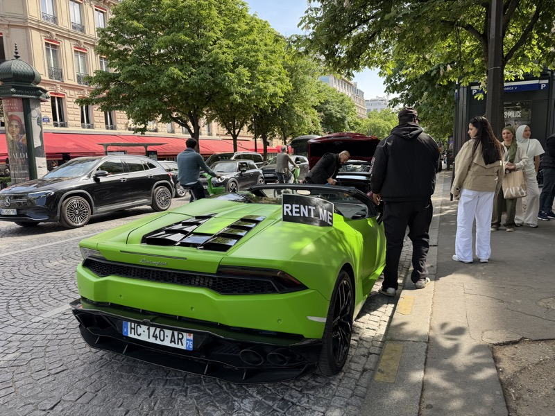

DTR の駆動部・操作系の詳細。（2026年4月24日）

---

## 4. 製品デモ

 
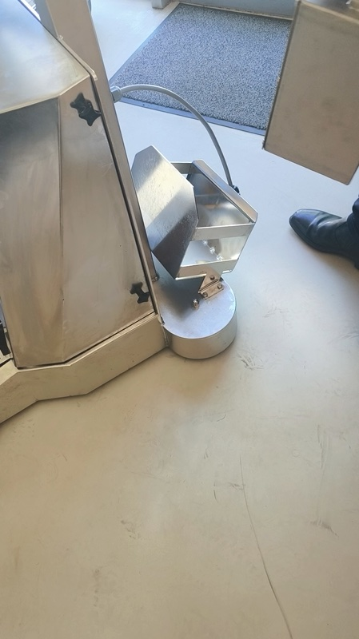

DTR の走行デモ（動画より）。重量物を牽引しながらの方向転換も軽快だ。（2026年4月24日）

 

デモの様子（動画より）。様々なシチュエーションでの牽引能力を実演してくれた。（2026年4月24日）

 

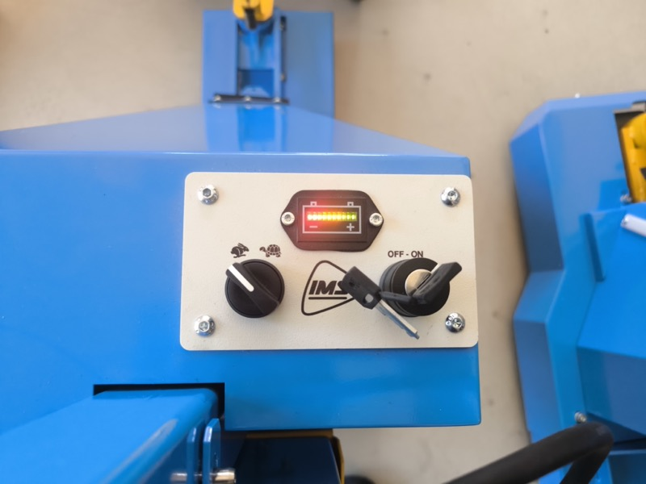

製品デモ現場。操作性と牽引力を確認した。（2026年4月24日）

---

## 5. まとめ・所感

**LogiMAT で気になった理由が、現地でよく分かった。**

DTR シリーズはシンプルで堅牢だ。
2003 年から変えずに作り続けているという事実が、その信頼性を証明している。
鉛対応、PG ドライブ搭載、1〜10 トンの 4 タイプ展開――全部、顧客の要求に応えてきた結果だ。

IMS Manutention は規模は小さくても、**専業メーカーとしての軸がある**。
販売代理として取り組む価値は十分にある。

ただし課題はある。
**スギヤスの既存ラインナップとの重複整理**、**価格競争力**、そして**日本市場での安全規格対応（労安法・SIL対応）**の確認が必要だ。

### アクション

| 担当 | 内容 |
|---|---|
| 橋本GM | IMS DTR シリーズとスギヤス既存品のラインナップ整理 |
| 橋本GM | 日本への輸入コスト・関税試算 |
| 技術部 | 日本市場の安全規格対応確認（労働安全衛生法・型式検定） |
| 山崎 | IMS との代理店契約条件の確認 |

---

## その他の写真

本編の流れには収めなかった写真・動画サムネイルを収録する。

 

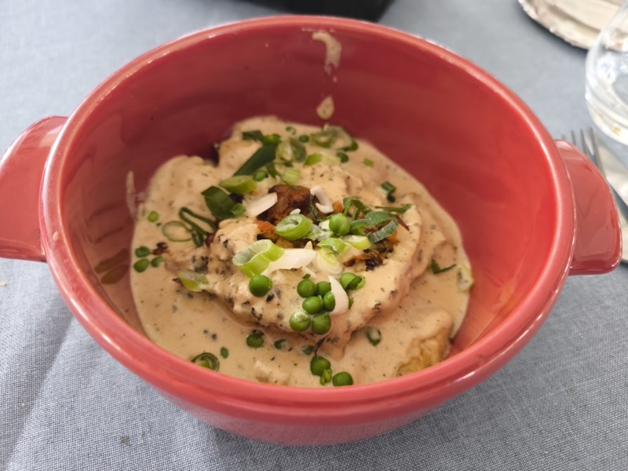

 

 

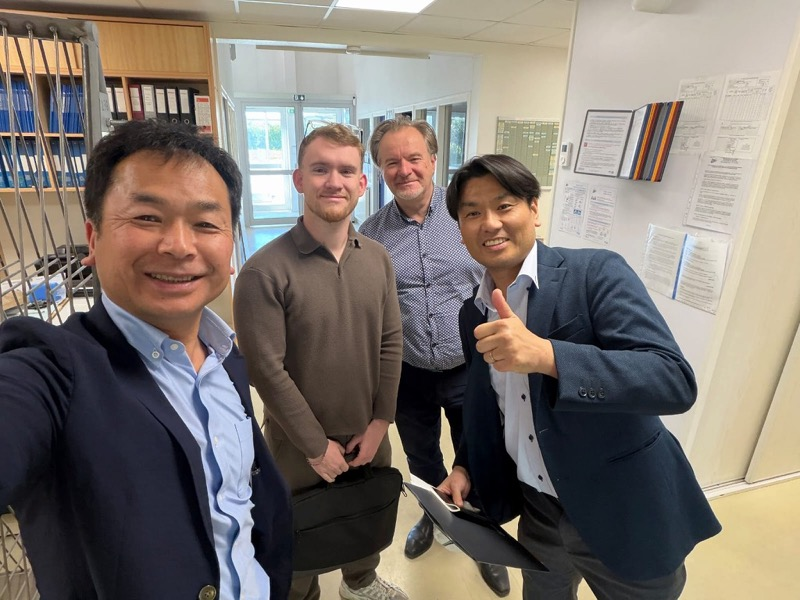
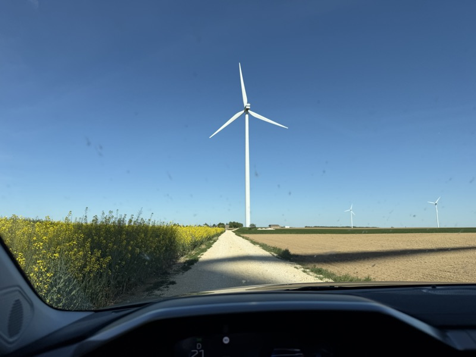

 

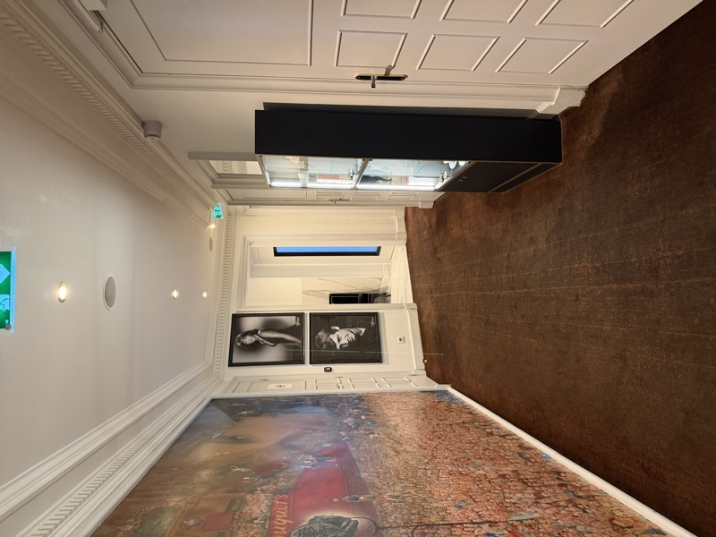

 

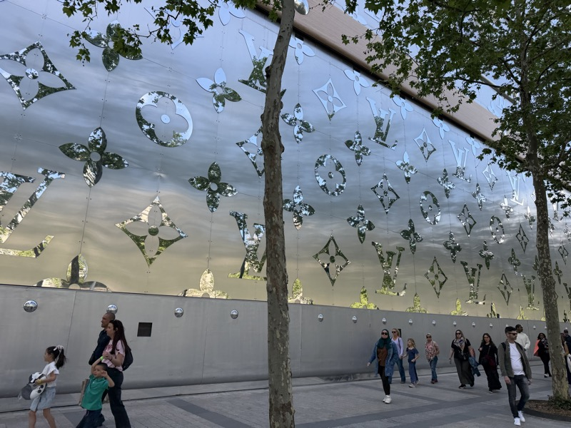

