# MODEX 2026 視察報告

> 記入者：山崎　/　2026年4月13〜15日　/　アメリカ・アトランタ
> 情報ソース：Nippou.tt + 現地写真（撮影：山崎・橋本）

---

## 1. サマリー

AMRはすでにコモディティだ。
中国・インド・韓国・米国・オランダ、多様な国籍のプレイヤーが同じ土俵に立ち、機能と価格で競い合っていた。

日本の物流展でだいたいわかったつもりでいた。大間違いだった。

- **AMR/ASRS の全段階が揃っていた**：棚登り型、無人フォーク、パレット搬送、ピッキングアーム、ヒューマノイドまで
- **中国勢の自信**：来場者の真横で5〜6mの高さにパレットを積み上げる無人フォーク。安全性への絶対的な自信がないとできない芸当
- **SEER Robotics と名刺交換**（DMP 名義で）：おとなしめの展示が好感を持てた
- **BIC の田島さんチームとの会食**：Ramonがアマゾンから直接オファーを受けているテーブルリフト案の話が浮上
- **自社への示唆**：ゴミ箱自動搬送＋反転システムが DR 自動搬送への応用アイデアと重なる。後方倒れ止め付き手動ハンド（安全安心パック追加候補）も確認

---

## 2. 展示会概要・参加者

| 項目 | 内容 |
|---|---|
| 展示会名 | **MODEX 2026** |
| 会期 | 2026年4月13日（月）〜16日（木）※視察は13〜15日 |
| 会場 | ジョージア・ワールド・コングレス・センター（GWCC）、アトランタ、ジョージア州 |
| 主催 | MHI（Material Handling Institute） |
| 規模 | 出展 1,000 社超 / 来場 5 万人超 / 展示面積 約 56,000 m²（ホール A・B・C） |
| 位置づけ | 北米最大の物流・サプライチェーン展示会。隔年開催（偶数年=MODEX/Atlanta、次回はProMat 2027/Chicago） |
| 参加者 | 山崎、橋本GM |
| 情報源 | [MODEX 2026公式サイト](https://www.modexshow.com/)（2026年7月取得）|

 

MODEX 2026 会場全景（ジョージア・ワールド・コングレス・センター）。吹き抜けの2階部分から見渡したホールA・B。Westfalia、Orbis、MUJIN、SICKなど多国籍の出展社が並ぶ。

 
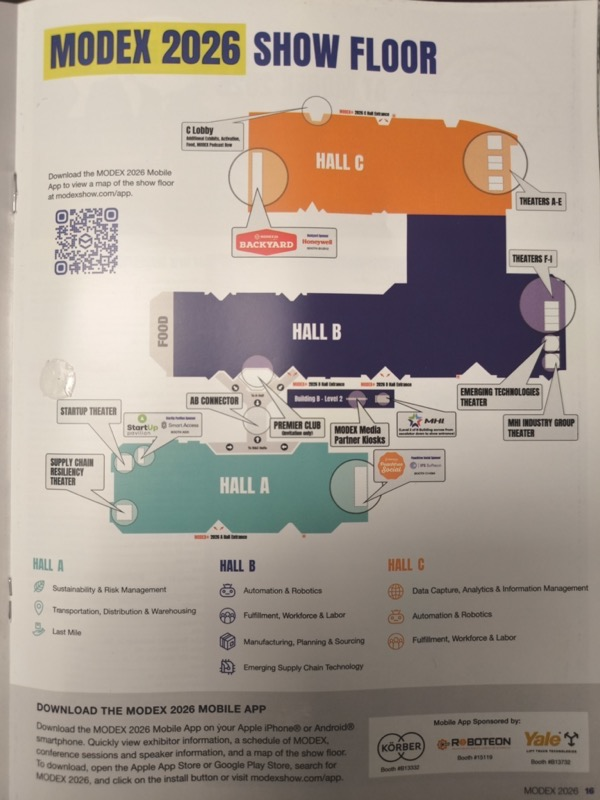

MODEX 2026 ショーフロアマップ。Hall A・B・C の3ホール構成。スタートアップシアター、サプライチェーンリサーチシアター、エマージング・テクノロジーシアターなどが配置されていた。

---

## 3. 視察の目的

1. 世界のAMR/AGV市場の最新動向を自分の目で確認する
2. 競合・参入企業の実際の技術水準を体感する
3. BIC（Business Innovation Community）メンバーとの関係を深化する
4. 次世代製品・ビジネスモデルのヒントを探索する

「日本の物流展に足繁く通い、だいたいわかっていたつもり」だった前提を検証する旅だった。

---

## 4. 背景（環境変化）

**AMR/AGV のコモディティ化が加速している。**

中国が多いが、インド・韓国・米国・オランダ、それぞれに特徴的で面白い。
かつては「導入費が高い先進技術」だったAMRが、いまや標準部品として買えるものになった。

棚登り型（ASRS）から無人フォーク、ヒューマノイドまで、倉庫自動化の全段階が一覧できた。
日本の物流展の「表」に対し、MODEX は業界の「裏側」—製品数・スピード・規模ともに別次元だった。

---

## 5. 内容（時系列）

### 4/13（月）― 移動・アトランタ着

 

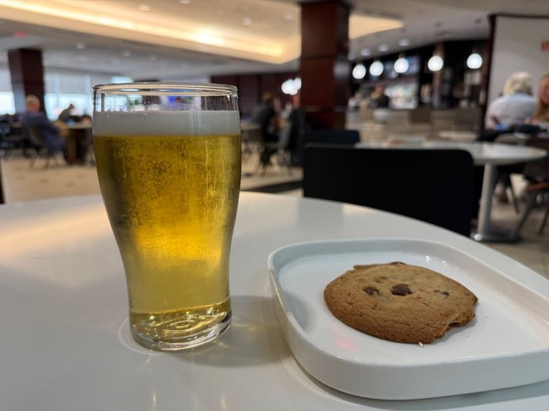
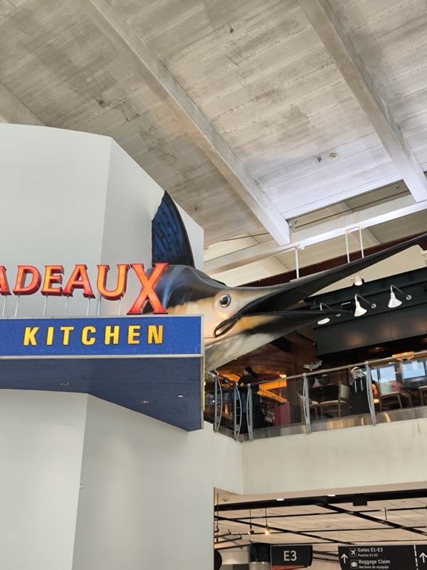

（左）出発前の空港ラウンジ。（右）アトランタ・ハーツフィールド・ジャクソン国際空港到着。「Bordeaux Kitchen」のかじき魚のモニュメントがお出迎え。

 
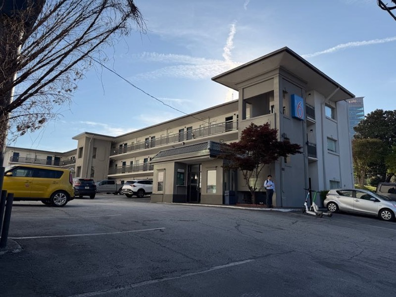

宿泊先の Motel 6（アトランタ市内）。バジェットホテルだが清潔で機能的。コスト重視の選択だが、銃撃事件が起きてもおかしくないような、、、。

 
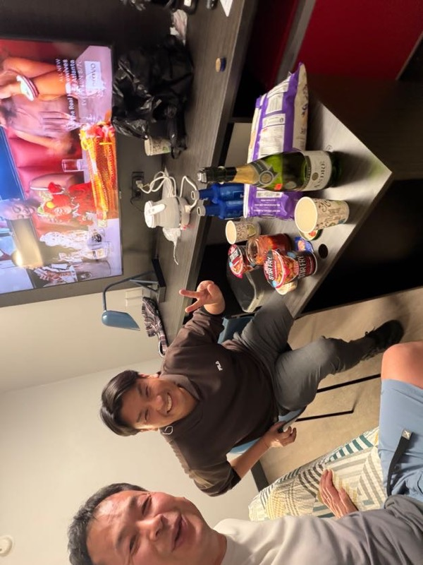

初日のホテル到着後の食事。近くにようやく見つけたコンビニで調達したカップラーメンとスパークリングワイン。時差ぼけも手伝って、気分が高揚していた。

---

### 4/14（火）― MODEX Day 1

#### AMR のコモディティ化を実感する

 
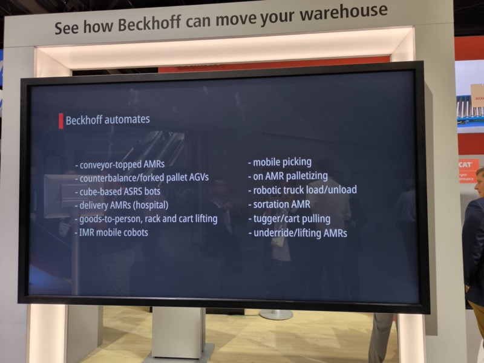

Beckhoff Automation（ドイツ）のブース。「See how Beckhoff can move your warehouse」―AMR、AGV、ASRS、ソーテーション、コボット、ロボットトラック荷積みまで、あらゆる自動化カテゴリーを制御できると謳う。

 

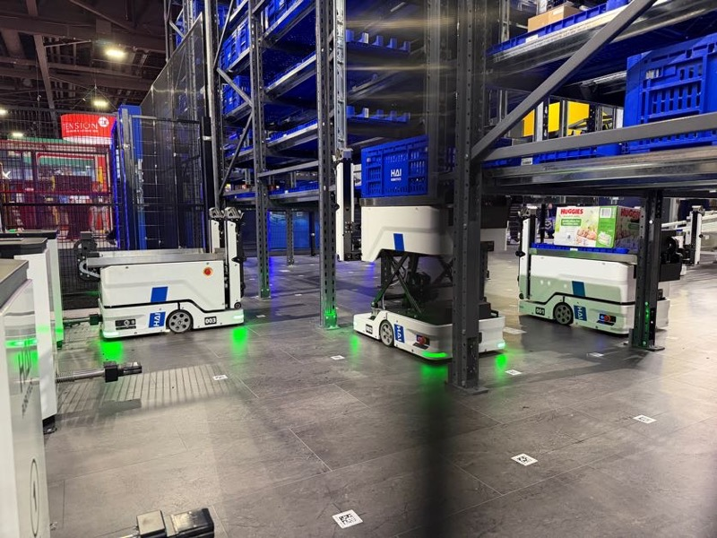
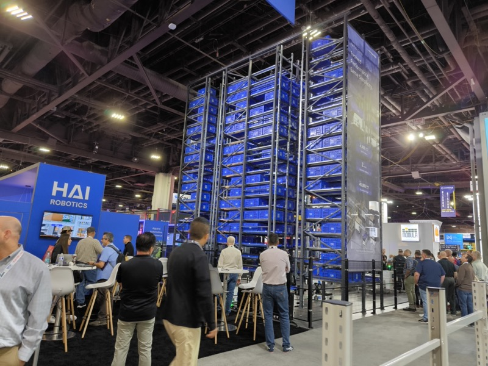

HAI Robotics（中国）の ASRS 展示。複数の白いACR（Autonomous Case-handling Robot）が格子状の棚の間を縦横に動き回る。天井近くまで積み上がった青いビンは圧巻だった。

 

各社AMRが複数台同時展示。ZS Robotics（中国）、ZS以外にも小型シャトル型ロボットが棚の中を動くデモが多数行われていた。「0 PROJECT FAILURE RATE / 5 min NEW SHUTTLE DEPLOYMENT」は ZS Robotics のコピー。

 

ADDVERB（インド）。「Material Handling: True Human+Robot Collaboration」「Storage: Pallet & Tote ASRS Solutions」の両輪で展開。パナソニック・シーメンスなど大手との協業実績も掲示していた。

#### リフト・搬送装置メーカーも多数出展

 

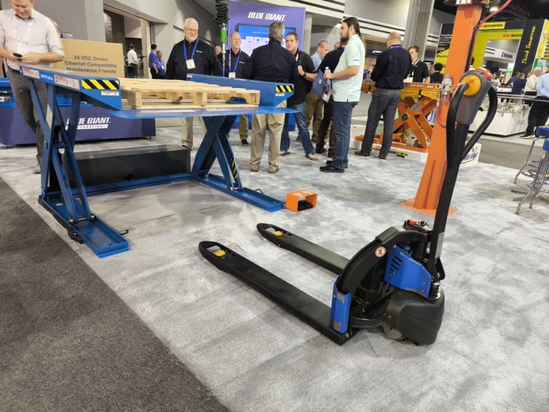
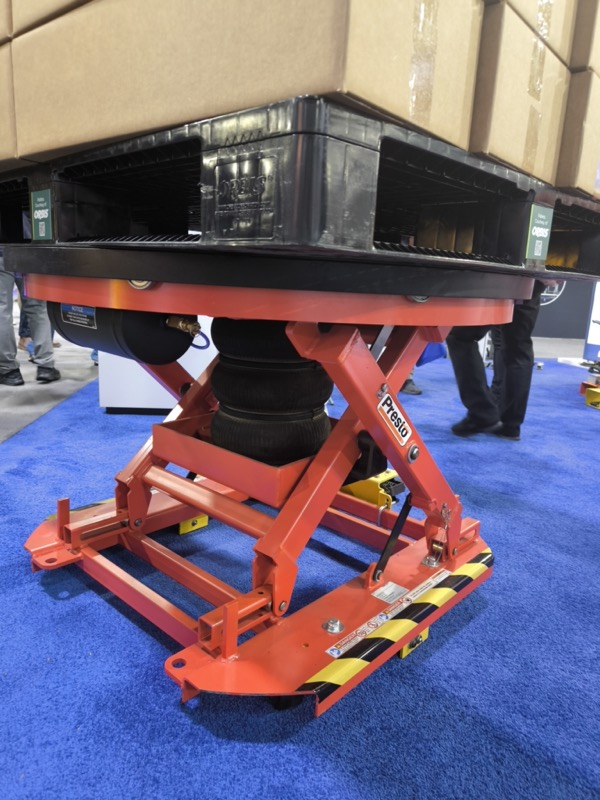

（左）Blue Giant（カナダ）の電動シザーリフトと電動パレットジャック。（右）Presto（米国）の空気圧式シザーリフト。ベローズ（空気袋）で昇降する構造が目を引いた。

 

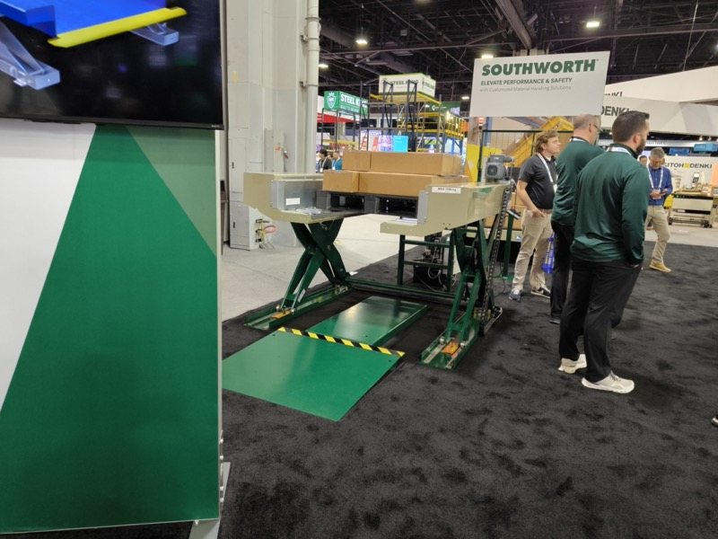
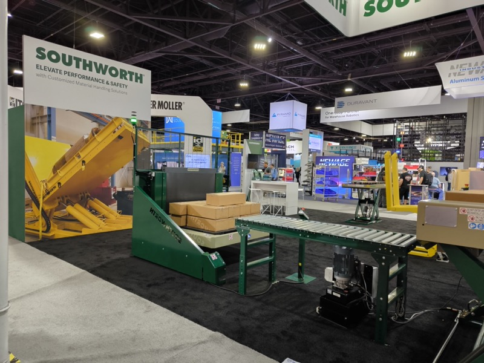

Southworth（米国）のシザーリフト。左がコンベアライン組み込み型、右がブース全景。ティルター（傾斜台）とシザーリフトを組み合わせた製品ラインナップ。スギヤスのリフト商品と直接競合する領域だ。

 

NewAge Industrial の AMR カート連動棚。小型AMRが棚の下に潜り込んで棚ごと搬送する、いわゆる「棚搬送型AMR」。赤・青のコンテナをそのまま運ぶ。

 
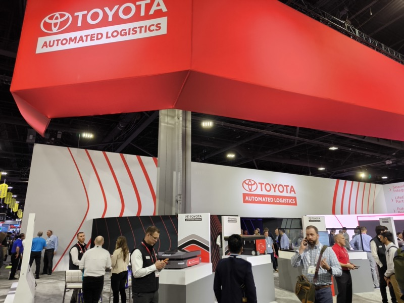

Toyota Automated Logistics の大型ブース。日本メーカーのなかで最大規模の出展。アテンドは見た感じほぼ全員がローカルスタッフだった。

#### 印象に残った展示

 

ヒューマノイドロボット（Apptronik等）。白いボディに光る円形の顔。ヒュンダイ・ボストン・ダイナミクス同様、物流展とは別次元の「機能を誇る凝った展示」だった。

 

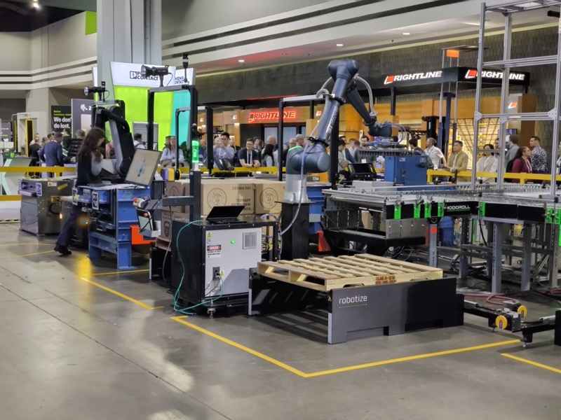
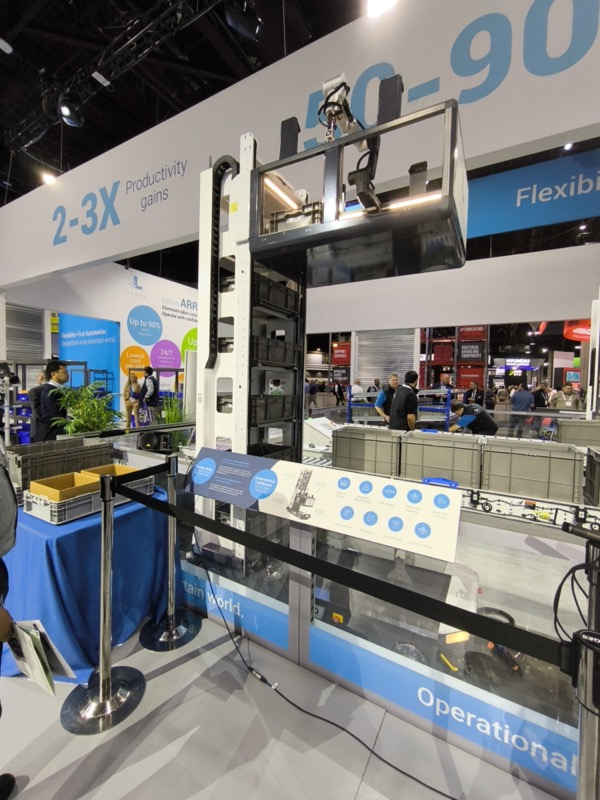

（左）Robotize（デンマーク）のパレット搬送AMRと Rightline の多関節ロボットアームを統合したデモ。AMRが下でパレットを運び、上でアームがピッキングする。（右）ASRS 棚のユニットピッカーアーム。「2-3X Productivity gains、50-90% operator labor reduction」と謳う。

 
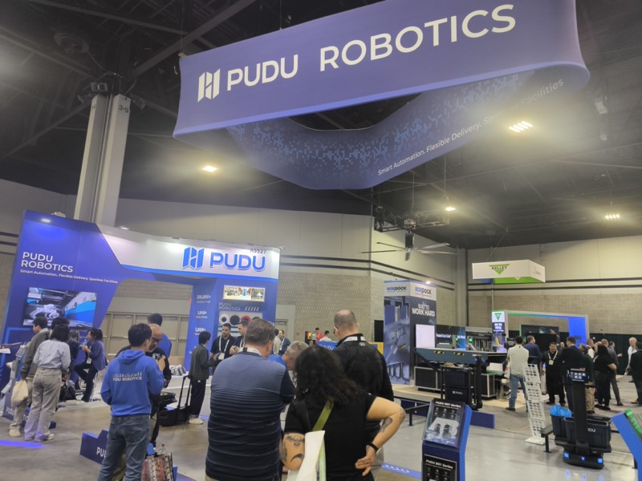

PUDU Robotics（中国）。配膳ロボットのトップブランド。「Smart Automation. Flexible Delivery. Spotless Furniture.」の三軸展開。カフェ型AMRやデリバリーロボットが走り回っていた。

 

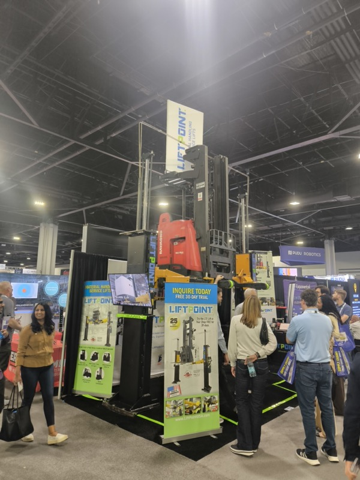
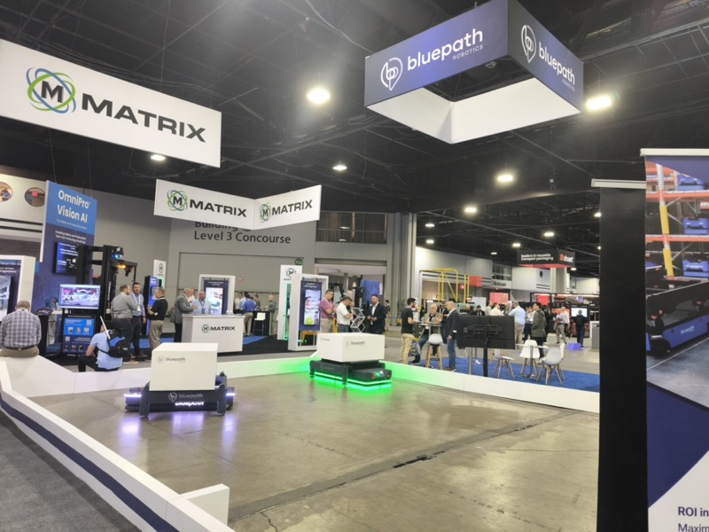

（左）LIFTPOINT—「フォークリフトをコンテナの高さに持ち上げる」リフト。海上コンテナへのアクセスを地面から可能にする発想は参考になる。（右）bluepath Robotics と MATRIX の合同ブース。小型AMRが会場内を走り回っていた。

 
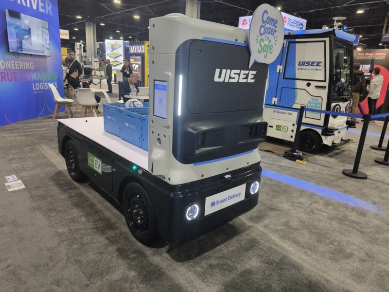

UISEE（中国）の「Smart Delivery」屋外対応EV自律搬送ロボット。大型タイヤとEVを組み合わせ、屋外の段差・悪天候にも対応。「AI Driver for the World」を謳う。

 

SitePrint―「Install your material handling equipment faster and exactly as engineered」。床面に±2mm の精度でレイアウト線を直接プリントする自走ロボット。設備導入の前工程を自動化する、ユニークな発想の製品だった。

 

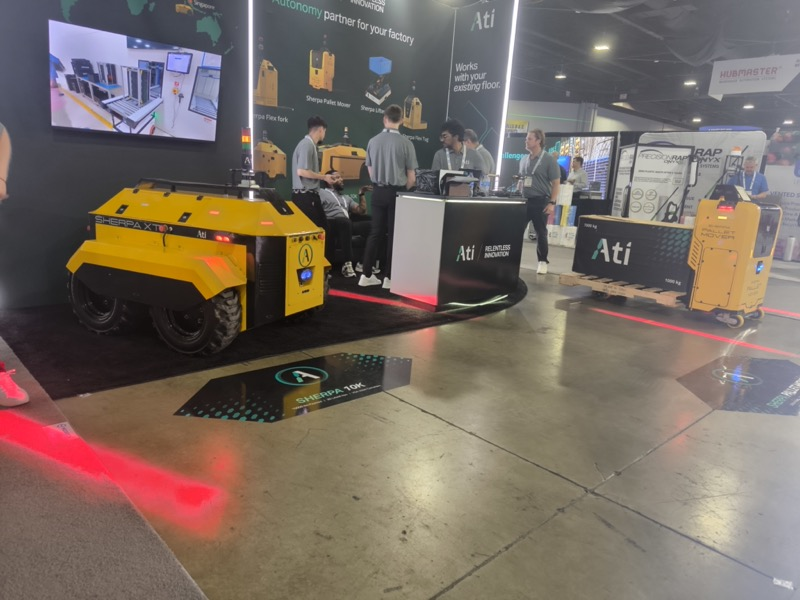
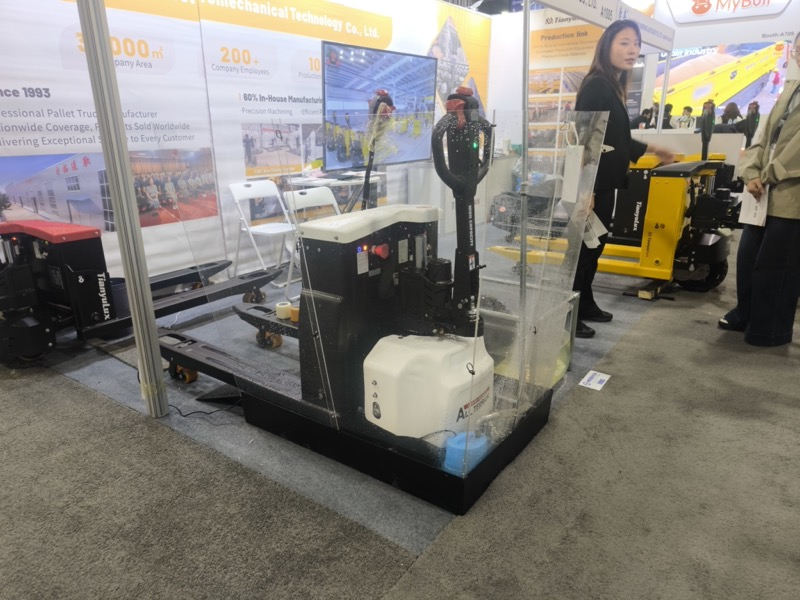

（左）ATi / SHERPA XT（オーストリア）。10トンクラスの重量AMR。工場・屋外問わず対応できる堅牢な大型プラットフォーム。（右）中国メーカーの全天候型電動パレットトラック。完全防水設計で大型タイヤ搭載のオフロード対応モデル。北京近郊のメーカー製で、EPとの差別化が明確だった。

#### BIC 会食（4/14 夜）

BIC ランチの卓上風景。丸テーブルを囲んで BIC メンバー全員が着席。ローストチキン・グリッツ・マッシュポテト・フライドチキンが各自の皿に並んでいる。田島さんチームのメンバーがスマホで撮影中。Southern ならではのランチだった。

 

BIC メンバーの田島さんとアメリカ人 3 名と会食。Southern fried chicken、grits、スープのプレートが並ぶアトランタらしい食事。若手エンジニアの Ramon から、アマゾンから直接オファーを受けているテーブルリフトの話を打ち明けられた。非常に興味深い内容だった。

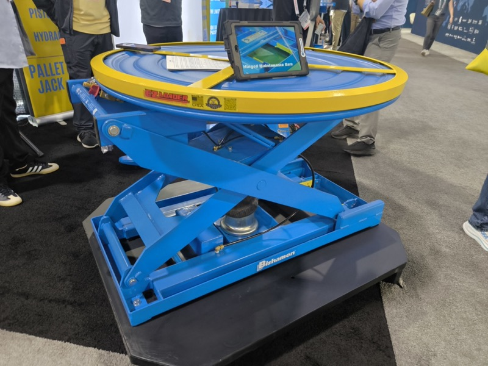

Bishamonのレベラー、これが一番の稼ぎ頭。丸い天板が回転し、パレット上の荷を任意の向きに回せる。青いフレームが鮮やかで、「Hinged Maintenance Bars」の表示も見える。作業者の負担軽減に特化した設計だ。

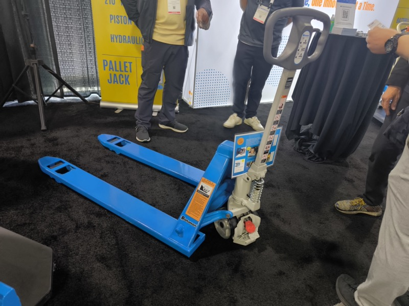

Bishamonの青いパレットジャック（Piston Hydraulic）。「PALLET JACK」の黄色いバナーが印象的だった。シザーリフトと並んで展示されており、Bishamon が多様な搬送補助機器ラインナップで MODEX に出展していることがわかる。

 
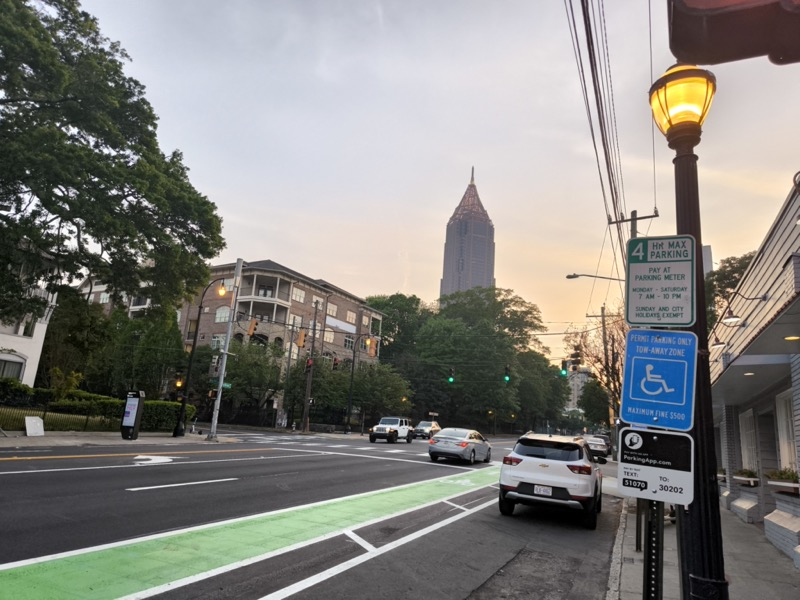

夕食後のアトランタ市内。グラント・パーク近辺をぶらり。遠くに見える塔がダウンタウンのシンボル的な存在。

---

### 4/15（水）― MODEX Day 2

#### STAX 社（橋本 GM が昨年売り込みを受けた電動車メーカー）

 

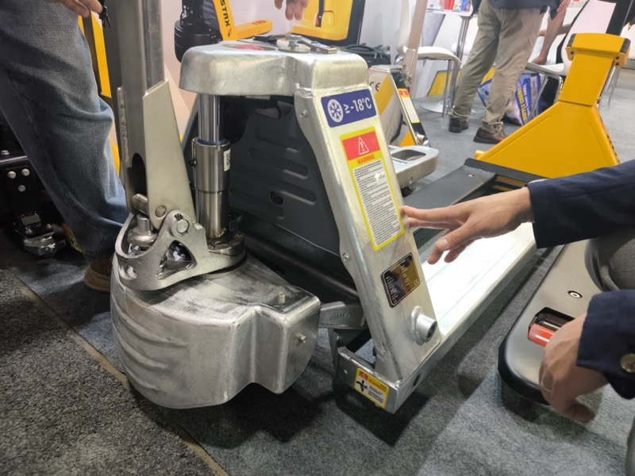

STAX 社のブース。右写真はステンレス合金製のパレットトラック（冷凍庫対応 ≥−18℃）のポンプ機構。黄色の標準モデルと並んで展示。「とにかく安い」が最大の武器。将来の価格戦略オプションとして、ゆるい関係性を継続しておく価値はある。

#### Day 2 の各ブース

 

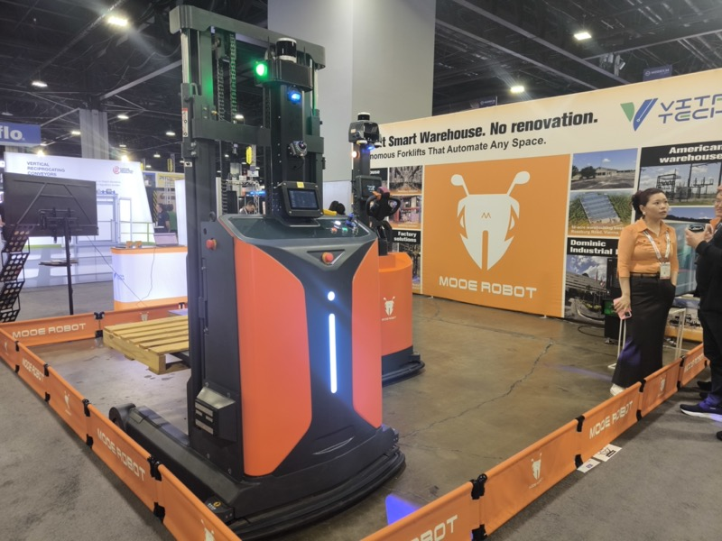
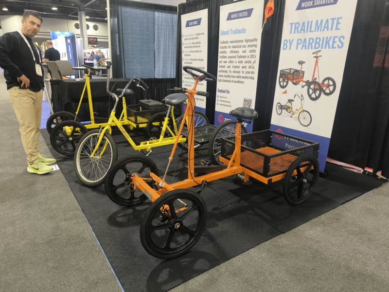

（左）MOODE ROBOT（中国）の自律AMRフォーク。「Smart Warehouse. No renovation.」—既存の床・棚をそのまま使えることをウリにしている。（右）Trailmate by Parbikes（米国）—工場内用の電動カーゴ三輪車。移動手段の合理化という発想。

 

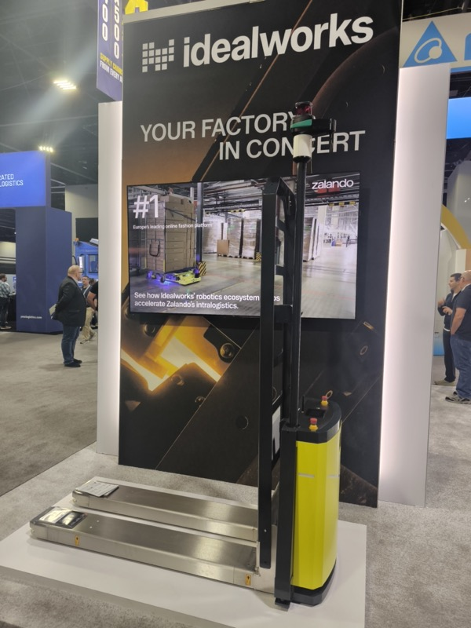
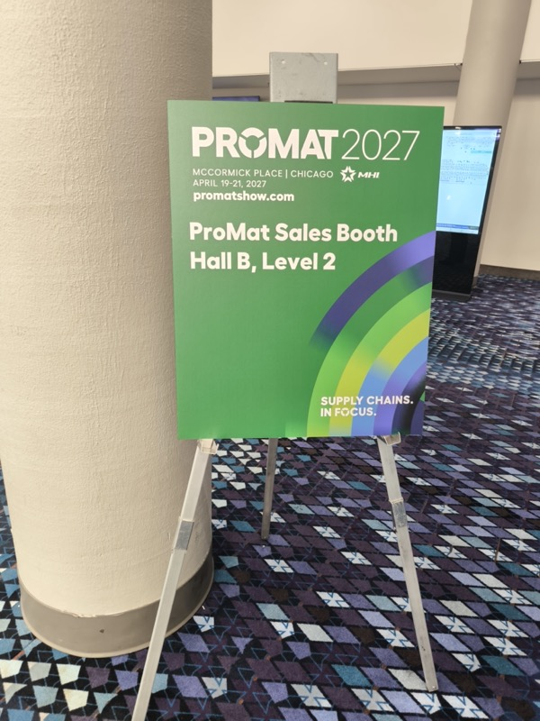

（左）idealworks（ドイツ）の AMR パレットムーバー。Zalando（欧州最大のファッション EC）への導入実績を前面に出していた。（右）ProMat 2027 の先行販売ブース。次回は 2027 年 4 月 19〜21 日、シカゴ・マコーミックプレイス開催。MODEX の「表舞台」がシカゴというわけだ。

 
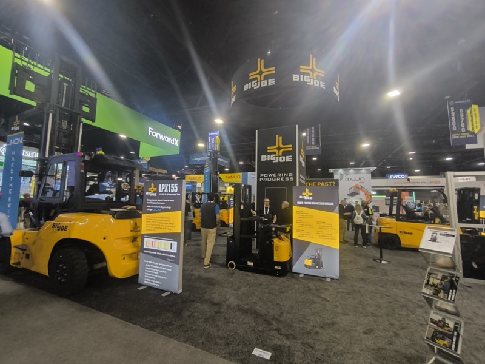

Big Joe Forklifts（米国）の大型ブース。MUJIN（日本）のロボットピッキング展示も隣接。日本メーカーは国内と変わらない製品を持ち込み、アテンドのほぼ全員がローカルスタッフという構図。

 
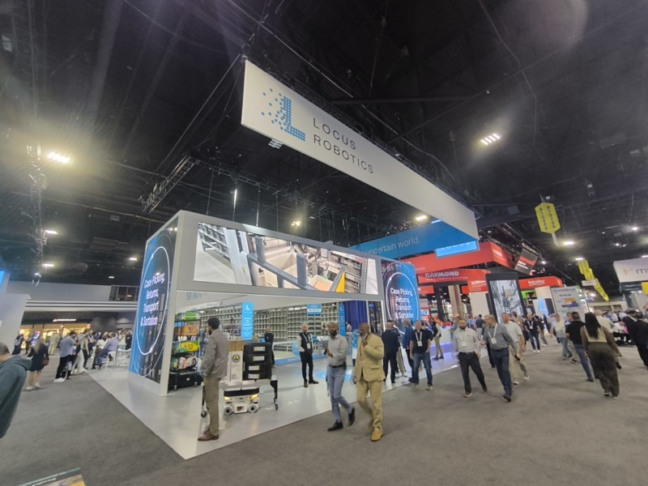

Locus Robotics（米国）の大型ブース。「Case Picking / Returns / Transport / Sanitation」という物流現場の全工程をワンプラットフォームで賄うコンセプト。デモ機が会場内を縦横無尽に走っていた。

 

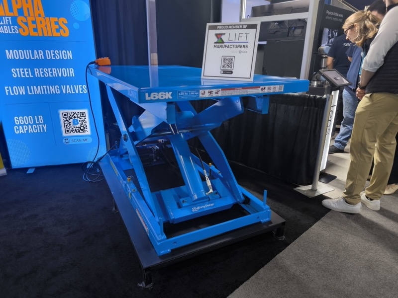
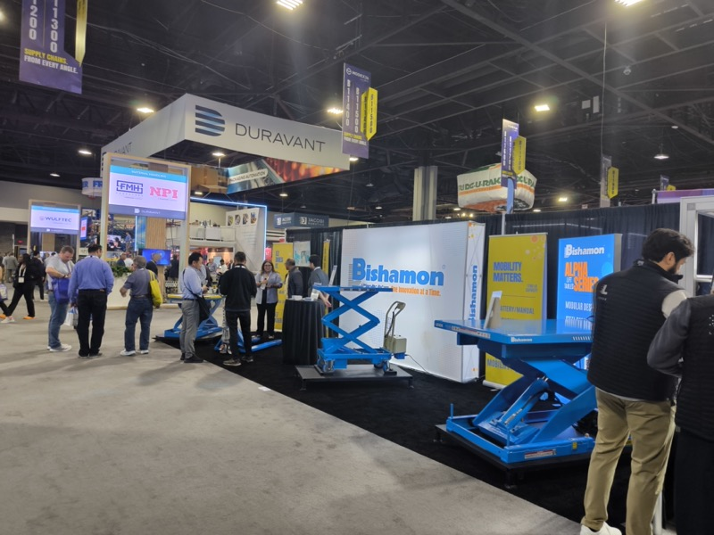

（左）L66K Alpha Series（米国）。「Modular Design / Steel Reservoir / Flow Limiting Valves / 6600 lb Capacity」のシザーリフト。（右）Bishamon（日系）のシザーリフトブース。青が特徴的なラインナップ。米国展示会に日本系メーカーもしっかり出展していた。

 

DEXORY（英国）の在庫スキャンロボット。高さ 8m 超のマストを搭載し、走りながら棚全体の在庫状況をスキャンする「Storage Health」監視ロボット。デジタルツインとの連携が売りだ。

 
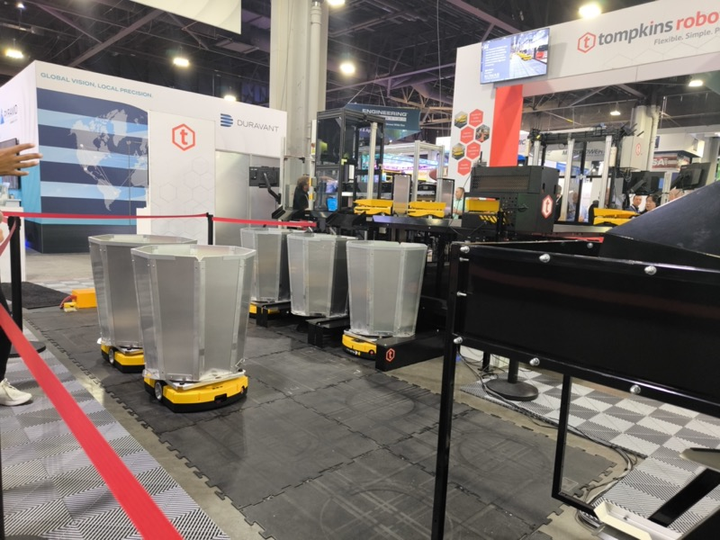

Tompkins Robotics（米国）+ Duravant の透明ビン搭載 AMR 群。小型 AMR がプラスチック製の透明コンテナを乗せて一列で走る。ソーテーションの自動化アプローチとして整然とした印象だった。

 
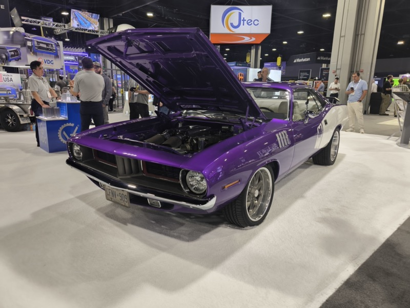

70年代の Plymouth Barracuda（紫）がブース展示されていた。CJTec のブースで、ロジスティクス機器メーカーがヴィンテージカーで集客する米国流の展示手法。

 

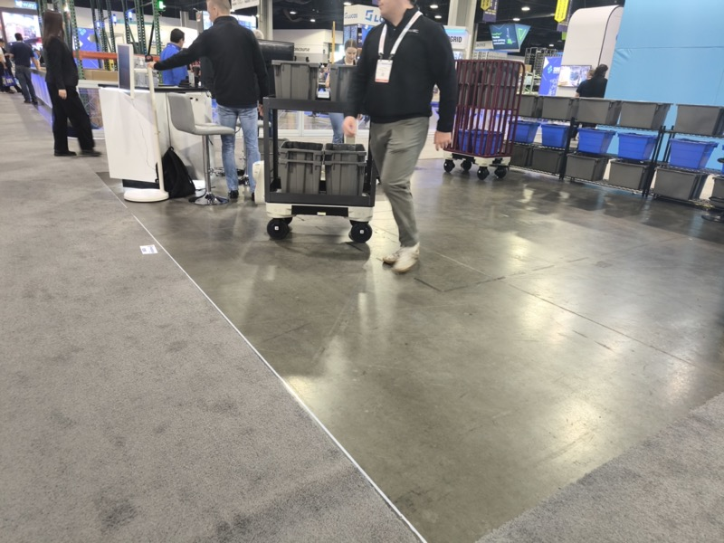

（左）人追従型電動台車。近づけば遠ざかる、までをスムーズでクイックな動きで実現しており、サウザーより格段に良い動きと感じた。技術と設計で差別化できるという好例。（右）Superior Lifts「The Last Four Feet」―トラックバースと荷台の最後の4フィートのギャップを解決するリフトプラットフォーム。Skip Construction / Improve Safety / Waste Less Space という3つのバリューを訴求。

 

ゴミ箱（大型コンテナ）を傾斜・反転してコンベアに流す自動搬送デモ。「大きなゴミ箱を自動搬送して、別置き反転機で空にする」コンセプト。DR（ダストリムーバー系）を購入した会社すべてが見込み客となる可能性のある発想だ。

 

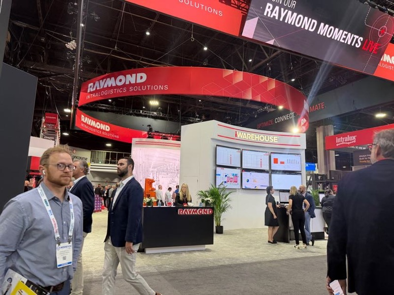

（左）Raymond Intralogistics Solutions の iWarehouse WMS ブース。フォークリフト大手の Raymond が WMS・データ管理まで一体展開。（右）SEER Robotics（中国）の大型ブース。「All Robots. One Platform. Fully in Your Control.」― DMP の名前を出しながら名刺交換。出展内容はおとなしめで、好感を持てた。

 
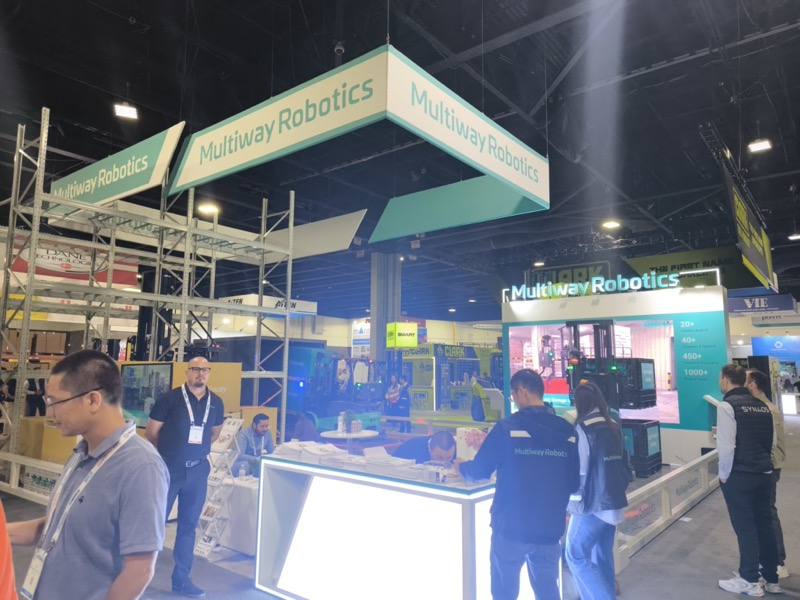

Multiway Robotics（中国）のブース。「30+ / 40+ / 450+ / 1000+」という数字が並ぶ。導入実績の数をそのまま見せる中国勢らしいアプローチ。

 
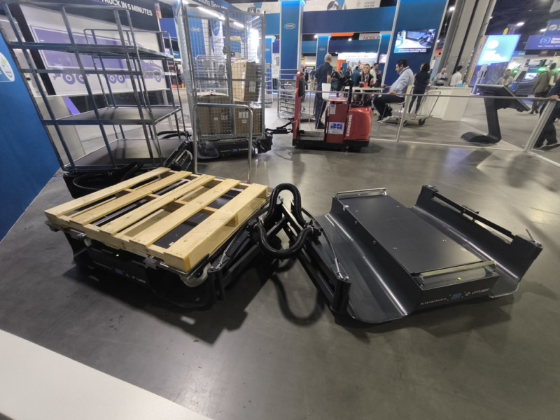

フラットパレット搬送型 AMR を台の上に並べて展示する手法。本体の薄さとパレットを直接持ち上げる構造をわかりやすく見せる。Smartpodd（スウェーデン系？）の展示と見られる。

#### BIC との昼食・BIC 会の情報交換

 

BIC の田島さんチームとのランチ。ソウルフード系レストランでフライドチキン・グリッツ・野菜のプレートを囲みながら、業界情報を交換。皆、真面目で気の良いメンバーだった。

#### アトランタ観光・夜

 

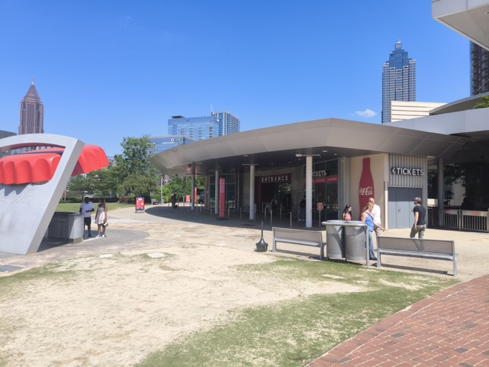
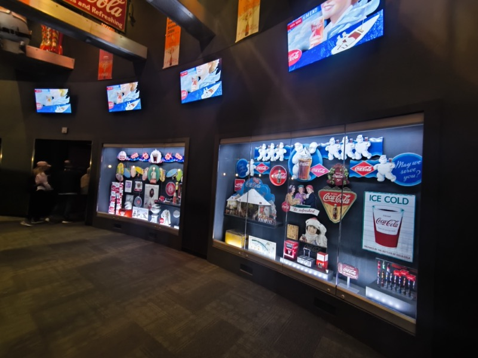

MODEX 会期後、World of Coca-Cola ミュージアム（アトランタ）へ。コカ・コーラ発祥の地。ヴィンテージ広告やボトルのコレクションが圧巻だった。アトランタに来たら外せない場所。

 

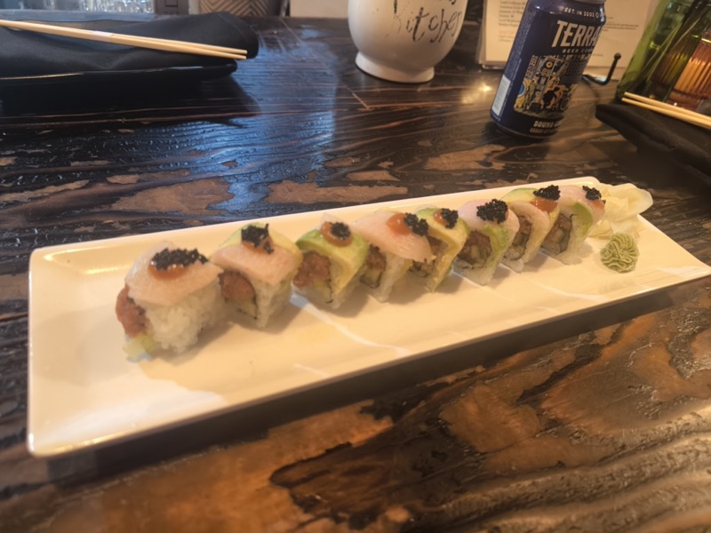
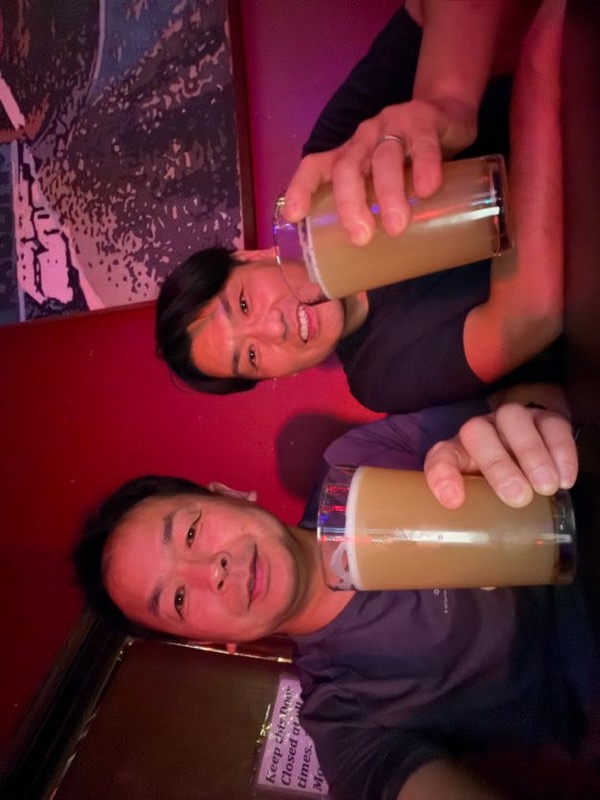

（左）夜は日本食レストランで寿司ディナー。アトランタでも本格的な寿司が楽しめた。（右）その後バーへ。2日間の展示会を振り返りながら乾杯。

---

### 帰路

 
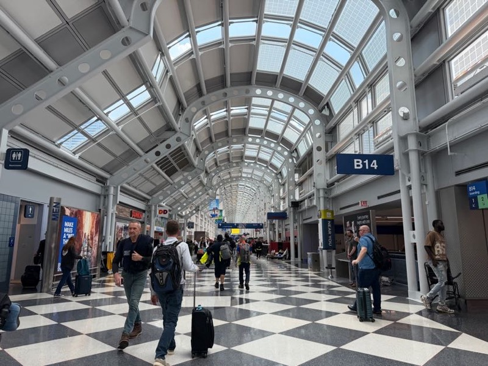

Chicago O'Hare 国際空港 B14 ゲートでの乗り継ぎ。アトランタ→シカゴ経由で帰国。アメリカ国内の広大さを改めて感じる移動だった。

---

## 6. まとめ

### 視察全体を通じた気づき・所感

**「日本の展示会でだいたいわかっていた」は思い込みだった。**

世界の技術水準と競合環境は、日本で見られるものとは別次元だ。
AMR は既にコモディティ。設計力・信頼性・コスト以外で差別化できなければ、市場に残れない。

印象に残った3点：

1. **スピードと自信の違い**：中国製無人フォークが来場者の真横で5〜6mの積み付けデモをやってのける。日本メーカーではまず見られない胆力だ。

2. **コンセプトより動作品質**：人追従電動台車で「近づけば遠ざかる」をスムーズかつクイックに実現しているものがあった。コンセプト自体はありきたりでも、技術と設計で差別化できる。これは顧客現場の実際を知らない技術部にとっての、一つの在り方かもしれない。

3. **見慣れないところに商機がある**：ゴミ箱反転搬送、SitePrint（床印刷）、Superior Lifts の「最後の4フィート」問題など、日本の展示会では目にしない切り口の製品が多数あった。

### 今後の展開・アクション

| アクション | 担当 | 概要 |
|---|---|---|
| DR 自動搬送システムの可能性検討 | 技術部 | ゴミ箱反転搬送 → DR 購入顧客への横展開案。AGV/AMR/DR/HTR 技術の融合で実現できるか |
| 後方倒れ止め（手動ハンド用）の安全安心パック追加 | 橋本GM → 営業 | 安全思考の高まりは確実な流れ。パーキングブレーキに次ぐ単価引き上げ貢献の可能性 |
| STAX 社との関係継続 | 橋本GM | 安い電動車メーカー。将来の価格戦略オプションとして、ゆるい関係継続が正解 |
| SEER Robotics との情報交換継続 | 山崎 | DMP 名義で名刺交換済み。おとなしめ展示の背景と次のステップを確認 |
| BIC の Ramon との継続接触 | 山崎 | アマゾンからのテーブルリフトオファーの詳細確認。共同提案の可能性を探る |
| パレット段積み装置の市場調査 | 技術部 | 日本市場でそろそろ機が熟すか。ロジマットでも異なるコンセプトで確認済み |
| ProMat 2027（Chicago）への参加検討 | 山崎 | 2027年4月19〜21日、McCormick Place。MODEX の「表舞台」。2年後の視察計画に組み込む |

### 不明・未確認事項

- ［要確認：BIC とは何の略か・どのような組織か］
- ［要確認：Locus Robotics が日本向けに展開予定はあるか（Nippou に「配膳猫型ロボット」と記述されているが、Locus は配送 AMR がメイン。別の会社か）］
- ［要確認：パレット段積み装置（ガスダンパー使用）の出展社名。写真からは特定できず］
- ［要確認：人追従電動台車の出展社名・型番。写真から特定できず。橋本GMが注目していた製品］

---

*Sources: [MODEX 2026公式サイト](https://www.modexshow.com/) / [BusinessWire - MODEX 2026 Press Release](https://www.businesswire.com/news/home/20260209978459/en/MODEX-2026-Supply-Chains-Marquee-Event-Coming-to-Atlanta-in-April)*

---

🟥🟥🟥🟥🟥🟥🟥🟥🟥🟥🟥🟥🟥🟥🟥🟥🟥🟥🟥🟥
<b>▼ 追記（AYamazaki 26/07/02）</b>

unUsed から復活させた写真・未掲載写真を時系列に追加。また横向きだった3枚（IMG_5768 / IMG_5787 / IMG_5965）を回転修正済み。

---

### 4/13 追加

 
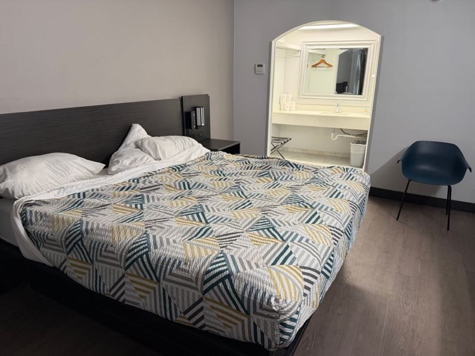

Motel 6 の客室内部。シンプルなダブルベッドと洗面台、青い椅子。清潔で機能的。コスト重視の選択。

---

### 4/14（MODEX Day 1）追加

 

会場へ向かう途中のアトランタ市内で遭遇した WM（Waste Management）の大型パッカー車。後部に油圧式リフト＆反転機構が搭載されており、ゴミ箱を自動で持ち上げ、荷台へ投入する仕組みだ。「ゴミ箱を自動搬送して反転機で空にする」という Nippou のアイデアの、現実版がここにあった。

 
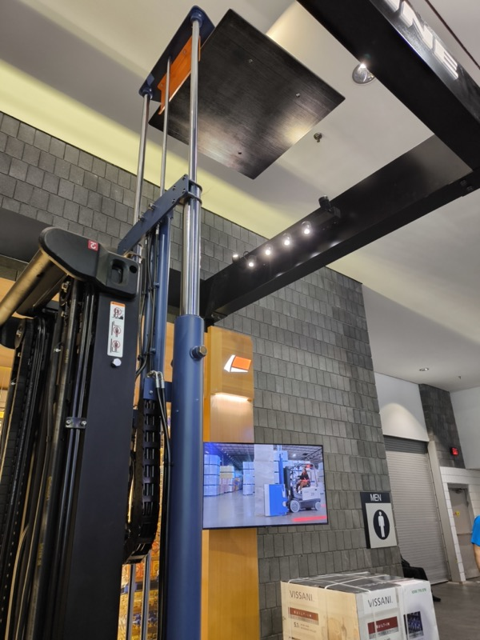

会場入口エントランス付近に展示された縦型リフト（バーチカルコンベア）。天井まで届く高さで、床面積を取らずに高所への搬送を実現する。Vissani ブランドの梱包箱が隣に積まれていた。

 

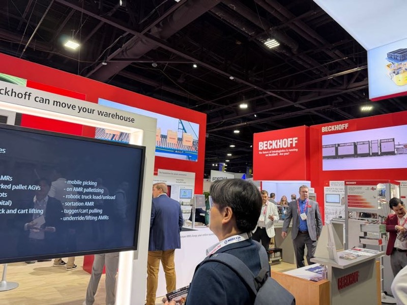
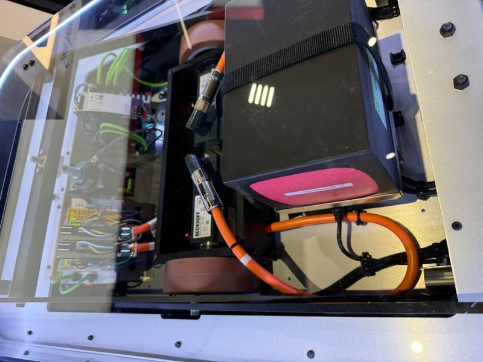

（左）Beckhoff ブースで大型スクリーンを確認中。スクリーンには AMR・ロボットトラック荷積み・ソーテーション等、倉庫自動化の全工程が一覧表示される。（右）Beckhoff AMR のカバーを開いた状態の展示。AMR 内部に搭載された Beckhoff 製コントローラーと橙色の動力ケーブルがむき出しになっている。制御の心臓部を「見せる」展示スタイルが印象的だった。

 
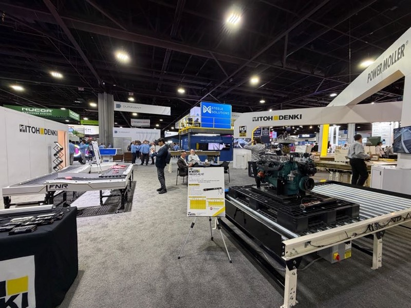

ITOH DENKI（伊東電機）・Power Moller（パワーモーラー）の合同ブース。日本を代表するローラーコンベアメーカーが MODEX にも出展。Steele Solutions（高層物流ラック大手）のブースと隣接しており、統合提案を意識した配置だった。

 
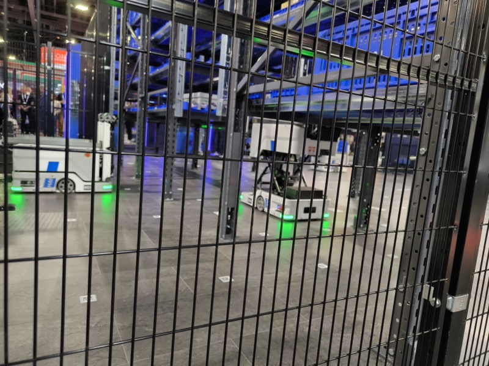

HAI Robotics のデモケージ内部を外から撮影。複数の白い ACR（Autonomous Case-handling Robot）が格子状の通路を自律的に走り回る。来場者はケージの外から眺めるだけで、ロボットは止まることなく動き続けていた。

 


（左）Southworth の全ブース俯瞰。黄色のモバイルリフト・ポジショナー、緑のシザーリフト、ティルターが一堂に会す。背後に ITOH DENKI と Power Moller が見える。（右）Presto（米国）の電動シザーリフト複数台。赤いボディが鮮やかなラインナップで、油圧式と空気圧式が混在して展示されていた。

 


Southworth のコンベア組み込み型シザーリフト（超低プロファイル）。ローラーコンベアのライン内に埋め込んで、荷を持ち上げながら次工程へ流す設計。スペース効率を最大化したラインリフトの好例。

 


DEMATIC（ドイツ系物流システム大手）のブース。大型パレットティルター・反転機の実動デモに来場者が群がっていた。DEMATIC は DHL・Amazon・Walmart への大規模導入実績を強調。競合他社との規模感の差が歴然としていた。

 


（左）Toyota Automated Logistics ブースの活況。Swisslog が隣接。「Seamless Integration / Lifetime Partner / Future-Ready」の3つのメッセージが掲示されていた。アテンドはほぼ全員がローカルスタッフだった。（右）HELI（合力、中国）の「Warehouse Trucks / End-to-End Warehousing Solution」大判パネル。リーチトラック・パレットジャック・ライダー・オーダーピッカーの全製品を1枚のビジュアルで見せる中国流の力強い訴求スタイル。

 

テーブルマニピュレーター型の昇降架台（黒）。ROSS Conveyor・TEGENE・Agility の各ブースが隣接するエリアに展示。コンベア接続を前提とした昇降治具で、ラインへの組み込みを想定した構造だ。

 


Robotize（デンマーク）のフラット AMR がパレットを搭載してブースの構造物の下をくぐる瞬間。超低床設計で標準パレットをそのまま持ち上げ、自律搬送する。緑の LED が方向指示の役割を果たしていた。

 


（左）Bluepath Robotics のバナー。「ROI in 2 Years」「SAFETY」「EFFICIENCY」「INTEGRATION」—AMR の導入価値を4つのキーワードに絞って訴求。シンプルで明快なメッセージ設計。（右）Slip Robotics（「AN ENTIRE TRAILER IN 5 MINUTES」）と THIRA Robotics の隣接展示。Slip はトラック荷積みの完全自動化、THIRA は小型四輪全地形対応ロボット。テーマも用途も異なる2社が並んでいた。

 


（左）PD Manufacturing「Tools for the Hardest Mile in Delivery」。ハンドトラック・ドーリー・坂道ランプなど、ラストマイル配送の最終局面（トラックから玄関先まで）に特化した手動搬送ツール専業メーカー。（右）PROGLOVE（バーコードスキャナー内蔵手袋）ブース付近の混雑した通路。来場者が密集し、各社担当者とのその場での商談がいたるところで起きていた。MODEXはカンファレンスというより、現場のバイヤーが素直に物を買いに来る場だと実感した。

 

LIFTPOINT ブースの全景。Raymond のリーチスタッカーがリフト上で持ち上げられた状態を展示。「フォークリフトをコンテナの床面高さに合わせる」ことで、コンテナへのフォークリフト直接乗り入れを可能にする。「設計力を感じる」と Nippou に記された通り、課題に対する解決アプローチが鮮やかだった。

 


（左）BIC 会食後のアトランタ散歩。グラントパーク近辺の公園の夜間整備現場。ポラリス製 4 人乗り UTV とフォークリフトが稼働していた。（右）ダウンタウン近くの夜の通り。信号機・街路樹・通行車両のある落ち着いた夜景。治安の良い雰囲気だった。

 


夕方のアトランタ、池のほとりで出会ったバリケンガモ（Muscovy Duck）。木製のデッキの上でじっとしていた。時差ぼけのぼんやりした頭でぼんやり眺めた一幕。旅の記録はこういう写真も大切だ。

---

### 4/15（MODEX Day 2）追加

 


（左）朝のアトランタ住宅街。緑豊かな並木と木造一軒家が並ぶ。日本の郊外とは似て非なる景観。（右）Day 2 の朝食。エッグ＆チーズのクロワッサンサンドとカプチーノ。シンプルで美味かった。

 


MODEX 2026 の詳細フロアマップ（別角度版）。Hall A・B・C の配置に加え、スポンサーブース（KÖRBER B13332 / ROBOTEON B15119 / Yale B13732）の番号と位置情報が記されている。モバイルアプリ「MODEX 2026 Mobile App」への誘導も掲示されていた。

 


MOODE ROBOT（中国）のブース正面から撮影。「Instant Smart Warehouse. No renovation.」のオレンジのバナーが会場内でも目を引く。実機のフォーク型 AMR が展示エリア内でパレットを持ち上げるデモを繰り返していた。

 


STAXX ブースにて。山崎・橋本 GM と STAXX 担当者（中央）の3ショット。「とにかく安い」が最大の特徴の電動車メーカー。橋本 GM が前年から接点を持つ相手で、今後の価格戦略オプションとして関係を継続することを確認した。

 


会場で出会った担当者（中央）を交えた3ショット。背景に ORBIS・SWISSLOG のサインが見える。日本メーカーとして知識・実績があることを伝えると、相手も自然に情報を開いてくれる場面が多かった。

 


展示会場ランチショップ「Southern Root。「Georgia Brews / Savories / Sweets / Musical Artista」の看板が並ぶカジュアルなダイニング。

 

 


（左）Tompkins Robotics ＋ Duravant のブース別角度。黄色いバッグを吊るしたコンベアソーターが稼働。AMR とソーターの統合ソリューションを展示していた。（右）Roach Conveyors（米国）の大型ブース。オレンジ色のコンベアライン・「Custom Solutions for Ultimate Productivity」のバナー。Agility Robotics のブースも左奥に見える。

 

 


（左）BIC ランチのメインディッシュ。揚げたてのフライドキャットフィッシュ（なまず）とミックスグリーン、タルタルソース。Southern 料理の定番。（右）デザートのブレッドプディング。カラメルソースがかかった甘さ控えめの逸品。アメリカのカジュアルファインダイニングのクオリティは決して低くない。

 

DEXORY（英国）ブースにて担当者（中央）と記念撮影。山崎・橋本 GM と。DEXORY のロボットは高さ 8m 超のマストで棚全体をスキャンし、在庫の「Storage Health」を可視化する。デジタルツインとの連携が売りで、英国スタートアップながら存在感があった。

 


Titan（米国）ブースの黄色いパレットジャック。「Drop Your Card, Win a Titan」のキャンペーン名刺箱がカウンターに。電動化されておらず手動式だが、剛性の高さと価格の安さを売りにするメーカー。日本の手動ハンドとの比較では設計の方向性が似ている。

 


Ballymore（米国）のブース。大型の工場向けクライミングプラットフォーム（$395/month）と卓上型電動シザーリフト（$114/month）が並んでいる。月額課金での販売モデルを明示していた。購入ではなくサブスクリプションで設備を提供する米国流のアプローチが新鮮だった。

 


（左）World of Coca-Cola ミュージアムの内部。天井を埋め尽くす世界各地のヴィンテージ看板・広告・ボトル。「University Grill」「Fountain Service」「LUNCH」の古い看板が折り重なる光景は圧巻だった。（右）ミュージアム建物の外観とアトランタのダウンタウンスカイライン。コカ・コーラ発祥の地アトランタの象徴的なシンボルだ。青空との対比が美しい。

 


アトランタの有名なブルースバー「Blind Willie's Blues Jazz & Roots」の外観。「LIVE BLUES TONIGHT」の黒板が出ていた。ミシシッピ・デルタスタイルのブルースライブが楽しめる老舗バー。名前はブルースの伝説 Blind Willie McTell（アトランタ出身）に由来する。

 


（左）夜の日本食レストランで注文した焼き鳥（もも串）。アトランタにも本格的な焼き鳥が食べられる店がある。（右）バーのカウンターで2杯のバーボン（オン・ザ・ロックと水割り）。2日間のMODEXを振り返りながら。

 


（左）夜の外出先（バー外テラス付近）で記念撮影。赤提灯が並ぶオープンエアのバーの前で。（右）バーのカウンターの風景。バーテンダーが客とやり取りをする、ローカルなバーの雰囲気。

 


日本食レストランのバーカウンターにて。山崎・橋本 GM がバーテンダーと向き合って親指を立てる。白髪のバーテンダーが笑顔で対応している。言葉が通じなくても、笑顔と親指が万国共通だと改めて実感した。

🟥🟥🟥🟥🟥🟥🟥🟥🟥🟥🟥🟥🟥🟥🟥🟥🟥🟥🟥🟥

---

🟦🟦🟦🟦🟦🟦🟦🟦🟦🟦🟦🟦🟦🟦🟦🟦🟦🟦🟦🟦
<b>▼ 追記（AYamazaki 26/07/02）</b>

review-report.md により、Images/ フォルダの全写真を再照合。未掲載写真9枚を時系列に追加。VID_xxx_thumb.png および不要な IMG_xxx_thumb.png を unUsed へ移動。

---

### 4/14（MODEX Day 1）追加②

 


ZS Robotics（中国）ブース正面。「0 PROJECT FAILURE RATE / 5 min NEW SHUTTLE DEPLOYMENT / 100% GLOBAL COMPLIANCE」を謳うシャトル型 AMR メーカー。Standard Robots のサインが背後に見え、2社が隣接して展示していた。

 


「Load or unload an entire trailer in under five minutes」—会場内のモニターに映された映像。フォークリフトなしにトレーラーを5分以内に積み降ろしするコンセプト。Slip Robotics のデモ映像と見られる。コピーとして圧倒的な訴求力があった。

 

SMG3 EDGE エリアで目にした小型電動バーチカルリフター（ポスト型）。軽量な荷を縦方向に持ち上げるシンプルな補助器具。フォークや台車に頼らず省スペースで垂直搬送を実現する、ラストワンフィート系の発想だ。

 


青い電動テーブルカート（Cap.2000lb / 約900kg）。シザー機構で昇降する電動台車で、大容量の荷を乗せたまま移動できる。背後にキャタピラー（CAT）のサインが見える。

---

### 4/15（MODEX Day 2）追加②

 


MiSUMi のブース。「80 SEXTILLION CONFIGURATIONS / Configured to Save Time」—機械部品メーカーが MODEX に出展しているのは珍しい。多品種の部品サプライヤーとして、搬送システムの設計者層を狙った出展と見られる。

 


大型タイヤを4つ持つ屋外対応の自律搬送ロボット。Nippou に「完全に全天候型で、大車輪でオフロードの段差に対応したモデル」とある北京近郊のメーカー製と一致する。屋外の荒れた路面でも自走できる設計で、EP・標準AGVとは明確な差別化がある。

 


LS THIRA-UTECH（韓国）の大型ブース。小型四輪 AMR「THIRA」がデモエリアを自走し、LS Electric ブランドとの連携を前面に出している。前日に Slip Robotics と隣接展示していたのと同じメーカーが、ここでは独立したブースで存在感を示していた。

 

Titan（米国）ブースの黄色いパレットジャック（正面アングル）。「Drop Your Card, Win a Titan」の名刺キャンペーンをやっていた。手動ハンドの設計合理性と堅牢性を押し出す米国メーカー。日本の手動ハンドとの設計比較として参考になる。

 

🟦🟦🟦🟦🟦🟦🟦🟦🟦🟦🟦🟦🟦🟦🟦🟦🟦🟦🟦🟦

---

## その他の写真

本編の流れには収めなかった写真・動画サムネイルを収録する。

 


 


 


 


 


 


 


 


 


 


 


 


 


 


 


 


 


 


 


 


 


 


 


 


 


 


 


 


 


 


 


