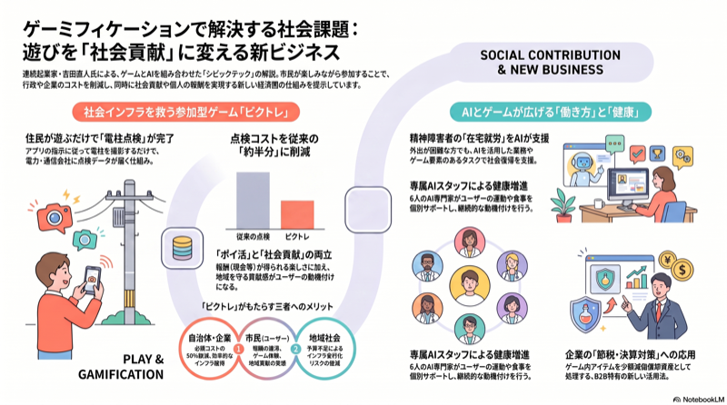

# 吉田 直人氏 講演レポート
## ゲーミフィケーションで社会課題を解決する

---

## 講演概要

| 項目 | 内容 |
|---|---|
| イベント | 経済界倶楽部 名古屋6月例会 第531回 |
| 演題 | ゲーミフィケーションで社会課題解決。電柱点検ゲーム「ピクトレ」の事例紹介 |
| 講師 | 吉田 直人氏（デジタル・エンターテイメント・アセット Founder & Co-CEO）|
| 日時 | 2026年6月29日（月）16:30〜17:30 |
| 会場 | 名古屋観光ホテル 3階「桂」|
| 聴講者 | 山崎 |

 

左：経済界倶楽部 名古屋6月例会の案内状。演題・講師・日時・会場のすべてが記載されている。右：吉田 直人氏、登壇の一幕。声がかすれているのは32歳の時のがん・放射線治療の後遺症だという。

---

## サマリー

ゲームを使って社会課題を解決する。それを事業にしてしまった男だ。
主力サービス「ピクトレ」は東京電力と共同開発した電柱点検ゲームで、全国展開中だ。
プログラミング外注のAI完全内製化で、昨年10月まで月1,000万〜2,000万円かかっていた外注開発費が、ゼロ円になったという実話は衝撃的。

---

## 登壇者について

28歳でゲーム会社を設立。拓銀・山一が倒れた時代の貸し渋りで倒産した。
同時期にがんを患い、放射線治療で声がかすれた。それは今も続いている。

その後、3社を上場させた。セレビスホールデン、ザッパラス、イオレ。
いずれも時代の流れに巻き込まれながら、何度も再起した経営者だ。

現在はDA（デジタル・エンターテイメント・アセット、2018年シンガポール創業）のCEOとして、ゲーミフィケーションを事業の核に据えている。

---

## 講演内容

### ゲーミフィケーションとは何か

ゲーミフィケーションというと、社員研修にゲームを使うケースが圧倒的に多い。
吉田氏の違いは、それを事業そのものにしてしまったことだ。

ビジネスモデルはB2B。ユーザーからは課金しない。
企業や自治体から費用をもらい、ユーザーに還元する構造だ。
既存のゲームメーカーとはビジネスモデルが根本的に違う。

### ピクトレ ― 電柱点検ゲーム

東京電力と共同開発したスマートフォンアプリだ。
電柱に2m以内に近づくと自動でカメラが起動し、ガイダンスに従って撮影する。
撮影データは東京電力に送られ、インフラ点検に活用される。

 

NotebookLMで作成したコンセプト図。左の「PLAY（遊び）」が右の「SOCIAL CONTRIBUTION（社会貢献）」へと転換されるモデルを示す。ユーザーは楽しみながら働き、企業・自治体・社会の課題解決に貢献する。

ゲームとしては、3チームに分かれて取り合い戦を行う。
撮影した電柱が自チームの色に変わり、チームで競う。
報酬は1本あたり15〜100円（地域・時期によって異なる）、チーム報酬は50万〜100万円単位。
ポイ活感覚で遊びながら世の中の役に立つ、という構造が特徴だ。

実績：北海道・秋田・沖縄・新潟・関東・東北などで展開済み。通常の点検コストの半分に削減。
NHK・テレビ朝日をはじめ各地のメディアに取り上げられた。
名古屋経済大学一村高等学校の入試問題にも登場した。

JTBが全国1,718自治体向けに営業を開始。カーブミラー・マンホール・防災設備への展開も進行中。
防災チャンピオンシップ（都道府県・市町村対抗の防災点検ゲーム）も開発中だ。
名古屋地区は秋口の開始予定。

### ASICSとのコラボ ― 運動×健康×保険

ASICSとともに、AIを活用した健康増進サービスを開発している。
ゲーム的な要素を取り入れ、AIキャラクター6人が専属スタッフとして食事・睡眠・運動をサポートする。
本来なら雇えない専属チームを、AIで再現した形だ。

健康増進→保険支払いの抑制、というInsurTech領域への展開も視野に入れている。
ASICSにとっては、B2C企業が新規事業としてB2B参入するモデルだ。

### 障害者就労支援 ― 在宅でAIを使う

法定雇用率が7月1日から2.7%に引き上げられる。
日本の障害者手帳保有者は1,000万人超。そのうち精神障害者は610万人で、5年で2倍になった。

精神障害者は出社が難しい。吉田氏の弟も30年間うつ病で引きこもり続けている。
その経験から生まれたサービスが「働くホーム」だ。
在宅でAIを活用し、企業が出したクエストをこなしながら社会復帰を支援する。
障害者がAI活用スキルを習得し、企業のAI活用をサポートするモデルに育てていく。

### AIシフト ― 外注費ゼロへ

昨年10月まで、外注の開発会社に月1,000万〜2,000万円を支払っていた。
現在はゼロ円だ。
すべてのプロダクトを自社でAI開発に完全移行した結果だ。

「AIアダプション」というキーワードで検索するとDA社が最上位に出てくるという。
AI本体を作るのではなく、AIを何に使うかを追求している会社だ。

### その他の事業

- **ご当地秘密エージェント**：消滅可能性自治体（744/1,718）向けの関係人口増加サービス。ピクトレの自治体ネットワークを活かす。
- **タッチ＆トレイル（竹中工務店）**：オフィス内にNFCタグを設置し、出社した社員の部門横断コミュニケーションを促進するゲーム。実証実験中。
- **決算対策**：ゲームアイテム購入が少額減価償却資産として即時損金算入できる仕組みを応用したサービス。

---

## 印象的な発言

「ゲームと言いましても、ただ楽しいだけではダメ。人が動くには、①面白い、②少し得をする、③世の中の役に立っている、この3つが揃う必要があります。」

「本当は真面目な顔をして何回もお願いしてもやってくれない。でもゲームを通じて面白いですよと言うと、アルバイト代を払わなくても動いてくれる。しかも本人の満足感が高い。」

「開発コストは昨年の10月までは月1,000万から2,000万円。現在はゼロ円です。」

---

## 所感・気づき・アクション

すさまじいレベルのアイデアマンだ。機会があればまたお話を伺いたい。
今日は泊りで一旦東京に戻って、また静岡に来る予定。
来週は、大阪、、、といまだに飛び回っている。
自身を、「営業が好きなんです」と言い切る。
営業先や今日のような懇親会場でで、熱量のある人に出会えることがあって、それが楽しみ。
「何かを成し遂げるには、熱量のある人と組まないとダメ」という強烈な主張が印象的であった。

そして会社に課題があることも大事。
「それは、社会に貢献したいいう高尚なものでも、売上を拡大したい、といった俗にまみれた願望でも構いません」と。
東京電力のピクトレも、懇親会でであった東京電力の若者。
彼は今、別会社でピクトレを展開し、最年少役員になったらしい。

AIの実例として、
外注に出していたプログラム開発費、月2,000万円がゼロになったという事実も、実に印象的であった。
吉田会長の肌感覚で、プログラム開発の単価は半分以下には下がるでしょうね、と。
プロンプトとか今はまだとっつきにくいが、あと半年か１年でもっと簡単になるでしょうね。とも。
話をした感じでは、おそらくClaudeでプログラム開発を行っている。

ゲームという手段を使って社会インフラの点検を市民に委託するモデルは、発想の転換だ。
コスト削減と地域貢献と市民の楽しさを、同時に成立させている。

自社に引きつけるなら、展示会や製品説明でもゲーミフィケーションの発想は使える。
「楽しいながら役に立つ」という設計は、製品体験にも応用できる可能性がある。

また、AI活用やGitHub活用も、難しく考えすぎているような気がした。
本当にこうして、プロの世界でスマホのアプリ開発を全てAIで実現しているのである。

出来ないわけがないではないか。

---

 

講演後の懇親会にて。右から2人目が吉田 直人氏。とても優しいかつ力強い。右端が主催者の佐藤社長で、吉田会長とは３０年来の友人であるとか

２０代の頃、佐藤社長がバイトをしていたちゃんこ屋。３０代になって主婦になり、そこの店主から紹介されたのが当時の吉田社長。
その頃既に、Imodeの占いアプリで儲けていたんだとか。
その時も今も、経営者として尊敬していて、まぶしい存在。確かに自分も眩しさを感じた。