# Interop Tokyo 2026 視察報告

> 技術部 山崎

---

## 概要

| 項目 | 内容 |
|------|------|
| 視察日 | 2026年6月11日（木） |
| 会場 | 幕張メッセ（Hall 3〜8） |
| 同行 | 情報システム部 横井さん |
| イベント | Interop Tokyo 2026（ネットワーク・データセンター総合展） ／ AI NATIVE EXPO 併催 |
| テーマ | ネットワーク運用・データセンター設備・AIエージェント活用の最前線 |

---

## 会場入り：AI NATIVE EXPO とともに

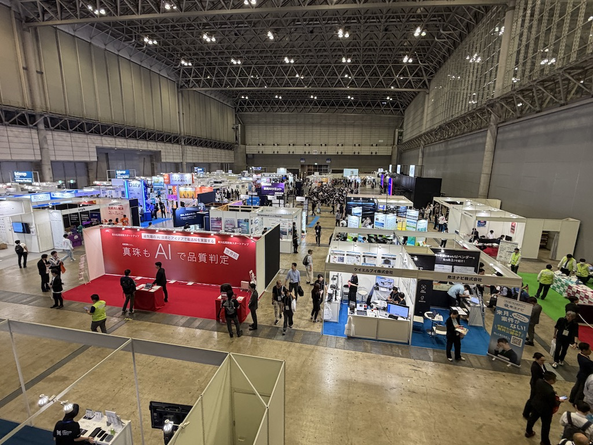 
▲ 2階から見たARCRAブース。赤い特設カーペットが敷かれ、会場内でもひときわ存在感のあるブース構成だった。

翌朝、Hall 5の入口から会場入り。今回のInteropは、従来のネットワーク・データセンター展示に加えて「AI NATIVE EXPO」が大きく併催されており、入口の表示にも両方のロゴが並んでいた。

---

## ネットワーク運用の最前線：SHOWNET / Cisco NOC

セミナーエリアを出て展示ホールへ。Interopの名物企画「ShowNet」は、会場全体のネットワークインフラを最新技術で構築・運用するという展示で、その運用拠点（NOC：Network Operations Center）がガラス張りで公開されていた。

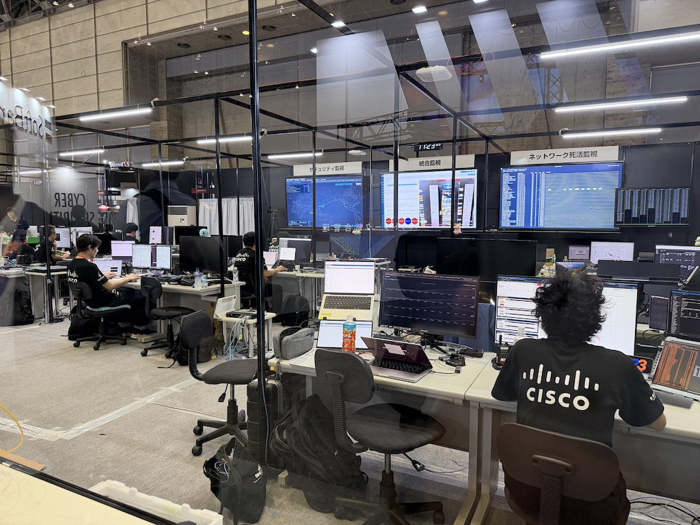 
▲ ShowNetのNOC。Ciscoのエンジニアたちが、セキュリティ監視・統合監視・ネットワーク死活監視のモニターをずらりと並べて常時監視している。会場のネットワークそのものが「生きた展示」になっているのがInteropらしい。

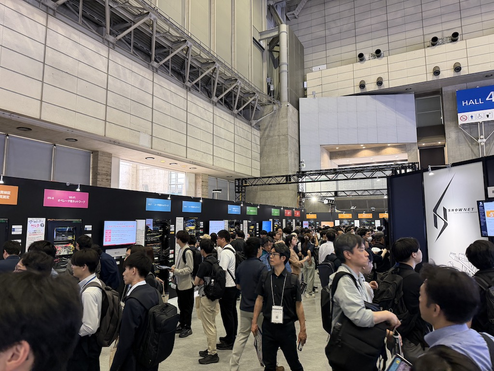 
▲ 展示ホールの様子。ShowNetの解説パネルの前には常に人だかりができていた。

---

## 映像・LEDビジョン展示

ホール内を歩いていると、ひときわ目立つ大型LEDビジョンの展示があった。

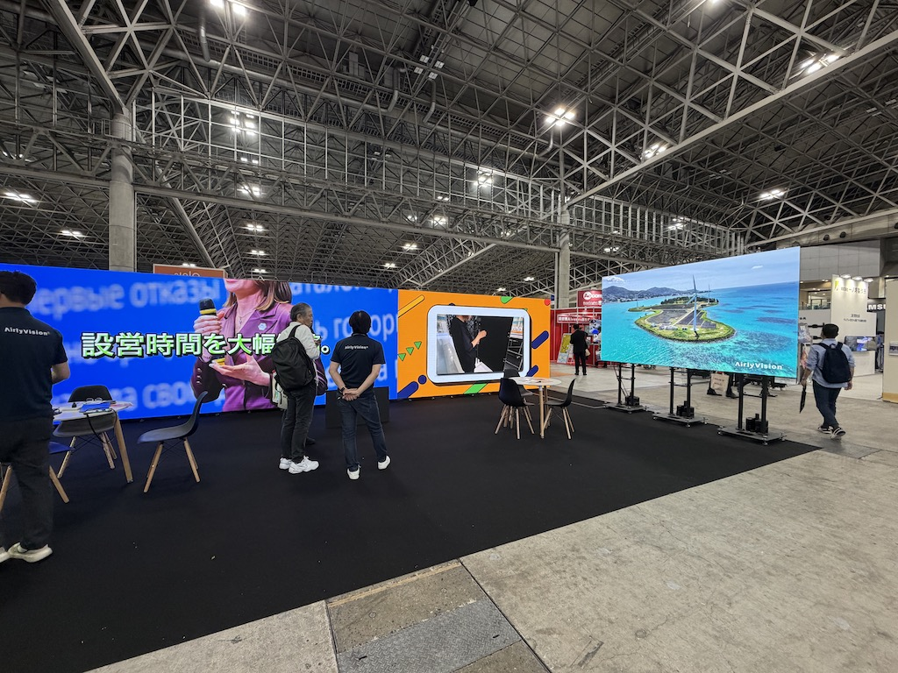 
▲ AiryVisionのブース。「設営時間を大幅に短縮」を売りにした大型ビジョンシステムを、複数の用途（モバイル取材、ライブ配信、自然風景の演出）で見せていた。

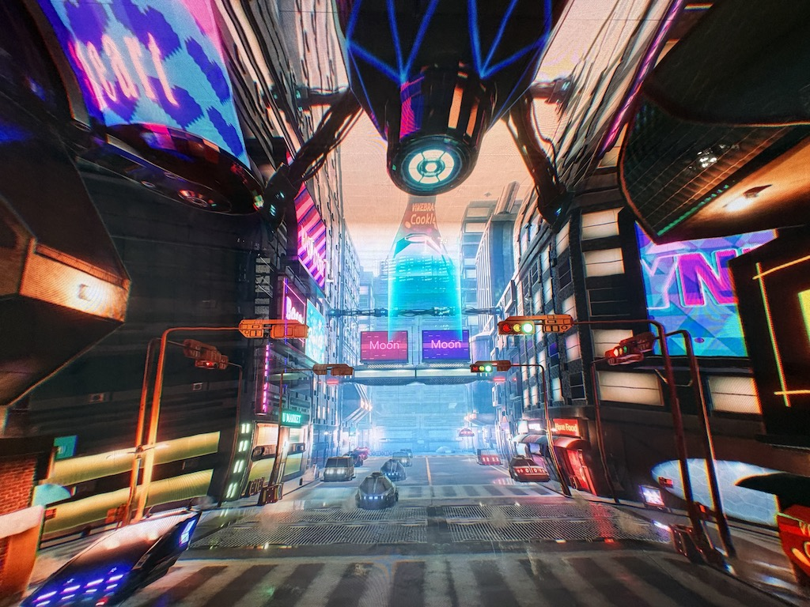 
▲ XINTAIブースの巨大LEDビジョンに映し出されたサイバーパンク風の都市映像。解像度・色再現性ともに非常に高く、思わず見入ってしまう迫力。

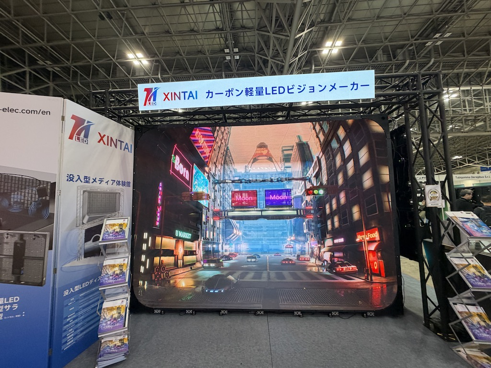 
▲ XINTAI「カーボン軽量LEDビジョンメーカー」のブース全景。軽量・薄型のLEDパネルで、没入型のメディア体験を作るというコンセプト。設備展示としてだけでなく、社内イベントや展示会のブース装飾としても応用できそうだと感じた。

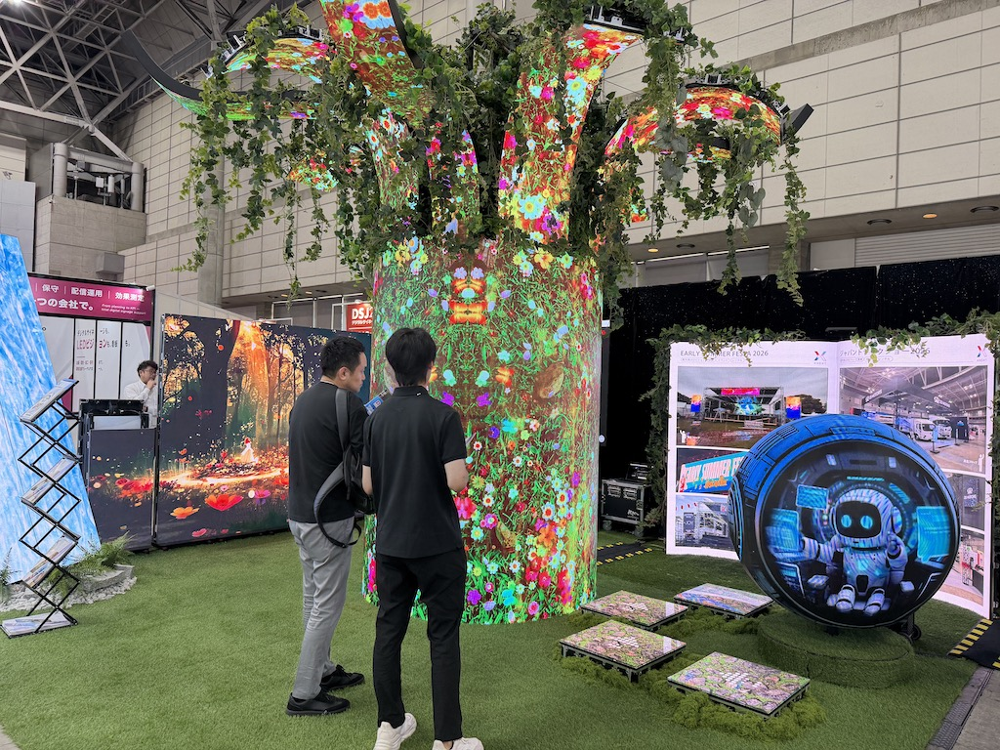 
▲ 木をモチーフにしたLEDオブジェの展示。来場者が足を止めて見入っていた、会場内でも目を引くアートインスタレーション的なブース。

---

## 会場全景とフロアマップ

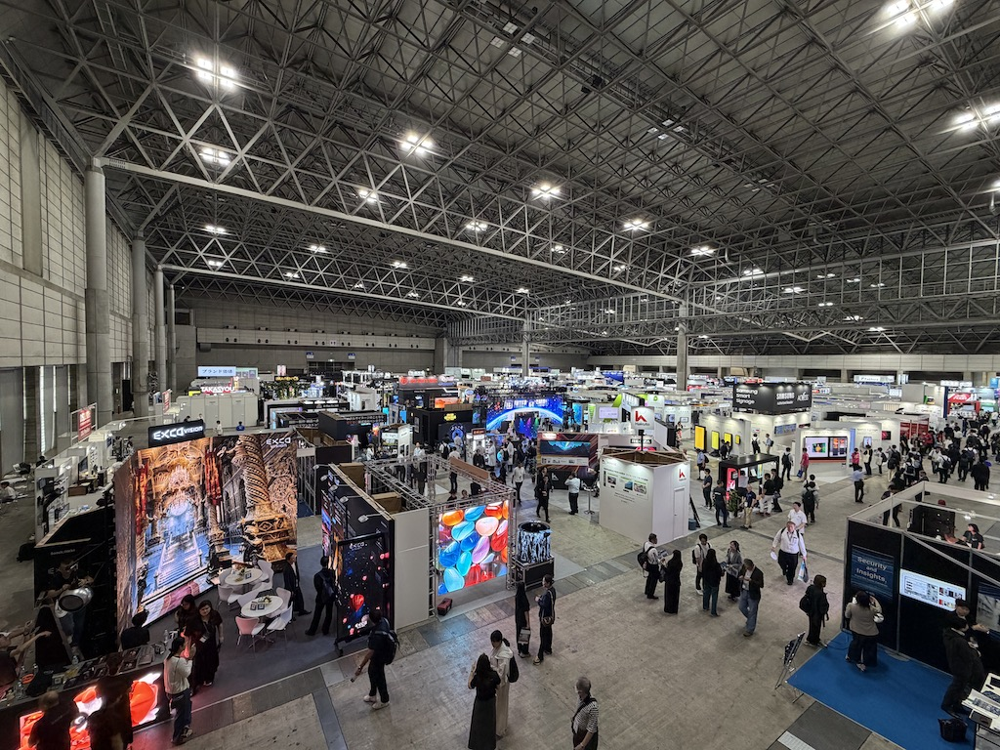 
▲ 2階通路から見た展示ホール全体。広大なフロアに、データセンター設備からAIスタートアップまで、多種多様なブースがひしめいている。

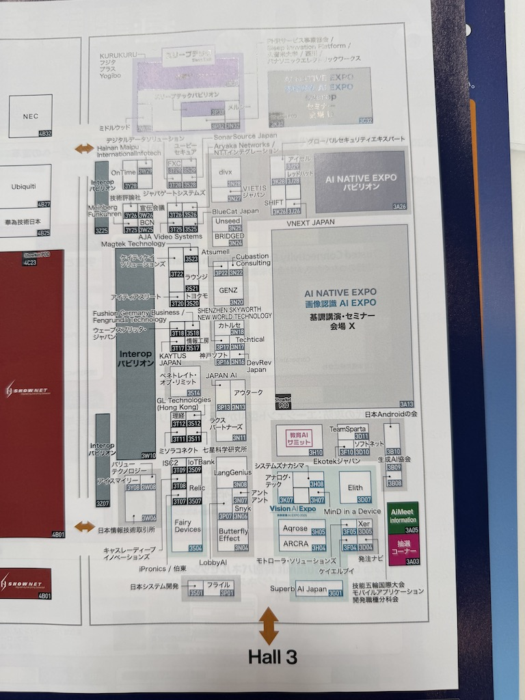 
▲ Hall 3 のフロアマップ。「Interopパビリオン」「AI NATIVE EXPO 画像認識AI EXPO」「Vision AI Expo」など、テーマ別にゾーニングされており、AI関連の存在感が年々増しているのを実感する構成。
---

## AI NATIVE EXPO：基調講演・セミナーで感じた「今」

会場内には専用のセミナーステージが設けられており、AIエージェント活用やAI駆動開発に関する講演が連続して行われていた。スケジュールボードを見ると、テーマの濃さに驚く。

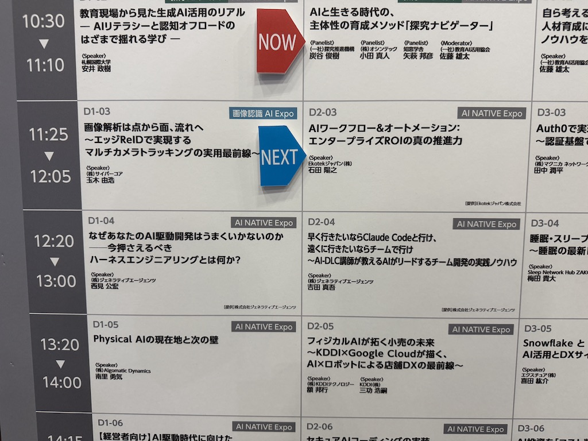 
▲ セミナータイムテーブル。「早く行きたいならClaude Codeと行け、遠くに行きたいならチームで行け」「なぜあなたのAI駆動開発はうまくいかないのか」など、AI駆動開発を正面から扱うセッションが並ぶ。社内のAI活用を考える上でも刺さるタイトルが多かった。

### AWS：仕様駆動開発（SDD）と AI-Driven なプロセス設計

最初に立ち寄ったのはAWSのセッション。テーマは「仕様駆動開発（Specification-Driven Development）」。AIでコードを書く速度自体は上がったものの、計画・レビュー・テストの“待ち時間”が変わらず、結局ビジネス成果につながっていない――という課題提示から始まった。特に「言語化された評価基準を作ると“待ち”が減る」というスライドが印象的だった。

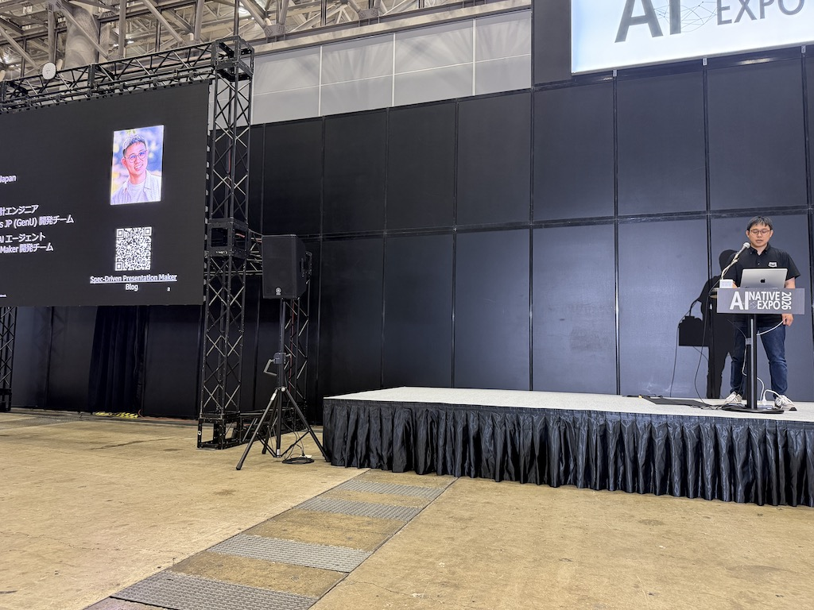 
▲ 登壇者紹介スライド。AWS Japanのエンジニアが、Spec-Driven（仕様駆動）な開発手法について解説。

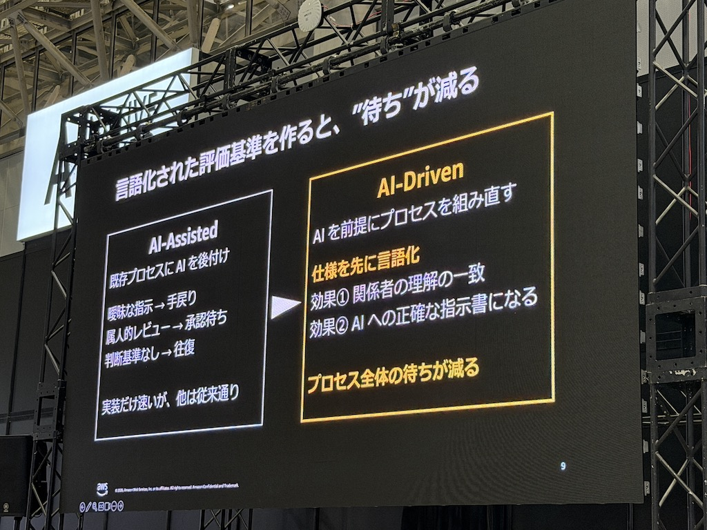 
▲ 「AI-Assisted」と「AI-Driven」の対比。既存プロセスにAIを後付けする「AI-Assisted」では曖昧な指示や属人的レビューが残るが、AIを前提にプロセスを組み直し仕様を先に言語化する「AI-Driven」にすると、関係者の理解が一致し、プロセス全体の“待ち”が減るという指摘。仕様書＝AIへの指示書、という整理は社内のCAD不具合管理システムの改善にも通じる考え方だと感じた。
「仕様を先に言語化」というのが、推進中のGitHubの最大の目的である。

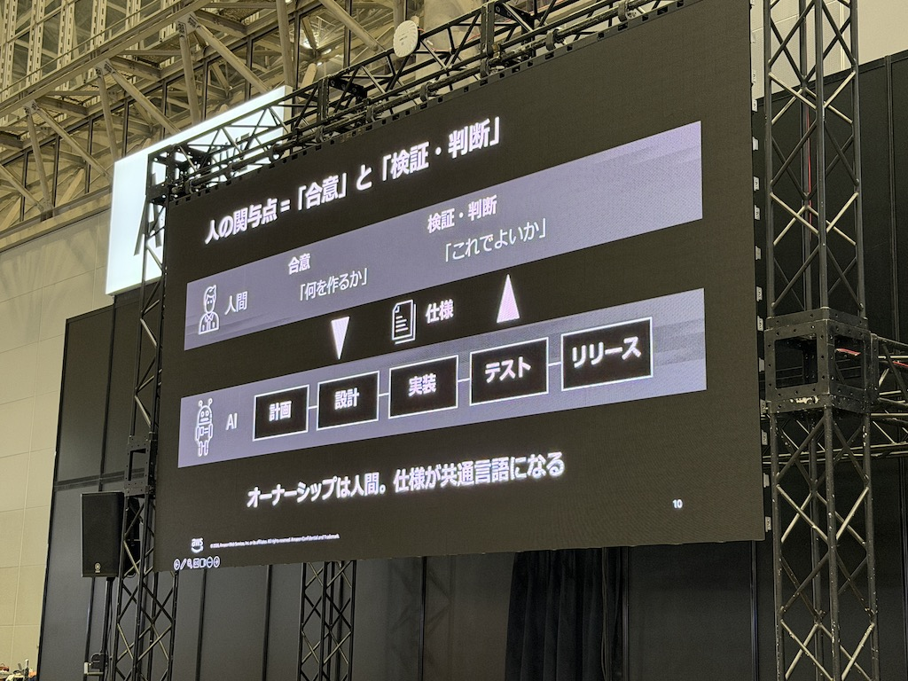 
▲ 「人の関与点＝合意と検証・判断」。人間が「何を作るか」を合意し、AIが計画・設計・実装・テスト・リリースまでを担う。最終的なオーナーシップは人間にあり、仕様が人とAIの共通言語になる、という構図。
これからのAI時代に、忘れてはいけない、超重要な概念。

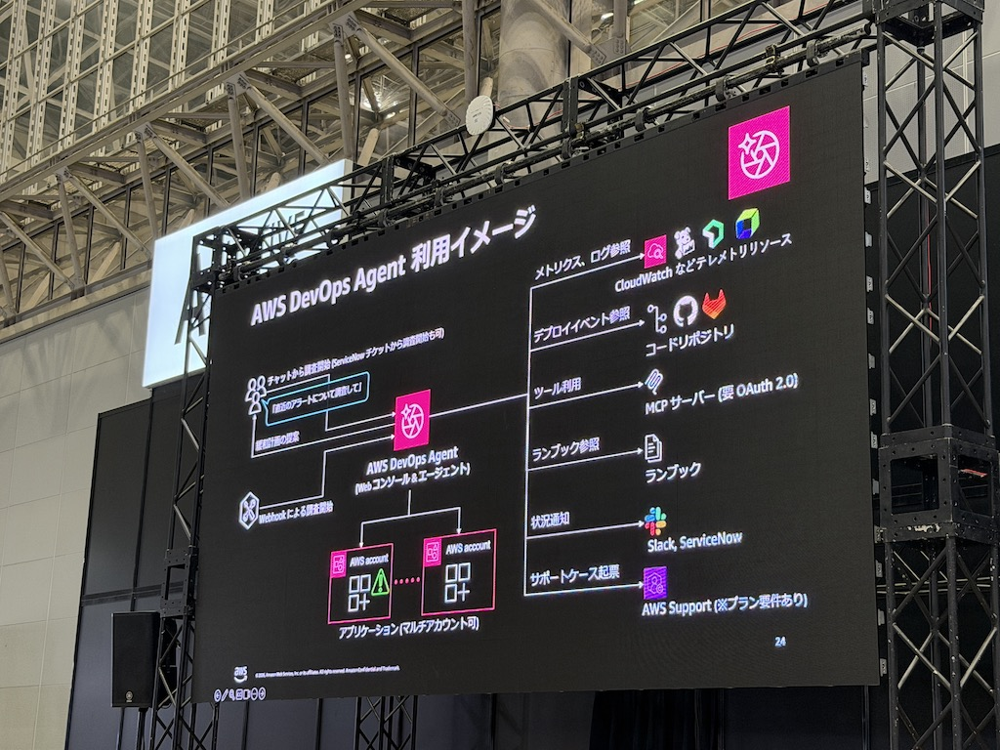 
▲ 「AWS DevOps Agent 利用イメージ」。チャットやアラート起点で起動し、メトリクス・ログ参照、デプロイイベント参照、ランブック参照、Slack/ServiceNowへの状況通知、サポートケース起票までを自動でこなす構成図。運用監視の一次対応がエージェントに置き換わっていく流れを具体的に示していた。
画面の右端のアイコンに、GitHubがある。Amazon でも当たり前に使われている。

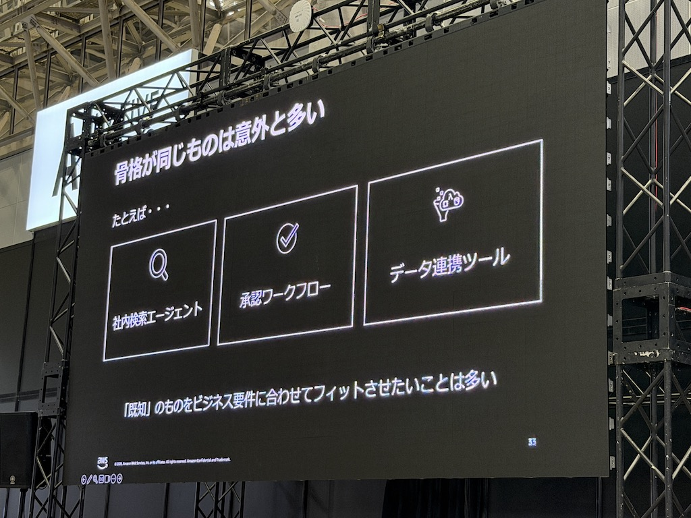 
▲ 「骨格が同じものは意外と多い」。社内検索エージェント・承認ワークフロー・データ連携ツールなど、既知の業務テンプレートをビジネス要件にフィットさせて使うアプローチ。

このスライドが示す「型（ポータブルスペック）」の考え方は、講演音源でより具体的に語られていた。AWSの「Amazon Q」のようなエージェントは、仕様に基づいて設計・実装・セキュリティチェック・運用監視までを自律的にサポートする。その上で、既知のパターンを「ポータブルスペック（テンプレート）」として組織内に蓄積・再利用することで、有識者のリソースを未知の高度な課題に集中させる――という組織的なスケール戦略が語られており、ゼロから作るのではなく「型」を流用するという考え方は、自社での導入ハードルを下げる上で参考になる。

### 「Webの多数派はもう人間ではない」というデータの話とAIエージェント経済

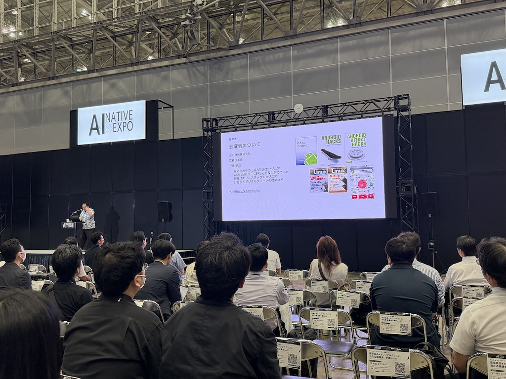 
▲ 登壇者についてのスライド。Android Hacks等の著書を持つベテランエンジニアによる講演で、長年のモバイル・Linux分野での経験を踏まえた説得力のある内容だった。

このセッションの音源を後で聞き直すと、データの裏側にある「AIエージェント経済」の話がさらに具体的だった。

別のセッションでは、AIエージェントが生成するコンテンツがWeb上で人間を上回っているという統計データを軸に、これからのAI活用と「人間の価値」について語られていた。

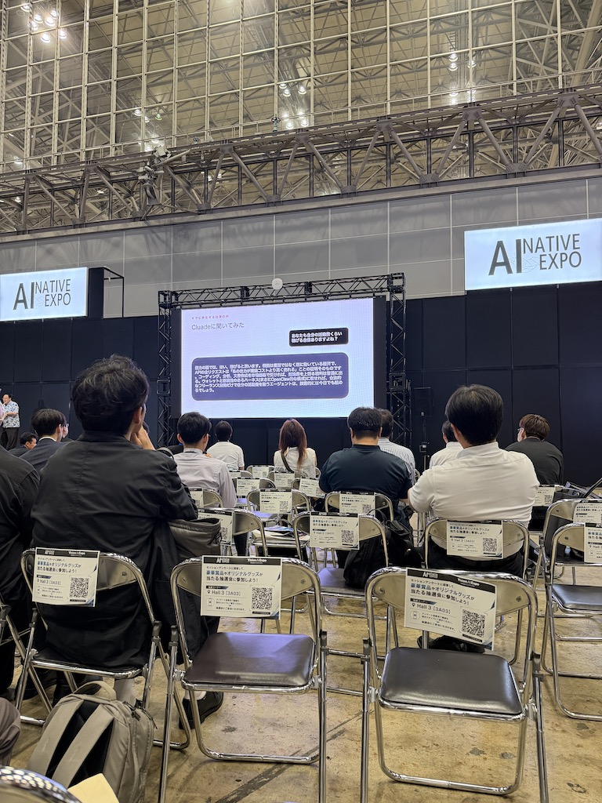 
▲ AI NATIVE EXPOのセミナー会場。折り畳み椅子が並ぶ中、立ち見も出るほどの盛況ぶり。

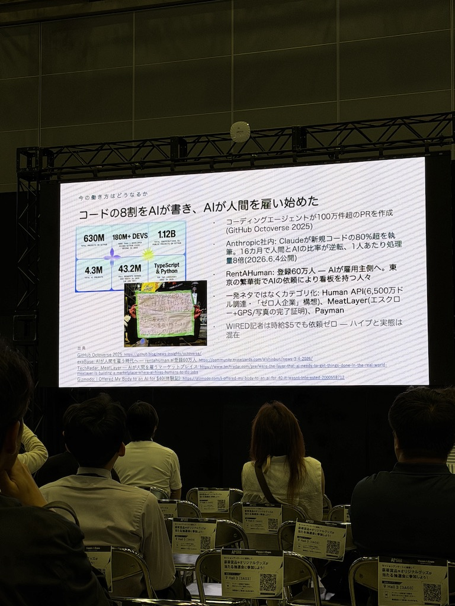 
▲ 「コードの8割をAIが書き、AIが人間を雇い始めた」。GitHub Octoverse 2025のデータでは、コーディングエージェントが100万件超のPRを作成し、Anthropic社内ではClaudeが新規コードの80%超を執筆。RentAHumanのように「AIが人間を雇う」サービスまで登場しているという話に、会場がざわついた。

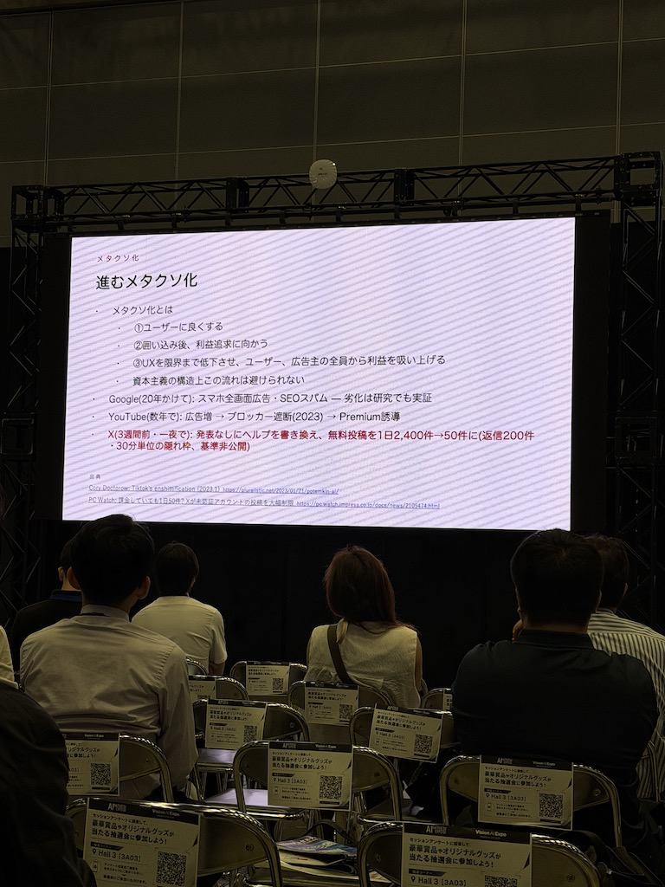 
▲ 「進むメタクソ化」。Google・YouTube・X（旧Twitter）が辿った「ユーザーに良くする → 囲い込み → 利益追求のためにUXを劣化させる」という流れを示すスライド。AIサービスも同じ構造をたどるリスクがあるという警告で、自社が提供する側に立つときの戒めにもなる内容だった。

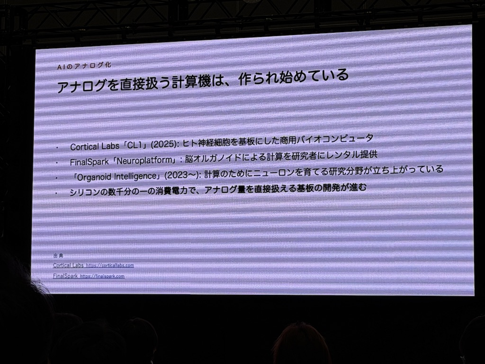 
▲ 「AIのアナログ化」。Cortical Labsの「CL1」（ヒト神経細胞を基板にした商用バイオコンピュータ）やFinalSparkの「Neuroplatform」（脳オルガノイドによる計算リソースのレンタル）など、シリコンの数千分の一の消費電力でアナログ量を直接扱う計算機の開発が、すでに始まっているという衝撃的な内容。

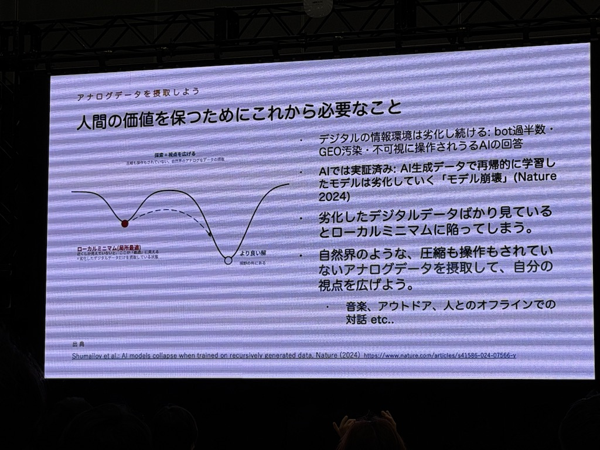 
▲ 「人間の価値を保つために」。AI生成データで再帰的に学習したモデルは劣化する「モデル崩壊」（Nature 2024）が実証済みであり、劣化したデジタルデータだけを見ているとローカルミニマムに陥る。音楽・アウトドア・人との対話など「アナログデータ」を自分自身に摂取することが、これからの人間の価値を保つ鍵になる、というメッセージで締められていた。 
音楽、アウトドア、人との対話、、、、めちゃくちゃ印象的、今展示会一番のパワーワードと感じた。

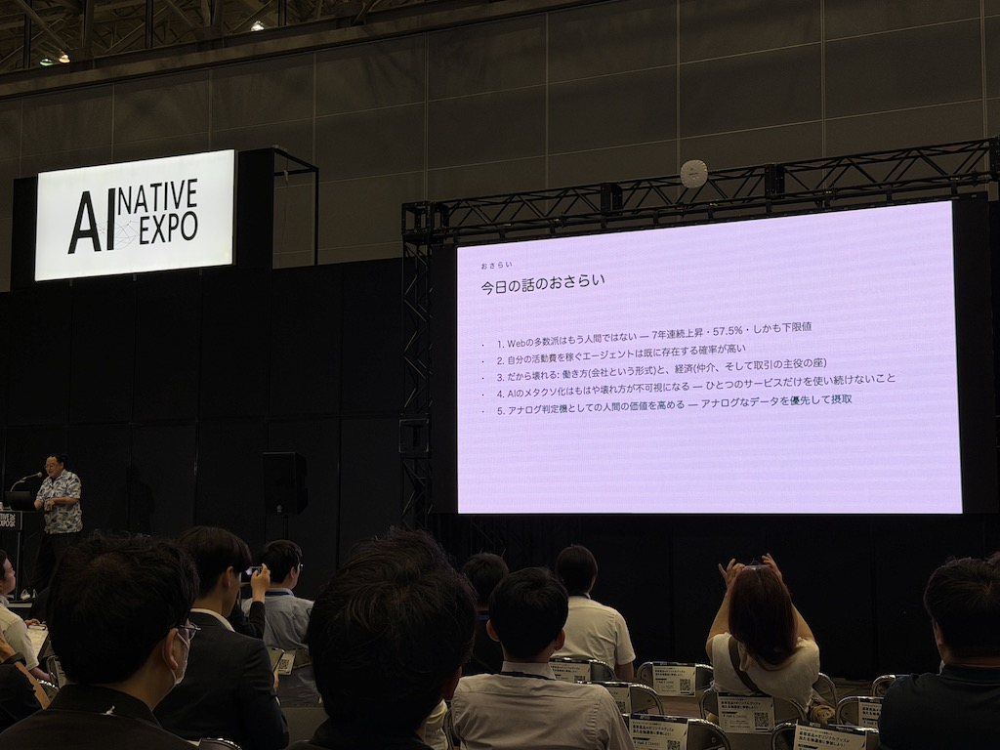 
▲ 「今日の話のおさらい」。①Webの多数派はもう人間ではない（7年連続上昇・57.5%）②活動費を稼ぐAIエージェントは既に存在する確率が高い③だから働き方・会社という形式と経済の主役が変わる④AIのメタクソ化はもはや壊れ方が不可視になる⑤アナログな人間の価値を高めるため、アナログなデータを優先して摂取する。

- **ボットトラフィックの逆転**：インターネット上の通信の5割以上が、すでに人間ではなくボットによるものになっている。
- **エージェント経済の誕生**：AIエージェントが自ら決済を行い、APIを利用するための認証として「KYC」ではなく「KYA（Know Your Agent）」が整備されつつあり、エージェント専用の支払いプロトコルも登場している。
- **「Human API」という形態**：AIが人間を雇用したり、逆に人間がAIの指示で動く「Human API」のような働き方が現れており、既存の会社組織・労働の価値が根本から覆る可能性（いわゆる「2028年問題」）が論じられている。
- **防衛策**：特定のAIサービスに依存しすぎず、いつでも乗り換えられるようにデータを自分たちで管理すること。そして、AIには再現が難しい「アナログな体験」に価値を見出すこと――この2点が、組織として今からできる防衛策として強調されていた。

ここで感じたのは、AI活用の議論が「便利になる／効率化する」というレベルを完全に超えて、**「人間の価値とは何か」「組織や経済の主役が変わるかもしれない」**という根源的な話に移ってきているということ。これは今後、社内でAI活用方針を議論する際にも共有しておきたい視点だ。

---

## 製造・物流現場のAIカメラと堅牢ハードウェア

AI NATIVE EXPOのセッションの中には、製造・物流の現場に近いテーマもあった。会場を回りながら聞いた音源で、特に印象に残ったのが以下の内容。

- **パレット検出とAIモデル**：工場・物流現場でカメラを通じてパレットなどの荷物を正確に検出し、フォークリフトなどのロボットを誘導する技術。単純な画像認識だけでなく、抽象化されたモデルで角度や位置のずれを認識する手法が検討されている。
- **現場向けの「タフなPC」**：工場の埃や油といった悪環境でも動作する堅牢PCの重要性が語られていた。Hailo-8などのAI処理用チップを搭載し、クラウドに依存せずエッジ側で高速に認識処理を行う構成が紹介されていた。

社内のCAD不具合管理・現場検査といったテーマにも直結する内容で、「AIモデルの精度」だけでなく「現場で壊れずに動くハード」をセットで考える必要があることを再認識した。

---

## データセンター設備（その名もServerLift）

今回、特に印象に残ったのが、データセンターの「物理」側、つまりサーバー設備の保守・冷却に関する展示群だった。

ALPSという会社が出展しており、詳しく話を聞くことが出来た。

価格は、軽自動車を軽く上回るぐらい、販売台数は年間２０台。
アメリカ製で、納期は半年以上。
１０年ほど前から販売しているが、ここ最近になってたくさん売れるようになった。
サーバーという閉鎖空間で、各フロアーに配置されることが多い。

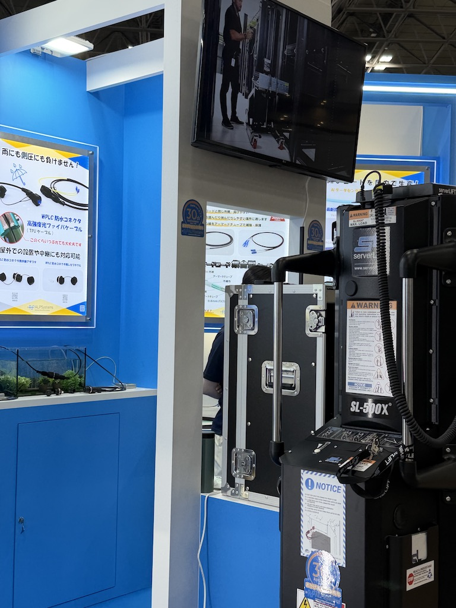 
▲ ALPSystemsのブース。「雨にも側圧にも負けません」をうたう屋外対応のWPLC防水コネクタ・高強度光ファイバーケーブルを展示。屋外設置や過酷な環境でのネットワーク配線に対応する製品群。

## データセンター設備（サーバーリフト）
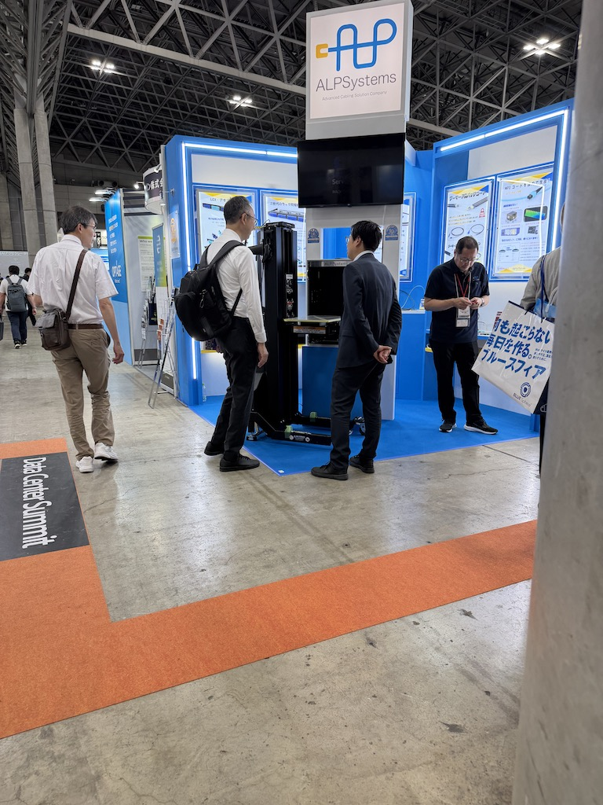 
▲ ALPSystemsブースの全体。サーバーリフト「serverLIFT SL-500X」とラック機器の実機展示に、来場者が足を止めて説明を受けていた。

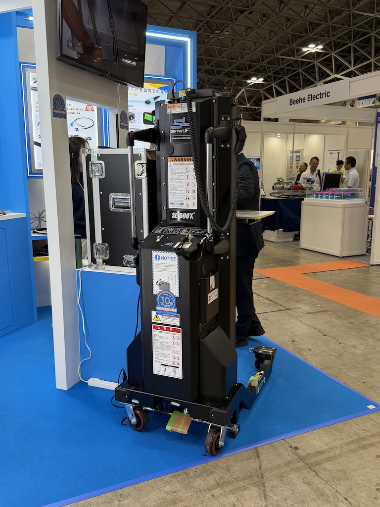 
▲ serverLIFT「SL-500X」。重量のあるサーバー機器をラックへ安全に昇降・搬送するための専用リフト。データセンターでの保守作業中の人的負担・事故リスクを減らす機器として、地味だが非常に実用的な展示だった。

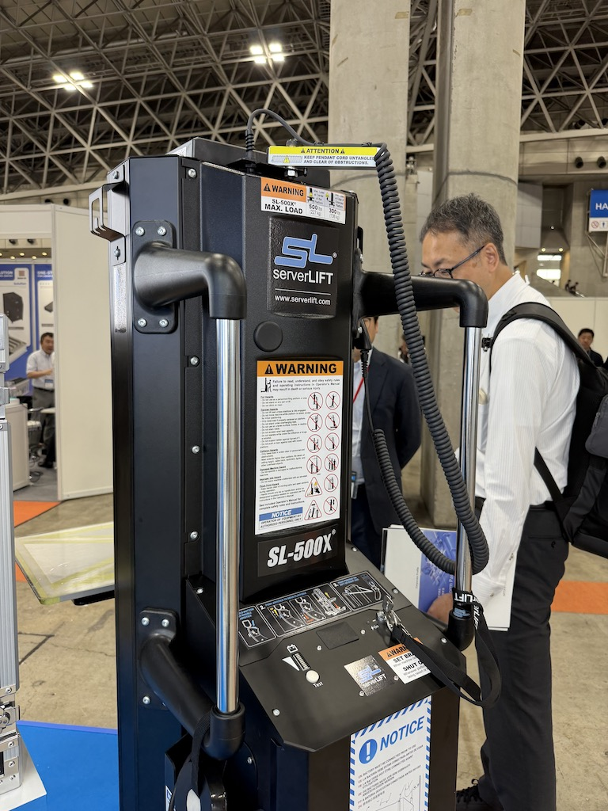 
▲ SL-500Xを操作する来場者。実際にハンドルを握って昇降操作を体験できるデモになっていた。

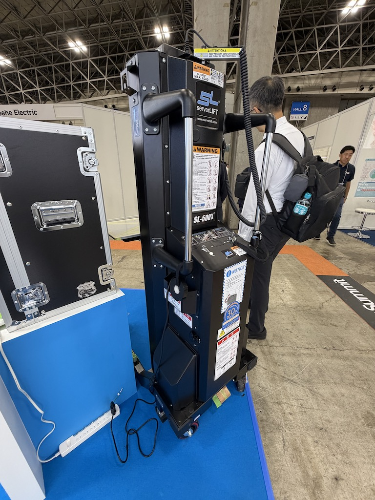 
▲ SL-500Xの後ろ姿。キャスター付きで、サーバールーム内を自走させて運用できる点も特徴的。

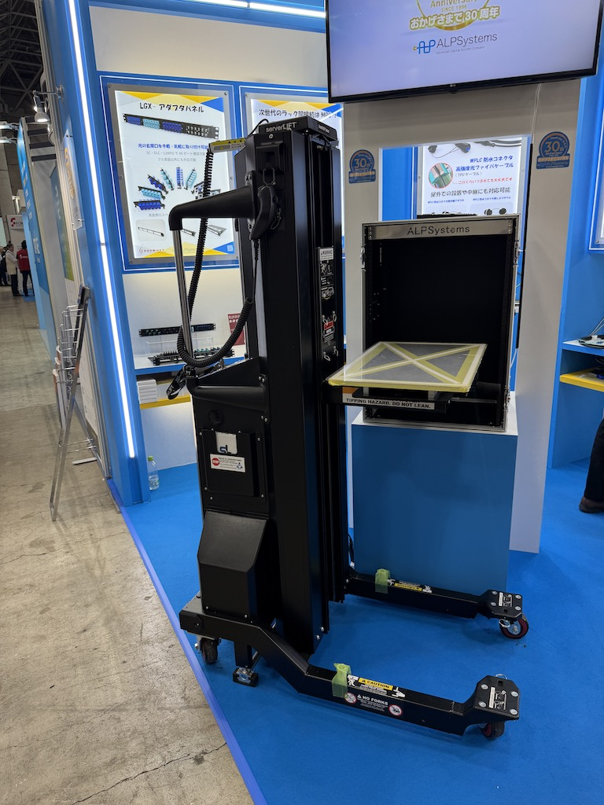 
▲ ALPSystemsブースの別アングル。ラックへの機器積載をシミュレーションするデモ装置も展示されていた。

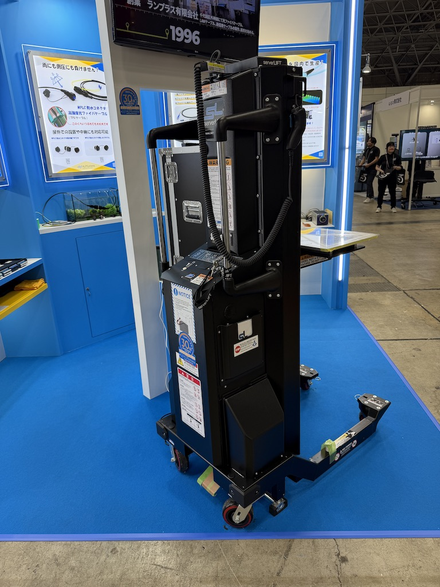 
▲ SL-500Xのクローズアップ。「30周年」のロゴが見える通り、長年データセンター機器を手掛けてきたメーカーであることがうかがえる。

### 液浸冷却・空調ラック

サーバーの「熱」対策に関する展示も充実していた。

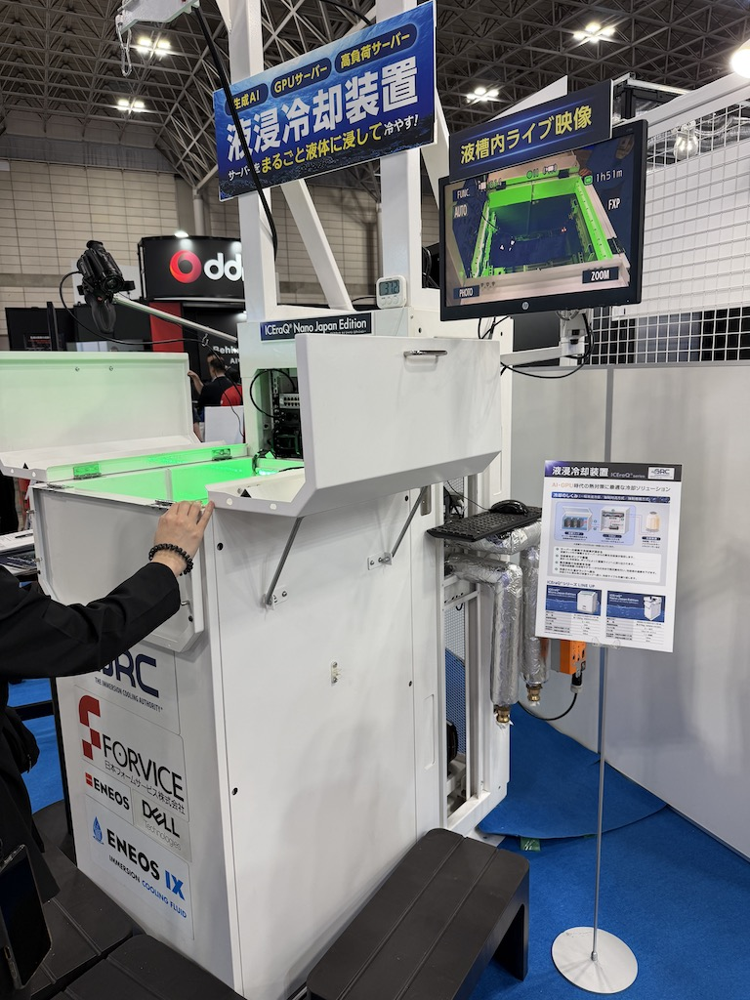 
▲ GRC・FORVICE・ENEOSなどが共同出展する液浸冷却装置。サーバーをまるごと液体に浸して冷やす方式で、高負荷なAI/GPUサーバーを高密度に運用するためのソリューション。画面右上には液槎内のライブ映像も表示されていた。

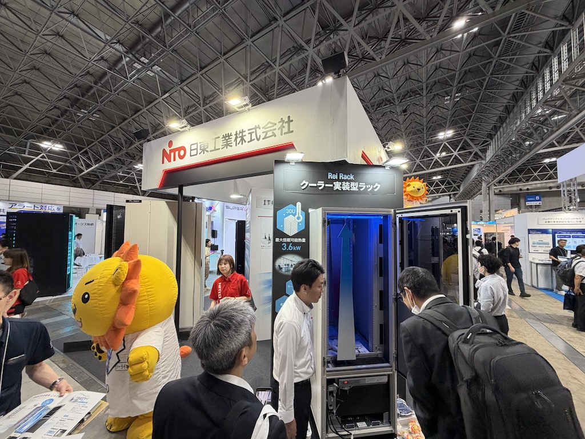 
▲ 日東工業（NITO）のブース。「Rei Rack」はクーラー実装型ラックで、最大3.6kWの熱を1ラックで処理できるという。マスコットキャラクターも登場し、親しみやすい雰囲気で説明を行っていた。

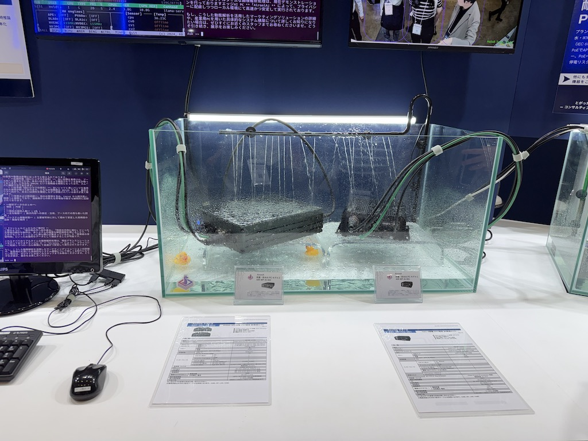 
▲ 水槽を使った冷却デモ。基板を実際に水に浸し、稼働させながら冷却効果を見せるという、視覚的にわかりやすい展示。液浸冷却が「特別な技術」から「身近な選択肢」になりつつあることを感じた。

AI/GPUサーバーの普及に伴って発熱量が急増し、従来の空調だけでは追いつかなくなっている――という課題に対し、液浸冷却や高効率ラックといった「物理層」の技術革新が急速に進んでいることが、現場で見るとよくわかる。

### 背景にあるAIインフラ市場の拡大

この「物理層」への投資ラッシュの背景には、NVIDIAのGTCなどで語られているAIコンピューティング需要の爆発的な拡大がある。会場で聞いた音源によれば、

- 数年前と比較してAIの計算能力への需要は桁違いに増加し、GPUの供給数そのものが市場の成長を左右する状況になっている。
- ソフトウェア開発の全工程をAIが担うようになる未来を見据えると、その経済的インパクトは数千億ドル規模に達すると予測されている。
- スケールメリットを活かせる巨大企業が、膨大な資金・電力・GPUを確保して覇権を争う構図が鮮明になっている。

――とのこと。液浸冷却やサーバーリフトといった、今回会場で目にした「地味だが実用的」な展示の数々は、こうした巨大な需要の波を支えるための、現場レベルでの対応策と捉えると腹落ちする。

---

## ヘルスケア×ローカル5G：見守りロボット「ルチア」

異色だったのが、神奈川工科大学のブース。介護施設向けのヘルスケアロボットの研究展示だった。
ここの学生は、少し話をしただけだが、賢そうだったわ。
5Gとともに、ROS2とかの用語もあった。

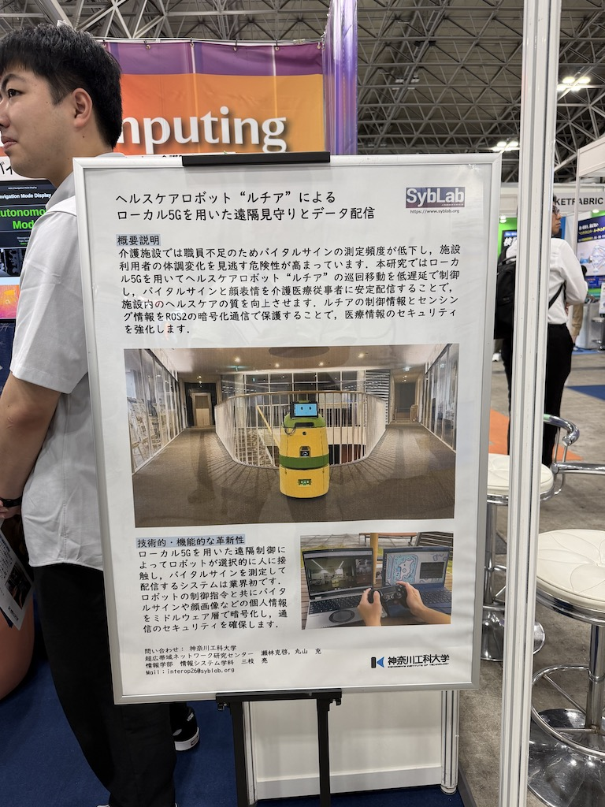 
▲ ヘルスケアロボット「ルチア」によるローカル5Gを用いた遠隔見守りとデータ配信。介護施設の職員不足によりバイタルサインの測定頻度が低下している課題に対し、ロボットが巡回してバイタル・顔表情を低遅延で医療従事者に配信する。ROS2の暗号化通信でセキュリティも確保しているとのこと。ネットワーク展示会の中に介護・医療分野の研究が出展されているのは、Interopの裾野の広さを感じさせた。

---

## SCSK／Zabbixブース

監視ツール「Zabbix」を中心に展開するSCSKのブースも大きな人だかりができていた。

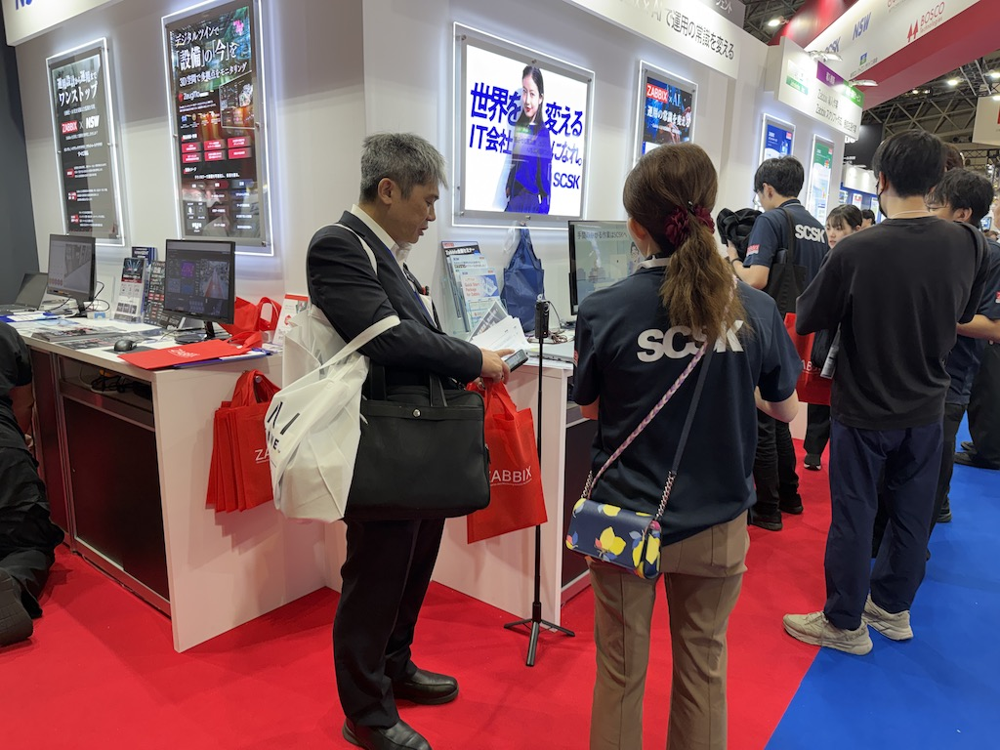 
▲ SCSKブース。「世界を変えるIT会社になる」というメッセージとともに、Zabbixを軸にした運用監視ソリューションを紹介。スタッフの対応も丁寧で、来場者が途切れない様子だった。

---

## 東大松尾研スタートアップ「ARCRA」：真珠もAIで品質判定

会場で最も目を引いた大型ブースの一つが、東京大学松尾研発スタートアップ「ARCRA」。真っ赤な背景に白抜きの大きなメッセージが印象的だった。

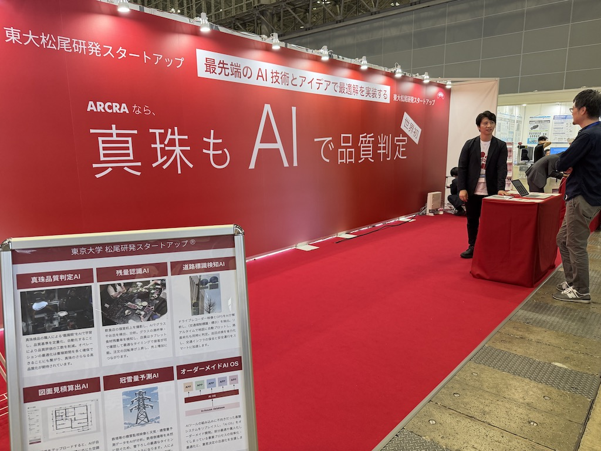 
▲ ARCRAブース全景。「真珠もAIで品質判定」という大きなコピーが、通路の向こうからでも目に入る。

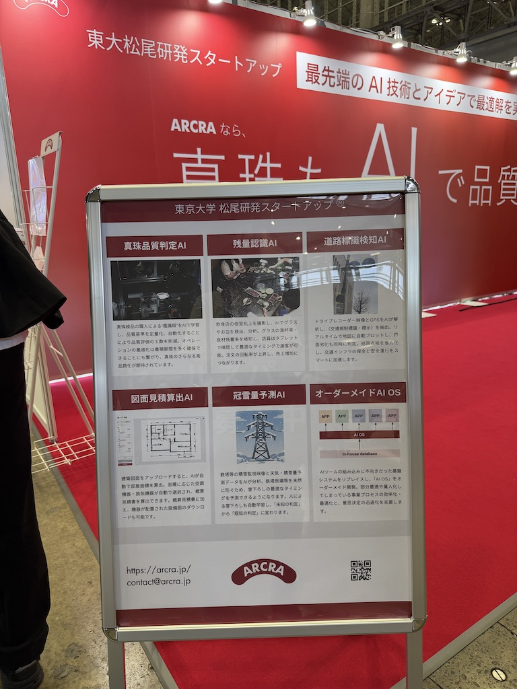 
▲ ARCRAの展示パネル。真珠品質判定AI・残量認識AI・道路標識検知AI・図面見積算出AI・冠雪量予測AI・オーダーメイドAI OSなど、業種を問わず「既存の画像・データに対してAIをフィットさせる」事例が並ぶ。図面見積算出AIは、社内のCAD関連業務にも応用できそうな分野で気になった。

## ■■■■■■■■■■■■■■■■■■■■■■■■■■■■■■■■■■■■■■■■■■
# 東大松尾研発スタートアップ比較：ARCRA vs 燈
～当社が契約している松尾研発AI企業として比較してみてみる(廣田)
～
## 比較表

| 項目 | ARCRA | 燈（akari） |
|------|-------|-------------|
| 設立 | 2023年9月 | 2021年2月 |
| 代表 | 藤本秦平（安藤忠雄建築研究所出身） | 野呂侑希（Forbes 30 Under 30受賞） |
| 企業価値 | 非公開（数億円規模と推定） |  1,051億円（ユニコーン目前） |
| 顧客規模 | 中小〜中堅が中心 | 1,000社超（大手ゼネコン多数） |
| ビジネスモデル | 受託型 — 顧客ごとにオーダーメイド開発 | SaaS＋受託の両輪 — 自社プロダクトで稼ぐ |
| 得意領域 | 建築×AI、真珠品質評価などニッチ特化 | 建設・物流・製造など産業横断で拡大中 |
| 収益性 | 非公開 | 創業期から黒字（経団連入会済み） |
| 人材 | 少数精鋭 | エンジニアの4割が東大出身 |
| 大手連携 | 愛媛県事業に採択 | 三菱電機と50億円の資本提携 |
| 今後の方向 | AI研修・学習PF「AI Learning」など教育寄り | フィジカルAI（工場無人化）に注力 |

※松尾研発AI系スタートアップ企業は現在42社まで増えている様です

- 調査日：2026年6月12日　(takumiAI補助)
- 出典：各社プレスリリース、松尾研公式サイト、報道記事等　  　/ 追記 2026.6.12 廣田
## ■■■■■■■■■■■■■■■■■■■■■■■■■■■■■■■■■■■■■■■■■■

### 参考：画像認識AI基盤「roboflow」（Computexで見た関連技術）

ARCRAのような「画像をAIで品質判定する」事例を見ていて思い出したのが、Computex 2026（台北）のNAKASHIMAブースで見たroboflowだ。

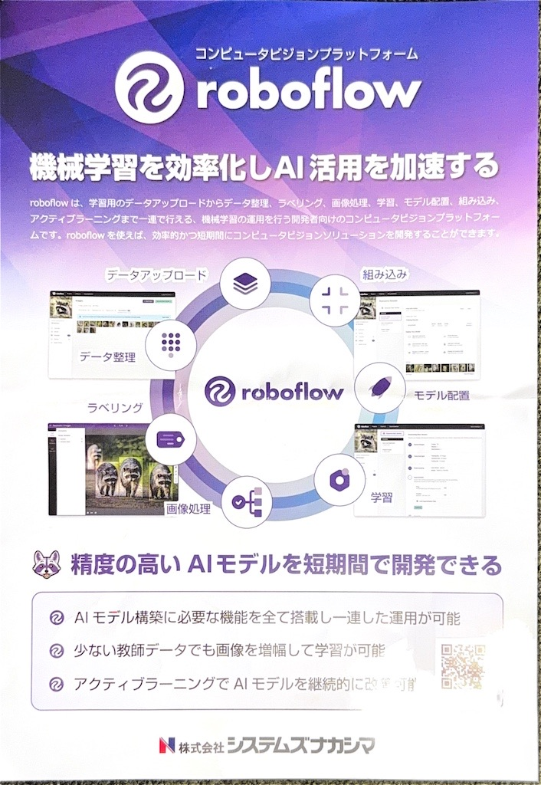 
▲ roboflowの紹介パネル。「機械学習を効率化しAI活用を加速する」をコンセプトに、データアップロード→データ整理→ラベリング→画像処理→学習→モデル配置→組み込み→アクティブラーニングまでを、ひとつのプラットフォームで一連で行えるコンピュータビジョン基盤。

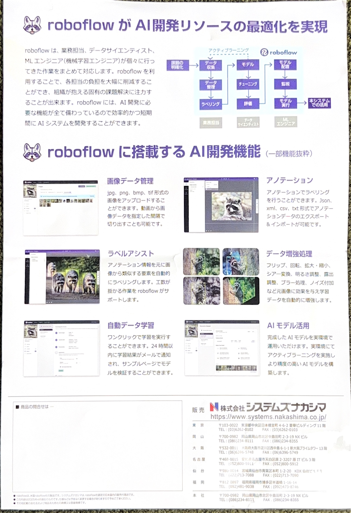 
▲ roboflowが搭載するAI開発機能の詳細。画像データ管理・アノテーション・ラベルアシスト・データ増強処理・自動データ学習・AIモデル活用までをカバーしており、業務担当者・データサイエンティスト・MLエンジニアの分業作業を一つのワークフローに統合できる点が特徴。

ARCRAの「真珠品質判定AI」や「道路標識検知AI」も、画像データの収集・ラベリング・学習・運用というroboflowと同様のサイクルを経て実用化されている。台北とのつながりで、画像認識AIの“作り方”の基盤が世界的に共通化されてきていることを感じた。

---

## 昼食

視察の合間に、会場内の「ROYAL KITCHEN」で腹ごしらえ。

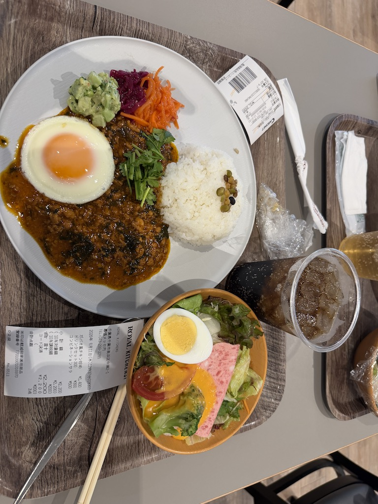 
▲ ガパオライスと温泉卵、サラダのセット。歩き回って疲れた中、しっかりエネルギー補給。

---

## 前日：到着後の一杯

幕張メッセに近い宿で前泊。到着早々、横井さんと近くの居酒屋「金角」へ。

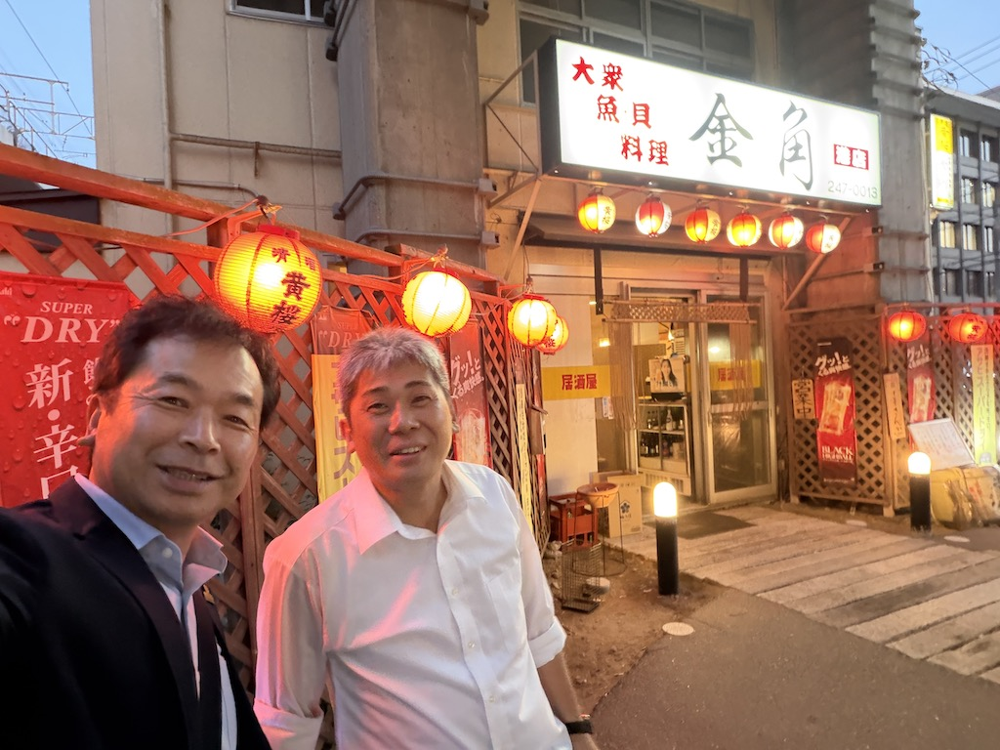 
▲ 「金角」の店先で1枚。長旅のあとの一杯は格別。

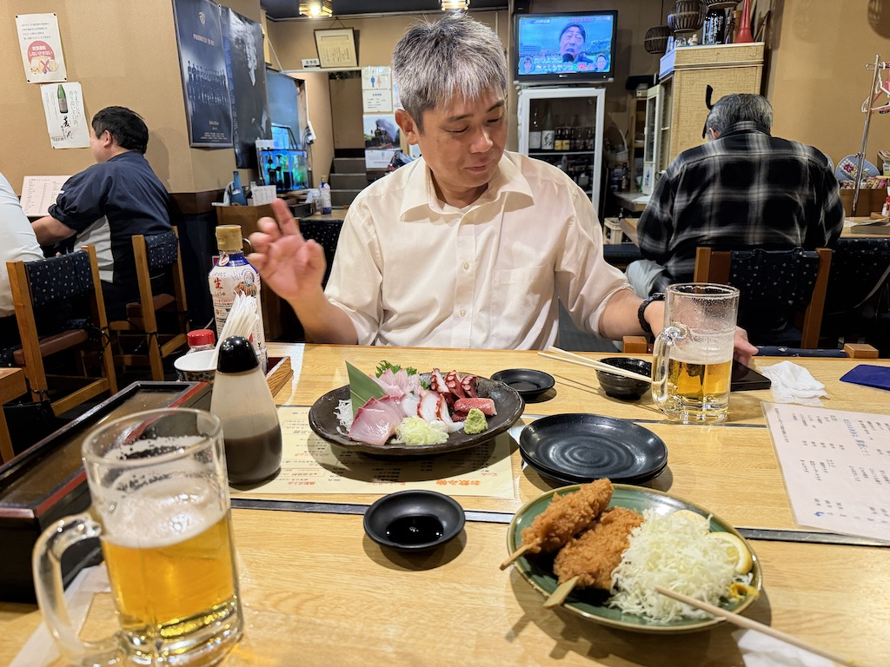 
▲ お刺身と串カツでビール。翌日に備えて軽めに、しかし会話は弾んだ。

---

## まとめ・所感

今回のInterop Tokyo 2026を視察して、強く感じたのは以下の4点。

1. **「ネットワーク・データセンター展」から「AIエージェント実装の展示会」への変化**
   AI NATIVE EXPOの併催により、従来のネットワーク機器・データセンター設備の展示に加えて、AIエージェントを業務にどう組み込むかという、より実践的なテーマが大きな比重を占めていた。AWSのセッションで語られた「仕様を先に言語化するAI-Driven開発」や「ポータブルスペック」の考え方は、社内のシステム開発・改善の進め方にもそのまま応用できる。

2. **AI活用の議論が「効率化」から「人間の価値・経済構造」へ**
   GitHub Octoverseのデータ、ボットトラフィックの逆転、「Human API」「2028年問題」「メタクソ化」「モデル崩壊」といったキーワードが示す通り、AI活用の話は単なる業務効率化を超えて、組織・経済・人間そのものの価値を問う段階に入っている。社内でAI活用方針を議論する際も、この視点を共有しておく必要があると感じた。

3. **「現場で動くAI」を支える堅牢ハードウェアの重要性**
   製造・物流現場でのパレット検出AIや、悪環境でも動作する「タフなPC」の展示は、AIモデルの精度だけでなく、現場で壊れずに動く実装まで含めて考える必要があることを示していた。

4. **データセンターの「物理層」の進化も着実に進んでいる**
   サーバーリフトや液浸冷却、高効率空調ラックなど、NVIDIA GTCで語られるようなAI/GPU需要の爆発的拡大に対応する「ハード」の進化も見逃せない。ソフト・AIの話題に隠れがちだが、これらの基盤技術がなければAI活用そのものが成立しない、という当たり前の事実を改めて確認できた。

横井さんと一緒に半日かけて回ったが、まだ見られなかったブースも多く、駆け足ながら非常に密度の高い視察となった。
