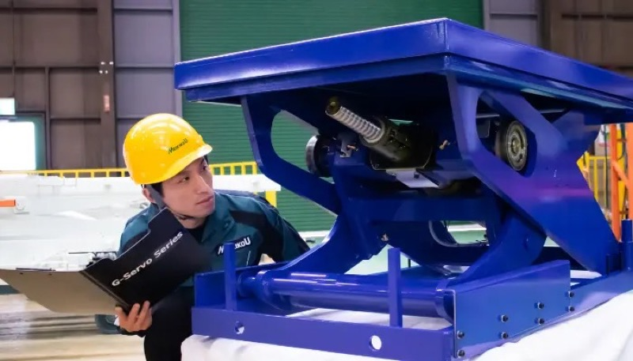
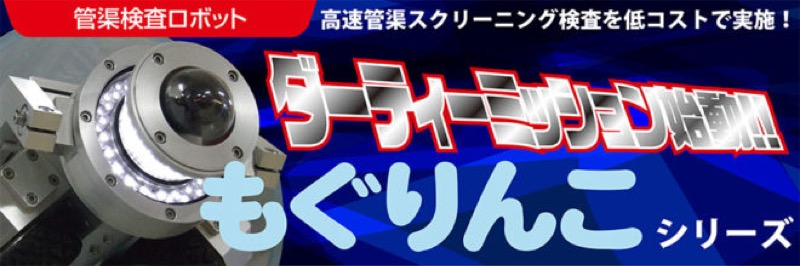
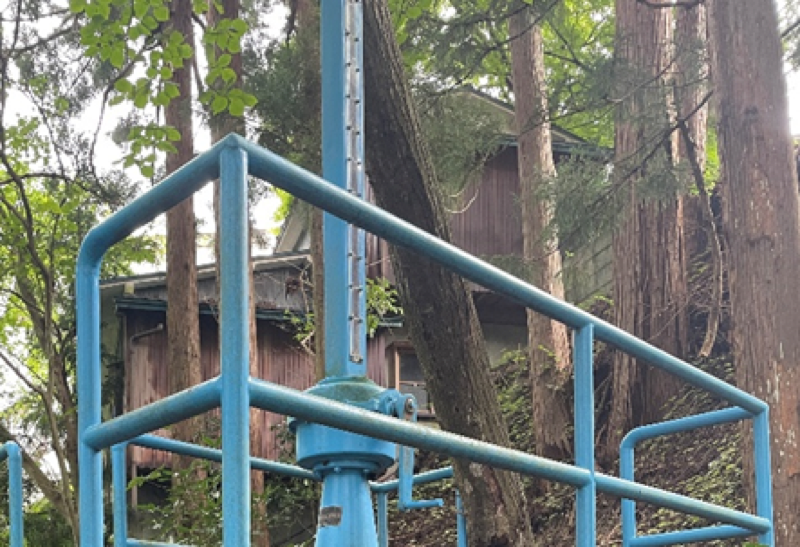

# 老朽化インフラ整備市場 参入提案

> 作成：2026年6月　/infra-mente
> 出典：`Knowledge/NotebookLM.txt`（インフラメンテナンス包括的民間委託・製造業のサービス化に関するドメイン知識ベース）

---

## 結論

橋梁点検車のような車両搭載型の装置は、これまでスギヤスが手掛けてきた領域とそぐわない。
代わりに、自社が長年培ってきた**昇降機構（リフト技術）**、現在進行中の**AGV/AMR・IoTセンシング（M5stack資産）**を起点に、老朽化インフラの点検・保全に応用できる新商品を3案提示する。

いずれも「車両を作る」のではなく、「自社の機構設計・センシングの強みを、インフラの『不』に当てはめる」発想で構成している。モノ売りではなく、点検データ・稼働データの蓄積をコト（SaaS）として設計し、「サービス・パラドクス」を打破する収益構造を組み込む。

---

## 新商品アイデア①：可搬式・狭所点検用昇降ユニット

**該当項目**：戦略＝新技術導入による競争優位（NETIS）／自社の強み＝整備用リフト（マルチ・ファンタス等）で培った昇降機構の設計知見

ボックスカルバート・低空頭の橋梁下・配水池内部など、車両もクレーンも入れない狭所の点検に、人力で搬入できる軽量シザーリフト式の点検台を投入する。自社が長年手掛けてきた整備用リフトの設計知見（昇降ストローク・耐荷重・安全機構）をそのまま転用できる領域であり、車両開発という未経験分野に踏み込まずに済む。

 

シザーリフト機構の点検イメージ（出典：株式会社メイキコウ公式サイト）。パンタアーム式の昇降台は、自社のリフト設計資産と親和性が高い。

---

## 新商品アイデア②：管路・暗渠点検用 小型自走ロボット

**該当項目**：実行＝高速PoCの実施／自社の強み＝AGV/AMR・M5stack IoTセンシング（社内提案「AMR見守りIoTユニット」からの展開）

技術部で既に着手しているAGV/AMRセンシングユニットの知見を、工場内搬送設備から下水道管・暗渠など老朽化が進む管路点検へと転用する。小型自走ロボットにカメラ・センサーを搭載し、人が入れない狭小管路の点検データを蓄積する。新規の車両・台車技術ではなく、既存のAMR走行制御・M5stackセンシング資産を横展開するだけで成立する点が強みである。

 

管渠検査ロボット「もぐりんこ」シリーズ（出典：株式会社石川鉄工所公式サイト）。自走式で管内を移動しカメラ点検を行う構成は、自社AMR技術の応用先として参考になる。

---

## 新商品アイデア③：水門・ゲート設備向け 後付けIoT予防保全ユニット

**該当項目**：戦略＝「サービス・パラドクス」の打破と収益化論理／自社の強み＝リフト機構の摩耗・固着メカニズムへの理解（[福島トヨペット南会津店視察](../202501-FukushimaToyopet/Report.md)で確認したリフトの錆固着事例等）＋M5stack IoTセンシング資産

老朽化したハンドル式水門・ゲート開閉装置に後付けできるIoTセンサーユニットを開発し、稼働状況の遠隔監視・異常予兆検知をサブスクリプション型で提供する。可動部がサビ・摩耗でどう固着していくかは、自社がリフト整備の現場で繰り返し見てきた現象そのものであり、「機構の劣化を見極める」知見がセンサーの閾値設計にそのまま活きる。

 

既設水門への後付けIoT遠隔開閉装置の設置例（出典：株式会社farmo公式サイト「アクアドライブ」）。既存のハンドル式設備に後付けする発想は、自社のリフト保全ノウハウと相性が良い。

---

## 実行ロードマップ（新技術導入の5ステップに準拠）

**該当項目**：実行＝新技術導入の5ステップ・プロセス

| ステップ | 内容 |
|---|---|
| ① 課題の明確化 | 点検要領・ガイドラインのどの項目を改善するか（有効性／コスト／業務量）を定義する |
| ② 情報収集・相談 | NETIS・点検支援技術性能カタログを確認し、地方整備局・大学等の専門家へ早期相談する |
| ③ 現場試行（PoC） | 共同開発または官庁呼び込み型試行で、管理下の現場で使い勝手と精度を評価する |
| ④ 本格導入（調達） | 技術の習熟度に応じ、プロポーザル方式・総合評価落札方式で調達される状態をつくる |
| ⑤ 事後評価と改善 | KPIに基づき導入前後の効果を定量把握し、開発側へフィードバックする |

KPIは二段建てで設計する。固定KPI（点検時間削減率・点検コスト削減率など5年単位で固定する本質指標）と、可変KPI（導入自治体数・PoC件数など広報・営業向けの短期指標）を分けて管理する。

### ②情報収集・相談の具体化：訪問先の優先順位

業界の現状把握は、**地方整備局を先に、自治体（市役所等）を後に**訪問する順序で進める。

| 訪問先 | 役割 | 訪問の狙い |
|---|---|---|
| 地方整備局（国交省地方支分部局） | NETIS登録・点検支援技術性能カタログの審査窓口 | 新技術の評価ルートに直接接続し、自社技術がNETISの5項目（経済性・工程・品質・安全・環境）にどう該当しうるか早期に専門家の感触を得る |
| 自治体（市役所等） | 現場の発注主体・予算判断者 | 点検現場の実情・予算感をヒアリングし、「不適切な要求水準設定」の失敗例を避けるための積算基準・要求水準のすり合わせ材料を得る |

市役所は予算・現場ニーズのヒアリング相手として有効だが、技術導入の審査権限や専門家への接続力では地方整備局に劣る。地方整備局で技術評価ルートを確認してから自治体を回ることで、的外れな提案を防ぐ。

---

## リスクチェックと対策

**該当項目**：失敗例と対策（Pitfalls & Anti-patterns）

| 想定されるリスク | 知識ベース上の失敗パターン | 対策 |
|---|---|---|
| 「ものづくり補助金」獲得を前提に開発投資の意思決定をしてしまう | 補助金依存（補助金ゲーム）― 補助終了とともに運用コストを賄えずアナログ回帰する | 導入前にライフサイクルコスト（LCC）を試算し、君津市の橋梁点検LCC50%削減事例のような長期・間接コスト縮減効果を財務部局・自治体側に示す |
| PoCで未達が出ても「設計変更」として吸収し、根本原因を分析しない | フェイクPDCAと構造的未学習 | 第三者によるゲート・レビュー（Gate 0〜5）を社内に制度化し、節目ごとに客観的な継続判断を行う |
| 現場施工・据付を多重下請に丸投げし、品質・安全管理が形骸化する | 重層下請構造による管理不全 | 建設キャリアアップシステム（CCUS）を活用し、施工に関わる技能者の就業履歴・資格を業界標準で確認する |
| 自治体側の予算と「点検効率化したい」という目的が噛み合わない要求水準書のまま受注してしまう | 不適切な要求水準設定 | 導入実績のある他自治体・地方整備局へ事前ヒアリングし、実務に即した積算基準・要求水準を擦り合わせてから提案する |
| 自社の実績がない車両・台車開発に踏み込み、未経験領域での技術リスクを抱え込む | （本提案独自の留意点）自社の強みから外れた領域への投資判断 | 3案とも、既存の昇降機構・AGV/AMR・IoTセンシング資産の延長線上にあるかを開発着手前に必ず確認する |

---

## 黄金律との照合

知識ベースの黄金律：「新技術を『目的』ではなく『手段』として使いこなし、客観的データに基づいた『二段建てKPI』と『勇気ある撤退基準』を制度に組み込むことで、限られた資源を将来の再設計へと循環させる」

本提案の評価軸：**3案とも、点検・保全現場の「不」（狭所での危険作業、管路点検の属人化、水門の固着・誤作動）を、自社の既存技術資産の延長で解消できるかどうか**。車両開発のような未経験領域への飛躍を避け、自走可能なリカーリング収益を作れる案から着手する。

着手前に、撤退トリガー（例：PoC後2年で導入自治体数が目標比50%未達なら撤退）を事前に社内合意しておくことが、知識ベースが繰り返し指摘する「やめる勇気の制度的担保」にあたる。
