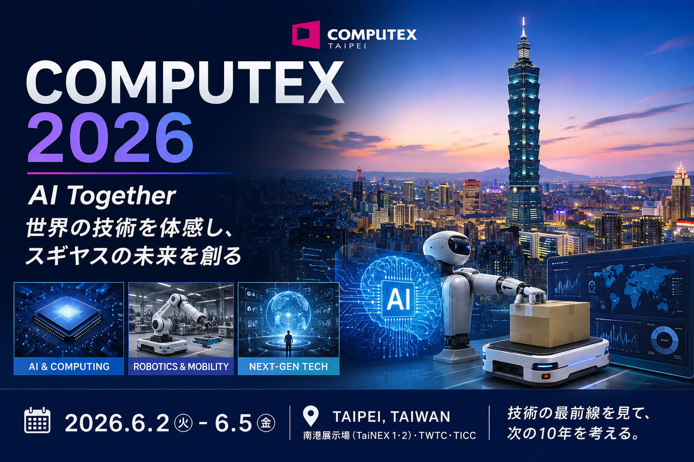

# 🚀 COMPUTEX 2026 視察出張企画書

> **世界最先端のAI・ロボティクス技術を体感し、スギヤスの次世代商品開発へつなげる**

---

   

## 📌 目的

台湾・台北で開催される世界最大級のAI・コンピューティング展示会

# COMPUTEX 2026

を視察し、

* AI活用による開発革新
* AMR・ロボティクス技術の調査
* 次世代組込み制御技術の探索
* 新商品アイデアの発掘
* 新規サプライヤー開拓

を実施する。

---

## 🌏 展示会概要

| 項目   | 内容                     |
| ---- | ---------------------- |
| 展示会名 | COMPUTEX 2026          |
| 開催期間 | 2026年6月2日(火) ～ 6月5日(金) |
| 開催地  | 台湾 台北市                 |
| テーマ  | AI Together            |
| 主催   | TAITRA / TCA           |

### 🔗 公式サイト

👉 https://www.computextaipei.com.tw/en/index.html

---

## 🎯 視察の背景

近年、

* 生成AI
* AIエージェント
* ロボティクス
* 自律搬送
* AI搭載機器

の進化が加速している。

スギヤスにおいても、

* 自動車整備機器
* 物流搬送機器
* 福祉機器

の各事業で大きな変革が予想される。

今後10年を見据え、

**「何を作るか」**

だけではなく、

**「どの技術を取り込むか」**

を判断するために現地調査を実施する。

---

# 🗓️ 視察スケジュール

| 日付       | 内容            |
| -------- | ------------- |
| 6/2(火)   | 中部国際空港 → 台北移動 |
| 6/2(火)午後 | COMPUTEX視察開始  |
| 6/3(水)   | COMPUTEX視察    |
| 6/4(木)   | COMPUTEX視察    |
| 6/5(金)   | COMPUTEX視察・帰国 |

---

# 🔍 重点調査テーマ

## 🤖 ① AI技術

### 調査内容

* 生成AI
* AIエージェント
* ローカルLLM
* AI開発ツール
* エッジAI

### 期待成果

✅ 開発業務へのAI活用

✅ 技術部の生産性向上

✅ AI新商品企画

---

## 🚚 ② AMR・ロボティクス

### 調査内容

* AGV
* AMR
* LiDAR
* SLAM
* ビジョンシステム

### 期待成果

✅ ABMR開発への応用

✅ 自律搬送技術の理解

✅ 次世代物流機器構想

---

## 💻 ③ 組込み制御技術

### 調査内容

* ROS
* Jetson
* ARM
* Linux RT
* 産業用PC

### 期待成果

✅ 階段昇降機制御の高度化

✅ リフト制御システムの進化

✅ Renesas依存低減

---

## 💡 ④ 新商品アイデア探索

### 調査対象

* InnoVEX
* スタートアップ企業
* AIベンチャー

### 期待成果

✅ 2030年以降の商品構想

✅ 新事業テーマ創出

---

## 🏭 ⑤ サプライヤー開拓

### 調査対象

* センサー
* 通信機器
* 産業用PC
* ディスプレイ
* カメラ
* モータ制御

### 期待成果

✅ 新規仕入先開拓

✅ コスト競争力向上

✅ 調達リスク低減

---

# 🎯 訪問候補企業

## AI関連

* NVIDIA
* Intel
* AMD
* ASUS
* Acer
* Advantech

## ロボティクス関連

* NVIDIA Robotics
* ROS関連企業
* AMRメーカー

## スタートアップ

* InnoVEX出展企業

---

# 💰 概算予算

| 項目     |           金額 |
| ------ | -----------: |
| 航空券    |      80,000円 |
| 宿泊費    |      60,000円 |
| 現地交通費  |      10,000円 |
| 食事代    |      20,000円 |
| その他    |      30,000円 |
| **合計** | **200,000円** |

---

# 📋 帰国後成果物

* [ ] 視察報告書
* [ ] AI活用提案書
* [ ] 新商品アイデア提案
* [ ] 技術トレンドレポート
* [ ] サプライヤー候補リスト

---

# 🌟 本視察で得たいもの

> AIを学ぶためではなく、
>
> AIを活用した製品を生み出すために参加する。

> 技術を見るためではなく、
>
> 次の10年の事業を考えるために参加する。

---

# 🏁 技術部スローガンとの関係

## AIで発想し、GitHubで育て、新商品で未来を創る

本視察で得た知見をGitHub上で共有・蓄積し、

* 新商品企画
* 試作開発
* 技術標準化

へつなげる。

---

## 🔗 関連リンク

### COMPUTEX 2026

https://www.computextaipei.com.tw/en/index.html

### InnoVEX

https://www.innovex.com.tw/

### NVIDIA GTC Taipei

https://www.nvidia.com/en-tw/gtc/taipei/computex/

---

**作成者：技術部長 山崎晶洋**

**作成日：2026年5月29日**
