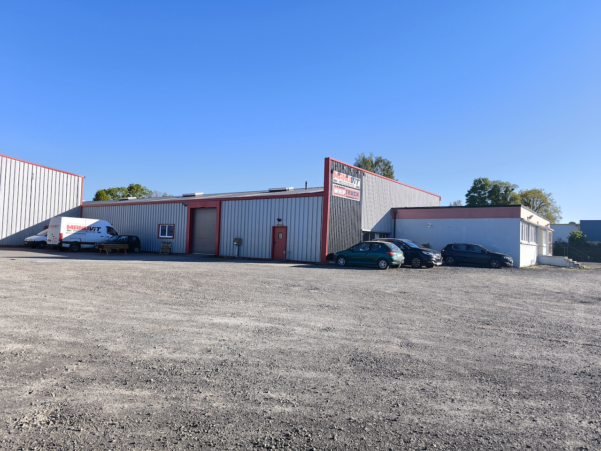
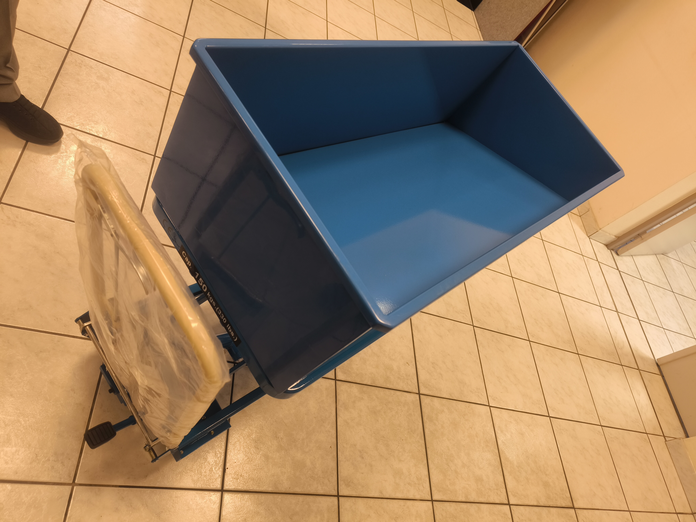
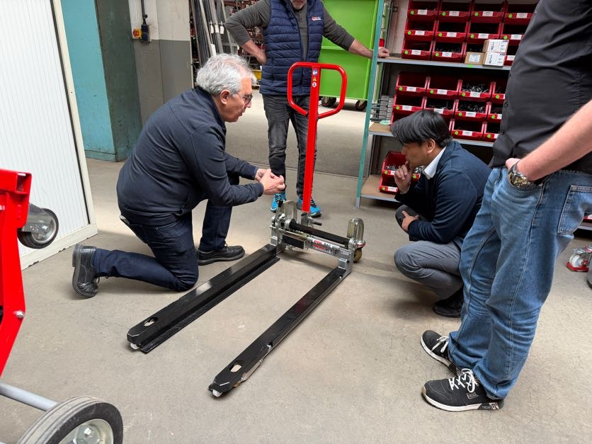
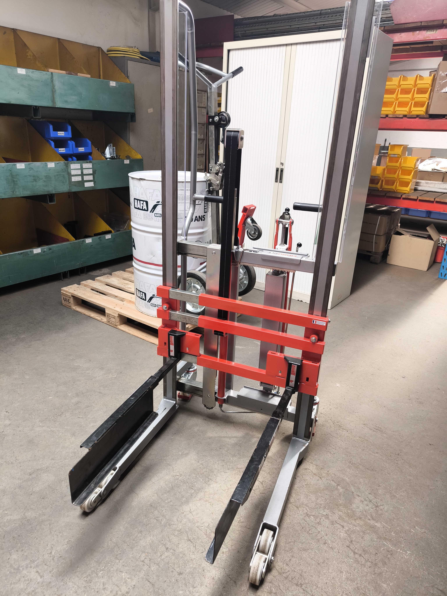
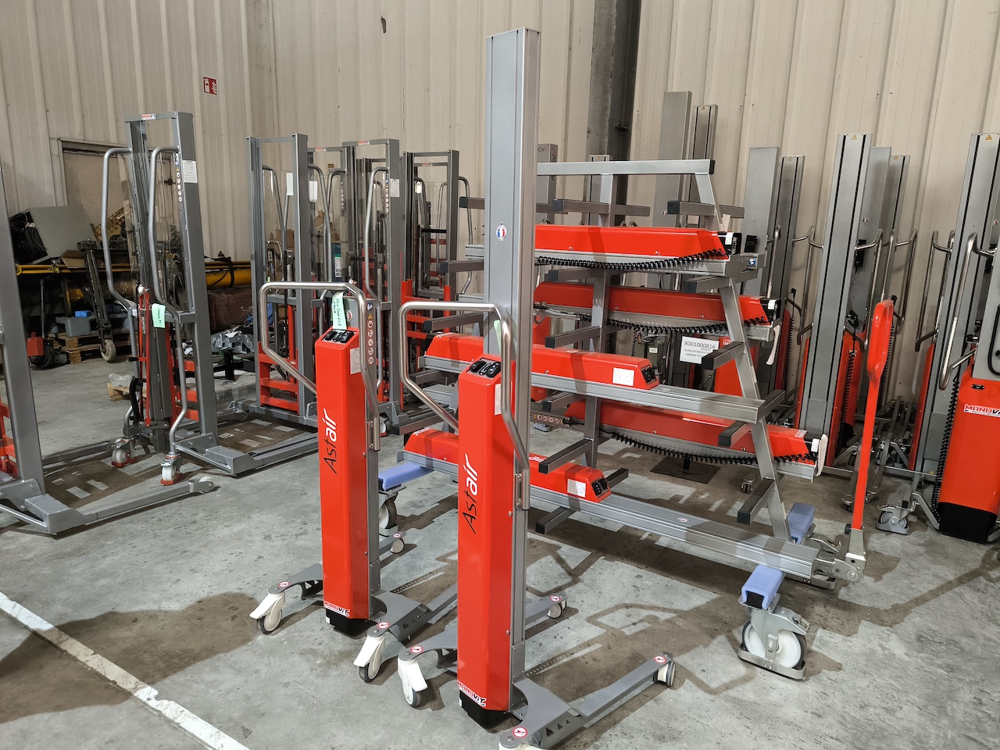
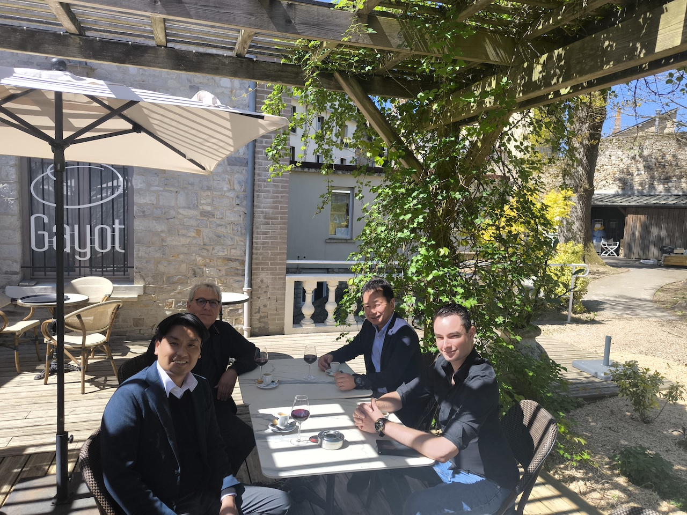
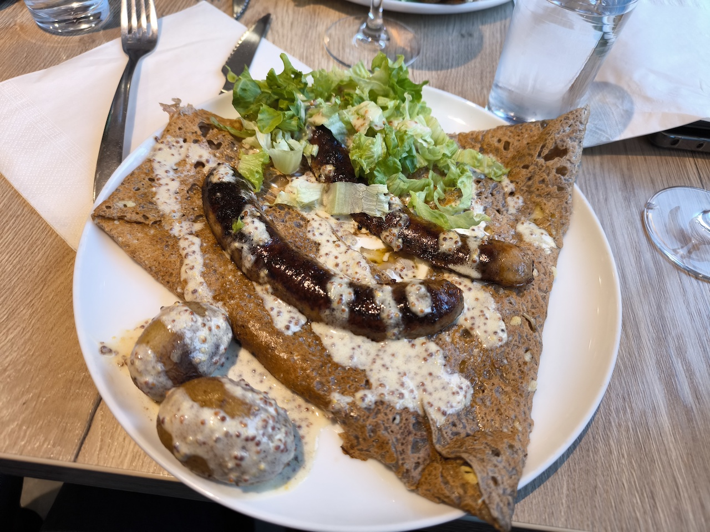

# 2026年 フランス出張報告

## 📅 概要
- **期間**: 2026年4月22日 〜 4月24日
- **訪問都市**: パリ近郊
- **目的**:代理店MANVITならびにIMSに訪問、それぞれの商品について協議

## 🇺🇸 MANUVIT
### 4月23日：パリから北西に２５０km
- **内容**: マブビット社を訪問。工場見学、ハンド及びKGLの説明、相手先商品の協議。
- **気づき**: 売上１０億円のうち、改造が６０％を占める。
　　　　　　　３DCADを使った設計力はなかなかのもの

### オフィス外観

### MANUVITでの改造

### MANUVIT社の興味深い商品群

### MANUVIT社 年配のパスカルと、若手のバティスタ

### 海外では特に、会食も仕事

<!-- ## 🇪🇺 ヨーロッパ(）
### 4月8
- **内容**: フィンテック企業とのミーティングに参加。
- **資料**: [リンク先のタイトル](ここにURL) -->

<!-- ## 🎥 動画レポート（外部ストレージ）
- [サンフランシスコの街並み動画](GoogleドライブなどのURL)
- [現地カンファレンスの様子](YouTubeのURL)

## 📝 まとめ -->

今回訪問した２社は、昨年ドイツで行われたLogimatで一度お会いしている。
そこで出展されていた、それぞれの会社の商品に魅力を感じていた

今回訪問し、工場見学やミーティングを通じて、信頼性を確認することが出来た
９月の物流展に向けて、OEM供給を受けるというスタンスで出展してみたい、と思った

帰国後、社長室にて報告会を行い、
橋本GMから、２社に対して見積もりを依頼する運びとなった

6月18日：IMS　牽引車　購入進捗
6/19に完成との連絡が入りました。
来週、エアー引取りを開始し、月末到着を目指して進めていきます。