# Computex 2026 台北出張報告

> 技術部 山崎

[Computex2026 全写真（Googleフォト）](https://photos.app.goo.gl/65CxeU6F83Y2mVAV9)

---

## 概要

| 項目 | 内容 |
|------|------|
| 出張期間 | 2026年6月1日（月）〜6月4日（木）3泊4日 |
| 目的地 | 台湾・台北（COMPUTEX 2026 視察） |
| 参加人数 | 1名 |
| 会場 | 南港展覧館1・2館（TaiNEX） ／ 世貿一館（TWTC Hall 1） ／ TICC |
| テーマ | **AI Together**（出展約1,500社・6,000小間） |

---

## きっかけ

5月26日、経済界主催の講演会に参加した際、平山准教授から「Computexは絶対におすすめです」と紹介されたことがきっかけ。

「AIの最前線が、あそこにあります」という一言が刺さった。
すぐに航空券とホテルを手配し、6月1日に出発することにした。

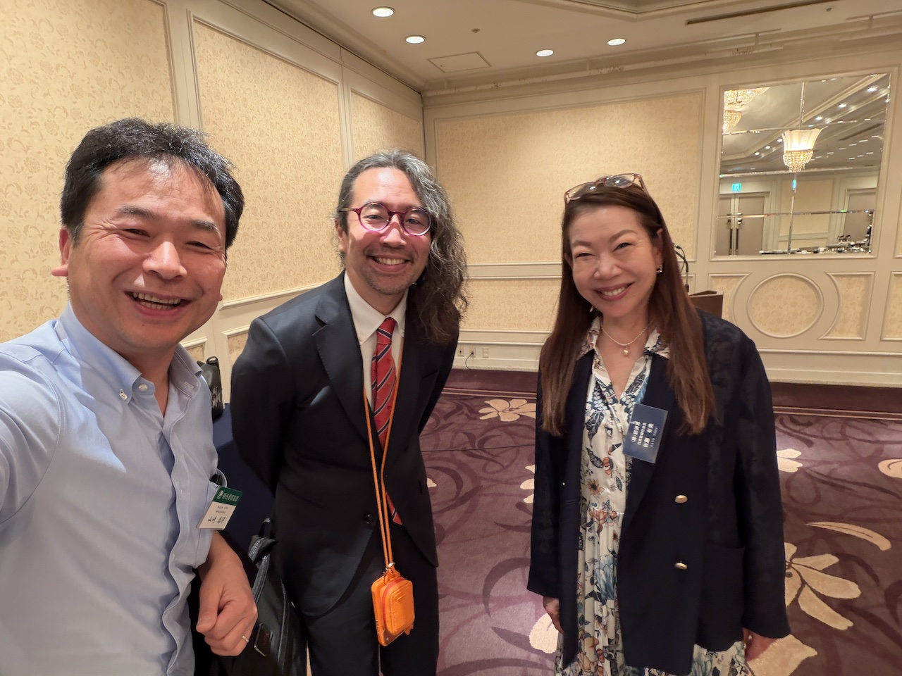<br>
▲ 平山准教授（中央）との1枚。この出会いがすべての始まり。

- [平山准教授講演内容（Dev-Meeting）](https://github.com/KAZUHISA-HIROTA/Dev-Meeting/blob/main/doc/%20講演/2026-05-26.md)

---

## 6月1日（月）出発・台北着

名古屋セントレアから台湾桃園まで、チャイナエアライン（Airbus A321neo）で3時間の旅程だったが、
**台風6号の影響で2時間遅延**。それでも無事にホテルまでたどり着いた。

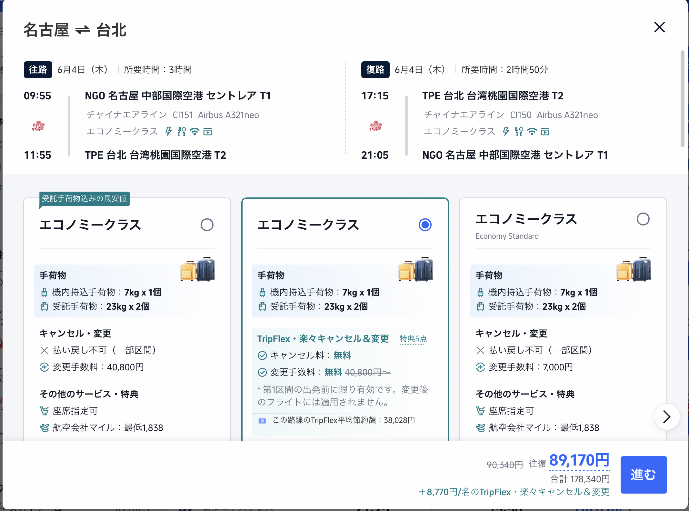<br>

### 台北の「親日」ぶり

台北駅近くの Mayer Inn（美亜商旅）にチェックイン。

ホテルが入るビルのおばちゃんも、受付の若いお兄ちゃんも、皆、日本語を上手に話す。
ホテル周辺には三越・大戸屋・コメダ・丸亀・ユニクロと、日本のチェーンが目立つ。
電車の車内も実に清潔で、静かだ。

面白いエピソードがあった。
ビルのおばちゃん、実は日本人のクォーターで、長崎に古い家があるとのこと。
「誰か買ってくれないか？」と。
道を尋ねてわずか2分で、不動産取引の相談に発展した。
こういうところが、実にたくましい。

### Trifa eSIM のトラブルから学んだこと

ここのところ毎回使っている海外eSIMサービス「Trifa」だが、今回はどうにも接続できなかった。
サポートチャットに相談すると、素早く調査して、的確な回答をくれて解決した。

**トラブルがあっても良い。サポートの質が良ければ、より良いファンになる。**
これは製品・サービス開発においても本質だと感じた。

---

## 6月2日（火）Computex 1日目：世貿一館 → TICC → TaiNEX 2下見

### 午前：世貿一館（TWTC Hall 1）ロボティクスゾーン

まず会場の近い方、世貿一館のロボティクスゾーンを視察した。

正直に言うと、「先進的」というほどのものはなかった。
ここ最近、国内外の展示会で見慣れてしまっているのかもしれない。
ただ、人型（ヒューマノイド）ロボットが、地味に、確実に、現実社会に近づいていることは感じた。

### oToBrite：Vision-AI 深度センシング

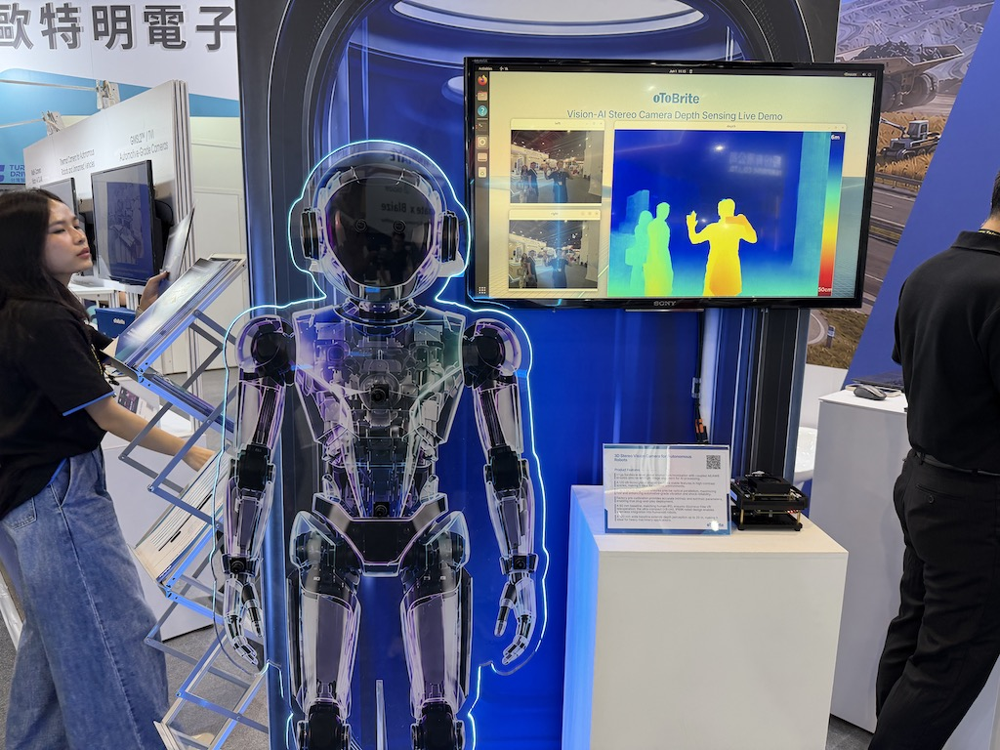<br>
▲ oToBriteのブース。ステレオカメラで人の動きを3D深度マップとして可視化するデモ。画面右のカラーマップ（オレンジ〜緑）が、カメラが捉えた「距離情報」を色で表現したもの。

台湾の車載カメラメーカー・oToBriteが展示していたのは、
**ステレオカメラ＋AIで周囲の人・物の「奥行き」をリアルタイムに把握する技術**だ。

担当者と話していて、印象的な一言があった。

> **「LiDARより高精度です」**

これは、かなり大胆な主張だ。少し補足しておく。

#### LiDAR vs ステレオカメラ + Vision AI

**LiDAR** は、レーザーパルスを照射して反射が戻るまでの時間（ToF：Time of Flight）から距離を測る。AMR・自動運転では定番のセンサーで、精度は高い。ただし、ハイエンド品は1台数万〜数十万円と高価で、AMRのコストを大きく押し上げる原因のひとつになっている。

LiDAR が生成するのは「点群（Point Cloud）」データで、チャンネル数（16ch・32ch・128ch等）に解像度の上限がある。たとえば 128ch のハイエンドLiDARでも、1m先での計測点の間隔は数cm程度にとどまる。

一方、**ステレオカメラ + Vision AI** は、2台のカメラの視差（パラレックス）から深度を計算する。これ自体は古い技術だが、AIが組み合わさることで大きく変わった。

- 高解像度画像（例：1920×1080px）全体を使うため、理論上は**ピクセル単位の奥行き情報**が得られる。点群の密度でLiDARを上回れる。
- AIが**低テクスチャ面**（白い壁・一様な床・光沢素材）を補完推定できる。
- **コスト**は桁違いに安く、エッジAIチップで処理できるためシステム全体のコストダウンに直結する。

[距離を正確に検出し、色で表現する]https://photos.app.goo.gl/W85E5vR2ZPWRM9MR8

テスラの自動運転も、カメラベースでLiDARを使わない方向性に舵を切っている。同じ考え方だ。
**工場内・物流倉庫・AMR用途（近〜中距離・屋内）**に限れば、担当者の「LiDAR超え」という主張は、あながち誇張ではないかもしれない。

**スギヤスの視点で言えば**、今後のAGV/AMR後継機や工場内の人・物体検知システムを検討する際、「LiDARが当たり前」という前提を一度外して考えてみる価値がある。

**★★★★★★★★★★★★★★★★★★★　廣田追加コメント　★★★★★★★★★★★★★★★★★★★**

いよいよLiDARの時代では無くなってきそうですね！！
テスラもカメラですし、そもそも人間は**二つの目**と**脳**で距離間を判断できている事を考えると、今の時代は、**目＝カメラ**、**脳＝AI**で成立できちゃうって事ですよね！！

**★★★★★★★★★★★★★★★★★★★　コメントおわり　★★★★★★★★★★★★★★★★★★★**

---

### 午後：TICC（台北国際会議センター）NVIDIA 技術展示

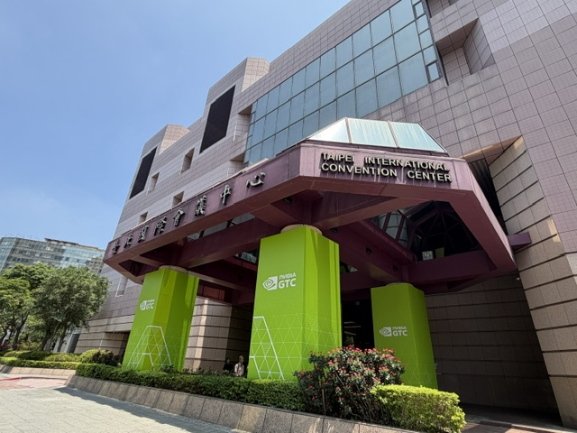<br>
▲ TICC（台北国際会議センター）外観。入口を覆うNVIDIA GTCの緑のバナーが、今年のComputexの主役が誰かを物語っている。

TICCでNVIDIAの技術展示を見学した。
入場だけでも一苦労のセキュリティで、担当者の講演は別料金とのことで断念。
「ショーケース」という単独説明コーナーを見学した。

これが予想以上に充実していた。
スマホのAI解説を駆使しながらなんとか理解した、印象に残った3点を報告する。

前日（6/1）のオープニングセレモニーでは、Jensen Huang氏が基調講演を行っており、今まさに世界中が台北に注目している。
その基調講演で特に印象的だった2つの発表を、以下に記しておく。

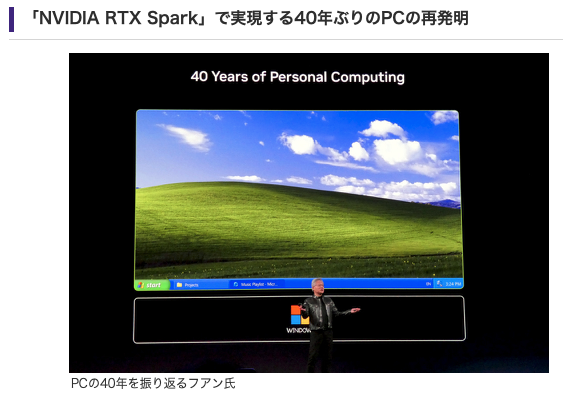<br>
▲ 「NVIDIA RTX Spark で実現する40年ぶりのPCの再発明」。Windows XP の丘の画像とともに、PCの40年の歴史を振り返るファン氏。NVIDIAがGPUメーカーの枠を超え、PC体験そのものを再定義しようとしている姿勢を感じた。

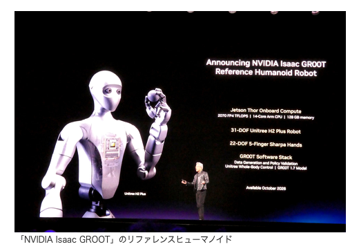<br>
▲ 「NVIDIA Isaac GR00T」リファレンスヒューマノイドロボットの発表。

| 項目 | 仕様 |
|------|------|
| オンボードコンピュータ | **Jetson Thor**（3073 FP8 TFLOPS、12コアARM CPU、128GB） |
| ロボット本体 | Unitree H2 Plus（31-DOF） |
| ハンド | Sherpa（22-DOF・5本指） |
| ソフトウェア | GR00T Software Stack（全身制御・操作生成・汎用ポリシー） |
| 発売時期 | **2026年10月予定** |

前日のロボティクスゾーンで「ヒューマノイドが地味に現実社会に近づいている」と書いたばかりだが、NVIDIAが本体・ハンド・AIスタックまで一気通貫で発表してきた。
「AIの頭脳（Jetson Thor）」「物理的な体（Unitree / Sherpa）」「動かすソフト（GR00T）」を揃えた、フルスタックのヒューマノイドプラットフォームだ。
**2026年10月**に市場投入されるとすれば、来年以降の製造現場のロボット議論は、ガラッと変わるかもしれない。

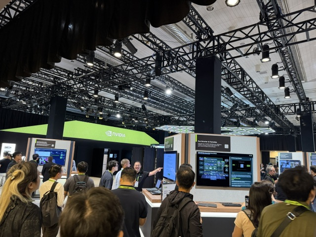<br>
▲ NVIDIAショーケースの内観。担当者が各デモを解説しながら、来場者が次々と吸い込まれていく。

#### ① 工場作業のカメラ自動監視

作業手順の逸脱をAIがリアルタイムで検知するシステム。

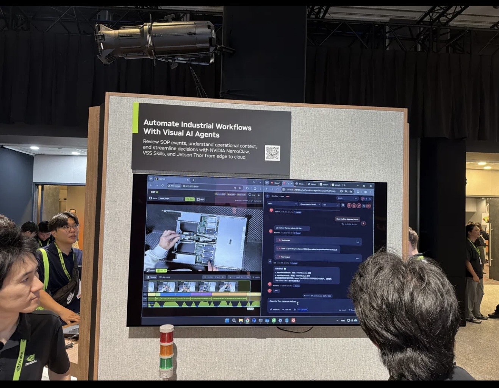<br>
▲ 「Automate Industrial Workflows With Visual AI Agents」。カメラ映像を解析し、SOP（標準作業手順）の逸脱を自動検知。NVIDIA NemoClaw・VSS Skills・Jetson Thor を組み合わせたシステム。

これは、現場に非常にリアルな話だ。
実は水野が基礎研究を行っている「ヒト検出カメラ装置」も、NVIDIAの **JETSON**（エッジAI入門機）を使っている。
まさに同じ技術の延長線上にある。

リフトにも、AMRにも、福祉機器にも取り付け可能、と考えると、用途は広い。

#### ② 工場まるごとデジタルツイン

設備の状態・部品不足を画面上でリアルタイム把握する技術。
AIに話しかけて工場の状況を確認できる点が面白かった。

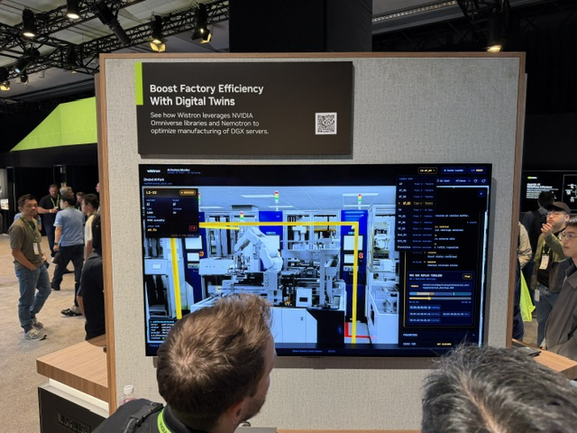<br>
▲ 「Boost Factory Efficiency With Digital Twins」。Wistronの工場をデジタル空間で再現し、NVIDIA OmniverseとNemotronでリアルタイム最適化するデモ。

「いまいち信じられないが、これもやがて当たり前になっていくのか」というのが正直な感想だ。

#### ③ インターネット不要のAIエージェント

工場内のネットワークだけで動くAI基盤。
**情報が外に出ないため、日本の製造現場でも受け入れやすい。**

クラウド依存からエッジAIへの移行は、間違いのない流れだと思う。
セキュリティ要件が厳しい日本の製造業にとっては、特に重要な特徴だ。

---

### 夕方：TaiNEX 2（南港展覧館）下見

夕方、南港のTaiNEX 2に移動して下見を行った。

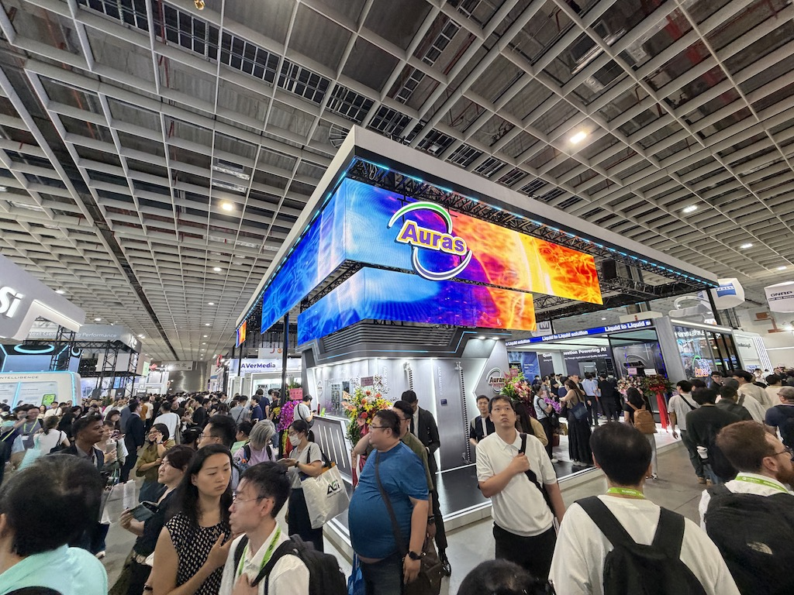<br>
▲ TaiNEX 2の会場。Auras社のブースだけで、この規模感が伝わると思う。

「やはり、こっちがメインだった。」

とんでもない展示規模だった。世界中が半導体ブームであり、その中心地が台北だ。
出展メーカーはもれなく、半導体あるいはAIの波に乗っている。
日本のメーカーはほとんど目にしない。

AMRなど分かりやすい自律搬送の出展は多くなかったが、
**Inventec**という台湾の大手ODMメーカーが AMR 実機を展示しているのを確認した。
翌日、詳しく調査することにした。

---

## 6月3日（水）Computex 2日目：TaiNEX 2 メイン視察

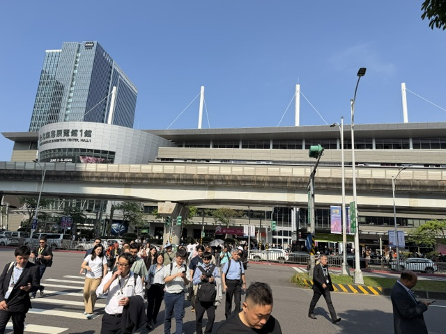<br>
▲ 南港展覧館（TaiNEX）へと吸い込まれていく来場者の波。世界中から技術者・ビジネスパーソンが集まっているスケール感が伝わる。

### NVIDIA GTC エリア ／ Jensen Huang を目撃

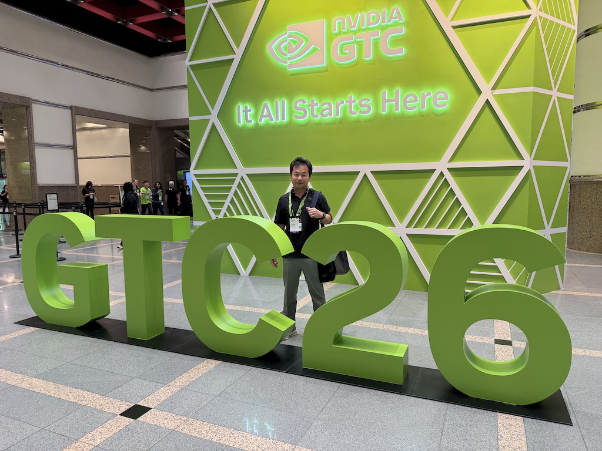<br>
▲ 「It All Starts Here」。会場内のNVIDIA GTCエリアにて。

NVIDIAが会場内に専用エリアを展開していた。
「全てはここから始まる」という言葉が、今年のComputexのテーマを象徴している。

そして、サーバー展示エリアを歩いていると、黒山の人だかりが目に入った。
何があるのかわからないまま、とりあえず自分も中に入ってみた。

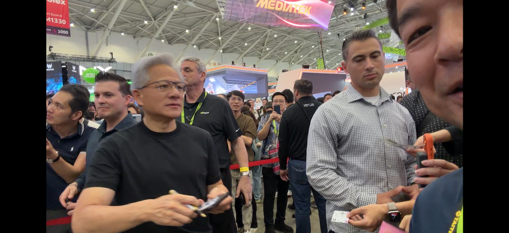<br>
▲ **これ、Jensen Huang 本人です。** ゲリラ的なミニ講演の直後、サインをしながら歩いていた。

NVIDIAのCEO、黄仁勲（Jensen Huang）が、ゲリラ的なミニ講演を終えたところだった。
帰り際、自分のすぐ近くをサインをしながらゆっくり歩いていった。
ちょっとだけ触れて、ツーショットっぽく近くから撮影。

**実に気さく。**
一人一人に目を合わせ、笑顔とジョークで可能な限りサインに応じていた。

つい先月、エアーフォースワンでトランプと中国に行ってきた、世界を動かす人間とは、とても思えない雰囲気だ。
ここに居合わせたラッキーな人たちは、みな感激していた。
完全なるおっさんなのに、アイドルそのもの。**目指すべき現代のエンジニア像**だと思う。

ふと考えてみると、彼がビッグサイトに来るというのは、とてもじゃないが考えにくい。
AI産業だけではないかもしれないが、**台湾の存在感**を改めて実感した。

---

### Inventec × NVIDIA：自律 AMR「iUGV」

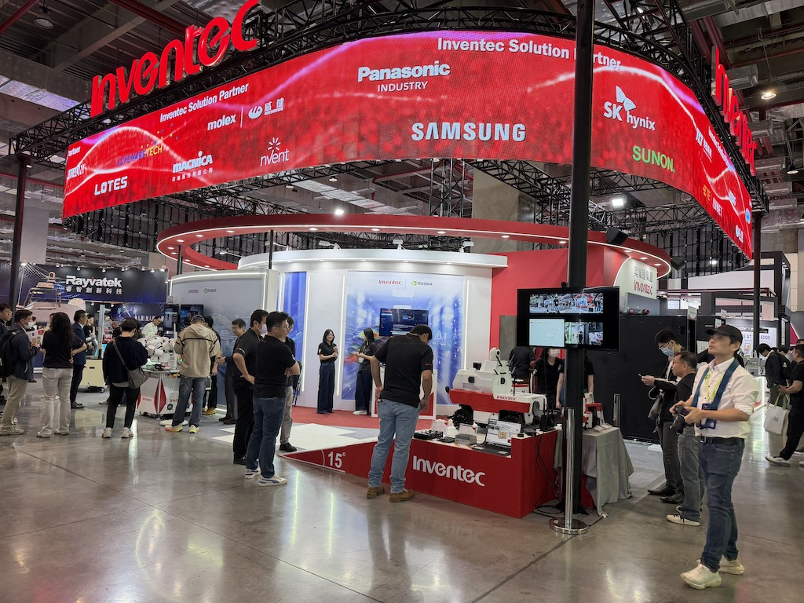<br>
▲ Inventecブース。Samsung・SK hynix・Panasonic Industry・Sunon など錚々たるパートナー企業を従えた大型ブース。

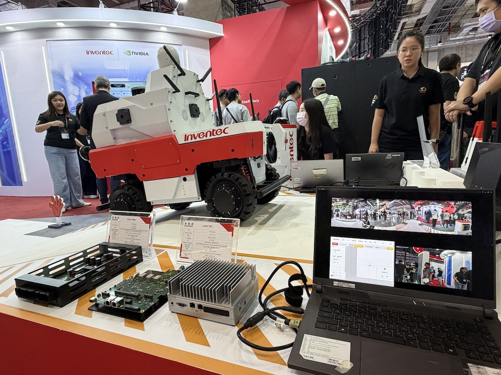<br>
▲ NVIDIAと共同開発した自律AMR「iUGV」。手前のエッジAIコンピューティングモジュール群が、ロボットの「頭脳」にあたる。

台湾の大手ODMメーカー・Inventecが、NVIDIAとタッグを組んで展示していた。
担当者と名刺交換・情報交換を行い、**来週中にメールでコンタクト予定**だ。

#### Inventec iUGV 主要スペック

| 項目 | 内容 |
|------|------|
| AI 制御基板 | **NVIDIA Orin NX（157 TOPS）** |
| 通信インターフェース | **CANBus・RS485**（既存設備との接続が現実的） |
| バッテリー | **LFP（リン酸鉄リチウム）** 工場内24時間稼働対応 |
| 用途 | 自律搬送・施設パトロール・監視 |

LFPバッテリーは発火リスクが低く、工場内での長時間運用に適している。
CANBusとRS485は産業機器の標準プロトコルで、既存のPLC・設備との接続が現実的にできる。これは導入ハードルを大きく下げる。
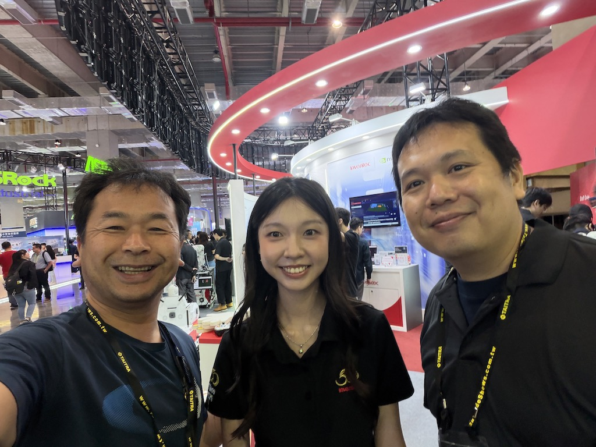<br>

#### 「地図不要のAI自律制御」という可能性

注目したのはスペックだけではない。
担当者の話から、**マップ（地図）をまったく使わず、瞬間的なAI判断だけで自律制御できる可能性**を感じた。

昨日のNVIDIA TICC展示で「動画だけで学習を完了させる」というデモを見た。信じられないが、可能性は否定できない。
そのAI技術と、このiUGVが直接繋がっているとしたら、という話だ。

現在、IDECとDMPとのコラボレーションを進めているが、より発展的な構想として、このコントローラーは非常に魅力的だ。

#### MODEX（アトランタ）で見たこととのつながり

4月のMODEXで「AMRが人混みの中を自律的にかき分けて走る」のを見て、「どうやって動いているのか」とずっと気になっていた。その答えのひとつが、このInventecブースにあった。

ロボット本体の前に並んでいる箱型のモジュールは、**NVIDIA Jetson AGX Orin** シリーズだ。
MODEXでも多くのAMRメーカーがこのJetsonシリーズを搭載しており、NVIDIAはこの分野でデファクトスタンダードになりつつある。

このチップが何をしているか、大きく3つだ。

**① SLAM（同時自己位置推定と地図生成）**
ロボットが「自分が今どこにいるか」を常に把握しながら、周囲の地図をリアルタイムで作り続ける技術。MODEXのAMRが人混みの中で止まらずに走り続けられたのも、このSLAMが機能していたから。NVIDIAは **cuVSLAM**（GPU加速版ビジュアルSLAM）として提供しており、カメラ映像だけで精度の高い位置推定を実現する。

**② リアルタイム物体検知（Deep Learning Inference）**
カメラ映像に対して、人・障害物・不審物などを瞬時に識別するニューラルネットワーク推論。**TensorRT**（NVIDIAの推論最適化エンジン）によりクラウド不要・ローカルで100ms以下の超低遅延処理が可能になっている。

**③ NVIDIA Isaac プラットフォーム**
NVIDIAが推進するロボティクス開発基盤。Isaac ROS・Isaac Perceptor（多眼カメラによる3D空間認識）などが含まれる。同じIssacを使う他社システムとの連携がしやすいという実用的なメリットもある。

```
MODEX で見た AMR（物流搬送）
            ↓ 同じ技術スタック
Inventec iUGV（搬送・施設監視）
            ↓ 共通の「頭脳」
    NVIDIA Jetson + Isaac プラットフォーム
```

今後のAGV/AMR後継を検討する際、「ロボット本体のスペック」だけでなく、**「どのAIプラットフォームの上で動いているか」**を確認することが重要になる。

---

### 犬型・猫型配膳ロボット：「当たり前」になった証拠

会場をくまなく歩いてみると、犬型・猫型の配膳ロボットの派生系はいたるところで目についた。
しかし、自分を含めて、特に足を止める人は無し。

**世界的に見ても、当たり前の技術に成り下がってしまっている。**

2〜3年前なら「すごい」と人が集まった技術が、今や誰も振り向かない。
技術の陳腐化のスピードを改めて感じた一場面だった。

---

### SORABITO × TakumiX：現場向け Voice AI（日本スタートアップ）

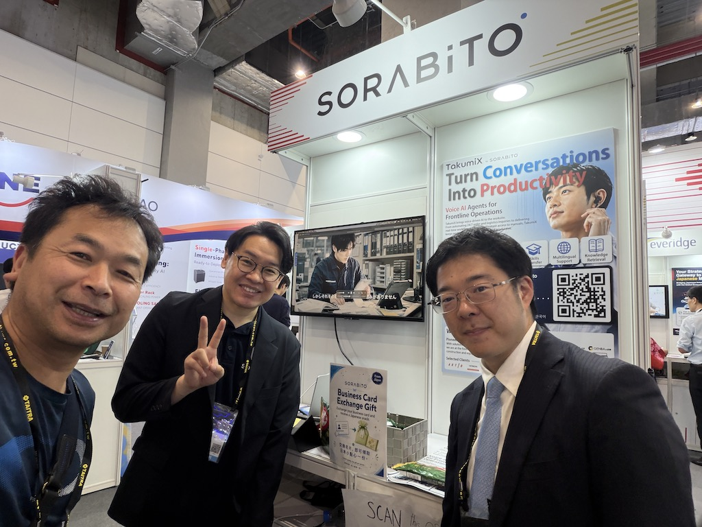<br>
▲ SORABITOブース。「Turn Conversations Into Productivity」── 会話を生産性に変える。

日本のスタートアップ **SORABITO** が、Computexに出展していた。
InnoVEXゾーンで情報交換を行い、意気投合した。

**TakumiX**は現場作業者向けの音声AIエージェントで、耳につけたイヤホン型デバイスに話しかけると、AIが作業手順・在庫情報・ナレッジベースを即座に返してくれる仕組みだ。
音声解析には、万博で口説き落として日本代理店契約を結んだ、イギリス企業の技術を使っているという。

昨日視察したNVIDIAのVisual AI（カメラ監視）と組み合わせることで、次世代スマートファクトリーの具体的なイメージが描けた。

#### フォークリフト年次点検デジタル化：スギヤスへの直接的示唆

特に注目したのが、**フォークリフトの年次点検システム**だ。

現状は紙で行うのが普通だが、SORABITOはウェブシステム上で完結できる仕組みを開発し、**日本で初めて行政認可を取得**したという。約3年間の粘り強い取り組みの末に実現した。

EPやトラバーの電動走行タイプは、人ごとではない。
フォークリフトカンパニーや一般工場へのリーチで、パートナーになってもらえないか？とアプローチを受けた。
**後日、打ち合わせを行う約束をした。**

創業者はまだ40歳で、東京本社だが半田市の出身。縁もゆかりもある。

---

### DMP × STARBIT：AI 動画改ざん防止エンジン

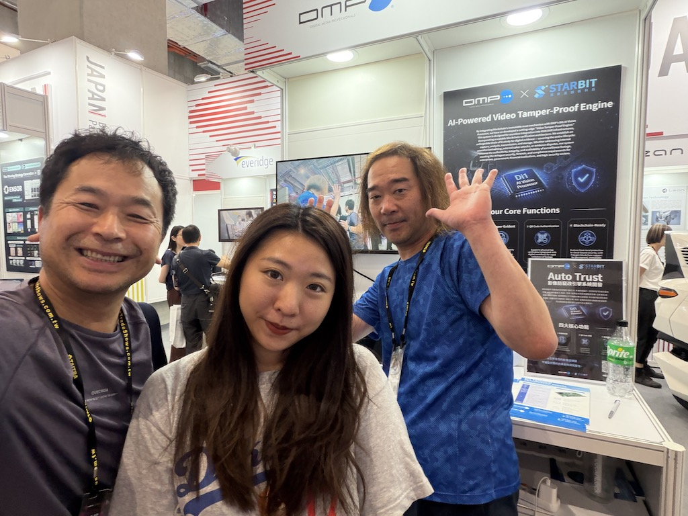<br>
▲ 「AI-Powered Video Tamper-Proof Engine」── 動画の真正性をAIとブロックチェーンで保証する技術。

AMR開発でコラボレーション中の **DMP** も出展していた。
エッジAI担当エンジニアの**浜中さん**と情報交換。

STARBITとの協業で「AI-Powered Video Tamper-Proof Engine」を展示していた。
カメラで撮影した映像が「本当に改ざんされていないか」をAIとブロックチェーンで証明する技術で、工場の品質管理記録・監視カメラ映像の信頼性保証などに応用できる。

いつながら感心するが、**DMPのパートナー探しは卓越している。**

---

### Chessnut：AI電子チェスボード（番外編）

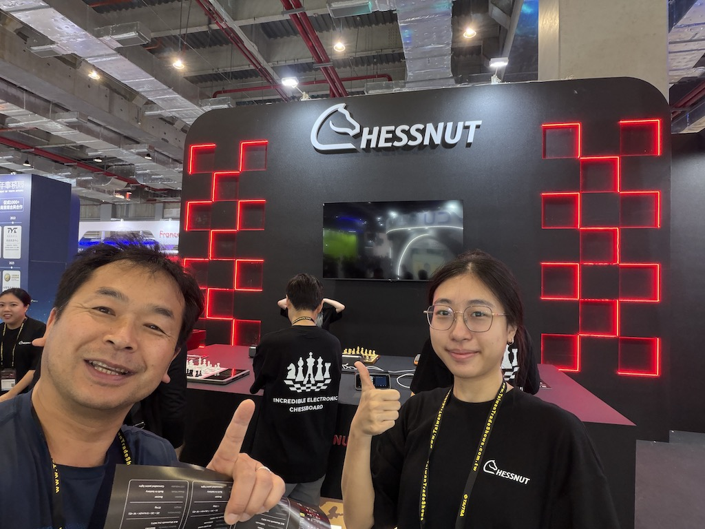<br>

完全に余談だが、AIチェスボードのブースが妙に面白かった。
物理的な盤の上に駒を置いてチェスをすると、そのままAIと対戦できる。

「こんな使い方があるのか」という発見は、展示会ならではだと思う。
技術の使い方に発想力をもらえる瞬間だった。

---

### 光華商場（電子部品・ガジェット街）

帰りがけ、地下鉄の光華商場駅で途中下車した。
エッジAI・IoT関連の市場動向を把握するためだ。

古き良き、電気街だけだった頃の秋葉原の雰囲気。
ここで何か調達するのは相当なオタクであるが、
**意欲ある技術部員であれば、台湾に来たなら寄った方が良い場所**の一つだと思う。

---

## 6月4日（木）Computex 3日目（最終日）・帰国

最終日は午前中のみ、TaiNEX 2を中心に動いた。

### 朝食：香満園（地元食堂）

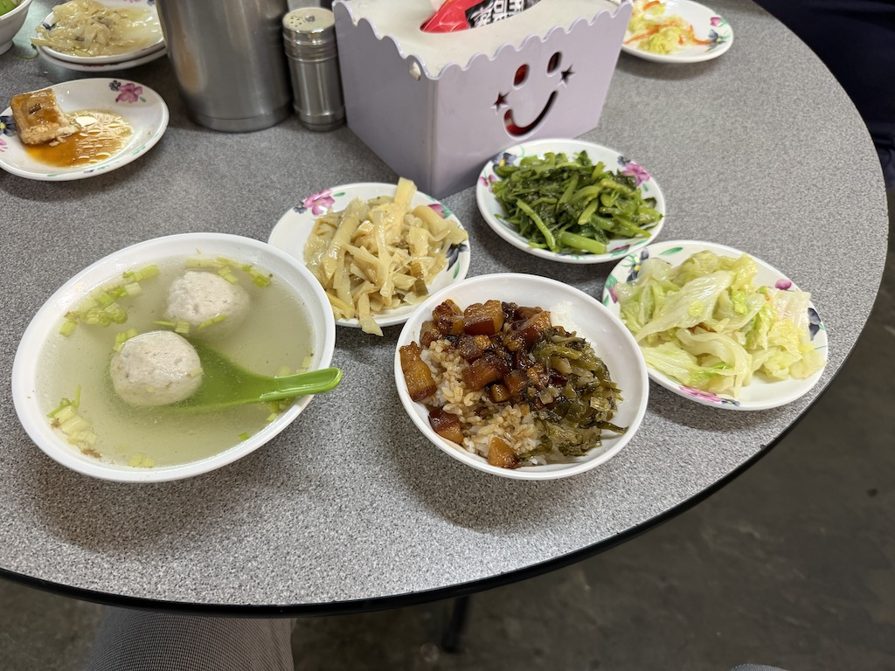<br>
▲ 香満園での朝食。魚丸湯・魯肉飯・青菜を地元民と同じテーブルで。

地元食堂「香満園」にて、魯肉飯・肉丸湯・青菜を地元民と同じテーブルで食べた。
**130NTD（約600円）。**
ディープ台湾体験で、めちゃうまかった。

鼎泰豊の1/5の値段で、満足度は体感5倍。
どちらも台湾の正解だが、気分次第で使い分けられるのが台湾の良いところだ。

---

### Inventec 再訪：地図ハイブリッド構成という「現実解」

Inventecブースを再訪し、改めて観察してみると、
ノートPCの画面に**地図ベースの管理システム**と**全周囲カメラ映像の同時監視**が稼働していることに気づいた。

「地図不要のAI自律制御」と「従来型の地図ベース管理」の**ハイブリッド構成**である。

完全に地図を捨てたわけではなく、現時点での現実解として、この組み合わせが選ばれているということだろう。
「ただ動くだけなら地図も不要」かもしれないが、施設全体の管理・運用まで含めると、地図は引き続き有用なのかもしれない。

昨日の「地図はいらなくなるのか？」という自分の発想には至っていないが、技術の成熟に伴って、そのレベルに近づいていくのは間違いないと思う。

---

### 日本パビリオン：スタートアップ情報交換

海外で出会う日本企業というのは、絶妙の距離感になる。経験上。

本日、印象的だった3社を報告する。

#### DeNA子会社：AIスケジューリング

AIを使ったスケジューリングシステムで、鉄道や電力の大手企業に納入実績があるという。

スケジュール作成など、極めて古典的なコンピュータ関連のテーマだ。
しかし驚くべきは、こうした大企業でも、**実質的には数人がカンを駆使してExcelでスケジューリングしていた**という現実だ。
信じられないが、まだまだこうした分野が、ビジネスチャンスだということらしい。

#### REHATCH Inc.（秋葉原）：AIマーケティング〜広告一気通貫

AIを使ったマーケティングから広告制作まで一気通貫で支援する会社。
AI画像・動画生成など、誰でもできる時代になっても、**それでも商売になる**というのが勉強になった。

ツールが民主化されても、使いこなす専門性や知見には価値がある、ということだろう。

#### Olive（名古屋本社登記）：感情リアルタイム可視化


カメラで静脈を検出し、瞬間的な感情をリアルタイムでモニタリングする技術を持つ会社。
もともとは**トヨタ自動車の乗り心地開発**が起源というから面白い。

名古屋本社登記というのも、縁を感じる。

かねてから「目には見えない人の感情こそが品質と生産性に直結する」と実感してきた。
この技術をリフトや製造ラインに組み込んでも、面白いかもしれない、と感じた。

---

## 台北の街・食

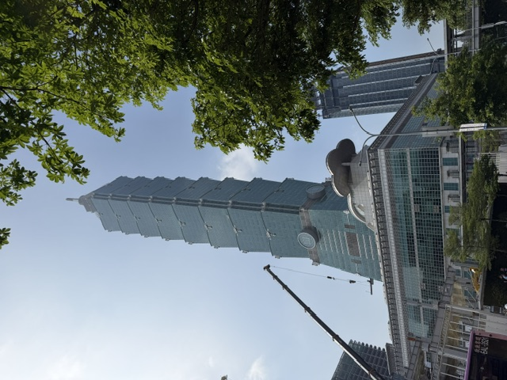<br>
▲ 台北のシンボル・台北101（508m）。鼎泰豊や世貿一館のある信義区にそびえる。

### 鼎泰豊（ディンタイフォン）

到着日のランチは、世界的に有名な **鼎泰豊（DIN TAI FUNG）** へ。

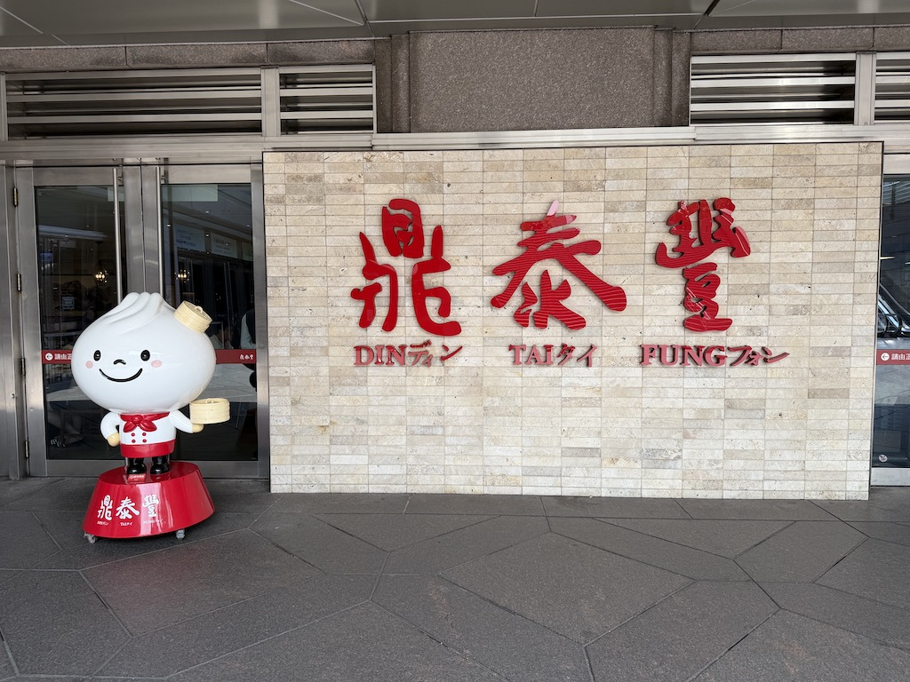<br>
▲ 鼎泰豊・信義店。台湾発祥、今や世界13カ国に展開するグローバルレストランチェーン。ミシュランも認めた名店。

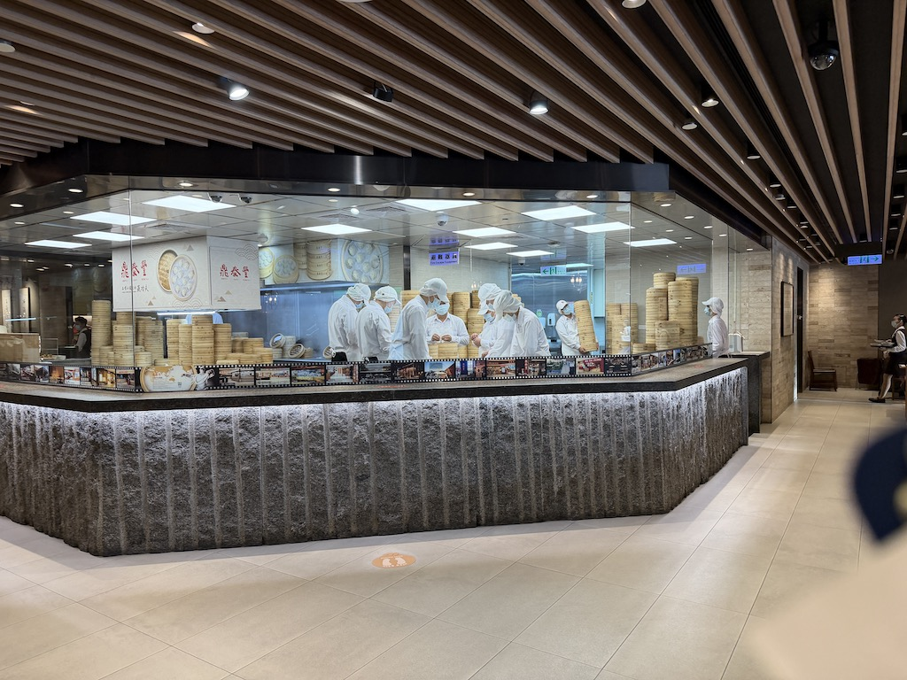<br>
▲ ガラス越しに見える厨房。職人が一つ一つ、18のひだを手で折りながら小籠包を包んでいる。

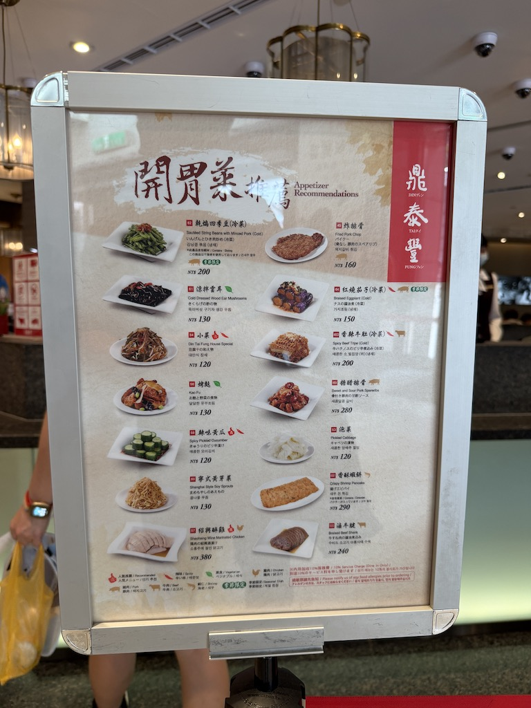<br>
▲ 前菜メニュー。小籠包以外も、どれも間違いない。

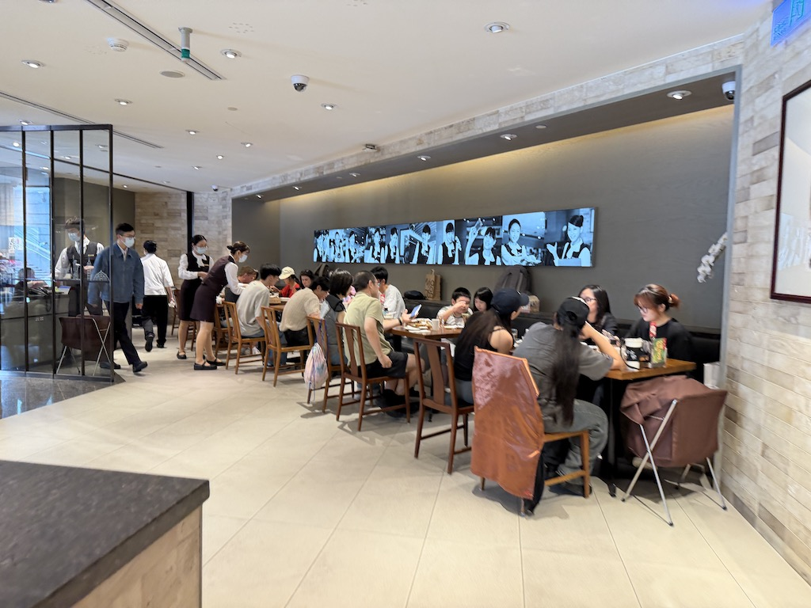<br>
▲ 店内の様子。清潔感があり、接客も丁寧。一人でも入りやすい。

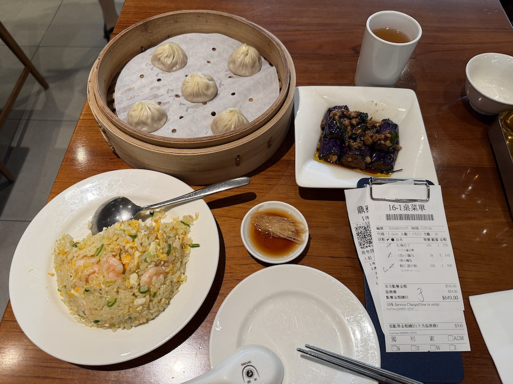<br>
▲ 小籠包・チャーハン・茄子の醤油炒め。649NT（約3,000円）。

確かにランチで3,000〜5,000円はする。正直、安くはない。
でも、皮の薄さ・スープのじゅわっと感・香り、全部が別次元だった。
台湾に来ることがあれば、**一度は行ったほうがいい**。間違いなく。

---

### 寧夏夜市と台湾グルメ

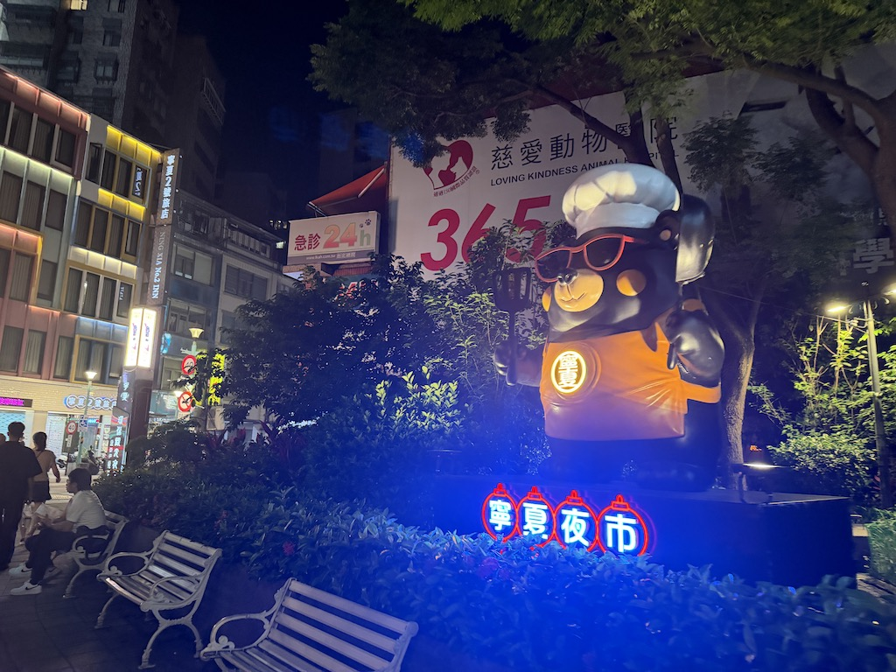<br>
▲ 寧夏夜市（ニンシャーナイトマーケット）。活気がすごい。

夜は台北駅から徒歩圏の **寧夏夜市** を訪問。
50〜100店舗が路上にひしめき合い、週末の大須商店街の比ではない人出だった。

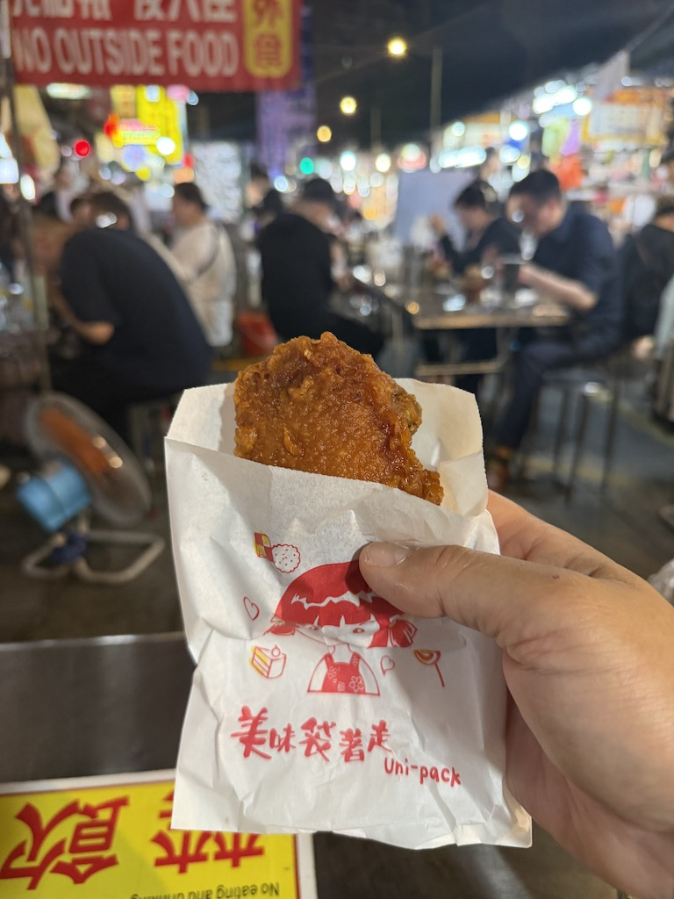<br>
▲ 台湾フライドチキン（鹹酥雞：シェンスージー）。

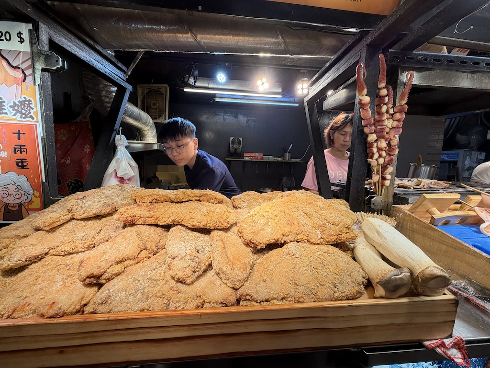<br>
▲ 大きな鶏むね揚げ（雞排：ジーパイ）。顔より大きい。

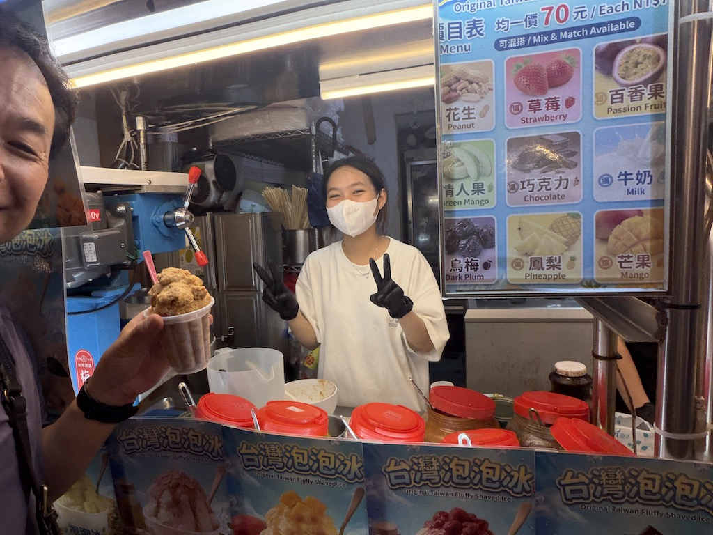<br>
▲ 台湾泡泡冰（台湾フワフワかき氷）。暑い台湾には欠かせない。

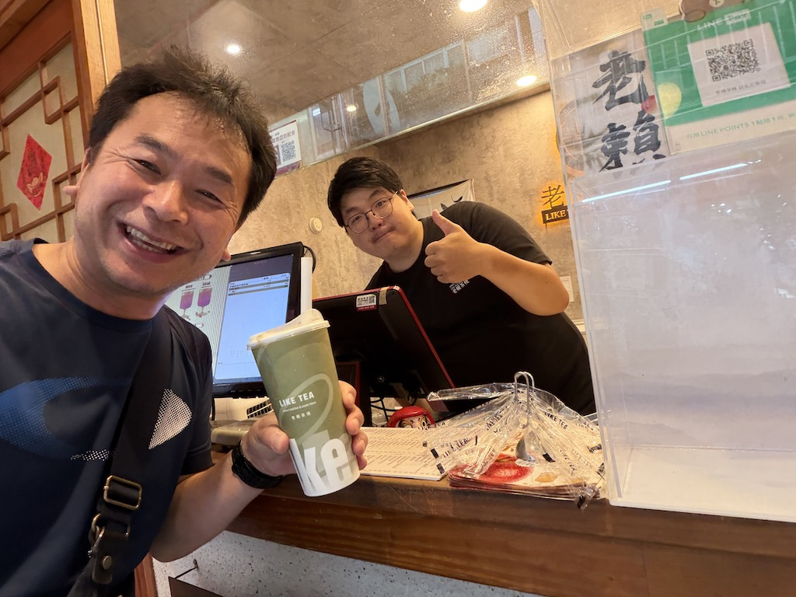<br>
▲ タピオカ緑茶（LIKE TEA）。台湾はどこのお茶屋も本当に旨い。

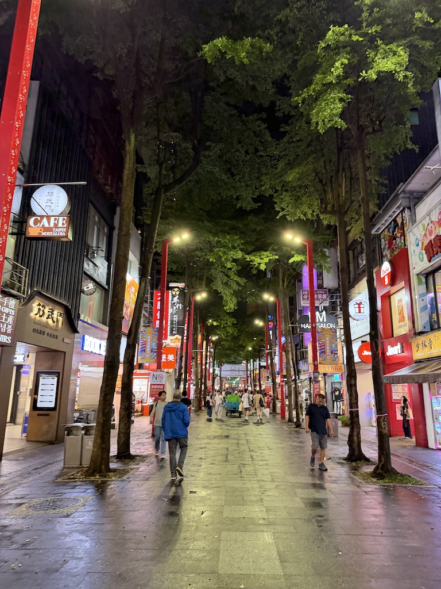<br>
▲ 台北市内の繁華街。夜でも明るく、緑が多くて歩きやすい街だった。

「台湾に来たらスシローに行く人がいるのか」と思って撮影した1枚も。

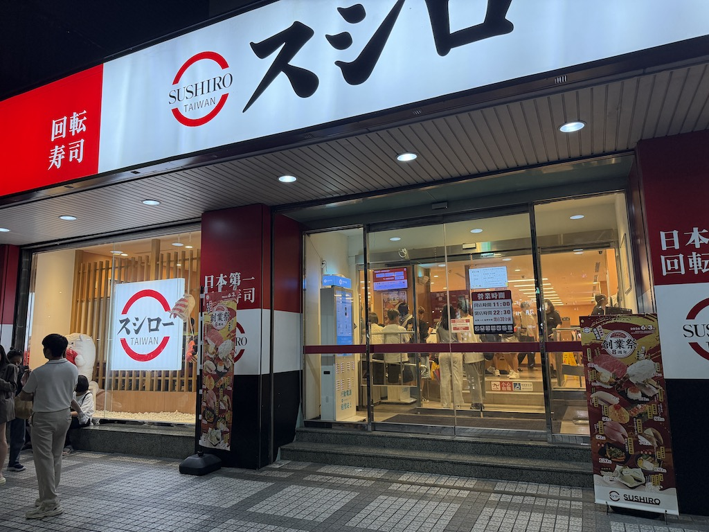<br>
▲ スシロー TAIWAN。現地でも長蛇の列だった。

---

## 3日間まとめ

### AIが「見えないもの」を可視化し始めている

かねてから、目には見えない人の感情こそが品質と生産性に直結する、と実感してきた。

今回の展示会で目にしたOliveの「感情リアルタイム可視化」、SORABITOの「音声AIによる現場支援」、NVIDIAの「工場カメラ監視」は、それぞれ異なるアプローチで、現場の「見えないもの」を可視化しようとしている。
その方向性は間違っていない、と確信した。

### ハードウェアからソフトウェアへ

今回展示会で目にした会社だけには限らないが、**ハードウェア依存から脱却し、ソフトウェアに軸足を移している会社が成長している**ことは事実だ。

この出張中に、ソフトバンクとキオクシアが、トヨタ自動車の株価を上回ってしまったというニュースも飛び込んできた。
日本でもアメリカのように、製造業よりも情報関連の方が価値があるとされ始めている。

AGVやAMR単体の競争は今後さらに激化する。
当社の強みである現場対応力を活かしながら、AI・IoTとの連携や点検システムとのセット提案など、付加価値の高いビジネスモデルへの転換の可能性は、確かにある。

### 当社が今後取り組むべき方向性

今回の視察を通じて、製造現場のAI化における数年先の技術の全体像が、おぼろげながら見えてきた。特に以下の組み合わせが、当社製品の今後の方向性を考える上で重要なヒントになった。

- **カメラ × Visual AI** → 現場作業の自動監視
- **音声AIエージェント** → 作業者へのリアルタイム指示
- **NVIDIA Orin NX 搭載 AMR** → 自律搬送との統合

現在は、ROSや画像認識の基礎技術に着手し始めたところだが、先々には音声も当然に取り組みたい分野だ。

また、橋本GMの調査発案だが、**大規模データセンター専用のリフト**というのも、当然にあって良いものだろう。
クリーン度・静電気・耐荷重など要求スペックは厳しいに決まっているが、スーパーニッチでのNo.1は取れそうな成長分野である。

### 一期一会

Computexは「AIを使う展示会」ではなく、「AIを作っている人たちが集まる場所」だった。

4月の米欧出張（MODEX・ヨーロッパ）と比べても、**技術の最前線の密度**という点では、Computexが頭一つ抜けていたと感じた。

今回もまた、一期一会を感じた海外出張となった。

---

以下のGoogleフォトに、全写真をまとめています。
先入観を持たずに見て、何かひとつでも「面白そう」と感じるものがあれば、ぜひ声をかけてください。
一緒に考えていきましょう。

[Computex2026 全写真（Googleフォト）](https://photos.app.goo.gl/65CxeU6F83Y2mVAV9)

---

*作成日：2026年6月5日 ／ 技術部 山崎*
