# なんとか入れれました！

0616 Yamazaki
ナイストライ！！！
こうしてGitHubでのシェアを始めて体験してみたけど、、、
やっぱりコレ、いいね！

GitHubの仕様は、文字の完全一致を求めるからね、
JPGとjpgは、大文字・小文字で異なる、と認識するとかね。

### 0616追記しました！　佐倉  
動画のアップに挑戦中です！
### 0618追記しました　奥村

# 視察報告書

## Robot Technology Japan 2026

| 項目      | 内容                       |
| ------- | ------------------------ |
| 視察日     | 2026年6月12日（金）            |
| 会場      | Aichi Sky Expo（愛知県国際展示場） |
| 同行者     | 奥村さん、佐倉君                 |
| レポート作成者 | 技術部　前川                   |
| テーマ     | **「好奇心って、引力だ。」**         |

---

# 1. 視察内容

会場は非常に多くの来場者で賑わっており、ロボティクス分野への関心の高さを強く感じた。展示内容としては産業用ロボットアームが多数を占め、従来のティーチングによる動作再現だけでなく、カメラを活用した画像認識やAIによる音声指示対応など、自律化・知能化が標準機能となりつつあることを実感した。

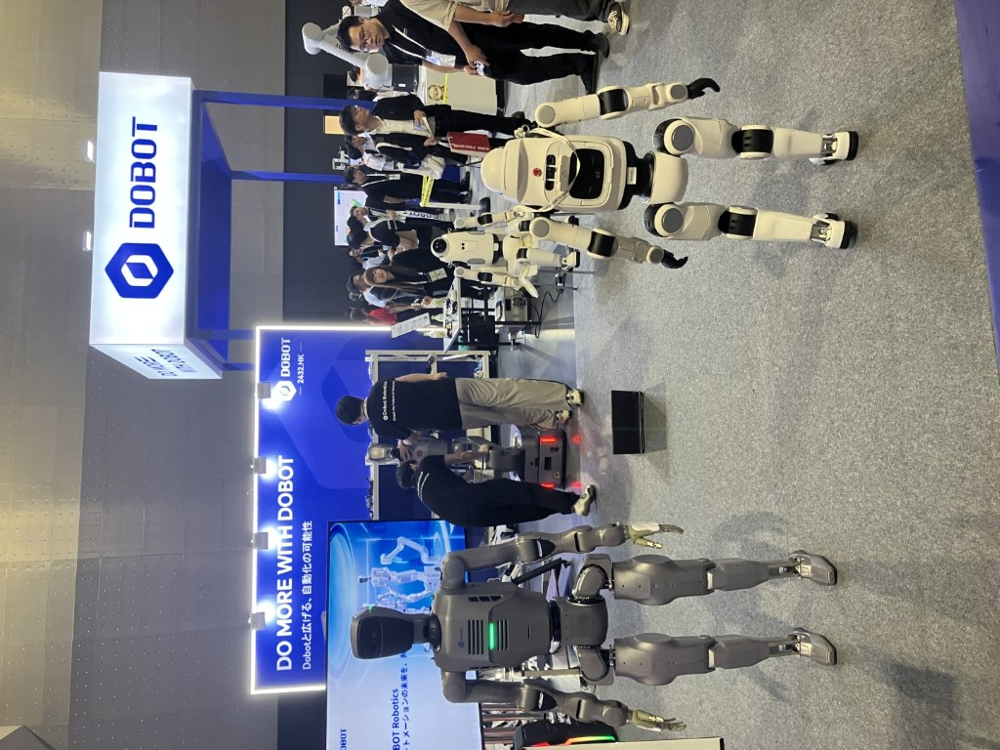 
また、近年注目を集めているヒューマノイドロボットの展示も数多く見られた。日本メーカーの出展は少なく、大部分が中国メーカーであり、中国企業の技術開発スピードと市場展開力の強さが印象的であった。

AMR（自律搬送ロボット）は単体製品としてではなく、自動化ラインを構成する要素として展示されるケースが多かった。箱型AMRは差別化が難しくなっている一方、一部メーカーはメカナムホイールによる全方向移動性能をアピールしていた。 

### 全体印象(奥村)

> 出展の半分がロボットハンドと感じるほど、「ワークをいかに確実につかむか」が技術競争の焦点。  
> イーロン・マスクが「ハンドは難しい」と言うだけあって、奥が深い領域。

**フィジカルAI** の台頭も顕著。ファナック・安川・Denso・ダイヘンなどの大手が、ティーチングによるトレースではなく、カメラ映像から判断して自律動作するデモを展示。溶接の狙いずれをAIで解消できれば現場への恩恵は大きい。
 
### **[写真や動画の一覧はこちら](https://photos.app.goo.gl/HmYCeTd3bVEt4Mhp8)**

---

## 1-1. 足回り技術（NSK アクティブキャスター）
 
 

NSKのアクティブキャスターを視察した。

1輪に対して2つのモータを搭載し、駆動と旋回を独立制御する構造となっており、2輪のみで全方向移動を実現していた。過去に見た試作品と比較して大幅な小型化が図られており、技術の成熟を感じた。

一般的なメカナムホイールは構造上、走行時の上下振動が発生するが、本技術はその課題を解決し、オフィスや病院などの屋内環境での利用を想定している。

STの横移動実現に向けた新たなアプローチとして参考になる技術であり、今後検討を進めたい。

---

### NSK × Delta電子 — ロボット用リニアアクチュエータ

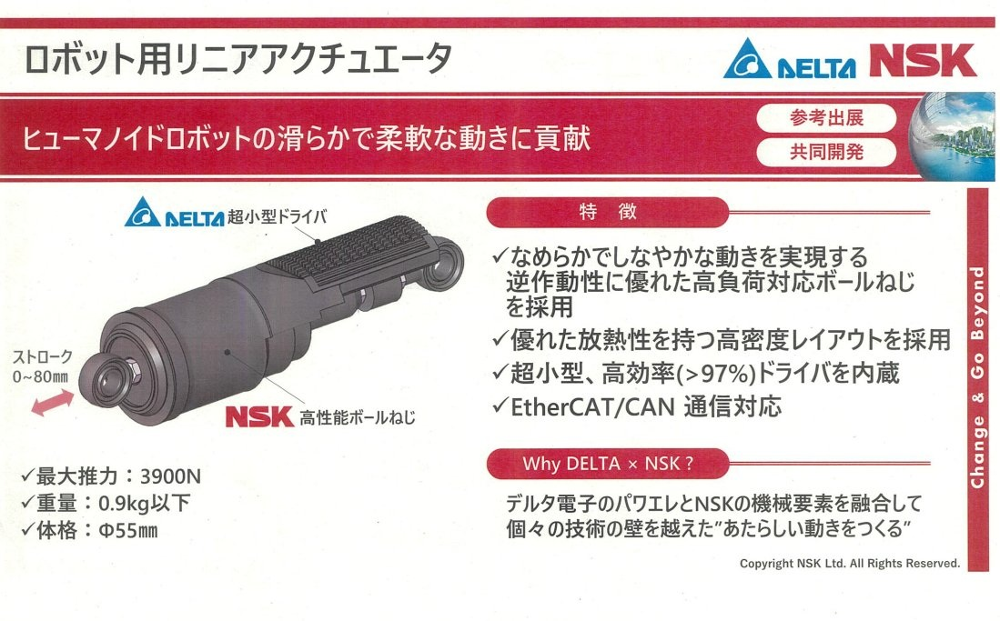

> ⚠️ 撮影禁止のため、カタログ写真のみ

ヒューマノイドの腕を動かすための小型アクチュエータ。ドライバまで一体化されCANで制御できる。 
### **駆動部にドライバを内蔵する設計がトレンドになっていると感じた。** 
 

| 項目 | 値 |
|------|-----|
| 外径 | φ55 mm |
| 最大推力 | 3,900 N |
| 重量 | 0.9 kg 以下 |
| ストローク | 0〜80 mm |
| 通信 | EtherCAT / CAN |

---

## 1-2. 水圧駆動技術（NACOL）
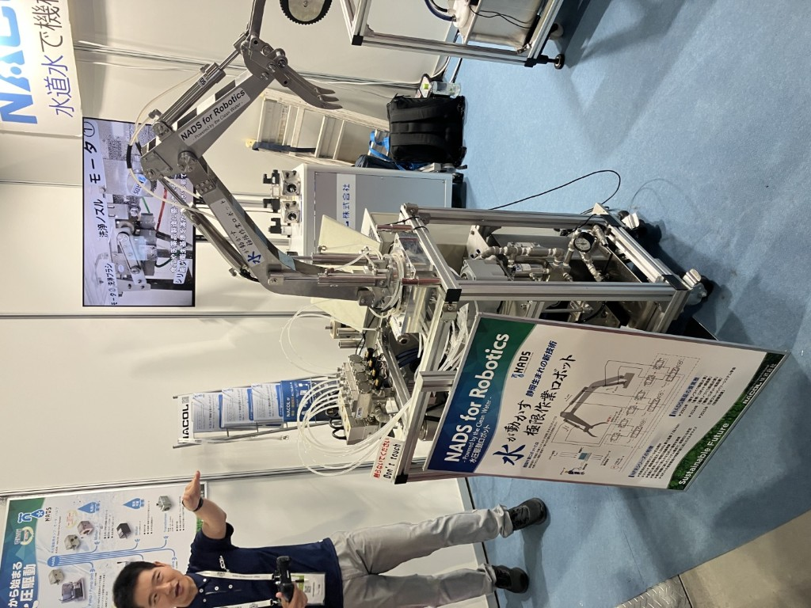
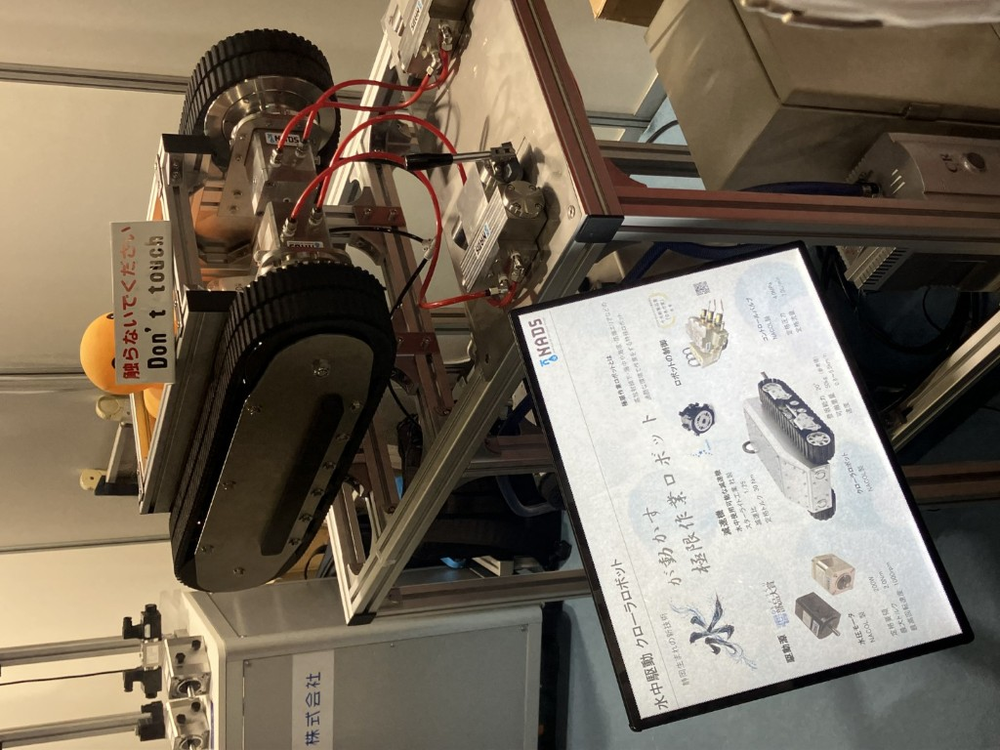 
NACOL社の展示を視察した。

同社は水圧ポンプ、制御ユニット、アクチュエータ、シリンダまで一貫して開発・販売しており、水圧を利用したロボットアームやクローラ駆動のデモ展示を行っていた。

自社のコア技術をロボティクス市場へ展開する事例として非常に参考になった。

 
260616 Yamazaki 
NACOLって、静岡県清水市の会社だよね？
１年くらい前かな、廣田GMらと一回訪問しているんだよ。
その時は、アキュムレーターという、油圧回路に入れてリフト挙動をマイルドにする装置の検討で。
 
---

## 1-3. AMR要素技術（ベッコフ）
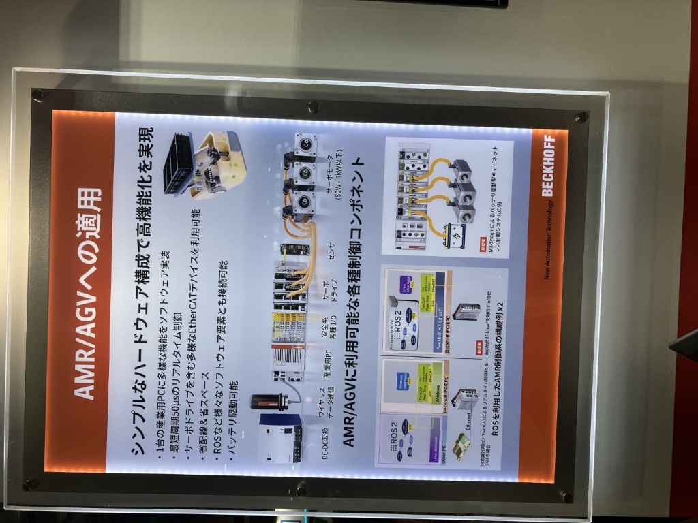 
ドイツ製産業用PCを扱うベッコフ社のブースを訪問した。

約40年にわたり産業用PC事業に携わっており、AMRシステムに関しても豊富な知見を有しているとの説明を受けた。

今後の技術相談先候補として名刺交換を実施した。

---

## 1-4. 触覚センサ技術（太田廣）
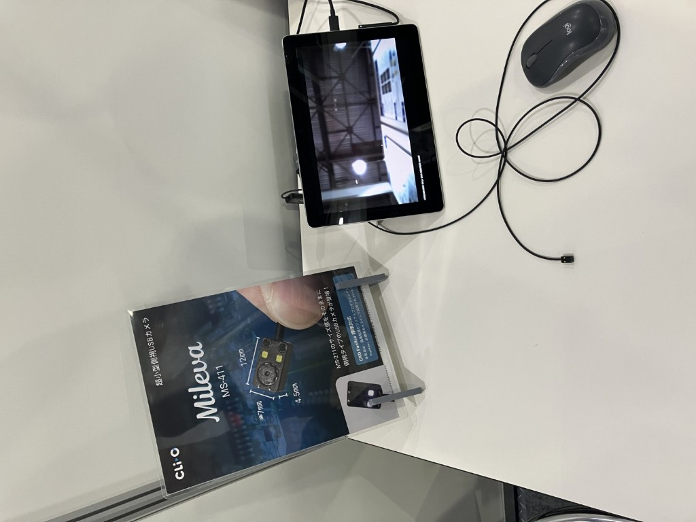 
太田廣の触覚センサに採用されている超小型カメラと画像処理技術に興味を持った。

搭載されているカメラは7mm×12mmという小型サイズでありながら鮮明な画像を取得できていた。

カメラはクリオ社が開発しており、愛知県一宮市に拠点があるため、今後来社いただき技術情報交換を行いたい。

---

## 1-5. 機構技術（キトー）

キトーの電動バランサに搭載されていたロールクランプ機構を確認した。

スライドレールのロック機構を活用し、クランプ開閉時に動作モードが切り替わる巧妙な構造となっていた。

動画撮影も行ったため、後日詳細な動作解析を実施したい。

---

## 1-6. DMPブース
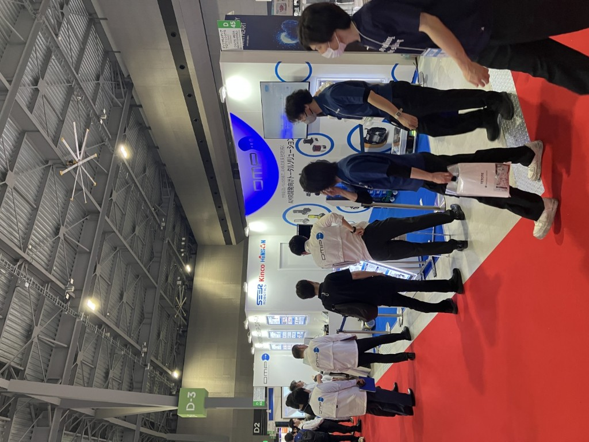 
DMPブースを訪問した。

ブースは非常に盛況で、多数の引き合いを獲得している様子であった。

先週実施いただいた設定レクチャーへのお礼を伝えるとともに、今後も継続的な技術サポートをお願いした。

---

### 1-7. 椿本チェーン ZIPチェーン（KeiganALI ブース展示）

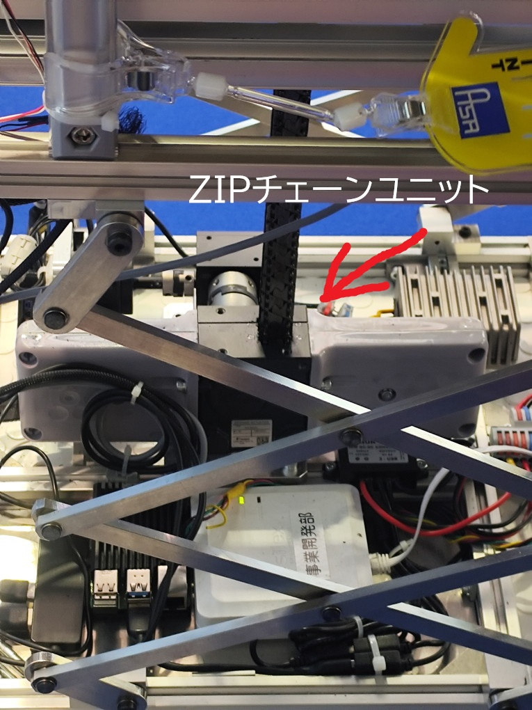 

アサ電子工業ブースにKeiganALIのリンク式昇降装置が展示されており、その駆動源が椿本の**ZIPチェーン**だった。

- ユニットとして単体購入可能
- **薄いテーブルを高く持ち上げる用途**に適している
- 上方向にのみ伸びる特性を活かした省スペース昇降機構

---

### 1-8. マブチモーター — 超小型ブラシレスモータ「Thumbelina」

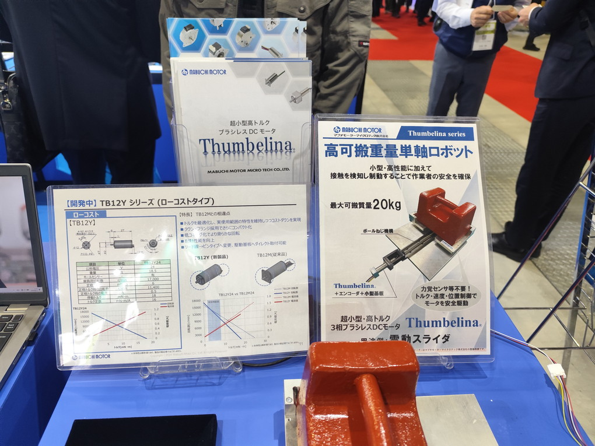 

超小型モータ（**Thumbelina**シリーズ）を使ったネジ駆動装置。

| 項目 | 値 |
|------|-----|
| モータ外径 | 20 mmという驚異的な小ささ！ |
| モータ全長 | 30 mm |
| 最大可搬重量 | 20 kg |
| 駆動方式 | この小ささで何とブラシレスDC！|

- 蓋の開閉・製品内部のちょっとした駆動など、コンパクトな駆動装置として応用可
- **1個から購入可能**（以前は1万個〜と言われていたが確認済み）

---

# 2. 所感・まとめ

今回の視察を通じて、ロボット業界においてAI、画像認識、自律制御技術が急速に普及していることを改めて実感した。

特にヒューマノイド分野では中国企業の存在感が圧倒的であり、日本企業との差が拡大している印象を受けた。一方で、足回り機構、触覚センサ、水圧アクチュエータなどの要素技術には独自性の高い技術開発が多く見られ、今後の製品開発や新規技術検討のヒントを得ることができた。

また、ここ半年でAMR関連技術への理解が深まったことにより、以前よりも技術的な観点で展示内容を分析できるようになったと感じている。今後はAMRだけでなく、ロボットアームの関節構造、アクチュエータ、配線技術などの要素技術についても知識を深め、自社製品開発へ活かしていきたい。

テーマである「好奇心って、引力だ。」のとおり、興味を持った技術や企業との接点から新たな発想や学びを得ることができた有意義な視察であった。
  
---

2026-6-16　追記　技術佐倉  

## 1. 展示会全体所感

今回初めてROBOT TECHNOLOGY JAPANへ参加したが、来場者数は非常に多く、会場内の移動にも苦労するほどの盛況ぶりであった。  
出展者へ確認したところ、前日以上の来場者数との声も多く、特に当日は大変活気のある展示会であった。  
  
展示内容としては、産業用アームロボットが中心であった一方、ヒューマノイドロボットや犬型ロボットの出展も多く見受けられた。  
自身がこれまで参加した国内展示会の中でも特に展示数が多い印象を受けた。  
  
また、ヒューマノイドロボットの実演では多くの来場者が集まり、非常に高い注目度を感じた。  
実際に見学したトヨタのバスケットボールAIロボットの実演では、限られたスペースにもかかわらず多数の来場者が集まっていた。  
  
今回日本の展示会でヒューマノイドロボットの実演に多くの来場者が集まっている様子を見て、日本ではまだ先端技術として強い関心を集めていることを感じた。  
一方で、山崎部長の台湾出張レポートでは「先進的というほどのものはなかった」との記載があり、地域によってロボット技術への期待や受け止め方、展示の方向性に違いがあることも印象的であった。
ロボット技術に対する注目度や受け止め方に、日本と海外との違いを感じる機会となった。   
  
また、AMR関連の展示ブースでは、説明員が来場者に対して「スギヤスのハンドパレットトラックを自動化したような製品です」と説明している場面を複数回見かけた。  
搬送機器の説明において自社製品が比較対象として用いられていることから、スギヤス製ハンドパレットトラックの認知度の高さを改めて感じ、嬉しく思った。  
  
---

## 2. 出展内容（ロボット × AI）

### ① バスケットボールAIロボット（トヨタ）

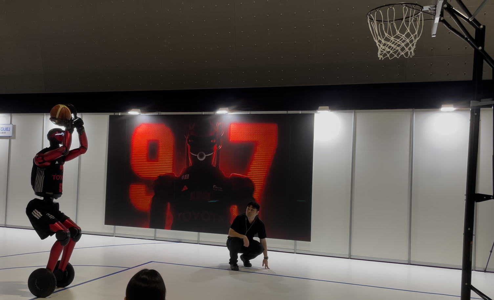　 
▲バスケットボールAIロボットのフリースローの様子  
  
* 身長：219 cm
* 体重：74 kg
* CUEシリーズ第七世代（CUE7）
* 前モデルCUE6から約50 kg軽量化

実演展示であったため詳細な技術説明までは確認できなかったが、足部は2輪構成となっており、移動速度も速かった。さらに、ドリブルやシュート動作を行っていた。

特に、2輪でバランスを維持しながら一連の動作を安定して実施している点が印象的であり、姿勢制御や動作制御技術の高さを感じた。

---

### ② ファナック（ロボットアーム × AI）

展示会ではAIを活用した音声認識ロボットの展示が複数見られたが、その中でもファナックの展示が特に印象に残った。

実演では、産業用ロボットアームを従来のティーチング作業なしで動作させていた。来場者が「サイコロを振って」といった音声指示を出すと、その内容をAIが解釈し、ロボットが指示に応じた動作を実行していた。

複雑な指示では動作が成立しない場面も見られたが、多くの指示に対して適切に動作しており、ロボット操作の簡易化や現場導入の可能性を感じる展示であった。

---

## 3. 出展内容（AMR）

### ① MiR（デンマーク製AMR）

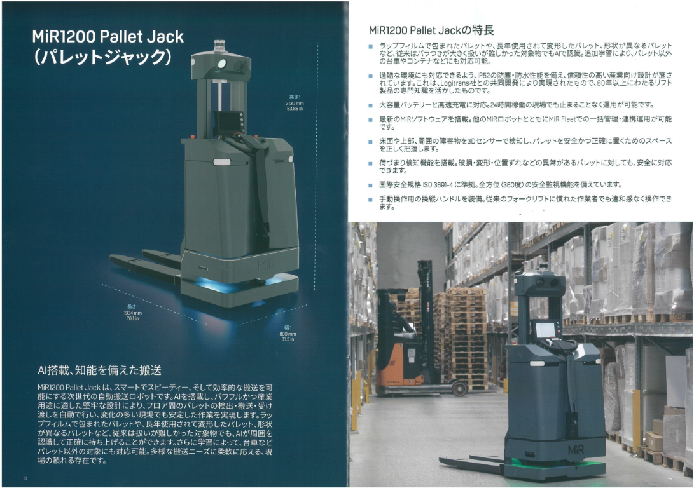　 

#### 製品概要

* フォーク型AMR
* 手動操作にも対応

#### 安全・認識技術

* 前後左右および本体上部に安全装置を搭載
* フォーク方向にはカメラ＋AIを搭載（主用途：パレット検知）
* 安全機能は主に本体上部の3D LiDARが担う構成

#### 市場動向

* 国内普及はまだ限定的
* 日本：既存設備・レイアウト維持志向
* 海外：AMR導入前提でレイアウト変更するケースあり

#### 所感

事前調査でMiRが出展することを知りブースを訪問した。残念ながら実機展示はなく、パンフレットをもとに説明を伺った。
率直に「売れてます？」と販売状況について質問したところ、日本では全然と回答。
理由は上記市場動向に記述した通りで、日本市場では導入ハードルの低さや既存設備との親和性が重要であると感じた。

---

### ② オムロン（昇降タイプAMR）

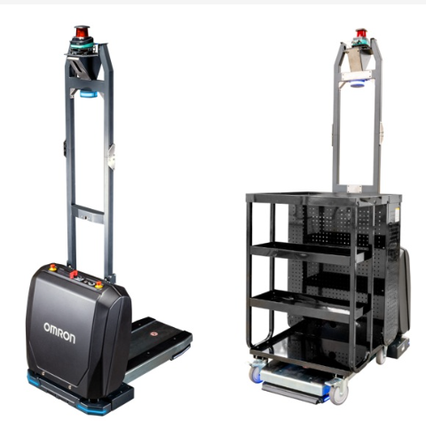　 

#### 製品概要

* 2026年4月発売
* 販売実績：2台（説明時点）
* 本体価格：約1,400万円
* システム込み：約2,000万円

#### 特徴

* 既存台車（車輪径125mm）をそのまま搬送可能
* 独自モーター4基搭載により横移動も対応
* 非接触充電方式採用

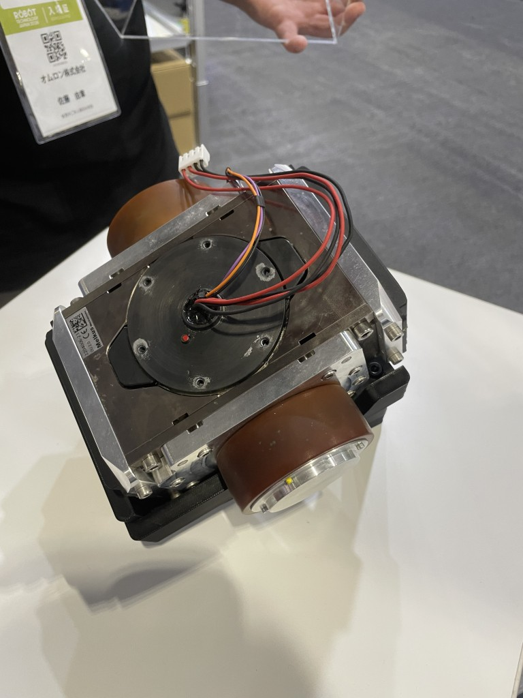 
▲横移動できるモーターの写真。

#### 安全・運用面

* 前方2基・後方1基のセンサー搭載
* 上昇時は後方センサー制限あり、補助としてバンパー装備
* オプションで3D LiDAR追加可能

#### 導入・設定

* マップ作成＋PC上で搬送ポイント設定
* 単純搬送であれば開梱後約2時間で稼働可能

#### 所感

既存設備を活用しながら導入できる設計思想が強く、日本市場に適した製品設計と感じた。価格競争ではなく、性能やサポートによる差別化も特徴的であった。

---

## 4. まとめ

今回の展示会では、ロボット技術の進化だけでなく、AIとの融合による操作性向上や自動化領域の拡大を実感した。  
特に、トヨタのバスケットボールAIロボットやファナックの音声認識ロボットでは、高度な制御技術やAI活用によって、  
従来より直感的で柔軟なロボット活用が進んでいることを感じた。

また、AMR分野では各社とも市場拡大を見据えている一方、日本では既存設備との親和性や導入ハードルの低さが重要視されていることを改めて認識した。  
特にオムロンの既存台車活用や、MiRから伺った市場状況は、日本市場特有の考え方を理解する上で参考になった。  

加えて、展示会全体を通して、海外では一般化しつつある技術であっても、日本では依然として先端技術として高い注目を集めていることを感じた。  
今回の見学では、技術動向だけでなく、市場環境やユーザーの受け止め方の違いについても理解を深めることができ、今後の製品検討や提案活動を考える上で有意義な機会となった。
 

---

## その他の気になった出展(奥村)

### 竹中電子工業 — NPN/PNP 出力変換ユニット（PN-7300 / NP-7398）

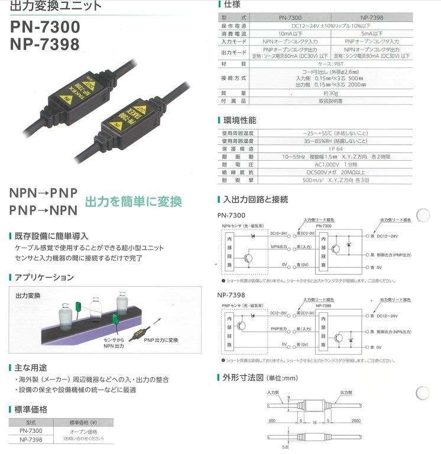 

NPN出力 ↔ PNP出力を互いに変換するコンパクトなユニット。リレーやトランジスタで代替可能だが、非常に小型で製品の省スペース化に有効。

---

### Doog — サウザー（人追従AMR）

 

人に追従する仕組みは**カメラではなく3D LiDAR**（Velodyne製と思われる）で実現。人を点群形状として認識している。

- LiDARはカメラより距離精度が高いが高価
- **パレットやワークの識別にも3D LiDARでトライしてみたい**
- 今後カメラとの価格競争が進むことを期待

---

### Fingervision — 触覚センサ内蔵グリッパ

 

### 展示の中で最も印象的だったグリッパ技術。**花びらを潰さずに把持**できるデモに驚かされた。

**動作原理：**

1. 透明な柔軟パッドに等間隔でドットをプリント
2. カメラでドットの移動と対象ワークとの位置関係を追跡
3. ワークが触れているか・滑っているかをリアルタイム判定
4. 滑らないギリギリの力でつかむ

| 項目 | 内容 |
|------|------|
| 力の検出方式 | 画像ベース（ひずみゲージ不使用） |
| 価格 | 50万円以上 |
| 将来性 | 画像で力を判断する新トレンドの先駆け |

太田廣ブースの類似製品と原理は近いが、**ひずみではなく画像で力を判断**するのが新しい潮流。高額ながら将来的に主流になる可能性あり。

---

### IAI — スライダー循環ユニット

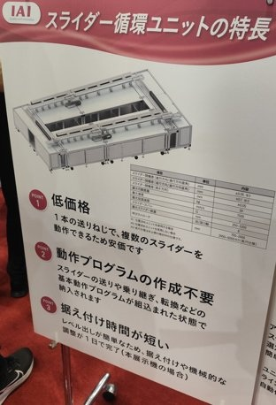 

> ⚠️ 噛み合い部の撮影禁止のため外観写真のみ（動作は動画参照）

1本の送りネジでステージを次工程に搬送する機構。ナット側が**半割れ形状**になっているため途中でネジから外れて移動できる。

**特長：**
- 低価格（1本の送りネジで複数スライダーを制御）
- 動作プログラムの作成不要（基本動作がプリセット）
- 据え付け時間が短い（1日で完了）

---

### YATOMIエンジニアリング — 5本指ハンド

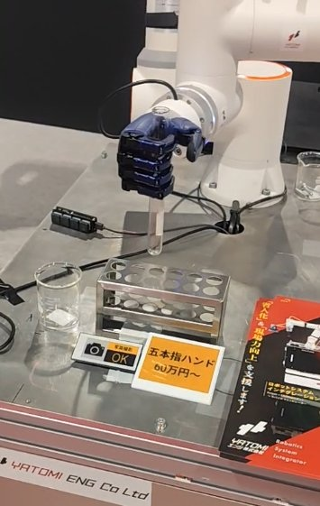 

5本指ハンドは数百万円するものが多いが、**60万円〜**と破格の価格設定。

---

### 物流ロボット（Airion）

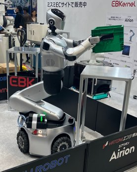
 

少し先の物流向け次世代製品の一例。AMR上にヒューマノイドアームを搭載した構成。

---

## まとめ・今後のアクション候補

| 技術 | 用途候補 | 優先度 |
|------|---------|--------|
| NSK アクティブキャスタ | 全方向AMRの駆動ユニット | 低 |
| NSK/Delta リニアアクチュエータ | ヒューマノイドアーム・昇降機構 | 低 |
| 椿本 ZIPチェーン | テーブル昇降装置 | 高 |
| マブチ Thumbelina | 製品内部の小型駆動装置 | 中 |
| Doog 3D LiDAR方式 | パレット・ワーク識別 | 高 |
| Fingervision | 柔軟物・精密把持 | 低（高額） |
