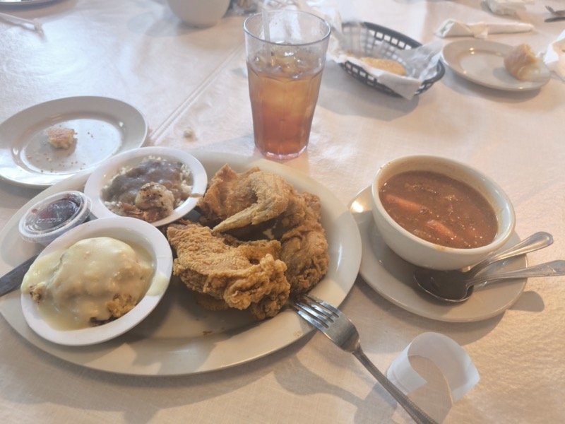

# BIC（Business Innovation Community）

## 基本情報

| 項目 | 内容 |
|---|---|
| 組織名 | BIC（Business Innovation Community） ※正式名称要確認 |
| 拠点 | 米国（アトランタ周辺？） |
| 接点 | MODEX 2026 会場内＋会食 |

BIC の田島さんとアメリカ人 3 名との会食。Ramon からアマゾンのテーブルリフト直接オファーの話が出た（MODEX 2026 4/14 夜）

## 概要

 

BIC ランチ（4/14）の卓上風景。丸テーブルを囲んで BIC メンバー全員が着席。ローストチキン・グリッツ・マッシュポテトが並ぶ、Southern ならではの食事（MODEX 2026）

MODEX 2026 に出展していた田島さん率いるチーム。アメリカ人3名を含むメンバー構成。
「皆、真面目で、気の良いメンバーである」（Nippou）。

## 重要情報

### テーブルリフト案件（アマゾン直接オファー）

- 若手エンジニアの Ramon（ラモーン）が、アマゾンから直接オファーを受けているテーブルリフトの話を打ち明けた
- 詳細は非公開段階だが、「非常に興味深い話である」（Nippou）
- 山崎が継続接触担当

## 活動内容

- MODEX 2026 に出展
- 4/14 夜：アトランタで会食（Southern fried chicken）
- 4/15 昼：BIC ランチ（Southern Root レストラン、フライドキャットフィッシュ）

 

4/15 BIC の田島さんチームとのランチ（Southern Root）。フライドチキン・グリッツ・野菜のプレートを囲みながら業界情報を交換（MODEX 2026）

## アクション

- Ramon との継続接触：テーブルリフトのアマゾン案件詳細確認、共同提案可能性を探る（担当：山崎）

## 未確認事項

- ［要確認：BIC とは何の略か・どのような組織・事業体か］

## 関連レポート

- [MODEX 2026 Report.md](../202604-MODEX/Report.md)
- [MODEX 2026 Nippou.txt](../202604-MODEX/Nippou.tt)

## 更新履歴

| 日付 | 内容 |
|---|---|
| 2026-07-02 | MODEX 2026 から初期作成 |
| 2026-07-03 | MODEX 写真を2枚追加（4/14 BICランチ・4/15 BICランチ）|
