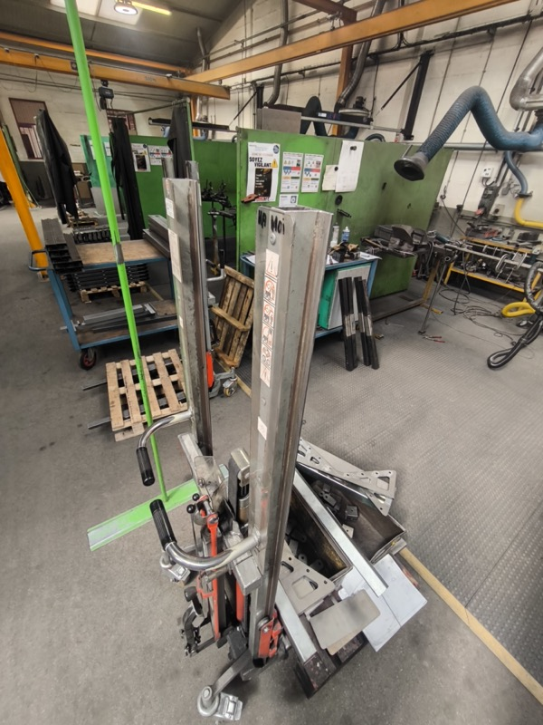

# MANUVIT SAS

**国・地域：** フランス・ノルマンディー La Ferté Macé
**設立：** 1981年
**売上：** 約10億円（日本円換算）
**従業員：** 非公開（CAD エンジニア 6〜7名確認）
**訪問日：** 2026年4月22〜23日（山崎・橋本GM）
**関係性：** 製品購入・輸入代理検討中

---

## 事業内容

昇降・マテハン機器メーカー。
**Variable Geometry（テコとギヤを使った変形機構）** を国際特許として持つ。
売上の **60%がカスタム改造対応**。

主要顧客：製薬・化学・航空宇宙・フランス軍・原子力発電所。

---

## コア技術

### Variable Geometry
テコとギヤを組み合わせた変形機構。ワーク形状・サイズに応じて接触形状を変える。
円筒形状の把持を得意とし、特殊ワーク対応の高いカスタム性を実現している。

### レーザー加工（導入中）
昨年、ベルギー製レーザー加工機とベンダーを購入。
5mm 以下はエアーのみで加工可能。従来のロシア製クランクプレスから置き換え中。

軸への縦方向ギヤ状インサートにより、溶接を代替する技術も持つ。

---

## 主要製品

| 製品 | 特徴 | 注目度 |
|---|---|:---:|
| デュアルシリンダー手動ポンプリフト | 2本シリンダー均等配分。軍・長尺物対応 | ★★★ |
| トラバース型昇降装置 | 幅可変。Variable Geometry の典型製品 | ★★★ |
| ギヤ式ハンドパレット型 | ギヤ駆動昇降。あっても良いラインナップ | ★★ |
| **60kg SFL 型** | **山崎が構想していた製品に近い。軽くデザイン良** | **★★★★★** |

 

60kg SFL 型スタッキングリフト。山崎が「これから開発したい」と構想していた製品に近い。軽量・デザイン良好。（2026年4月23日）

 

工場内デモ後の記念撮影。左から橋本GM・山崎・Pascal。背後に MANUVIT 300 装置。（2026年4月23日）

---

## 商談状況

- **橋本GM** が事前アプローチ済み。PB付きハンドパレットジャック＋KGL をサンプル購入してくれている。
- 「**中国製との違いは何か**」を真剣に問われた。カタログ説明では不十分。
- 担当：パスカル（年配・ベテラン）+ バティスタ（若手）。フランス人特有の超フランス訛り英語。

---

## アクション

| 担当 | 内容 |
|---|---|
| 橋本GM | スギヤス品の中国製対比データ（品質・耐久性・サポート実績）を整理 |
| 山崎 | MANUVIT 60kg SFL 型の輸入・OEM 可能性を技術部と検討 |
| 橋本GM | MANUVIT への次回提案資料作成 |

---

## 関連ファイル

- [MANUVIT 訪問レポート](../202604-MANUVIT/Report.md)
- [60kg SFL 輸入検討アイデア](../Ideas/MANUVIT_60kgSFL_Import.md)
