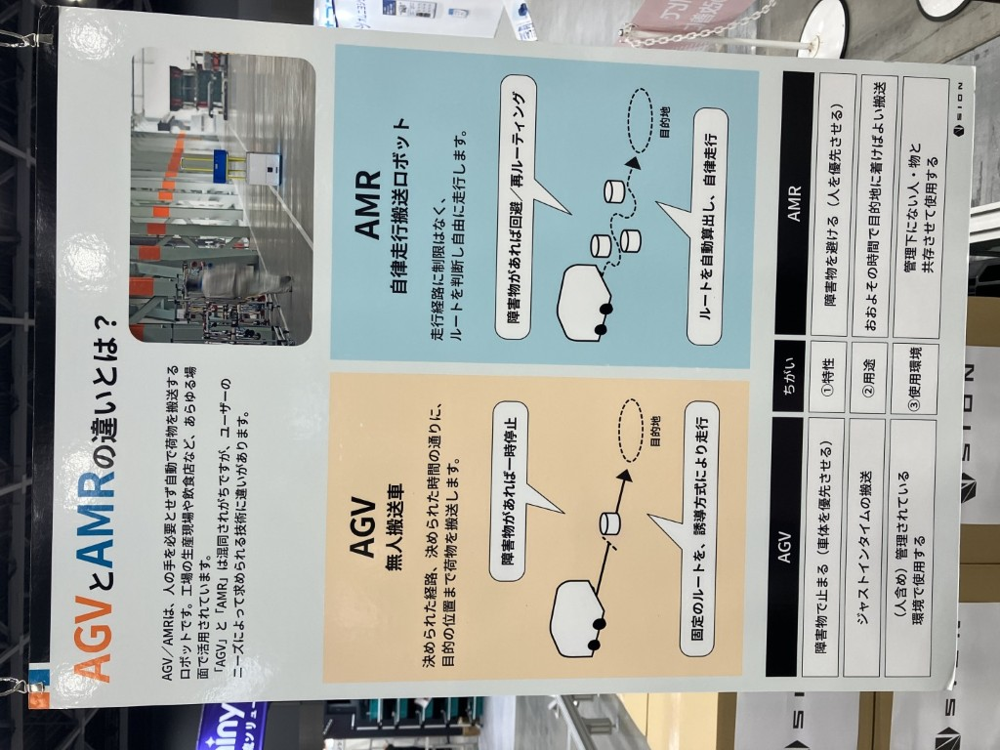
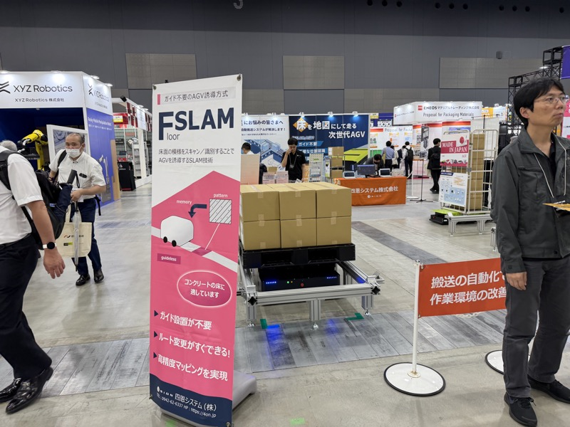
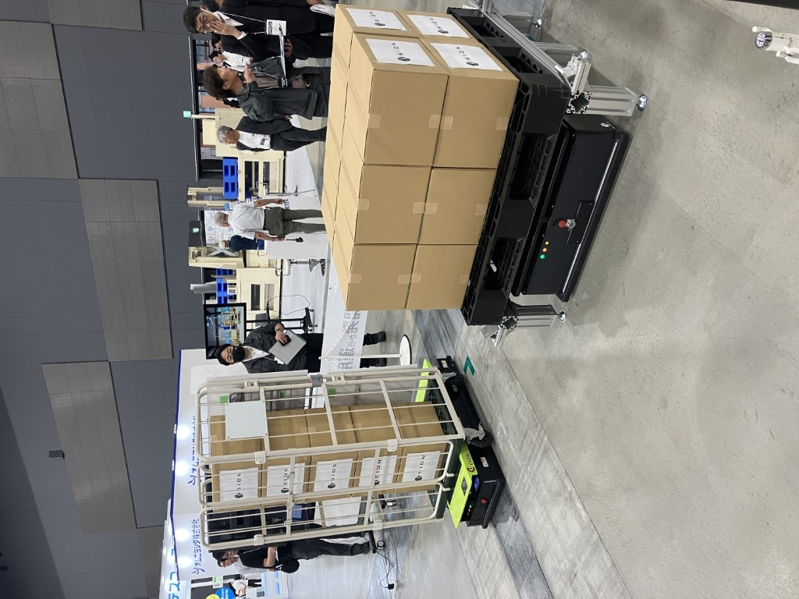

# 四恩システム

## 基本情報

| 項目 | 内容 |
|---|---|
| 企業名 | 四恩システム株式会社 |
| 所在地 | 福岡県久留米市 |
| 規模 | 設立15年・約40名 |
| 展示会 | 九州国際物流総合展 INNOVATION EXPO 2026（福岡マリンメッセ）|
| キャッチコピー | 「Floor SLAM」搭載 AGV |

 

四恩システムのAGV全景とFloor SLAM技術パネル。ガイド不要、ルート変更即対応が特徴。（INNOVATION EXPO 2026）

## 観察内容

 

四恩システム、AGV実機展示。Floor SLAM搭載で床面の傷・汚れを特徴点として自己位置推定。（INNOVATION EXPO 2026）

 

四恩システム「SION Floor SLAM」ブース。現在はスバルへ約30台導入済み。（INNOVATION EXPO 2026）

- **Floor SLAM**：床面の傷・汚れ・凹凸を特徴点として自己位置推定を行う独自方式
- 磁気テープ・QRコード不要。走行しながらマップを更新し、環境変化（傷・汚れ）にも追従
- スバルに約30台導入済み
- 創業社長（44歳）と山崎部長が面談。「AMRなどやる計画は微塵もなかった」と語る
- 東京にも活動拠点があり、改めて面談の約束を交わした

## 技術領域

- AGV / AMR（自己位置推定）
- Floor SLAM（特許・独自技術）
- ヨーロッパ発の誘導技術を国内メーカーが製品化

## スギヤスへの示唆

- ABMシリーズへの誘導方式追加オプションとして**技術提携の可能性**
- フロア認識部分の技術ライセンス・共同開発の余地あり
- 磁気テープ・QRコード・Floor SLAM を選択できる構成は、農場・古い工場・リフォーム物件などへの展開力を高める
- 九州の中小メーカー（40名）がヨーロッパ発最先端技術を製品化している事実そのものが、スギヤス自身へのメッセージ

## アクション候補

- 山崎部長と創業社長の再面談（東京）
- ABM誘導方式拡張の技術評価（技術部）
- Floor SLAM の特許・ライセンス条件の把握

## 関連情報

- [INNOVATION EXPO 2026 Report.md](../202606-InnovationEXPO/Report.md)
- [Knowledge/AMR/FloorSLAM.md](../Knowledge/AMR/FloorSLAM.md)

## 更新履歴

| 日付 | 内容 |
|---|---|
| 2026-07-03 | INNOVATION EXPO 2026 から初期作成 |
