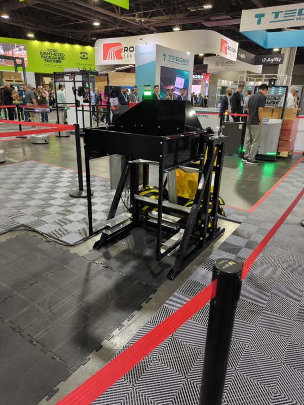
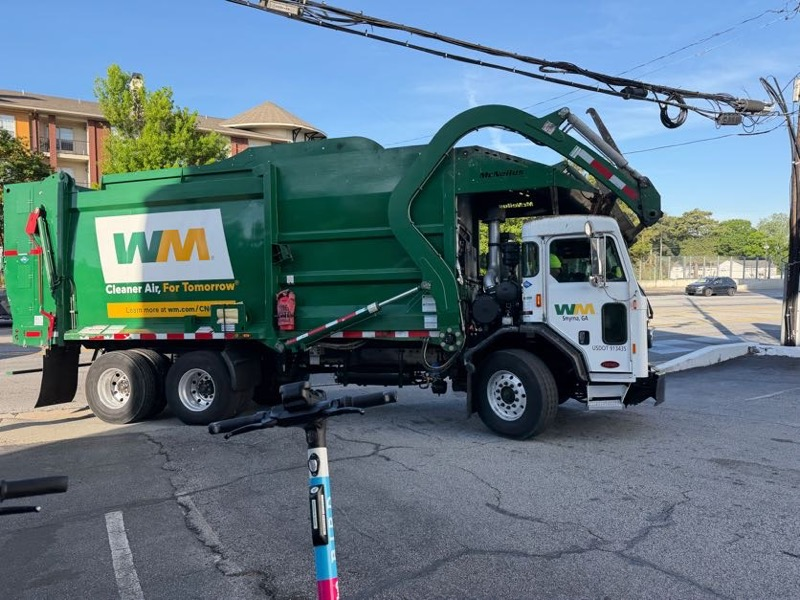
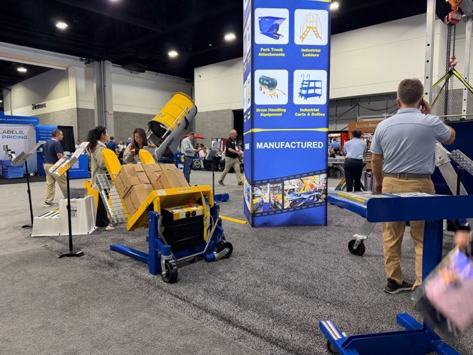

# DR 自動搬送システム（ゴミ箱反転搬送の応用）

## アイデア概要

「大きなゴミ箱を自動搬送して、別置き反転機で空にする」システムの DR（ダストリムーバー系）への応用。
MODEX 2026 で観察したゴミ箱自動搬送デモと、アトランタ市内で目にした WM 社パッカー車の実例が、このアイデアの着想源。

ゴミ箱（大型コンテナ）を傾斜・反転してコンベアに流す自動搬送デモ。DR 自動搬送システムのアイデアの直接の着想源（MODEX 2026）

## 背景

 

会場へ向かう途中のアトランタ市内で遭遇した WM（Waste Management）の大型パッカー車。後部に油圧式リフト＆反転機構が搭載されており、ゴミ箱を自動で持ち上げ荷台へ投入する。「ゴミ箱を自動搬送して反転機で空にする」というアイデアの現実版（MODEX 2026 視察時）

 

MODEX 会場内での傾斜・反転コンベア自動搬送デモ。コンテナを傾斜させてコンベアに流す機構。DR 自動搬送システムの直接の着想源（MODEX 2026）

- MODEX 2026 のデモ：大型コンテナ（ゴミ箱）を傾斜・反転してコンベアに流す自動搬送デモを視察
- アトランタ市内：WM（Waste Management）社の大型パッカー車が「ゴミ箱を自動で持ち上げ、反転させ、荷台へ投入」する現場を目撃
- Nippou：「前々から DR こそ自動搬送すべきと思っていたところ、この方法なら面白いカタチで実現できそうである」

## 想定製品・用途

- DR（ダストリムーバー？）を購入している会社すべてが見込み客
- AGV / AMR / DR / HTR 技術の融合で全くのオリジナルシステムを構築できる可能性

## 技術的アプローチ

- AGV または AMR でゴミ箱を自律搬送
- 所定の位置に到着後、反転機構でコンテナを空にする
- コンベアやコンパクターへの接続を想定

## 技術課題

- 反転機構の設計（油圧 or 電動）
- コンテナの多様なサイズ・形状への対応
- 安全性（反転時の飛散防止）
- AGV との連携プロトコル

## 次のアクション

- 技術部での実現可能性検討
- DR 購入顧客リストとの照合（見込み客数を把握）
- AGV/AMR/HTR 各技術部門との合同検討

## 担当

- Nippou 記述：技術部への提案候補

## 関連情報

- [MODEX 2026 Nippou.txt](../202604-MODEX/Nippou.tt)
- [MODEX 2026 Report.md](../202604-MODEX/Report.md)
- [Knowledge/Logistics/TrailerLoading_Automation.md](../Knowledge/Logistics/TrailerLoading_Automation.md)

## 更新履歴

| 日付 | 内容 |
|---|---|
| 2026-07-02 | MODEX 2026 から初期作成 |
| 2026-07-03 | MODEX 写真を2枚追加（WMパッカー車・傾斜反転コンベアデモ）|
