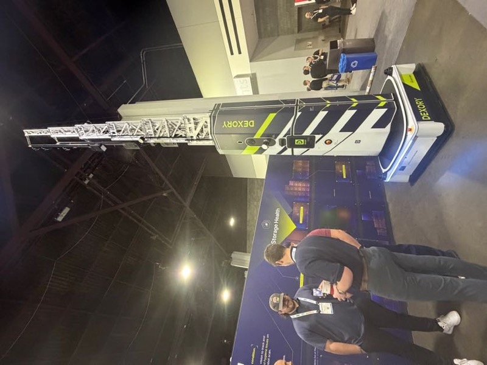
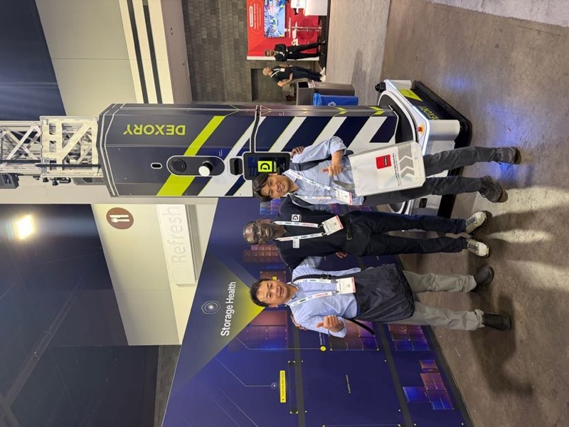

# DEXORY

## 基本情報

| 項目 | 内容 |
|---|---|
| 企業名 | DEXORY |
| 国 | 英国 |
| 展示会 | MODEX 2026（アトランタ）|
| キャッチコピー | 「Storage Health」|

DEXORY（英国）の在庫スキャンロボット。高さ 8m 超のマストを搭載し、走りながら棚全体の「Storage Health」をスキャンする（MODEX 2026）

## 観察内容

 

DEXORY（英国）ブースにて担当者（中央）と記念撮影。山崎・橋本 GM と。英国スタートアップながら MODEX で確かな存在感を発揮していた（MODEX 2026）

- 高さ 8m 超のマストを搭載した在庫スキャンロボット
- 走行しながら棚全体の在庫状況（Storage Health）をスキャン
- デジタルツインとの連携が売り
- 山崎・橋本 GM と担当者の3ショット写真あり
- 英国スタートアップながら MODEX で存在感を発揮

## 技術領域

- 自律在庫スキャンロボット
- デジタルツイン連携
- WMS データ取得の自動化

## スギヤスへの示唆

- 棚の「Storage Health」を可視化する発想は在庫管理の次世代アプローチ
- 高層棚と組み合わせた在庫可視化の需要が増加する可能性
- 直接の製品競合はないが、顧客提案のコンテキストとして参考になる

## 関連レポート

- [MODEX 2026 Report.md](../../Reports/202604-MODEX/Report.md)

## 更新履歴

| 日付 | 内容 |
|---|---|
| 2026-07-02 | MODEX 2026 から初期作成 |
| 2026-07-03 | MODEX 写真を1枚追加（担当者との記念撮影）|
