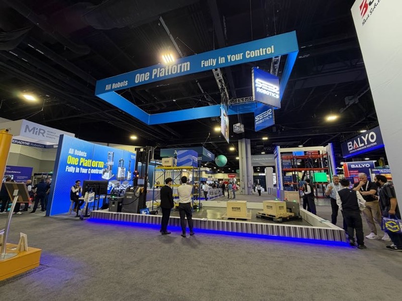

# SEER Robotics（仙工机器人）

## 基本情報

| 項目 | 内容 |
|---|---|
| 企業名 | SEER Robotics（仙工机器人） |
| 国 | 中国 |
| 展示会 | MODEX 2026（アトランタ）|
| ブースキャッチコピー | 「All Robots. One Platform. Fully in Your Control.」|

SEER Robotics（中国）の大型ブース。「All Robots. One Platform. Fully in Your Control.」— DMP 名義で名刺交換済み（MODEX 2026）

## 観察内容

- 大型ブースで出展
- AMR・AGV の全カテゴリをひとつのプラットフォームで統合管理するアーキテクチャを訴求
- 展示内容はおとなしめ（積極的な動くデモよりも説明系）
- 山崎が DMP 名義で名刺交換済み
- Nippou：「出展内容はおとなしめであり、好感を持てた」

## 技術領域

- AMR / AGV 統合プラットフォーム
- フリートマネジメント（全ロボット一元管理）

## スギヤスとの関連可能性

- DMP（ダイフク-スギヤスの共同事業？）名義で接触済みの重要相手
- 情報交換・連携の継続価値が高い
- 次のステップ：接触背景の確認、共同提案の可能性探索

## アクション（Nippou 記述）

- 山崎が継続的に情報交換継続担当

## 関連レポート

- [MODEX 2026 Report.md](../../Reports/202604-MODEX/Report.md)

## 更新履歴

| 日付 | 内容 |
|---|---|
| 2026-07-02 | MODEX 2026 から初期作成 |
