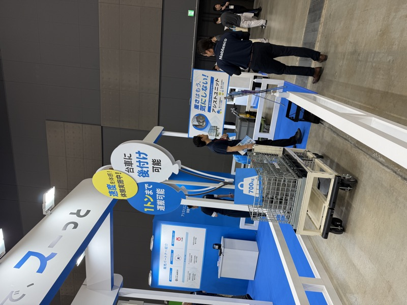
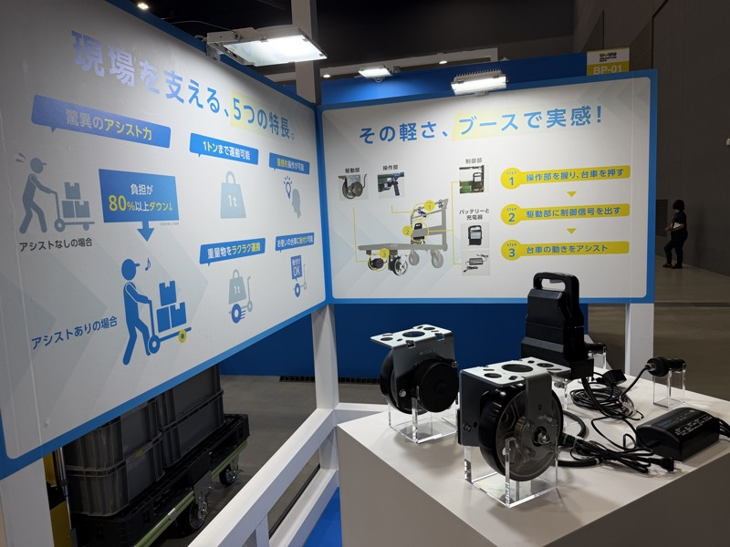

# ナブテスコ

## 基本情報

| 項目 | 内容 |
|---|---|
| 企業名 | ナブテスコ株式会社 |
| 国 | 日本 |
| 展示会 | 九州国際物流総合展 INNOVATION EXPO 2026（福岡マリンメッセ）|
| 展示品 | アシストユニット（電動アシスト）|

 

ナブテスコ アシストユニット。負荷80%以上ダウン、1トンまで対応。自社台車に後付けで電動アシストを追加できる。（INNOVATION EXPO 2026）

## 観察内容

- **アシストユニット**：自社台車に後付けで電動アシストを追加するモジュール
- 負荷を80%以上削減、最大1トン対応
- ユーザープライス：約70万円（取り付け工賃別）
- 自動車メーカーで爆発的に売れているとのこと（ユーエイ社談）
- 腰痛労災対策の文脈で引き合いが増加
- ユーエイ・タイユーがコラボ展示
- BSローレンやIDECのフランスメーカー製品と同系統
- 「自社の台車に取り付けられる」が最大の訴求点

## 競合比較

| メーカー | 製品 | 特徴 |
|---|---|---|
| ナブテスコ | アシストユニット | 後付け型。自動車メーカーに急拡大 |
| BSローレン | ドライブユニット | ユーザーが自社台車に取り付け |
| IDEC（フランス製） | ドライブユニット | 同系統。仏メーカー |
| スギヤス IMS（予定） | 牽引車 | 6トン能力。工賃込みの価格競争力あり |

## スギヤスへの示唆

- ナブテスコの70万円（取付工賃別）vs スギヤス IMS の「牽引車」という構造比較
- 牽引車は「牽引部分だけ工夫すれば良い」メリット → ユーザーの取り付け不要
- 自動車業界の腰痛対策需要は確実に強い。同じ訴求軸で IMS を提案できる
- 能力差（ナブテスコ1t vs IMS 6t）を活かした差別化が有効

## 関連情報

- [INNOVATION EXPO 2026 Report.md](../../Reports/202606-InnovationEXPO/Report.md)

## 更新履歴

| 日付 | 内容 |
|---|---|
| 2026-07-03 | INNOVATION EXPO 2026 から初期作成 |
