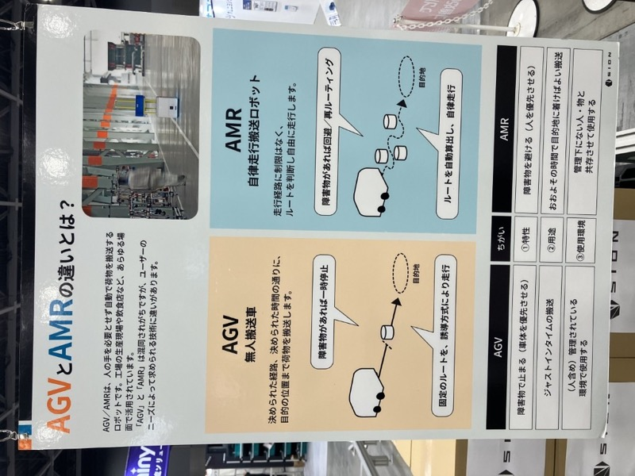
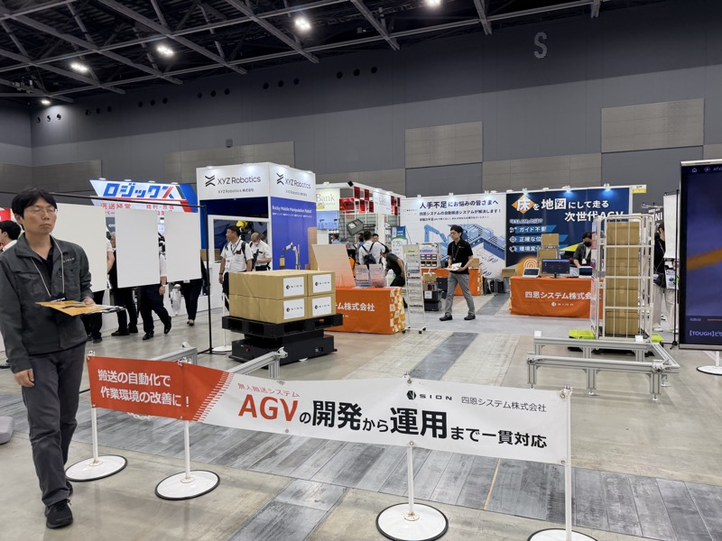
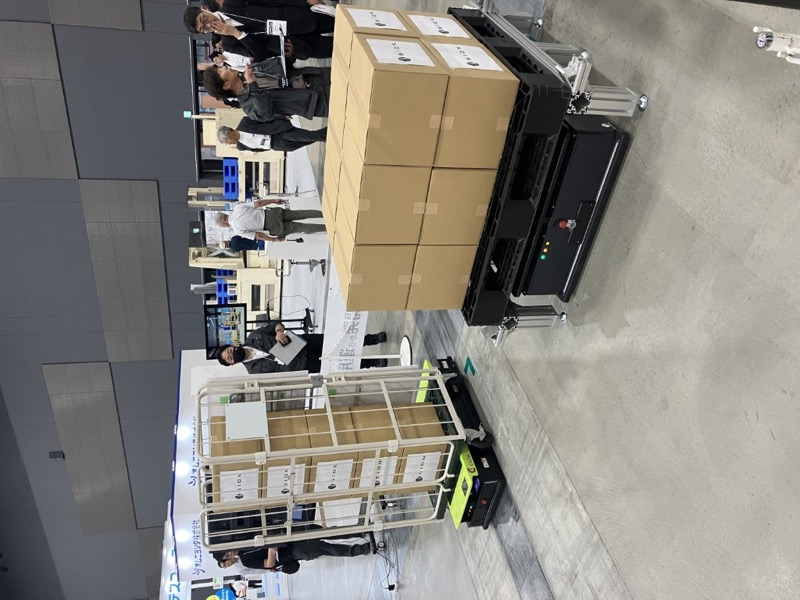

# ABMシリーズへの Floor SLAM 誘導方式追加

## アイデア概要

ABMシリーズ（スギヤスのAGV）に、四恩システムの Floor SLAM 方式を誘導オプションとして追加する。
磁気テープ・QRコードに加え、Floor SLAM を選択肢として持つことで、インフラ改修ができない現場への対応力が増す。

 

四恩システムのAGV全景とFloor SLAM技術パネル。磁気テープ・QRコード不要の誘導方式。（INNOVATION EXPO 2026）

## 背景

 

左：四恩システム AGV 実機（スバルに30台導入）。右：Floor SLAM AGV 実機。床面の傷・模様を特徴点として自律走行。（INNOVATION EXPO 2026）

- 四恩システム（久留米）は Floor SLAM 方式の AGV をスバルに約30台導入済み
- ヨーロッパ発の技術を国内で製品化した、九州の40名規模の地場メーカー
- 山崎部長が創業社長（44歳）と意見交換。東京での再面談を約束
- 前川TLも「複数の誘導方式を選択できれば、お客様への提案の幅がさらに広がる可能性」と指摘

## 提案内容

| オプション | 方式 | 対象環境 |
|---|---|---|
| 標準 | ビニールテープ | 新設・改修済み工場 |
| オプション A | QRコード | WMS連携・棚搬送 |
| オプション B（新） | Floor SLAM | 旧設備・農場・インフラ改修困難な現場 |

## 技術課題

- 四恩システムとの技術提携・ライセンス条件の確認
- ABMのモーター制御と Floor SLAM ソフトウェアの統合
- 床面条件の整理（フローリング・コンクリート・タイル等）

## 次のアクション

- 山崎部長 × 四恩システム社長の再面談（東京予定）
- Floor SLAM の特許状況・ライセンス条件の把握
- 技術部での Floor SLAM 誘導方式の評価実験

## 担当

- 山崎部長 → 四恩システムとの交渉窓口

## 関連情報

- [Companies/四恩システム.md](../Companies/四恩システム.md)
- [Knowledge/AMR/FloorSLAM.md](../Knowledge/AMR/FloorSLAM.md)
- [INNOVATION EXPO 2026 Report.md](../../Reports/202606-InnovationEXPO/Report.md)

## 更新履歴

| 日付 | 内容 |
|---|---|
| 2026-07-03 | INNOVATION EXPO 2026 から初期作成 |
