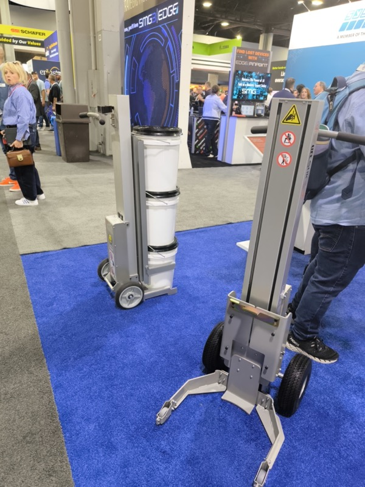

# パレット段積み装置の国内市場投入

## アイデア概要

MODEX 2026 で観察したパレット段積み装置（ガスダンパー使用）のコンセプトを、国内市場向けに製品化・販売する。

SMG3 EDGE エリアで目にした小型電動バーチカルリフター（ポスト型）。パレット搬送の垂直化・自動化という発想が共通する（MODEX 2026）

## 背景

- Nippou：「直角水平のガスダンパーを使った手動の動き。直角状態で 7 枚までの木製パレットを適当に積んで、ガイドによって揃い、水平状態にすると、傾斜でコンベアに流れていく」
- ロジマット（欧州展示会）でも異なるコンセプトでパレット整理整頓する装置を目撃済み
- Nippou：「日本ではこれまであまり売れていない印象はあるものの、そろそろ日本市場も機が熟すころではなかろうか」

## 想定製品・用途

- 木製パレットの整列・段積みを自動化または半自動化
- コンベアへの接続を前提とした設計
- 倉庫・物流センターの作業効率化

## 市場状況

- 日本市場では過去にあまり売れなかったカテゴリ
- 2026 年時点では「機が熟す頃」という直感（Nippou）
- 物流の人手不足が進む中で需要が高まる可能性

## 技術課題

- 出展社名が不明（写真から特定できず）→ 要調査
- ガスダンパー方式の特許状況
- 木製パレットの多様なサイズ・状態への対応

## 次のアクション

- 出展社名の調査（MODEX 2026 出展社リストから絞り込み）
- 国内顧客へのニーズヒアリング
- 技術部での実現可能性検討

## 関連情報

- [MODEX 2026 Nippou.txt](../../Reports/202604-MODEX/Nippou.tt)

## 未確認事項

- ［要確認：パレット段積み装置（ガスダンパー使用）の出展社名——写真から特定不能］

## 更新履歴

| 日付 | 内容 |
|---|---|
| 2026-07-02 | MODEX 2026 から初期作成 |
