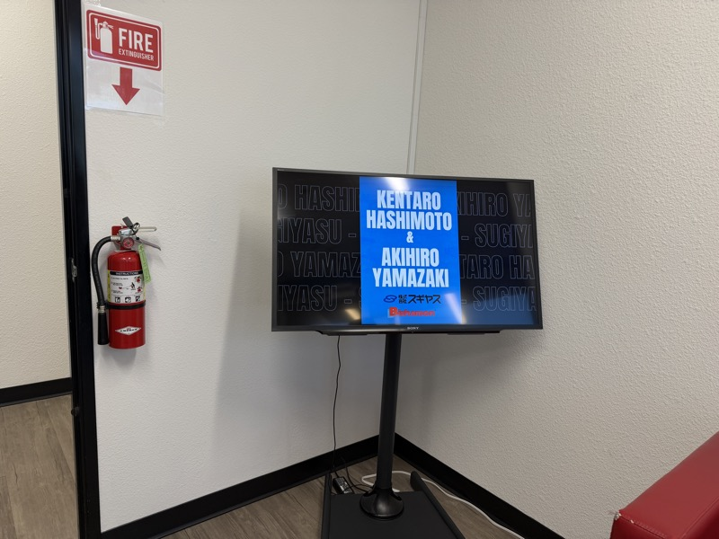
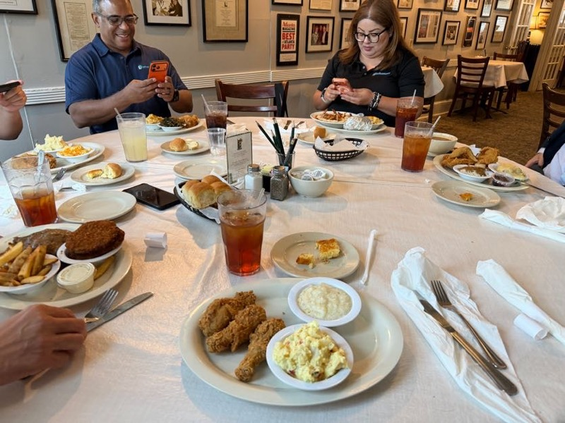
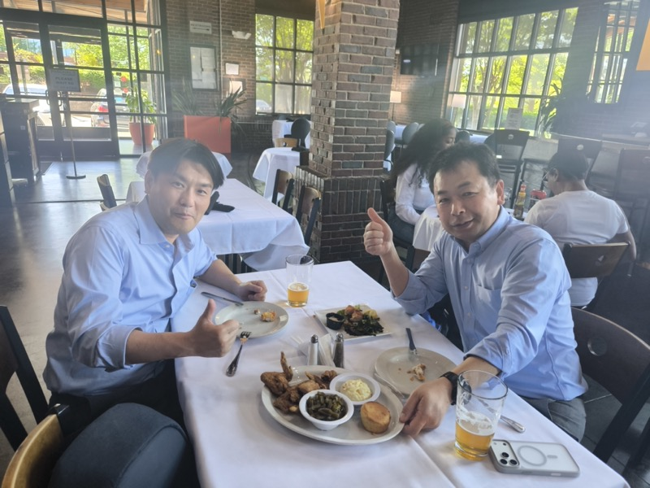
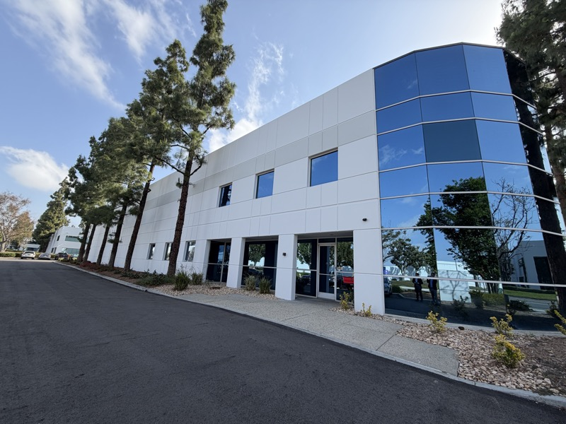
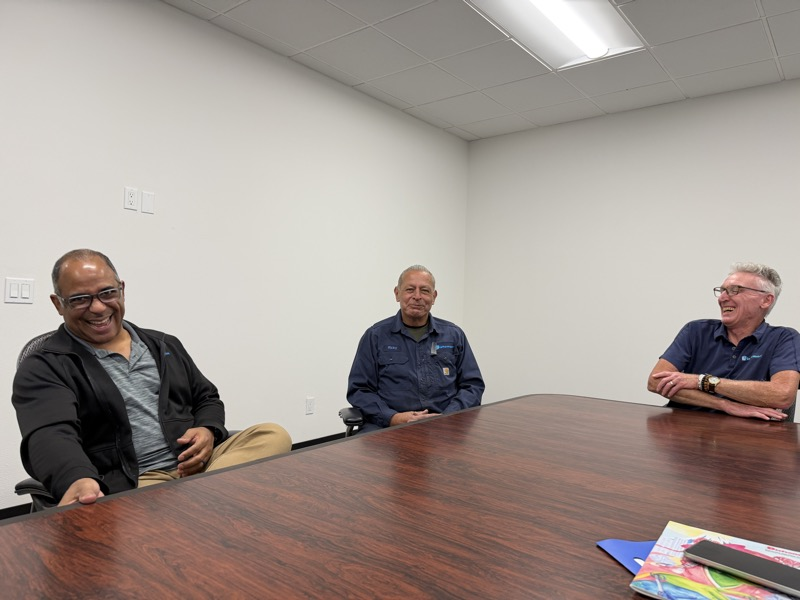
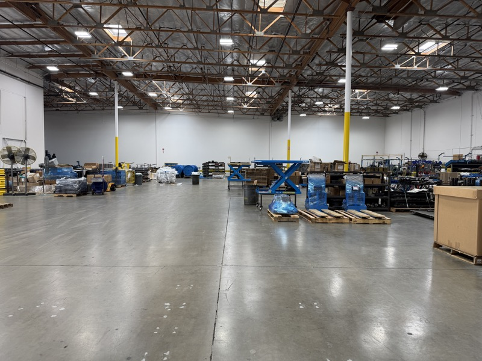
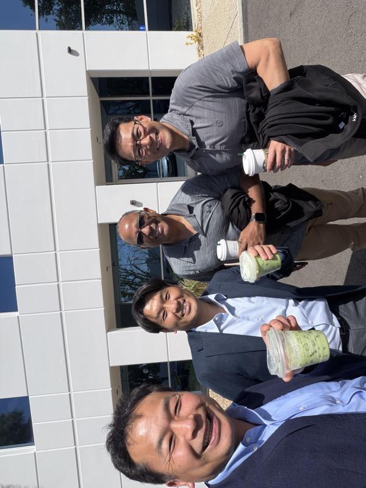

# Bishamon Industries Corporation（BIC）

> 作成日：2026-07-02　最終更新日：2026-07-10

## 基本情報

| 項目 | 内容 |
|---|---|
| 組織名 | Bishamon Industries Corporation（BIC） |
| 拠点 | Ontario, CA（カリフォルニア州） |
| 創業 | 1986年（約40年の歴史） |
| 事業 | リフトテーブル・パレットポジショナー製造 |
| 人員 | 約20名 |
| ブランド | Bishamon（毘沙門天に由来。日米でリフト業界に認知） |
| 接点 | MODEX 2026（Atlanta・4/13〜15）+ 本社工場訪問（Ontario CA・4/17） |

BIC 本社エントランスの歓迎メッセージ。"KENTARO HASHIMOTO & AKIHIRO YAMAZAKI / Sugiyasu / Bishamon" と表示。Bishamon ブランドとの繋がりが既に明示されている（2026年4月17日）

---

## MODEX 2026 での接触（4月14〜15日・Atlanta）

BIC の田島さんとアメリカ人 3 名との会食。Ramon からアマゾンのテーブルリフト直接オファーの話が出た（MODEX 2026 4/14 夜）

MODEX 2026 に出展していた田島さん率いるチーム。アメリカ人3名を含むメンバー構成。
「皆、真面目で、気の良いメンバーである」（Nippou）。

BIC ランチ（4/14）の卓上風景。丸テーブルを囲んで BIC メンバー全員が着席。ローストチキン・グリッツ・マッシュポテトが並ぶ Southern ならではの食事（<a href="../../Reports/202604-MODEX/Report.md">MODEX 2026 Report.md</a>）

4/15 BIC の田島さんチームとのランチ（Southern Root）。フライドチキン・グリッツ・野菜のプレートを囲みながら業界情報を交換（<a href="../../Reports/202604-MODEX/Report.md">MODEX 2026 Report.md</a>）

### MODEX でのキー情報

- 若手エンジニアの Ramon（ラモーン）が、Amazon から直接オファーを受けているテーブルリフト案件を打ち明けた
- 詳細は非公開段階。「非常に興味深い話である」（Nippou）

### Bishamon ブース展示品（[MODEX 2026 Report.md](../../Reports/202604-MODEX/Report.md)）

Bishamonブース全景。Duravant社の大型ブースと同エリアに出展（MODEX 2026 / 2026年4月15日）

- 油圧ハンドパレットジャッキ（ピストン式）
- Alphaシリーズ電動テーブルリフト「L66K」（6,600lb／約3トン対応、モジュール設計）
- 旋回式（ターンテーブル型）リフトテーブル（ヒンジ式メンテナンスバーで保守性を訴求）
- 40年の歴史を持つブランドながら、製品ラインアップ自体は油圧・電動テーブルリフト・ターンテーブルと手堅い構成。スギヤスの技術力・生産力を掛け合わせる余地は大きい

---

## BIC 本社・工場訪問（4月17日・Ontario, CA）

BIC 本社外観（Ontario, CA）。1986年創業。40年以上にわたり Bishamon ブランドのリフトテーブルを製造し続けている（2026年4月17日）

### スタッフ

| 名前 | 役職・属性 | 印象 |
|---|---|---|
| 安岡 社長 | CEO | 元銀行マン。落ち着いた人柄。「良い人」（Nippou） |
| フリオ（Julio） | VP・26歳 | IT担当。若手ながら VP 職 |
| エリー（Ellie） | 営業 | スペイン語話者 |
| スティーブ（Steve） | スタッフ・35歳 | 詳細不明 |
| ラモーン（Ramon） | エンジニア・1年目 | テーブルリフト開発担当。唯一のエンジニア |
| 田島 | 営業 | 唯一の専任営業担当 |

BIC 会議室でのミーティング。フリオ VP・現場ベテランスタッフ・スティーブが同席（2026年4月17日）

### 工場

BIC の製造・倉庫フロア。Bishamon ブランドのシザーリフトが複数台並ぶ。工場の設備状態は「お世辞にも良いとは言えない」（山崎）（2026年4月17日）

工場の設備状態は「お世辞にも良いとは言えない」（山崎）。
それでも Bishamon ブランドは40年の歴史を持ち、Amazon・Walmart・Tesla から直接引き合いがある。

### 受注状況と構造的課題

- Amazon・Walmart・Tesla など大手から直接引き合いがある
- 約20名という人員規模から、すべての大手案件をリソース不足で断っている
- 過去に Chrysler との大型案件実績あり
- 専任営業は田島さん1名・エンジニアはラモーン1名

BIC 本社前での集合写真。スギヤス2名・BIC側メンバー2名。別れ際の記念撮影（2026年4月17日）

---

## 戦略的評価

「Bishamon ブランド ＋ スギヤス技術力」という組み合わせに大きな可能性がある。

- **ブランドは本物**：40年の歴史・Amazon・Walmart・Tesla が自ら接触してくるレベル
- **リソースは薄い**：20名・エンジニア1名・専任営業1名で全大手案件を断っている
- **協業の余地**：スギヤスの技術・生産力で BIC が断っている案件を一緒に取りに行ける
- **橋本 GM 「複数代理店化案」**：スギヤスが北米代理店となり Bishamon ブランド製品を拡販する方向性

---

## アクション

- ラモーン（BIC エンジニア）との継続接触：Amazon テーブルリフト案件の詳細確認・共同提案可能性（担当：山崎）
- 橋本GM「複数代理店化」のスキーム具体化
- BIC との新商品共同開発・情報共有スキームの検討（窓口：田島さん → 安岡社長）

---

## 関連レポート

- [BIC 訪問・エンジェルス観戦 Report.md](../../Reports/202604-BIC/Report.md)
- [MODEX 2026 Report.md](../../Reports/202604-MODEX/Report.md)

## 関連アイデア

- [BIC 協業による北米展開](../Ideas/BIC_NorthAmerica_Collaboration.md)

---

## 更新履歴

| 日付 | 内容 |
|---|---|
| 2026-07-02 | MODEX 2026 から初期作成 |
| 2026-07-03 | MODEX 写真を2枚追加（4/14 BICランチ・4/15 BICランチ）|
| 2026-07-06 | BIC本社工場訪問（4/17）内容を追記。正式社名 Bishamon Industries Corporation に確定。スタッフ情報・戦略的評価・工場写真を追加 |
| 2026-07-08 | MODEX 2026 Bishamonブースの展示製品ラインアップ（パレットジャッキ・Alphaシリーズ電動リフト・ターンテーブル）を追記 |
