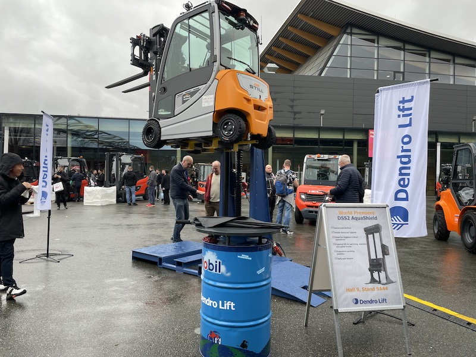
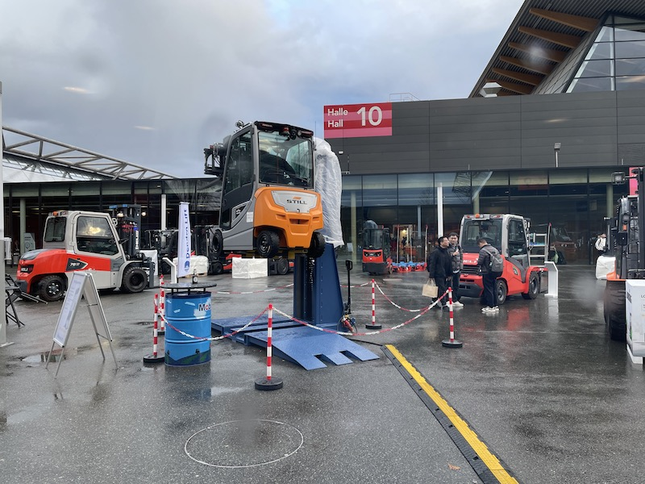

# Dendro Lift（Dendro Lift AB）

## 基本情報

| 項目 | 内容 |
|---|---|
| 企業名 | Dendro Lift AB |
| 国 | スウェーデン |
| 展示会 | LogiMAT 2025（シュトゥットガルト）|
| キーワード | 移動型スタッカー整備リフト・小型フォークリフト対応・防水（AquaShield）|

Dendro Lift「DSS2 AquaShield」のワールドプレミア展示。STILLフォークリフトを移動型整備リフトで高々と持ち上げてデモ。雨天対応の「AquaShield」仕様が特長（<a href="../../Reports/202503-LogiMat/Report.md">LogiMAT 2025 Report.md</a>）

## 観察内容

 

LogiMAT会場10番ホール前の屋外展示エリア（雨天）。STILL、Linde等のフォークリフトが雨の中でも稼働する中、Dendro Liftが整備リフトデモを実施（<a href="../../Reports/202503-LogiMat/Report.md">LogiMAT 2025 Report.md</a>）

- 雨天の屋外展示エリア（10番ホール前）で、STILLブランドのフォークリフトを移動型整備リフト「DSS2 AquaShield」で高々と持ち上げるデモンストレーションを実施。当社の製品開発視点から非常に参考になった
- 「DSS2 AquaShield」はこの LogiMAT でのワールドプレミア展示だった
- Web検索により、DSS2はスタッカー（フォークリフト）を持ち上げてエンジン・バッテリー・ブレーキ・足回りへのアクセスを容易にする移動型整備リフトと判明。最大2,500kgのトラックに対応し、Premium仕様は揚高1800mm。AquaShieldはIP69K対応の防水仕様（亜鉛メッキ）で、食品工場や水濡れ環境向け（出典：dendrolift.com）
- LogiMATにはSTILL社と共同出展する形でブースを構えている（出典：dendrolift.com ニュース記事）

［要確認：LogiMATブースで実際に山崎・中川・橋本GMが担当者と会話・名刺交換したかどうかは日報未記載。写真のみでの確認］

## 技術領域

- 移動型スタッカー・フォークリフト整備リフト
- 防水・耐候（IP69K）設計

## スギヤスとの関連可能性

- 黒野部長がL&Fからオファーを受けている移動型整備リフト案件（[雷電タイプ 移動型整備リフト](../Ideas/RaidenLift_MobileServiceLift.md)参照）の世界標準仕様の一つ
- 「小型フォークリフトを移動型リフトで持ち上げる」という基本構造、および雨天・屋外対応の設計思想が雷電タイプの参考になる

## アクション

- 次回接触時に、価格帯・OEM/代理店条件を確認
- 雷電タイプ企画（黒野部長のL&Fオファー案件）との仕様比較を実施

## 関連レポート

- [LogiMAT 2025 Report.md](../../Reports/202503-LogiMat/Report.md)

## 関連リンク

- [Dendro Lift AB（公式サイト）](https://dendrolift.com/en/)
- [DSS2 製品ページ](https://dendrolift.com/en/produkt/dss2/)

## 更新履歴

| 日付 | 内容 |
|---|---|
| 2026-07-10 | LogiMAT 2025 の写真とWeb検索結果から新規作成 |
