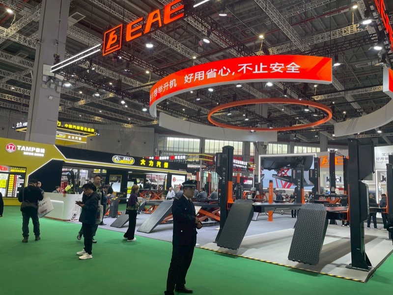
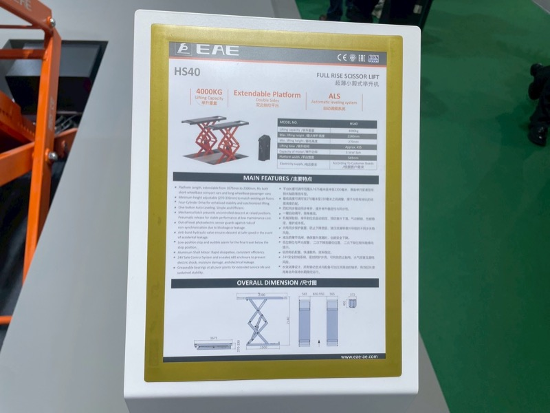
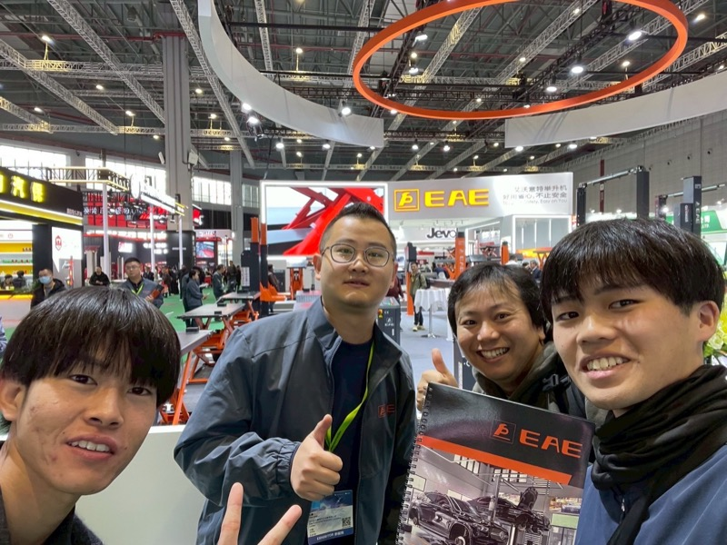

# EAE（艾沃意特举升机）

> 作成日：2026-07-16　最終更新日：2026-07-16

**国・地域：** 中国
**展示会：** Automechanika Shanghai 2025（2025年11月）
**関係性：** カタログ入手済み。電子的同調・重量計測技術の観察対象

---

## 観察内容

EAEは無線移動柱リフト・シザーリフト・4柱ドライブオンリフトを幅広く展開する中国メーカー。ブランドスローガンは「好用省心，不止安全（使いやすく安心、安全だけじゃない）」。

 

EAEの移動柱リフト制御盤。「群組模式（グループモード）」で最大7台以上をリンクし、位置（mm）・荷重（kg）をリアルタイム表示する。RFIDキーでのログインも備える。（2025年11月28日）

 

（左）大型4柱ドライブオンリフト。（右）「HS40 Full Rise Scissor Lift」仕様書。能力4000KG、自動レベリング機構を謳う。（2025年11月27〜28日）

 

EAEブースにて。淵田・水野・廣田GMがカタログを受け取った。（2025年11月28日）

## 技術領域

- 移動式2柱リフトの無線グループ同調（複数台を電気的にリンクし、位置・荷重を一元管理）
- 大型4柱ドライブオンリフト
- フルライズ・シザーリフト（自動レベリング機構付き）

## スギヤスとの関連可能性

- 群組モード（グループ同調＋荷重表示）は、スギヤスのFRZ構想（左右独立で動く同調機構）の実現形として直接参考になる
- 実際の荷重表示（1115KG）は、電子的な重量計測が実用段階にあることを裏付ける具体的な証拠

## 関連ファイル

- [Automechanika Shanghai 2025 訪問レポート](../../Reports/202511-Automechanika-Shanghai/Report.md)
