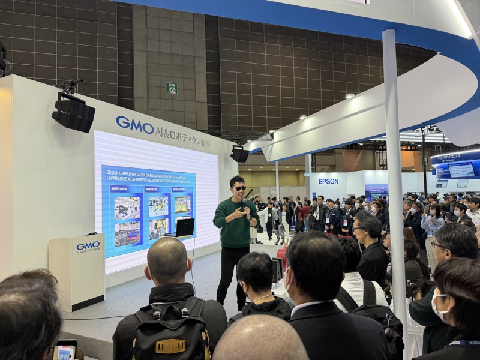

# GMO AI&ロボティクス商事

> 作成日：2026-07-09　最終更新日：2026-07-09

## 基本情報

| 項目 | 内容 |
|---|---|
| 企業名 | GMO AI&ロボティクス商事（GMOグループ） |
| 国 | 日本（中国製ロボットの国内販売代理店ポジション） |
| 展示会 | iREX2025（2025国際ロボット展、東京ビッグサイト）|
| 特記 | 会場で最も人を集めていたブース |

 

GMO AI&ロボティクス商事ブース。2台の中国製ヒューマノイドがステージに立つ。スクリーンには「AI×ロボティクスは人類史上最大の産業革命」（iREX2025）

## 観察内容

- 会場で最も人を集めていたブース。ステージに2台の中国製ヒューマノイドが静止し、「インターネット革命の前半戦（インフラ・EC）」と「後半戦（AI・ロボティクス）」を対比するスライドを展開
- GMOグループが「ロボティクス商事」として本格参入し、中国製ヒューマノイド・AMRの国内販売代理店ポジションを確立している
- YouTuberの「ものづくり太郎」氏が登壇し、「ロボットは次のステージへ」をテーマに講演。来場者がステージを取り囲んでいた

 

GMOブースのステージ。登壇者はYouTubeチャンネル「ものづくり太郎」。来場者がステージを取り囲んでいた（iREX2025）

- 「Gemini Robotics を活用した社会へ」のスライドを展示し、GoogleのAIモデルとロボット制御の統合を訴求
- Unitree Go2-W（電動四足歩行ロボット）を「高い走破性で警備・点検」用途で展示

## 技術領域

- ヒューマノイドロボット販売代理店（中国メーカー製品の輸入・販売）
- 四足歩行ロボット（Unitree等）
- Gemini Robotics（AI×ロボティクス統合）の実装訴求

## スギヤスとの関連可能性

- 直接の製品関連は薄いが、「中国製ロボティクス製品の国内販売代理店」というビジネスモデル自体が参考になる
- GMOのような商社ポジションを介した中国メーカーとの接点構築が、購買・調達戦略上の選択肢になり得る

## 関連レポート

- [iREX2025（2025国際ロボット展）Report.md](../../Reports/202512-InterRobot/Report.md)

## 関連知識

- [ヒューマノイドロボットの物流展示](../Knowledge/Humanoid/Humanoid_Logistics.md)

## 更新履歴

| 日付 | 内容 |
|---|---|
| 2026-07-09 | iREX2025 から初期作成 |
