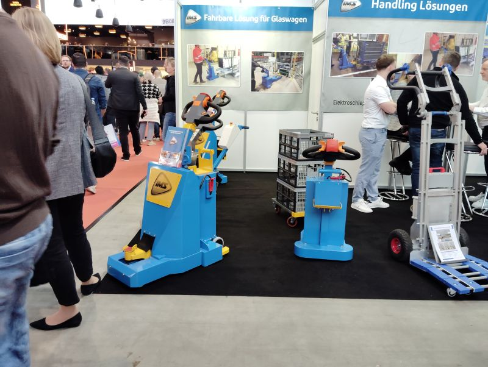
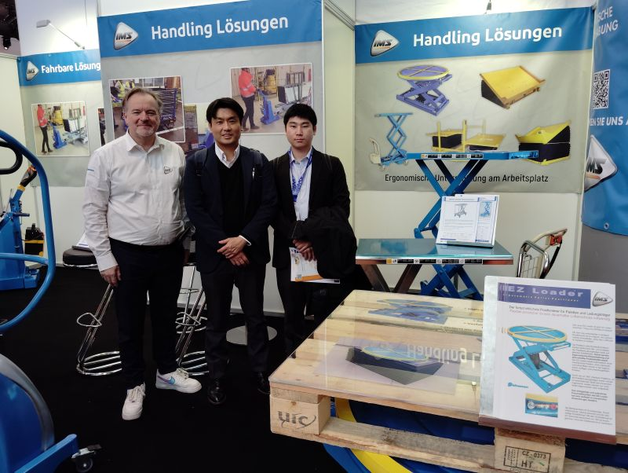

# IMS Manutention

> 作成日：2026-07-03　最終更新日：2026-07-08

**国・地域：** フランス・Bonneval, Eure-et-Loir
**設立：** 1973年
**訪問日：** 2026年4月24〜25日（山崎・橋本GM）
**担当：** ビンセント（Vincent）
**関係性：** 製品輸入・販売代理検討中

---

## LogiMAT 2025での出会い（初回接触）

 

（左）LogiMAT 2025のIMSブース。「Fahrbare Lösung für Glaswagen」「Handling Lösungen」を掲げ、電動牽引台車・スタッカーを展示。（右）ブースにて。左から現地担当者、山崎、同行メンバー（LogiMAT 2025 / 2026年3月13日）

DTRシリーズとの最初の出会いはLogiMAT 2025のIMSブースだった。エルゴノミクス機器（EZ Loaderなど）も含めて展示しており、山崎が気になっていた製品として記憶に残った。この出会いが、後のBonneval工場視察・実機納入（2026年4月・7月）へとつながっている。

## 事業内容

電動牽引トラクター専業メーカー。
重量物牽引装置「DTR シリーズ」を 2003 年から製造し続けている。
牽引能力 1 トンから 10 トンまでの 4 タイプをラインナップ。

公式サイト：[imsmanut.com](https://www.imsmanut.com/)

---

## 主力製品「DTR シリーズ」

 

DTR（Demi Tracteur Roulant）シリーズ。1 〜 10 トン 4 タイプ展開。2003 年から継続製造。（2026年4月24日）

 

（左）DTR 正面。IMS ロゴと操作ハンドル。（右）実機デモの様子。売れ筋は 1.5〜3 トンクラス。（2026年4月24日）

| 仕様 | 内容 |
|---|---|
| 牽引能力 | 1 トン〜10 トン（4 タイプ） |
| 製造開始年 | 2003年 |
| バッテリー | リチウムイオン（鉛蓄電池も対応可） |
| コントローラー | PG Drive（UK本社・カーチス比で高性能） |
| 売れ筋 | 1.5〜3 トンクラス |

---

## コントローラー

 

DTR のコントロールパネル。IMS ロゴ・バッテリー残量計・速度ダイヤル・OFF/ON キースイッチ。PG Drive 社製コントローラー搭載。（2026年4月24日）

採用しているのは **PG Drive Technologies（英国）**。
カーチス（Curtis）より高性能であると判断しての採用。
コントローラー選定において競合他社との差別化を意識している点が伺える。

---

## 実機納入・社内実機確認（2026年7月7日）

DTR の実機が航空便でスギヤスに納入された。
社長・黒野部長・谷澤GM・新倉GM・廣田GM・前川TL・武村TL以下、技術部若手メンバーで開梱・実機確認を実施した。

 

開梱直後の DTR 実機。梱包は段重ねの木枠と段ボールを使った、工夫のあるしっかりとしたスタイル。（2026年7月7日）

### 技術観察（実機分解確認）

 

（左）裏返して確認した駆動部。低床かつグリップをよくするための、チェーンを介した駆動方式。（右）バッテリーは別台車で運搬でき、台車ごと本体にドッキングする。（2026年7月7日）

| 観察項目 | 内容 |
|---|---|
| 駆動方式 | チェーンを介した駆動。低床とグリップ確保を両立。かなり考えられている |
| バッテリー | 別台車で運搬できるものが本体とドッキング。随所に工夫 |
| 取り回し | 荷重がかかっていないときはモーター駆動車輪を浮かせて軽く取り回せる（ビンセントが説明していた大きな特徴） |
| 牽引テスト | Bishamon トラックを即席アタッチメントで牽引。目論見どおり成功 |

---

## 商談状況

- LogiMAT 2025（シュトゥットガルト）で出会い、山崎が気になっていた製品
- 橋本GM が継続フォロー中
- **DTR シリーズとスギヤス既存ラインナップの重複確認**が必要
- 2026年7月7日：実機納入。社内での実機確認・牽引テストを完了

---

## アクション

| 担当 | 内容 |
|---|---|
| 橋本GM | DTR と既存品のラインナップ整理・重複確認 |
| 橋本GM | 日本への輸入コスト・関税試算 |
| 技術部 | 労働安全衛生法・型式検定 対応確認 |
| 山崎 | 代理店契約条件の確認 |

---

## 関連ファイル

- [IMS 訪問レポート](../../Reports/202604-IMS/Report.md)
- [DTR 輸入・販売代理 アイデア](../Ideas/IMS_DTR_ImportDistribution.md)
