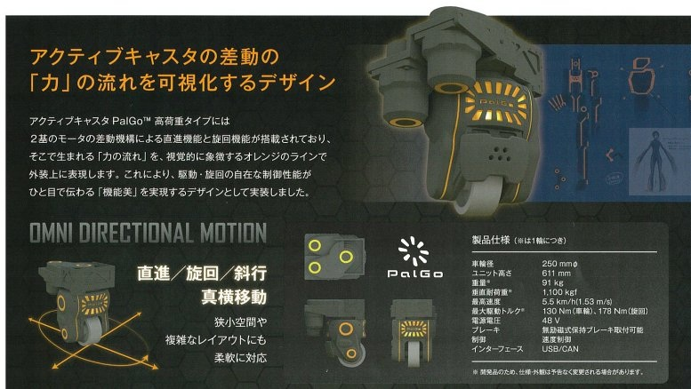
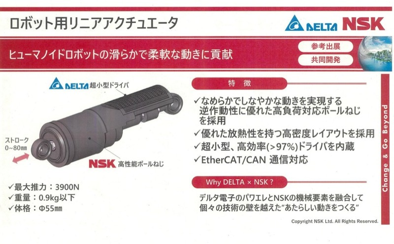

# NSK（日本精工）

> 作成日：2026-07-10　最終更新日：2026-07-10

## 基本情報

| 項目 | 内容 |
|---|---|
| 企業名 | NSK（日本精工株式会社） |
| 国 | 日本 |
| 接点 | Robot Technology Japan 2026（Aichi Sky Expo・2026年6月12日） |
| 展示品 | アクティブキャスター、NSK×Delta電子 ロボット用リニアアクチュエータ |

 

NSK アクティブキャスタ「PalGo」。1輪に2モータを搭載し駆動と旋回を独立制御、2輪のみで全方向移動を実現（Robot Technology Japan 2026）

## 観察内容

- **アクティブキャスター**：1輪に対して2つのモータを搭載し、駆動と旋回を独立制御する構造。2輪のみで全方向移動を実現する。5年前の試作品と比較して大幅に小型化されており、要素技術としての成熟を感じた
- 一般的なメカナムホイールは構造上、走行時に上下振動が発生するが、本技術はその課題を解決し、オフィスや病院などの屋内環境での利用を想定している
- 地道にユニークな駆動ユニットを手掛けており、「何か面白いアプリケーションが作れそうで良いアイデアが湧かない」（前川Nippou）という声が出るほど応用の幅が広い技術

 

NSK×Delta電子 ロボット用リニアアクチュエータ。ヒューマノイドの腕を動かすための小型アクチュエータで、ドライバまで一体化しCANで制御できる（Robot Technology Japan 2026）

- **NSK×Delta電子 リニアアクチュエータ**：ヒューマノイドの腕を動かすための小型アクチュエータ。ドライバまで一体化されCANで制御できる。撮影禁止のためカタログ写真のみ確認

| 項目 | 値 |
|------|-----|
| 外径 | φ55 mm |
| 最大推力 | 3,900 N |
| 重量 | 0.9 kg 以下 |
| ストローク | 0〜80 mm |
| 通信 | EtherCAT / CAN |

- 「駆動部にドライバを内蔵する設計がトレンドになっている」という所感（山崎）：アクチュエータ単体ではなく、制御系まで一体化した設計が業界標準になりつつある

## 技術領域

- 全方向移動用駆動輪ユニット（アクティブキャスター）
- ロボット用リニアアクチュエータ（ドライバ一体型）

## スギヤスとの関連可能性

- ST（スギヤス製品カテゴリ）横移動実現の参考技術として検討価値あり
- 全方向AMRの駆動ユニットとしての応用（社内優先度：低）

## 関連レポート

- [Robot Technology Japan 2026 Report.md](../../Reports/202606-RobotTechJapan/RobotTechnologyJapan2606-Report.md)

## 更新履歴

| 日付 | 内容 |
|---|---|
| 2026-07-10 | Robot Technology Japan 2026 から初期作成 |
