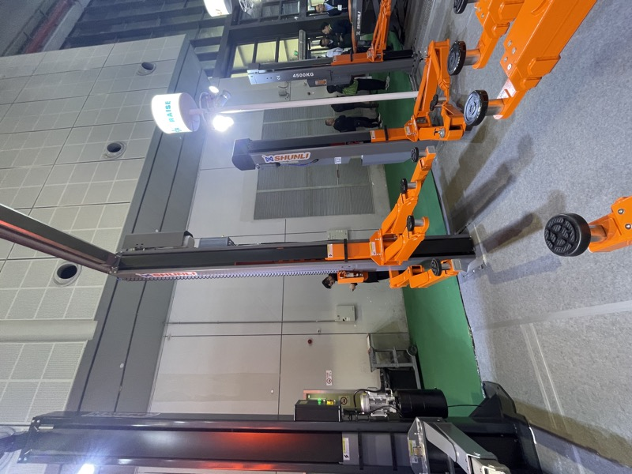
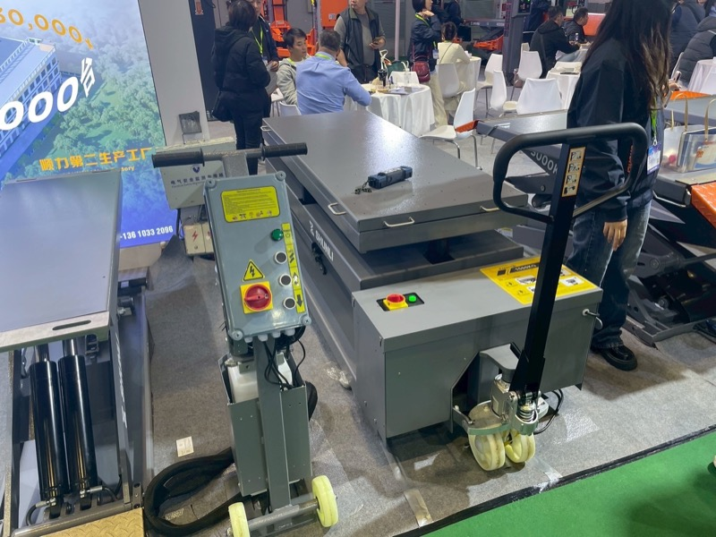
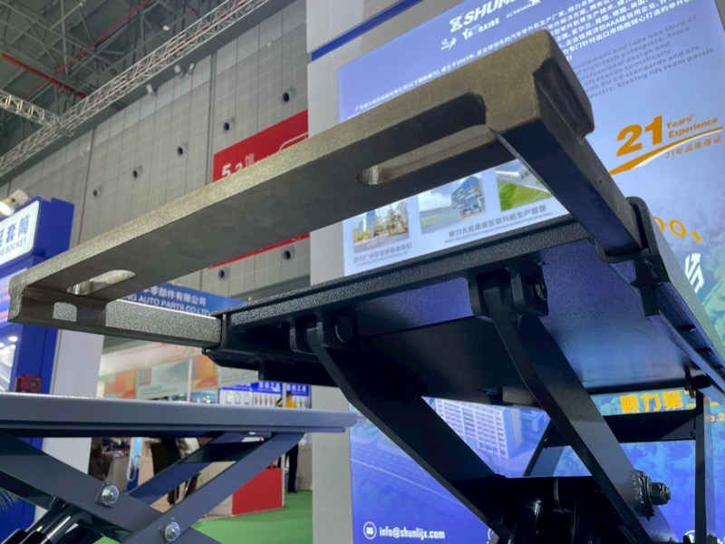

# SHUNLI（順力）

> 作成日：2026-07-16　最終更新日：2026-07-16

**国・地域：** 中国
**創業：** 2005年（21年の実績を訴求）
**展示会：** Automechanika Shanghai 2025（2025年11月）
**関係性：** 中国製2柱リフト・移動式シザーリフトの大手メーカーとして観察

---

## 観察内容

SHUNLIは「21 Years' Experience」を掲げる自動車整備リフトの専業メーカー。第二生産工場は50,000㎡規模と紹介されており、中国国内の乱立するリフトメーカーの中でも実績・規模で一線を画す存在だった。

 

SHUNLIの2柱リフト（4500KG）。チェーン駆動の同調機構が確認できる。（2025年11月28日）

 

（左）移動式フラット・シザーリフト（1500KG）。（右）企業紹介パネル。EU CE規格への準拠もアピール。（2025年11月28日）

## 技術領域

- チェーン駆動式2柱リフト（8トン級まで展開）
- 移動式フラット・シザーリフト
- スクリュー式移動柱リフト（同社ブランド内で複数方式を併売）

## スギヤスとの関連可能性

- 21年・50,000㎡工場という規模感は、価格勝負が基本の中国市場において「信頼できる調達先」の選定基準になり得る
- CE認証取得済みであり、欧州向け輸出の実績も示唆される

## 関連ファイル

- [Automechanika Shanghai 2025 訪問レポート](../../Reports/202511-Automechanika-Shanghai/Report.md)
