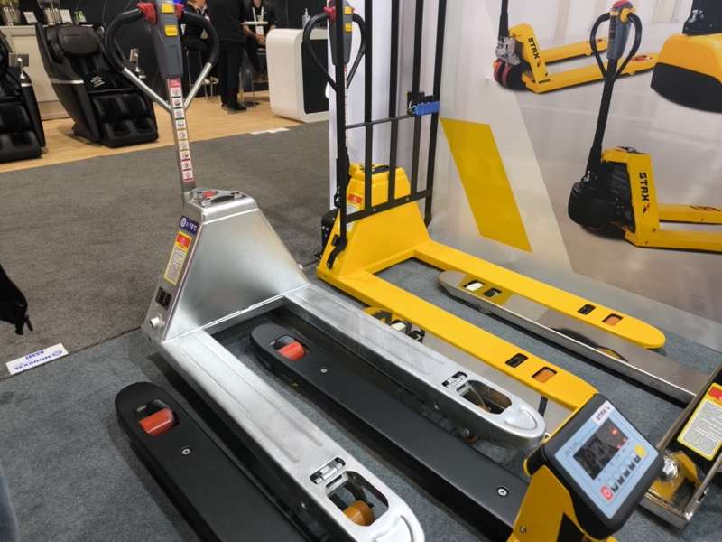
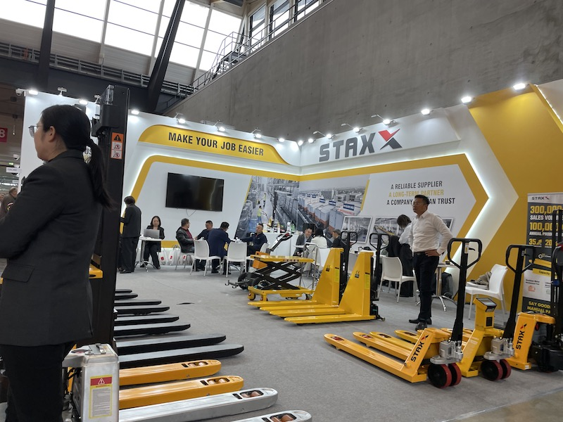

# STAX（STAXX）

> 作成日：2026-07-02　最終更新日：2026-07-10

## 基本情報

| 項目 | 内容 |
|---|---|
| 企業名 | STAX / STAXX |
| 国 | 中国 |
| 展示会 | MODEX 2026（アトランタ）|
| キーワード | 低価格電動車 |

STAXX ブースにて、山崎・橋本 GM と STAXX 担当者（中央）の3ショット。「とにかく安い」が最大の特徴の電動車メーカー（<a href="../../Reports/202604-MODEX/Report.md">MODEX 2026 Report.md</a>）

## 観察内容

 

STAX のブース。（右）ステンレス合金製パレットトラック（冷凍庫対応 ≥−18℃）のポンプ機構。黄色の標準モデルと並んで展示。「とにかく安い」が最大の武器（<a href="../../Reports/202604-MODEX/Report.md">MODEX 2026 Report.md</a>）

 

LogiMAT 2025でのSTAXXブース（初回接触）。「Make Your Job Easier」「A Reliable Supplier, A Long-Term Partner」と欧州向けブランディングを打ち出し、年間30万台の販売実績を誇示していた（LogiMAT 2025 / 2026年3月12日）

- 橋本 GM が前年（2025年）に売り込みを受けていたメーカー。初回接触はLogiMAT 2025（2026年3月）のブース訪問だったと判明
- 電動パレットトラック・電動車全般
- ステンレス合金製の冷凍庫対応モデル（≥−18℃）を展示
- Nippou：「とにかく安い、とのことである」
- MODEX では担当者と3ショット写真撮影済み
- LogiMATでは中国メーカーの欧州進出トレンドの象徴として観察（EP社・HUAGANG・SEER ROBOTICS・Yi-Liftと並ぶ）

## 技術領域

- 電動パレットトラック
- 冷凍倉庫対応電動車

## スギヤスとの関連可能性

- 「将来の価格戦略オプションとして、ゆるい関係継続が正解」（Nippou）
- 自社製品の価格競争が激化した際の調達先候補
- 積極的に深めるではなく「つながりを維持する」レベルの関係性

## アクション

- 橋本 GM が継続担当
- 次回商談機会あれば価格・スペック詳細を確認

## 関連レポート

- [MODEX 2026 Report.md](../../Reports/202604-MODEX/Report.md)

## 更新履歴

| 日付 | 内容 |
|---|---|
| 2026-07-02 | MODEX 2026 から初期作成 |
| 2026-07-03 | MODEX 写真を1ペア追加（ブース展示・ポンプ機構）|
