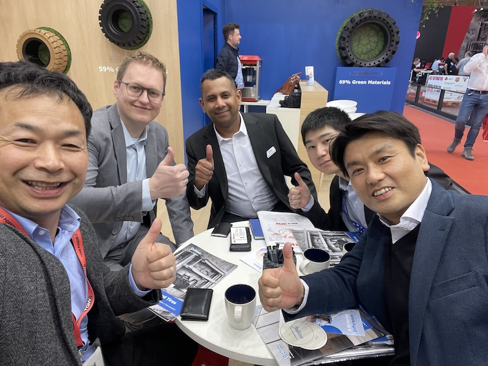

# Stellana（ステラナ）

> 作成日：2026-07-08　最終更新日：2026-07-08

## 基本情報

| 項目 | 内容 |
|---|---|
| 企業名 | Stellana |
| 国・地域 | 欧州 |
| 展示会 | LogiMAT 2025（シュトゥットガルト）|
| 関係性 | 直接取引開始で合意 |

 

Stellana社ブースにて山崎・中川（左後）と欧州側担当者たちとの打ち合わせ。背面には「59%/69% Green Materials」のエコウレタンタイヤが並ぶ（LogiMAT 2025 / 2026年3月12日）

## 観察内容

- カナツー小倉常務から以前提案されていたステアリングホイールが、実はStellana社製であったと判明
- LogiMAT会場内のStellana社ブースにて担当責任者と面談
- 「もし取引が始まるとしたら、直接やりましょう」と口頭で合意
- 環境配慮型のエコウレタンタイヤ（Green Materials 59%/69%表記）も展示
- なぜこれまでStellana社とのコンタクトが切れていたのかは今後の宿題

## 技術領域

- ステアリングホイール
- エコウレタンタイヤ

## スギヤスとの関連可能性

- カナツー経由の間接取引から直接取引への切り替えによるコスト・リードタイム改善
- 5年後を見据えた開発テーマとして「欧州サプライヤーとの部品調達ルート確立」の第一号候補

## アクション

| 担当 | 内容 |
|---|---|
| 山崎 | 直接取引の窓口設定・契約条件確認 |
| — | なぜコンタクトが途切れていたかの経緯確認 |

## 関連レポート

- [LogiMAT 2025 Report.md](../../Reports/202503-LogiMat/Report.md)

## 更新履歴

| 日付 | 内容 |
|---|---|
| 2026-07-08 | LogiMAT 2025 訪問記録から初期作成 |
