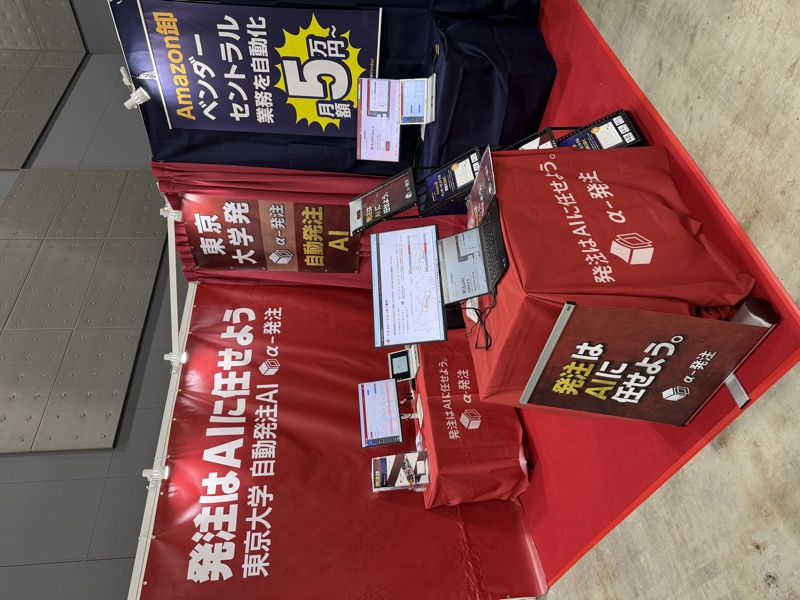

# infonerv

> 作成日：2026-07-03　最終更新日：2026-07-03

## 基本情報

| 項目 | 内容 |
|---|---|
| 企業名 | 株式会社 infonerv |
| 出自 | 東京大学発スタートアップ |
| 代表 | 江崎貴裕（東大特任准教授）|
| 展示会 | 九州国際物流総合展 INNOVATION EXPO 2026（福岡マリンメッセ）|
| 展示品 | AI在庫管理システム |

 

左：AI在庫管理ブース（「発注はAIに任せよう」）。右：株式会社infonerv、東大特任准教授・江崎貴裕氏が代表。「モノが過不足なく行き渡る世界にする」。（INNOVATION EXPO 2026）

## 観察内容

- **AI在庫管理**：在庫の適正化をAIで自動化するサービス
- ミッション：「モノが過不足なく行き渡る世界にする」
- **ON SEVEN DAYS**（ファッション雑貨）への導入済み。かなりの成果を出しているとのこと
- トレンドが大きい雑貨屋にはAI在庫管理が特に効く
- AIエンジン：**AnthropicのClaude**を使用
- 代表は「松尾研究所は学生主体でたいしたことない」と言い切る

## 技術領域

- AI在庫管理・需要予測
- 物流・流通特化
- Claude（Anthropic）活用型 AI

## スギヤスへの示唆

- 在庫管理のAI化は「ハードとソフトを組み合わせた提案」として顧客への価値提供に活用できる
- 台車・リフト納入先の倉庫業者への紹介・連携可能性
- Claude活用という点でAI活用の具体的事例として社内啓蒙に使える

## 関連情報

- [INNOVATION EXPO 2026 Report.md](../../Reports/202606-InnovationEXPO/Report.md)

## 更新履歴

| 日付 | 内容 |
|---|---|
| 2026-07-03 | INNOVATION EXPO 2026 から初期作成 |
