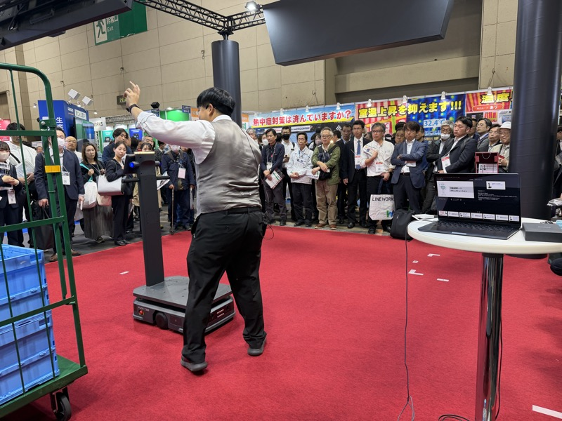

# ソフトバンクロボティクス

> 作成日：2026-07-08　最終更新日：2026-07-08

## 基本情報

| 項目 | 内容 |
|---|---|
| 企業名 | ソフトバンクロボティクス |
| 国・地域 | 日本（中国企業との連携あり） |
| 展示会 | 生成AI World・ロボット展示会 2025（ポートメッセなごや） |
| 関係性 | 競合・観察対象（AMR市場のベンチマーク） |

 

（左）担当者がカメラに映りながらボタン一押しで追従デモ。急旋回にもついてくる繊細な速度制御。（右）300kgの台車を牽引しながら自走するデモ。観客が四方を取り囲む状況でも安定して動作していた（生成AI World 2025 / 2025年10月30日）

## 観察内容

- 飲食店の猫型配膳ロボットでの実績を土台に、工業分野へ本格参入
- 中国企業との連携とソフトバンクの知名度により、1年を経ずして販売実績が付いてきている
- デモは黒山の人だかり。世の中の関心の高さがうかがえた
- 追従機能：カメラに自分を映しながらボタン一押しで追従対象を認識。人の急旋回にもついてくる
- 300kgの荷物運搬・牽引に対応。速度制御が繊細で、恐怖を感じさせない仕上がり

## 技術領域

- AMR（自律移動ロボット）
- カメラベースの人物追従技術

## スギヤスとの関連可能性

- 直接の取引対象ではなく、市場水準を測るベンチマークとして重要
- 「このレベルの制御ができれば、オフィス・ホテル・病院・店舗・介護に加速度的に浸透する」という危機感の源泉
- 「戦意喪失しそうになる」レベルの完成度。自社AMR開発（アドバンテック連携等）の目標水準として意識する

## アクション

- 特になし（継続的な市場観察対象）

## 関連レポート

- [生成AI World・ロボット展示会 2025 Report.md](../../Reports/202510-GenerativeAI/Report.md)

## 更新履歴

| 日付 | 内容 |
|---|---|
| 2026-07-08 | 生成AI World・ロボット展示会 2025 訪問記録から初期作成 |
