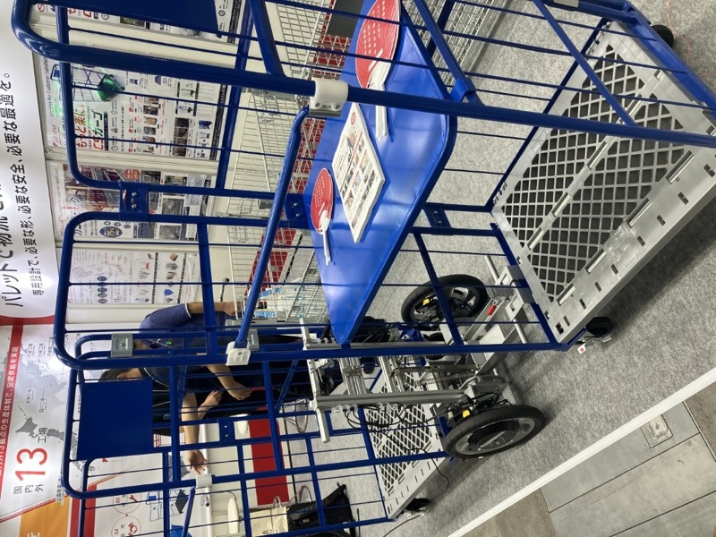
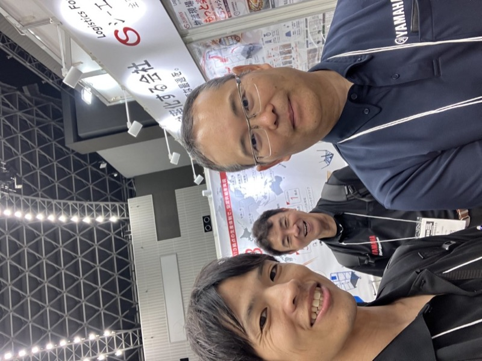
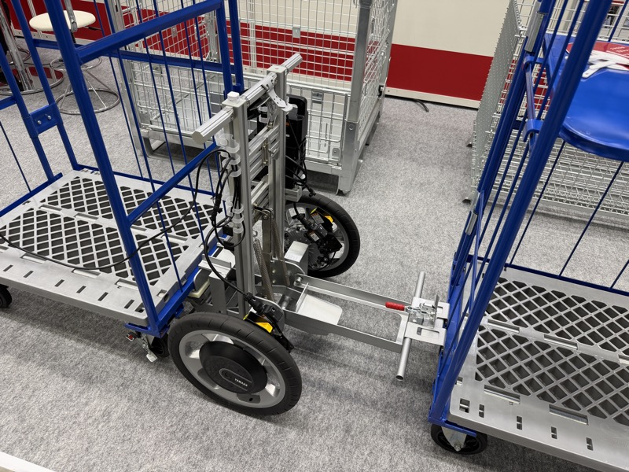

# ヤマハ発動機 × CS JAPAN「PAXIS」

> 作成日：2026-07-03　最終更新日：2026-07-03

## 基本情報

| 項目 | 内容 |
|---|---|
| 展示企業 | CS JAPAN × ヤマハ発動機 |
| 製品名 | PAXIS（電動アシスト台車）|
| 展示会 | 九州国際物流総合展 INNOVATION EXPO 2026（福岡マリンメッセ）|
| コア技術 | 車いす用インホイールモータ技術の物流転用 |

 

CS JAPAN × ヤマハ発動機 PAXIS 展示。カゴ車2台を前後連結して電動アシスト走行。（INNOVATION EXPO 2026）

## 観察内容

 

CS JAPAN × ヤマハ発動機 カゴ台車電動牽引装置。2台のカゴ台車を前後連結し、電動アシストで走行・操舵。指先コントローラーで前進・後進。（INNOVATION EXPO 2026）

- 車いす用インホイールモータ技術を物流分野へ**そのまま横展開**
- カゴ車2台を前後連結して搬送。回転中心機構により非常に小回りが利く
- 重量物でも軽い力で操作できる
- 指先コントローラーで前進・後進を操作
- 4輪自在キャスターを車輪を浮かせたり固定したりで対応
- 連結装置は足踏みメカクランク方式。「気持ちの良い踏みごごち」（山崎）

## 着眼点

- **コア技術の横展開**：車いす用電動アシストという自社の既存技術を、物流市場へ転用
- 新技術を一から開発せず、既存技術の異業種応用で新価値を生み出した
- 機構設計（回転中心機構・メカクランク）による付加価値の高め方が秀逸

## スギヤスへの示唆

- スギヤスも電動化・自動化の切り口で「既存の昇降・搬送技術の横展開」が可能
- こういうメカ的な要素技術はスギヤスの本来の強みである（山崎）
- 台車×電動アシスト組み合わせの提案スタイルは、IMS牽引車との類似性がある

## 関連情報

- [INNOVATION EXPO 2026 Report.md](../../Reports/202606-InnovationEXPO/Report.md)

## 更新履歴

| 日付 | 内容 |
|---|---|
| 2026-07-03 | INNOVATION EXPO 2026 から初期作成 |
