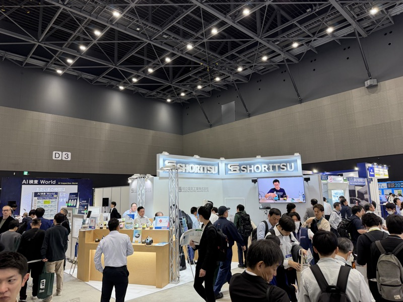

# 昭立電気（SHORITSU）

> 作成日：2026-07-08　最終更新日：2026-07-08

## 基本情報

| 項目 | 内容 |
|---|---|
| 企業名 | 昭立電気工業株式会社（SHORITSU） |
| 国・地域 | 日本 |
| 展示会 | 生成AI World・ロボット展示会 2025（ポートメッセなごや） |
| 関係性 | 新規商談候補（相性良好） |

 

昭立電気工業のブース（SHORITSU）。会場内でも来場者密度の高いゾーンに位置していた（生成AI World 2025 / 2025年10月30日）

## 観察内容

- 基板の実装メーカー。少ロットを全くいとわない体質
- 展示サンプルは大電流対応。既視感を感じるレベルの実績
- 商社経由で、イヤサカ社の車検機の基板も製作している実績を確認。整備業界の環境を理解している
- 既存仕入先に見られるような横柄な雰囲気は微塵も感じなかった（山崎所感）

## 技術領域

- 基板実装（大電流対応）
- 少ロット対応の生産体制

## スギヤスとの関連可能性

- 弱電はNNP、大電流は昭立電気、という棲み分けが成立する可能性
- 探せば良い基板実装メーカーと出会えるという気づきの象徴的事例

## アクション

- 具体的な取引条件・単価の確認（次回接触時）

## 関連レポート

- [生成AI World・ロボット展示会 2025 Report.md](../../Reports/202510-GenerativeAI/Report.md)

## 更新履歴

| 日付 | 内容 |
|---|---|
| 2026-07-08 | 生成AI World・ロボット展示会 2025 訪問記録から初期作成 |
