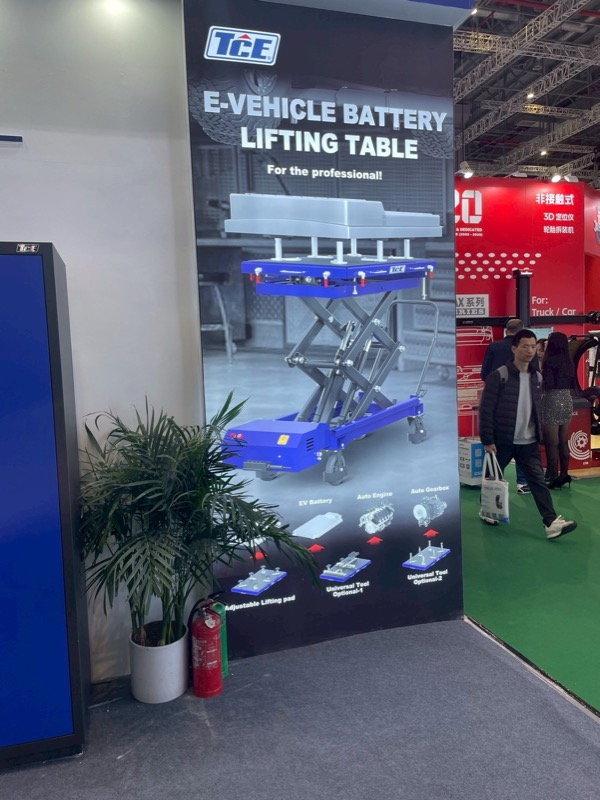

# EV普及を見据えたバッテリー脱着対応リフター

> 作成日：2026-07-16　最終更新日：2026-07-16

**ソース：** 2025年11月 Automechanika Shanghai 2025視察（武村TL・水野・淵田、廣田GM・橋本GM・山崎）
**優先度：** ［要確認：優先度未設定］
**ステータス：** アイデア段階

---

## アイデアの概要

上海市街地では自動車・バイクのEV化が進み、走行音がほぼ無音になっている実態を確認した。中国の展示会では、この流れを先取りする形でEVバッテリー・エンジン・ギヤボックスそれぞれに対応した専用アダプターを備えるリフティングテーブルが製品化されていた。

 

TCEブース「E-VEHICLE BATTERY LIFTING TABLE」。EVバッテリー・Auto Engine・Auto Gearboxそれぞれに対応したアダプターを用意する。（2025年11月28日）

また、8本アームの柱リフト（車を上げるために4本・バッテリーを受けるために4本）のように、車体昇降とバッテリー脱着を同時に行う専用機も出展されていた。

> いずれ日本もEVがどんどん普及していく可能性はあると思います。EVの進化に合わせたリフトの開発が必要だなと強く感じました。（淵田）

---

## 想定する製品の方向性

### Option A：既存リフトへのアダプターオプション追加
標準リフトのテーブル面に、EVバッテリー・エンジン・ギヤボックス用の交換式アダプターを用意する。開発負荷が小さく、既存製品ラインの拡張として着手しやすい。

### Option B：バッテリー交換専用機の新規開発
車体昇降用アームとバッテリー受け用アームを分離した専用機。EV整備工場・バッテリー交換ステーション向けの新規カテゴリーとして開発する。

---

## 課題・確認事項

- 国内EV普及率・バッテリー交換needsの実態調査（現時点で市場規模が読めない）
- アダプターの標準化（EVメーカーごとにバッテリー形状が異なる可能性）
- 8本アーム柱リフトの詳細構造（現地では概要のみ確認、図面等は未入手）

---

## 次のアクション

| 担当 | 期限 | 内容 |
|---|---|---|
| ［要確認：担当未定］ | ［要確認：期限未定］ | 国内EV整備市場・バッテリー交換needsの実態調査 |
| ［要確認：担当未定］ | ［要確認：期限未定］ | 既存リフトへのアダプターオプション追加の技術検討 |

---

## 関連ファイル

- [Automechanika Shanghai 2025 訪問レポート](../../Reports/202511-Automechanika-Shanghai/Report.md)
- [2025年トレンド](../Trends/2025.md)
