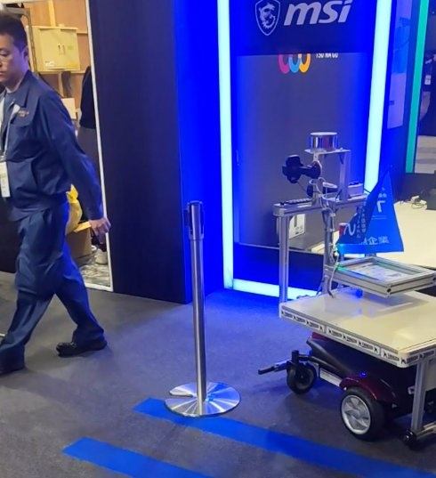

# 3D LiDARによるパレット・ワーク識別

**ソース：** Robot Technology Japan 2026視察（2026年6月12日・奥村）
**優先度：** 高
**ステータス：** 構想段階

## アイデアの概要

Doogのサウザー（人追従AMR）が採用している3D LiDARによる点群認識を、パレットやワークの識別に応用する。現状はカメラベースの認識が主流だが、LiDARは距離精度で優位性がある。

## 背景

Doogサウザーの人追従は、カメラではなく3D LiDAR（Velodyne製と思われる）で実現されており、人を点群形状として認識している。LiDARはカメラより距離精度が高いが高価。今後カメラとの価格競争が進むことが期待される。

 

Doog サウザー。3D LiDARによる点群認識で人を追従する（Robot Technology Japan 2026）

## 想定製品・用途

- AMR・搬送機器のパレット位置検出・ワーク形状識別
- 既存のカメラベース認識を補完・置換する選択肢

## 技術課題

- LiDARユニットのコスト（現状は高価格帯）
- 点群処理のソフトウェア開発・既存システムとの統合

## 次のアクション

- Doog社との情報交換（LiDARユニットの型番・価格帯確認）
- 自社AMR構想における認識方式（カメラ vs LiDAR vs 併用）の比較検討

## 関連

- [Doog（サウザー）](../Companies/Doog.md)
- [AMR のコモディティ化](../Knowledge/AMR/Commoditization.md)
- [Robot Technology Japan 2026 Report.md](../../Reports/202606-RobotTechJapan/RobotTechnologyJapan2606-Report.md)
