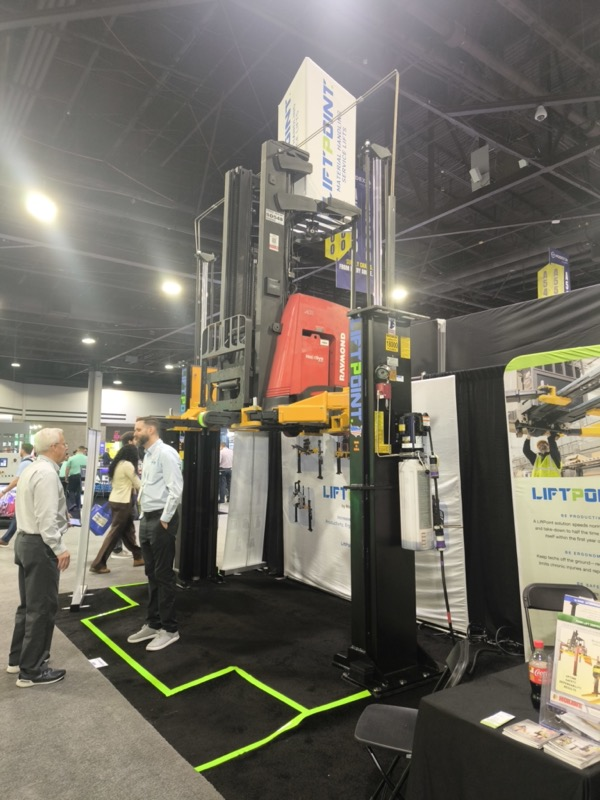
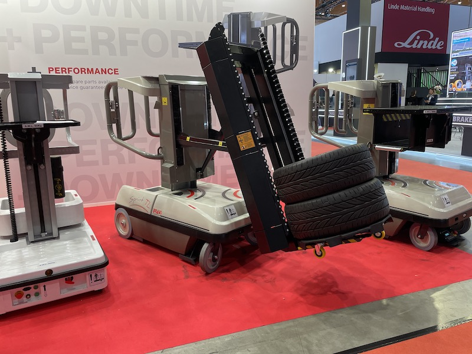

# 小型フォークリフト対応 移動型整備リフト（雷電タイプ）

> 作成日：2026-07-08　最終更新日：2026-07-10

**ソース：** 2026年3月 LogiMAT 2025視察（山崎・中川・橋本GM）
**優先度：** 高（今期〜来期に応用可能）
**ステータス：** 構想段階

## アイデアの概要

黒野部長がL&Fからオファーを受けている移動型整備リフト案件。LogiMAT 2025で見たVIPERおよびDendro Lift「DSS2 AquaShield」のデモが、雷電タイプの移動型整備リフトとしての方向性を実物で示している。

LIFTPOINTブースの全景。Raymondのリーチスタッカー（フォークリフト）を丸ごとリフトで持ち上げ、コンテナの床面高さに合わせるデモ。「フォークリフトを持ち上げる」という発想は雷電タイプと共通する（<a href="../../Reports/202604-MODEX/Report.md">MODEX 2026 Report.md</a>）

企業情報：[LiftPoint.md](../Companies/LiftPoint.md)

 

 

Dendro Lift「DSS2 AquaShield」のワールドプレミア展示。STILLフォークリフトを移動型整備リフトで高々と持ち上げてデモ。雨天対応の「AquaShield」仕様が特長（<a href="../../Reports/202503-LogiMat/Report.md">LogiMAT 2025 Report.md</a>）

企業情報：[DendroLift.md](../Companies/DendroLift.md)

 
 

VIPERの移動型整備リフト（- DOWN TIME + PERFORMANCE）。タイヤ交換作業を想定し、タイヤを積み重ねた状態でデモ展示。Lindeフォークリフトの横に設置され、小型フォーク向けモバイル整備リフトの世界標準を示す（<a href="../../Reports/202503-LogiMat/Report.md">LogiMAT 2025 Report.md</a>）

## 背景

VIPER・Dendro Lift「DSS2 AquaShield」は、STILLのフォークリフトを屋外（雨天）で高々と持ち上げるデモを実施。物流商材とは異なる「整備・サービス」領域向けの設計思想が明確だった。MODEX 2026のLIFTPOINTも、フォークリフト本体を持ち上げるという発想で共通する。用途はコンテナ搬入対応だが、「小型フォークリフトを移動型リフトで持ち上げる」という基本構造は雷電タイプの参考になる。

## 想定製品・用途

- ST・LV等の既存台車ベースを改造対応
- 小型フォークリフトの現場整備（屋外・雨天対応）
- 「物流商材とは違う設計思想」を前面に出したPR・販売戦略

## 技術課題

- 屋外・雨天での防水・耐候性能
- 自社工場での整備知見・リフト設計ノウハウの製品化への転用

## 次のアクション

- 黒野部長のL&Fオファー案件との整合確認
- 福島工場の生産体制での量産可否検討

## 関連

- [LogiMAT 2025 Report.md](../../Reports/202503-LogiMat/Report.md)
- [MODEX 2026 Report.md](../../Reports/202604-MODEX/Report.md)

## 更新履歴

| 日付 | 内容 |
|---|---|
| 2026-07-08 | LogiMAT 2025・MODEX 2026の写真を追加（VIPER・LIFTPOINT） |
| 2026-07-10 | Dendro Liftの企業情報ファイルを新規作成。LIFTPOINT・Dendro Liftへの企業情報リンクを各写真の説明のすぐ近くに配置 |
