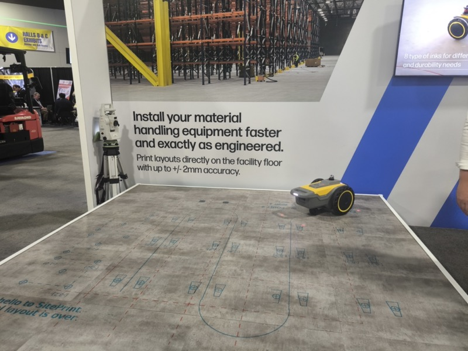

# SitePrint — 床面印刷ロボットによる設備導入前工程の自動化

## 概要

床面に ±2mm の精度でレイアウト線を直接プリントする自走ロボット。設備導入の前工程（レイアウト確定・墨出し作業）を自動化する。MODEX 2026 で初めて目にした、日本の展示会では見られない切り口の製品。

SitePrint のブース。「Install your material handling equipment faster and exactly as engineered」のキャッチコピーが掲示されていた。（<a href="../../Reports/202604-MODEX/Report.md">MODEX 2026 Report.md</a>）

## 技術概要

| 項目 | 内容 |
|---|---|
| 企業名 | SitePrint |
| 展示会 | MODEX 2026（アトランタ）|
| 精度 | ±2mm |
| 方式 | 自走ロボットによる床面直接プリント |
| 用途 | 倉庫・工場のレイアウト線・設備設置ガイドラインの墨出し |

## 解決している課題

- 設備導入前の「墨出し」作業は従来、人手・巻き尺・チョークで実施
- 大型倉庫での正確なレイアウト転写には時間・人員がかかる
- ズレが発生すると設備設置後の修正コストが高い

## 導入効果

- 設計データ（CAD レイアウト）を直接床面に転写
- ±2mm の高精度で「設計通りの配置」を保証
- 墨出し作業の工数・誤差を大幅削減

## スギヤスへの示唆

- スギヤスが設備導入（リフト・テーブル等）を提案する際の付帯サービスとして活用余地がある
- 「設備を売る」前工程のコンサルティングサービスとのセット提案
- 精度の高い設置位置のガイドラインを顧客工場に提供することで、設備導入時のトラブルを減らせる

## 類似アイデアとの比較

| 手法 | 精度 | 工数 | 課題 |
|---|---|---|---|
| 人手+巻き尺+チョーク | ±20〜50mm | 高 | 大規模倉庫では困難 |
| レーザーレベル | ±5mm 程度 | 中 | 線を描けない |
| SitePrint | ±2mm | 低 | 導入コスト未公開 |

## 関連情報

- MODEX 2026 出展。北米向けに展開中
- キャッチコピー：「Install your material handling equipment faster and exactly as engineered」

## 関連レポート

- [MODEX 2026 Report.md](../../Reports/202604-MODEX/Report.md)
- [Trends/2026.md](../Trends/2026.md)

## 更新履歴

| 日付 | 内容 |
|---|---|
| 2026-07-03 | MODEX 2026 から初期作成 |
