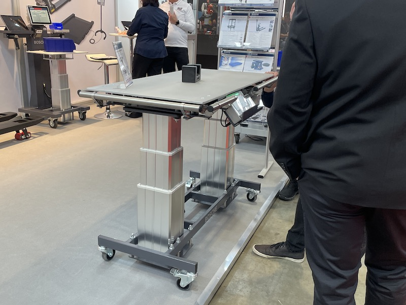

# テーブルが斜めになるテーブルリフト（傾斜テーブルリフト）

> 作成日：2026-07-08　最終更新日：2026-07-08

**ソース：** 2026年3月 LogiMAT 2025視察（山崎・中川・橋本GM）
**優先度：** 高（今期〜来期に応用可能）
**ステータス：** 再設計検討段階（過去に試作実績あり）

## アイデアの概要

LogiMATでエルゴノミクス対応テーブルリフトが複数社から出展されており、欧州では主要製品カテゴリーとして確立していた。パレテーナを置いて高さと角度を変えることで、中身を取り出しやすくする。老若男女をより生産現場に起用しやすくすることが狙い。

 

高さ調整・傾斜（チルト）機能付きの作業テーブル。多様な体格・姿勢に合わせて無段階で調整可能（LogiMAT 2025 / 2026年3月12日）

## 背景

過去にハンド・ST・LVで試作実績あり。構造の安定感不足が課題となっていた。今回の欧州展示（高さ調整＋傾斜機能付きテーブル、大型シザーリフトテーブルの内部機構）をベンチマークに再設計が可能。

## 想定製品・用途

- パレテーナ設置用の高さ・角度可変テーブル
- 労働力の高齢化・多様化への対応（エルゴノミクス機器需要の高まりに合致）

## 技術課題

- 構造の安定感（過去試作での課題）
- 電動モーター・油圧ポンプ・X型クロスリンク構成の参考実装（大型シザーリフトテーブルの内部機構より）

## 次のアクション

- 過去試作の課題点の再点検
- 福島工場での追加投資ほぼ不要な生産体制の確認

## 関連

- [LogiMAT 2025 Report.md](../../Reports/202503-LogiMat/Report.md)
