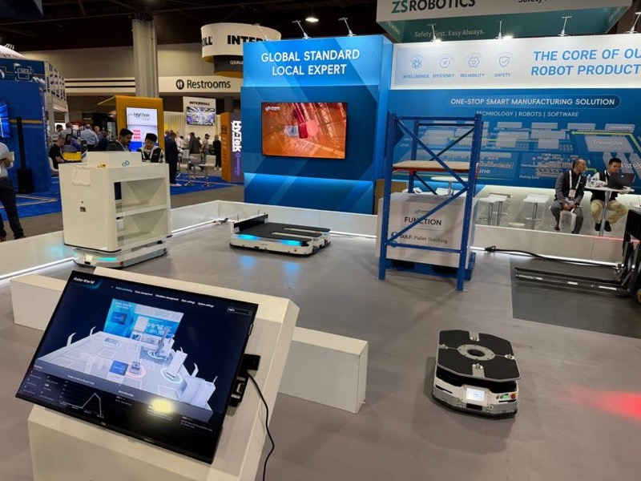
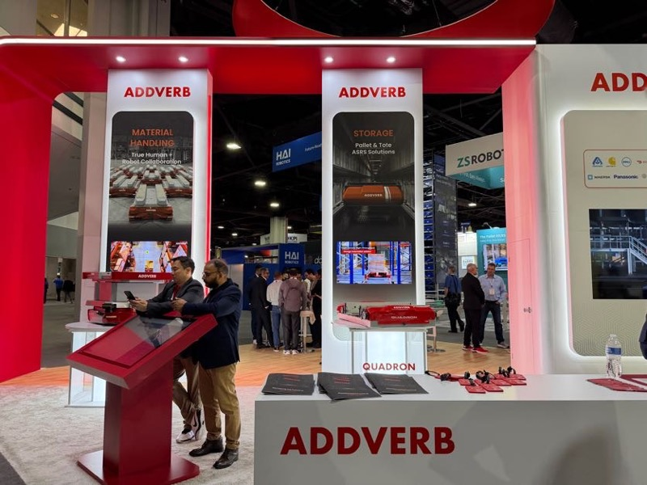
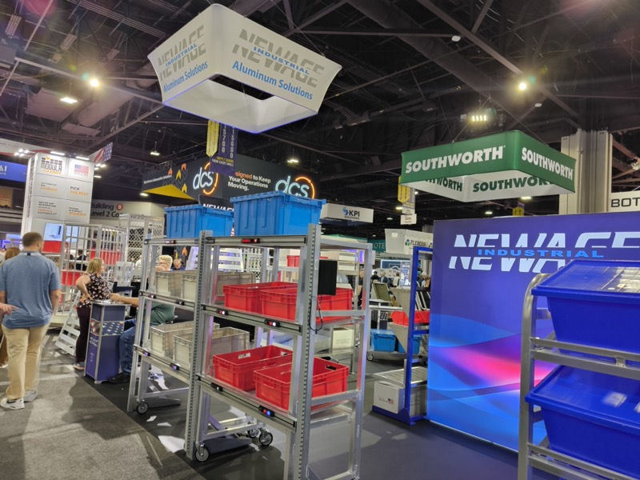
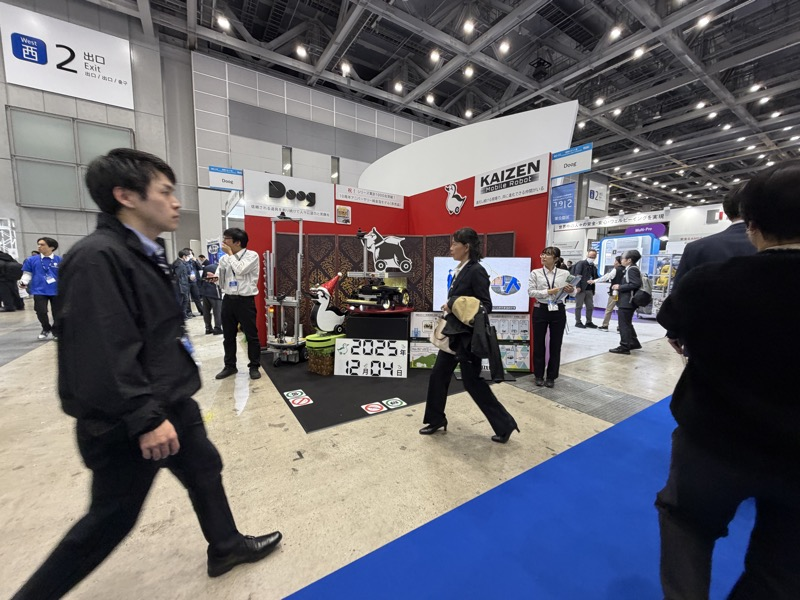
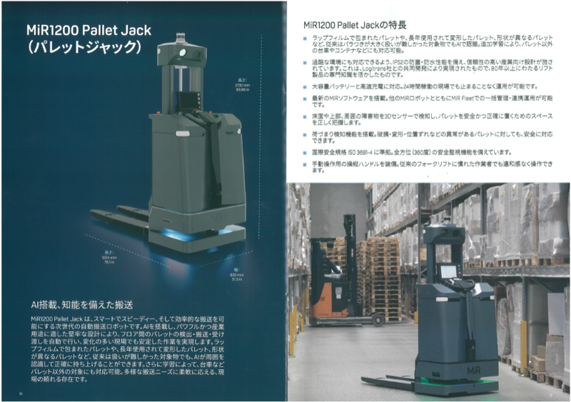
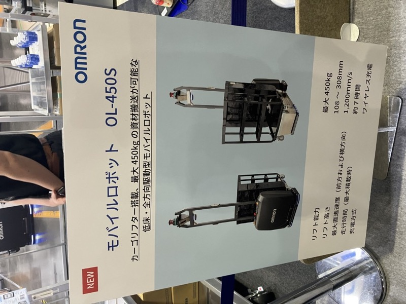
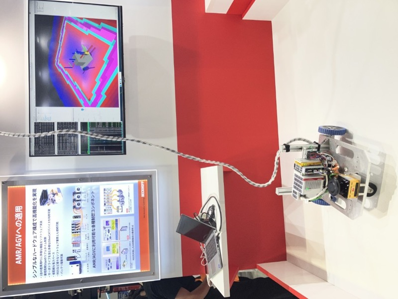

# AMR のコモディティ化

## 概要

2026年時点で AMR（Autonomous Mobile Robot）はコモディティ段階に入った。
中国・インド・韓国・米国・オランダ、多国籍プレイヤーが同一カテゴリで競合している。
日本の物流展で「だいたいわかっていた」認識は、MODEX を見て完全に覆された。

各社 AMR が複数台同時展示。ZS Robotics（中国）をはじめ、多国籍メーカーが同一フロアで競合を展開した（<a href="../../../Reports/202604-MODEX/Report.md">MODEX 2026 Report.md</a>）

## MODEX 2026 での観察

- 棚搬送型 AMR・棚登り型（ASRS）・無人フォーク・パレット搬送・ヒューマノイドまで倉庫自動化の全段階が一覧できた
- 中国メーカーが来場者の真横で 5〜6m の高さにパレットを積み上げるデモ。安全性への絶対的自信がないとできない芸当
- インドメーカー（ADDVERB）は ABM コンセプトと同じフォーク式で世界展開済み
- MOODE ROBOT「No renovation」—既存の床・棚をそのまま使えることをウリにする

 

（左）ADDVERB（インド）。「True Human+Robot Collaboration」と「Pallet & Tote ASRS Solutions」の両輪で展開。Panasonic・Siemens との協業実績を掲示。（右）NewAge Industrial の AMR カート連動棚。棚搬送型 AMR が棚ごと自律搬送する（<a href="../../../Reports/202604-MODEX/Report.md">MODEX 2026 Report.md</a>）

## 主要プレイヤー（[MODEX 2026 Report.md](../../../Reports/202604-MODEX/Report.md)）

| 企業 | 国 | 特徴 |
|---|---|---|
| ZS Robotics | 中国 | シャトル型 ASRS、「0 PROJECT FAILURE RATE」 |
| HAI Robotics | 中国 | ACR（Autonomous Case-handling Robot）棚登り型 |
| ADDVERB | インド | フォーク型・人型ロボット協調、Panasonic/Siemens 協業 |
| MOODE ROBOT | 中国 | フォーク型 AMR、既存倉庫改修不要 |
| idealworks | ドイツ | パレットムーバー AMR、Zalando 導入実績 |
| SEER Robotics | 中国 | 全ロボット統合プラットフォーム |
| Locus Robotics | 米国 | 全工程ワンプラットフォーム（Case Picking〜Sanitation） |
| Tompkins + Duravant | 米国 | AMR ソーティングシステム |
| Smartpodd | スウェーデン系？ | フラットパレット搬送型 AMR |
| Multiway Robotics | 中国 | 大規模導入実績訴求 |
| Bluepath Robotics | 米国 | 「ROI in 2 Years」訴求 |
| Robotize | デンマーク | 超低床フラット AMR、パレット直搬送 |

 

Locus Robotics（米国）の大型ブース。「Case Picking / Returns / Transport / Sanitation」— 物流現場の全工程をワンプラットフォームで賄うコンセプト。AMR がコモディティ化した先にある「ソフトウェア統合」競争軸を体現していた（<a href="../../../Reports/202604-MODEX/Report.md">MODEX 2026 Report.md</a>）

## ハノーバーメッセ 2026 での観察

会場通路を単独走行する小型AMR。来場者が行き交う通路を、監視員なしで人混みをかき分けながら進む。誰も驚かない。（ハノーバーメッセ 2026）

- **最大の発見は「走っている場所」だった**：ブースを飛び出し、来場者が行き交う通路を1300kgを牽引しながら走行。監視員なし
- 誰も驚かず「当たり前の世の中になっている」（山崎 Nippou 3805）
- IntelブースではAMRの台車の上にヒューマノイドが立ち、AMR×ヒューマノイドの融合を実演
- MODEX 2026（アトランタ）と同一レベルかそれ以上の自信を現場で確認

## EP Equipment 社内での実稼働（2025年11月）

展示会のサンプルから一歩進んだ現実を見た。EP Equipment（浙江中力機械）の自社工場内で、AMR 150台が実際に稼働していた。

 

EP社自社工場内のAMRスタッカー。鉄製メッシュ箱型パレットをフリーロケーションで2段積みしている。床面の赤いレーザーは安全センサーの走査光。（EP Equipment 浙江工場 / 2025年11月26日）

- 床に固定棚もレールもない。AMRが自分で場所を判断して段積みする「フリーロケーション」方式
- 鉄製箱型パレット（金属メッシュコンテナ）を2段積みで自律スタッキング
- AMR制御ユニットはUbuntuベース。ROS2との親和性が高いOSを採用している

 

（左）EP社AMR倉庫の通路。両側に積まれた鉄製パレットの間を、AMRが自律走行するための広い通路が確保されている。（右）EP社AMR制御ユニットのタッチパネル。Ubuntuのデスクトップが起動している。

展示会のデモと実工場稼働の差は大きい。「150台が毎日止まらず動いている」という事実は、技術成熟度の証明だ。EP社開発者400名のうち200名がロボティクス担当。来年にはロボティクス専用開発センターが立ち上がる。

## 生成AI World・ロボット展示会 2025（名古屋、2025年10月）での観察

海外の大型展示会だけでなく、国内の合同展示会でもAMRは「当たり前の技術」になっていた。

 

ソフトバンクロボティクスのAMRデモ。300kgの台車を牽引しながら自走し、黒山の人だかりができていた（生成AI World 2025 / 2025年10月30日）

- ソフトバンクロボティクスのAMRデモが黒山の人だかり。追従・牽引・速度制御のすべてが想像以上の完成度で、「戦意喪失しそうになる」水準（詳細は[ソフトバンクロボティクス](../../Companies/ソフトバンクロボティクス.md)）
- センサーメーカーのHOKUYO（北陽電機）でさえ、AMR関連の事例サンプルをこともなげに開発・展示。**コンポーネントサプライヤーがAMR活用事例を持つのが当然**になっている
- アドバンテックはAMR自社開発を研究テーマとして推進中。ニデックのドライブユニット×ソニー汎用カメラという構成でコスト現実解を模索（詳細は[アドバンテック](../../Companies/アドバンテック.md)）
- 「今から商品化して何を差別化していけるか、は別問題。最低限これくらいのことができなければ、その先に行くのは無理」という危機感が共通認識になっている

## iREX2025（2025国際ロボット展、東京ビッグサイト、2025年12月）での観察

SEER製 WLR-719コントローラー（メカナムホイール搭載AMRシャーシ）。左は2D LIDARセンサー。「Naviho搬送単元」として中国AMR市場に浸透している（iREX2025）

- **SEERコントローラーが中国AMRの事実上の標準**：WLR-719コントローラー（メカナムホイール搭載シャーシ、2D LIDAR搭載）が中国AMR市場に広く浸透。「昔の『インテル入ってる？』と同じ構図でスタンダードになっている」（山崎所感）
- 基礎知識があるエンジニアであれば、このコントローラーを使ってAMRを組める水準までコモディティ化が進んでいる
- 廣田GMがSEERのショールーム見学を既に約束済み（2026年3月予定）。DMP経由の接点（[SEER Robotics](../../Companies/SEER_Robotics.md)）が実地確認につながった

 

KAIZEN Mobile Robots / Doogブース。「2025年12月4日」のカウンター表示が見える。国内AMRメーカーが着実に存在感を上げている（iREX2025）

- **国内マテハン・AMRメーカーの実績蓄積**：これまであまり聞いたことのない会社（KAIZEN Mobile Robots / Doog等）が着実に販売実績をつくりつつある
- LINXブース：iRAYPLE AMR「物流を止めない自動化ソリューション」を掲げ、自動搬送ロボットから自動フォークリフトまでラインナップを展示

## Robot Technology Japan 2026（愛知・Aichi Sky Expo・6月）での観察

日本国内の産業用ロボット専門展でも、AMRは単体の主役ではなく「自動化ラインを構成する一要素」として展示されるケースが大半だった。一方で、駆動輪・コントローラー・リフト機構などのAMR要素技術には、独自性の高い開発が数多く見られた。

MiR（デンマーク製AMR）。フォーク型・手動操作対応。安全機能は本体上部の3D LiDARが担う構成（Robot Technology Japan 2026）

- **MiR（デンマーク）**：国内普及はまだ限定的。担当者いわく「ビシャモンを自動化したもの」という説明が分かりやすいとのこと。日本では既存設備・レイアウトを維持したいという要望が強く、海外のようにAMR導入前提でレイアウトを変える発想とは異なる
- **オムロン 昇降タイプAMR**：2026年4月発売の新製品「OL-450S」を確認。既存台車（車輪径125mm）をそのまま搬送できる設計思想が特徴で、日本市場の「既存設備を活かしたい」ニーズに寄り添っている

 

オムロン新製品「モバイルロボット OL-450S」。カーゴリフター搭載、最大450kgの資材搬送が可能な低床・全方向駆動型モバイルロボット（Robot Technology Japan 2026）

- **NSK アクティブキャスター**：1輪に2モータを搭載し駆動と旋回を独立制御、2輪のみで全方向移動を実現する足回り技術。メカナムホイールの弱点（走行時の上下振動）を解決し、オフィス・病院など屋内環境向け。5年前の試作品から大幅に小型化されており、要素技術としての成熟を感じさせた
- **ベッコフ（ドイツ）**：産業用PC専業（約40年）。AMR/AGV向けにEtherCATで各種コンポーネントを接続する制御構成をデモ。汎用産業用PCベースのAMR制御という選択肢
- **DAIHEN AiTran Lift／AiTran 500**：1m×1mのフットプリントに100mmのリフトアップ機能を内蔵した省スペース高密度搬送ロボットと、協働ロボット付き台車型AMR
- そのほか Phoxter（段差10mm・傾斜5%対応）、VisionNav Robotics（フォークリフト型）、Standard Robots（600kg積載）、MEIWA e-TEC（協働ロボット搭載AMR）、UXiMO（オールインワン駆動輪モジュール）など、AMR要素技術（駆動輪・リフト機構・耐環境性）の専業プレイヤーが多数出展

 

ベッコフ社ブースのAMR/AGV制御デモ。産業用PCとEtherCATで各種コンポーネントを接続し走行制御を行う（Robot Technology Japan 2026）

## 技術的示唆

- 差別化はもはや「AMR であること」ではなく「動作品質・信頼性・コスト」
- ソフトウェア統合（WMS・WCS 連携）が次の競争軸
- 「No renovation（既存設備改修なし）」コンセプトが中小規模顧客に響く
- 国内でも「AMRを持っているのが当たり前」の段階に入った。海外の先進事例（MODEX・ハノーバーメッセ）と国内の一般化（生成AI World）が同時進行している
- AMRのコア技術（コントローラー・制御ソフト）は既にSEERのようなプレイヤーによってコモディティ化・部品化されている。差別化は「その先」のシステム統合にある（iREX2025）

## スギヤス製品への応用可能性

- AMR と連携するリフト・テーブル製品の設計が次の要件に
- 「既存設備との統合」を前提にした製品設計が差別化になる可能性
- SEER Robotics（DMP 名義で接触済み）との連携検討価値あり

## 関連レポート

- [MODEX 2026 Report.md](../../../Reports/202604-MODEX/Report.md)
- [ハノーバーメッセ 2026 Report.md](../../../Reports/202604-HANNOVER/Report.md)
- [EP Equipment 工場訪問 2025年11月 Report.md](../../../Reports/202511-EP/Report.md)
- [生成AI World・ロボット展示会 2025 Report.md](../../../Reports/202510-GenerativeAI/Report.md)
- [iREX2025（2025国際ロボット展）Report.md](../../../Reports/202512-InterRobot/Report.md)
- [Robot Technology Japan 2026 Report.md](../../../Reports/202606-RobotTechJapan/RobotTechnologyJapan2606-Report.md)

## 更新履歴

| 日付 | 内容 |
|---|---|
| 2026-07-02 | MODEX 2026 から初期作成 |
| 2026-07-02 | ハノーバーメッセ 2026 の観察を追記 |
| 2026-07-03 | MODEX 写真を3枚追加（ADDVERB・NewAge AMRカート・Locus Robotics）|
| 2026-07-03 | EP Equipment 社内実稼働事例（150台・フリーロケーション段積み）を追記 |
| 2026-07-08 | 生成AI World 2025（名古屋）での国内観察を追記 |
| 2026-07-09 | iREX2025（SEER WLR-719コントローラー・KAIZEN Mobile Robots/Doog・LINX iRAYPLE）を追記 |
| 2026-07-10 | Robot Technology Japan 2026（NSKアクティブキャスター・ベッコフ・MiR・オムロンOL-450S・DAIHEN AiTran等）を追記 |
