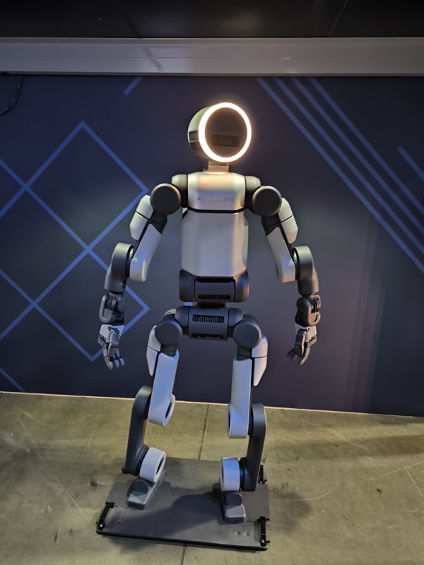
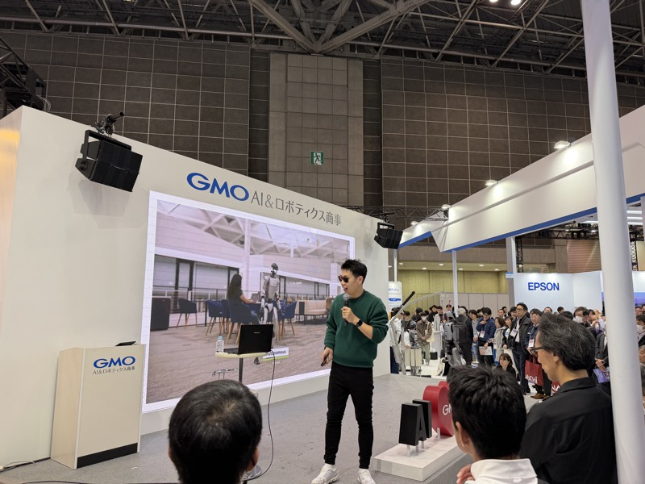
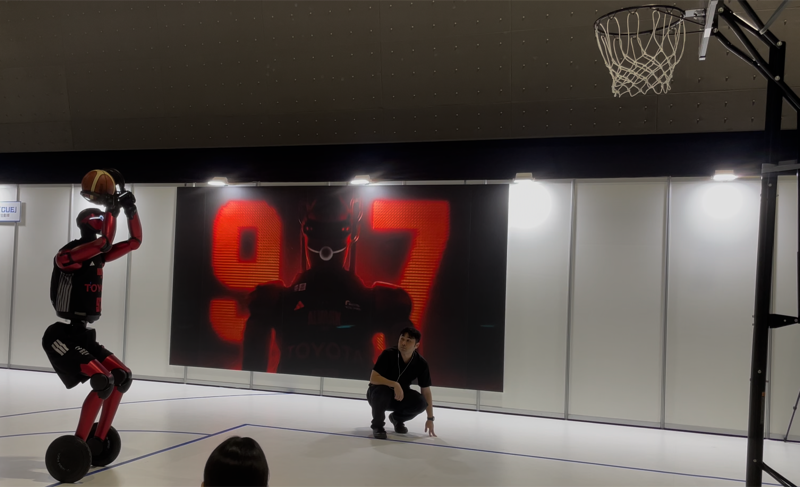
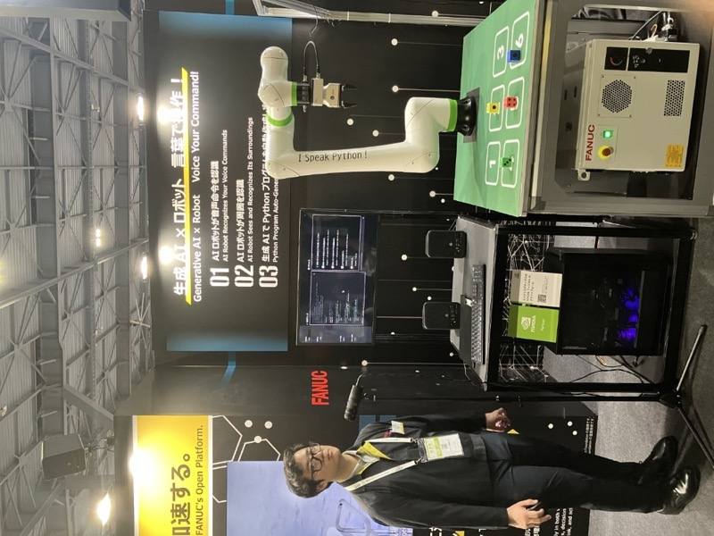
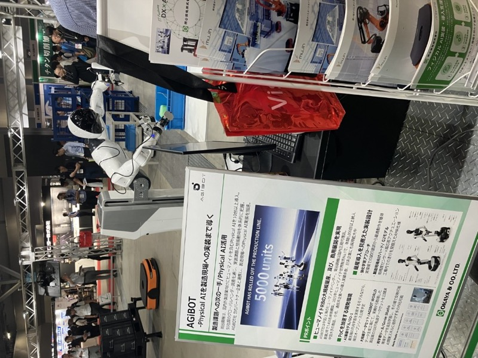

# ヒューマノイドロボットの物流展示

> 作成日：2026-07-02　最終更新日：2026-07-10

## 概要

MODEX 2026 ではヒューマノイドロボットが物流展示会に登場した。
まだ実用段階ではないが、「機能を誇る凝った展示」として物流業界への参入を示した。

Apptronik 等のヒューマノイドロボット。白いボディに光る円形の顔が MODEX 2026 フロアに登場。物流展にヒューマノイドが現れるのは日本では見られない光景だった（<a href="../../../Reports/202604-MODEX/Report.md">MODEX 2026 Report.md</a>）

## MODEX 2026 での観察

- Apptronik 等：白いボディに光る円形の顔。AMR・ASRS と同一フロアで展示
- Hyundai / Boston Dynamics：「当然のように、機能を誇る凝った展示」（Nippou）
- 物流展示会でヒューマノイドが展示されるのは日本の展示会では見られない光景

## ハノーバーメッセ 2026 での観察

IntelブースのAMR台車の上に立つヒューマノイドロボット。AMR×ヒューマノイドの融合が現実になっている。（ハノーバーメッセ 2026）

- **4体同調カンフーダンス**：YouTubeで見かける人型ロボットのカンフーダンスを会場で実演。バランスのリアルタイム制御が微妙なブレで目視できる
- **30軸以上の制御**：安川ロボットの6軸と対比して、ヒューマノイドの30軸超の制御技術が向上している
- **AMR×ヒューマノイド融合**：IntelブースではAMRの台車の上にヒューマノイドが乗り、移動しながら作業するデモ
- **犬型ロボット**：韓国メーカーが人の全力疾走以上のスピードで走る犬型ロボットを通路で実演。点検・見回り・熊ヨケに実用化可能
- 社名不明の企業が出展（動画撮影済みだが社名確認できていない）

## iREX2025（2025国際ロボット展、東京ビッグサイト、2025年12月）での観察

iREX2025は過去最多673社・3,334小間が出展し、視察者が「今年視察した展示会の中で最高の熱量」と評した回だった。会場で最も人を集めていたのはGMO AI&ロボティクス商事のブースで、中国製ヒューマノイド2台がステージに立っていた。

GMO AI&ロボティクス商事ブース。2台の中国製ヒューマノイドがステージに立つ。スクリーンには「AI×ロボティクスは人類史上最大の産業革命」（iREX2025）

- **中国製ヒューマノイドの圧倒的完成度**：動画では半信半疑だったが、実物の滑らかなダンスを目の当たりにして「絶望的な差」を感じた。日本の有名メーカーが出しているのは相変わらずの6軸か、せいぜい双腕。**中国との差は10年以上あり、対抗しようとする意味すら薄い**という結論に至った
- **GMOグループの本格参入**：「ロボティクス商事」としてGMOが中国製ヒューマノイド・AMRの国内販売代理店ポジションを確立。YouTuberの「ものづくり太郎」氏が登壇し、来場者を集める仕掛けを作っていた

 

左：「Gemini Robotics を活用した社会へ」スライド。右：スクリーンにヒューマノイドロボットの実演動画（GMOブース / iREX2025）

- **Gemini Roboticsの実装訴求**：GoogleのGemini Roboticsを活用した社会実装を前面に出したスライド展示。AIモデルとヒューマノイド制御の統合が実用フェーズに近づいていることを示す
- 「この分野のスピードは、NCなんかの年単位とはレベルが違う」（ものづくり太郎氏の言葉、山崎Nippouより）

 

GMOブース展示：Unitree Go2-W（電動四足歩行ロボット）。「高い走破性で警備・点検」を訴求（iREX2025）

- **犬型ロボットも中国の独壇場**：Unitree Go2-Wが警備・点検用途で展示。ハノーバーメッセで観察した韓国製犬型ロボットと同様、中国・アジア勢が実用アプリケーション訴求で先行

## Robot Technology Japan 2026（愛知・Aichi Sky Expo・6月）での観察

産業用ロボット専門展でも、AI音声操作・ヒューマノイドの展示が急増していた。特にファナックのAI音声認識ロボットと、トヨタのバスケットボールAIロボットの実演は来場者が黒山の人だかりとなっていた。

トヨタ バスケットボールAIロボット「CUE7」。身長219cm・体重74kg。前モデルCUE6から約50kg軽量化。2輪でバランスを維持しながらドリブル・シュート動作を実演（Robot Technology Japan 2026）

- **トヨタ CUE7**：2輪構成の足部で高速移動しながらドリブル・シュートを安定してこなす姿勢制御技術が印象的だった
- **ファナック × NVIDIA**：産業用ロボットアームを従来のティーチング作業なしで動作させる音声認識デモ。来場者の音声指示をAIが解釈し実行。複雑な指示では失敗する場面もあったが、多くの指示に適切に反応していた

 

FANUC×NVIDIAブースのAI音声操作デモ。音声指示でロボットアームを動作させる展示（Robot Technology Japan 2026）

- **AGiBOT（中国）**：ヒューマノイドロボットを5000台生産済みと訴求。商用展開を見据えた実装設計をアピール
- **AGIRobots**：「名古屋発ヒューマノイドスタートアップ」を掲げる国産ヒューマノイド。製造業向け実用化を志向
- **YUASA**：複合加工機・AMRのブース内に小型ヒューマノイド2体を展示。要素技術メーカーもヒューマノイド開発に参入している様子がうかがえた

 

AGiBOT（中国）Physical AIヒューマノイド。生産実績5000台をアピールする展示（Robot Technology Japan 2026）

## 技術的示唆

- 2026 年時点では実用段階ではないが、物流業界での将来ニーズを探索中
- ピッキング・仕分けでの活用がターゲット
- AMR 上にアーム（コボット・ヒューマノイド）を乗せる統合提案が増加
- **国内展示会でも中国製ヒューマノイドの実演が定着し始めた**（iREX2025）。海外展示会（MODEX・ハノーバーメッセ）での観察が、日本国内の展示会にも波及している
- 日本メーカーの6軸・双腕ロボットと中国製ヒューマノイドの技術差は「10年以上」で、正面対抗は現実的でない（iREX2025山崎所感）

## スギヤスとの関連

- 直接の関連は薄い
- ただし、ヒューマノイドが作業する「ステーション」としてのリフト・作業台の需要が将来発生する可能性
- GMOのような「販売代理店」ポジションを中国製ロボティクスメーカーとの間に確立する動きが国内で加速している点は、購買・調達戦略の観点で継続観察の価値あり

## 継続観察

- ProMat 2027（Chicago）でのヒューマノイド展示動向を引き続き観察
- ハノーバーメッセのカンフーダンス・犬型ロボット出展社名の特定（動画あり）
- ZeroErr（中国）のeRobアクチュエータ：ヒューマノイット関節部品サプライヤーとして注目
- GMO AI&ロボティクス商事の代理店展開動向（Gemini Robotics統合の進捗含む）

## 関連企業

- [ZeroErr（ヒューマノイド関節アクチュエータ）](../../Companies/ZeroErr.md)

## 関連レポート

- [MODEX 2026 Report.md](../../../Reports/202604-MODEX/Report.md)
- [ハノーバーメッセ 2026 Report.md](../../../Reports/202604-HANNOVER/Report.md)
- [iREX2025（2025国際ロボット展）Report.md](../../../Reports/202512-InterRobot/Report.md)
- [Robot Technology Japan 2026 Report.md](../../../Reports/202606-RobotTechJapan/RobotTechnologyJapan2606-Report.md)

## 更新履歴

| 日付 | 内容 |
|---|---|
| 2026-07-02 | MODEX 2026 から初期作成 |
| 2026-07-02 | ハノーバーメッセ 2026（カンフーダンス・犬型・AMR融合・ZeroErr）を追記 |
| 2026-07-09 | iREX2025（GMO AI&ロボティクス商事の中国製ヒューマノイド・Gemini Robotics・Unitree Go2-W）を追記 |
| 2026-07-10 | Robot Technology Japan 2026（トヨタCUE7・ファナック×NVIDIA音声AI・AGiBOT・AGIRobots・YUASA）を追記 |
