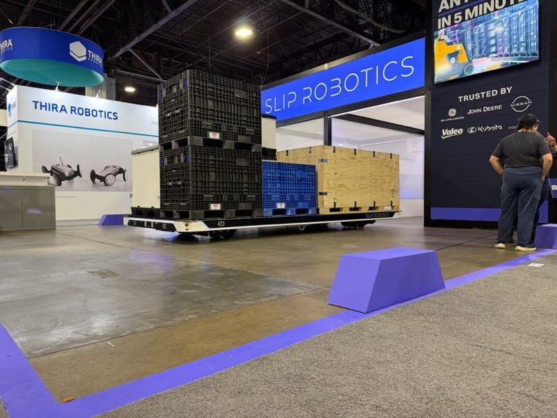
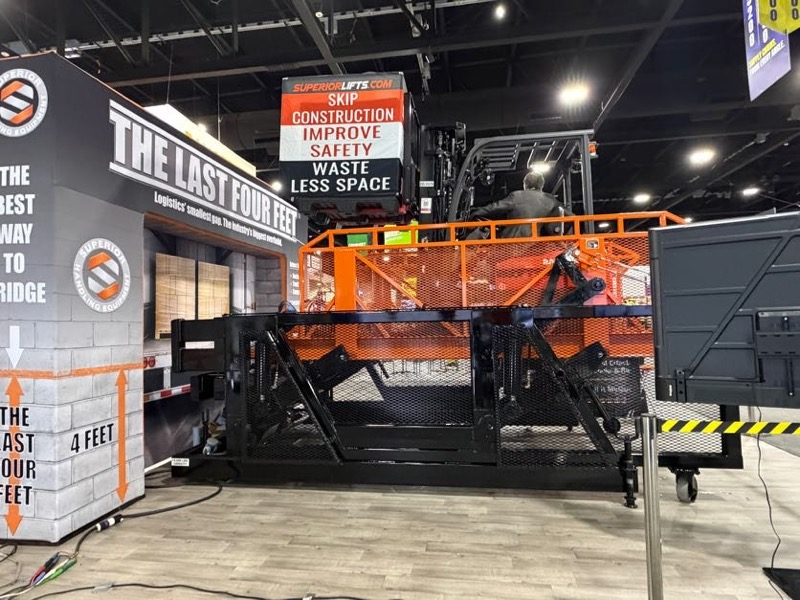

# トレーラー荷役自動化

## 概要

「5分でトレーラーを積み降ろし」を謳う自動化システムが MODEX 2026 で複数出展。
AGV/AMR の活用域が倉庫内部から「倉庫⇔トレーラー」の接続部分（ラストフィート）へ広がっている。

LIFTPOINT ブースの全景。Raymond のリーチスタッカーをリフト上に持ち上げ、コンテナ床面に高さを合わせて直接乗り入れを可能にする。「設計力を感じる」（Nippou）（<a href="../../../Reports/202604-MODEX/Report.md">MODEX 2026 Report.md</a>）

## MODEX 2026 での観察

### Slip Robotics

 

Slip Robotics（「AN ENTIRE TRAILER IN 5 MINUTES」）の展示。THIRA Robotics と隣接出展。トラック荷積みの完全自動化を謳う（<a href="../../../Reports/202604-MODEX/Report.md">MODEX 2026 Report.md</a>）

- 「AN ENTIRE TRAILER IN 5 MINUTES」
- フォークリフトなしでトレーラーを5分以内に積み降ろし完了
- デモ映像が会場モニターに映し出されていた：「Load or unload an entire trailer in under five minutes」
- THIRA Robotics と隣接出展

### LIFTPOINT

 

LIFTPOINT — フォークリフトをコンテナの高さに持ち上げ、海上コンテナへの直接乗り入れを可能にするリフトプラットフォーム。「設計力を感じる」（Nippou）（<a href="../../../Reports/202604-MODEX/Report.md">MODEX 2026 Report.md</a>）

- 「フォークリフトをコンテナの高さに合わせる」リフトプラットフォーム
- 海上コンテナへのフォークリフト直接乗り入れを可能にする
- 床面レベルのアクセスで、コンテナ積み下ろしのコスト・時間を削減
- Nippou「設計力を感じる」と評価

### Superior Lifts「The Last Four Feet」

 

Superior Lifts「The Last Four Feet」— トラックバースと荷台の最後の4フィートのギャップを解決するリフトプラットフォーム。「Skip Construction / Improve Safety / Waste Less Space」の3つのバリューを訴求（<a href="../../../Reports/202604-MODEX/Report.md">MODEX 2026 Report.md</a>）

- トラックバースと荷台の最後の4フィート（約1.2m）のギャップを解決
- Skip Construction / Improve Safety / Waste Less Space の3つのバリュー

## 技術的示唆

- 「倉庫と外部輸送のインターフェース」が次の自動化フロンティア
- AMR と固定リフトの組み合わせが解決策として浮上している
- 日本でもトレーラー荷役の人手不足は深刻で、市場ニーズは高い

## スギヤスへの示唆

- LIFTPOINT のコンセプト（フォークを上げてコンテナに乗り入れ）は既存フォーク製品との組み合わせとして参考になる
- 「最後の4フィート」問題を解くリフト製品ニーズが国内でも存在する可能性

## 関連企業

- [Slip Robotics](../Companies/Slip_Robotics.md)
- [LIFTPOINT](../Companies/LIFTPOINT.md)

## 関連レポート

- [MODEX 2026 Report.md](../../../Reports/202604-MODEX/Report.md)

## 更新履歴

| 日付 | 内容 |
|---|---|
| 2026-07-02 | MODEX 2026 から初期作成 |
| 2026-07-03 | MODEX 写真を3枚追加（Slip Robotics・LIFTPOINT・Superior Lifts）|
