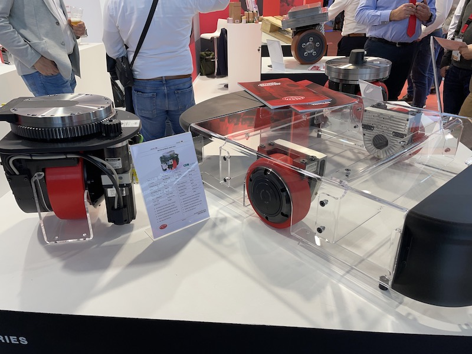
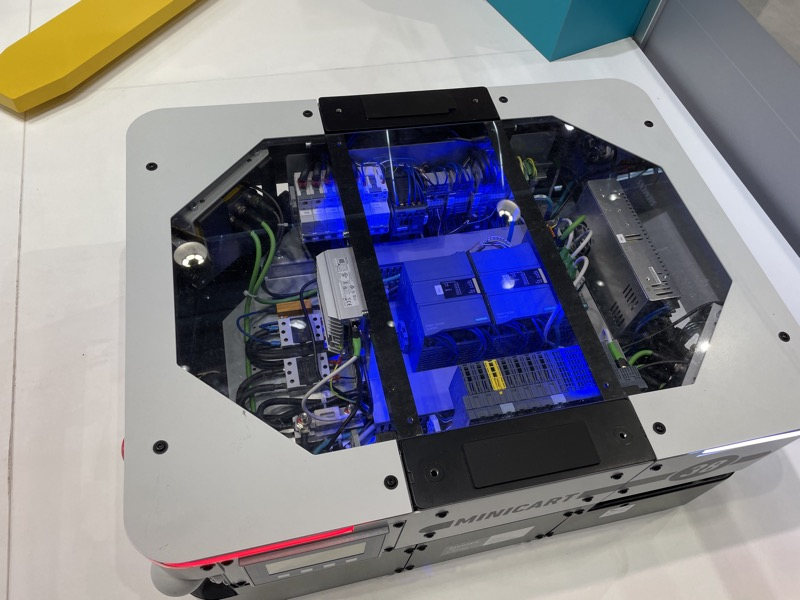

# ドライブユニットのオープンモジュール化

> 作成日：2026-07-08　最終更新日：2026-07-10

## 概要

AGV/AMRの核心部品であるドライブユニット（モーター＋コントローラー＋バッテリーの一体型ユニット）が、単体で調達可能な「部品」として市場に成立しつつある。LogiMAT 2025で複数の専業メーカーが同種の製品を展示しており、業界構造を根本から変える動きとして最重要技術発見のひとつとなった。

 

ドライブユニット（CDRシリーズ）各種。モーター内蔵の赤いホイールとコントローラーのセットが複数サイズで展示されていた（LogiMAT 2025 / 2026年3月12日）

## 観察された展示・技術

- ドイツメーカーのユニット：500kg積載・8時間稼働、電源オフ時に手動でも抵抗を感じない設計
- CDRシリーズ等、モーター内蔵ホイール＋コントローラーのセットが各種サイズで展示
- MINICART・GÖTTING社は内部制御機器（基板・配線・コントローラー）を透過的に見せる展示を実施

 

MINICARTのAMR内部を開示した展示（青LED照明）。制御基板・バッテリー・コントローラーが整然と収まる構造（<a href="../../../Reports/202503-LogiMat/Report.md">LogiMAT 2025 Report.md</a>）

## 関連企業

- ドイツのドライブユニット専業メーカー（社名未確認、橋本GM経由でサンプル依頼済み）
- MINICART、GÖTTING社（内部展示型AGV）

## 技術的示唆

オープンモジュール化により、業界の分業構造が3層に再編されつつある：

1. **ドライブユニット専門メーカー**（欧州・中国・国内）が部品を供給
2. **システムインテグレーター**がユニットを使い現場向けカスタムAGV/AMRを構築
3. **機械メーカー**（スギヤスのような）が既存の台車・リフト機器にドライブユニットを組み込み「電動化・自動化」を実現

## スギヤス製品への応用可能性

- 既存のリフト機器・台車製品に外部調達ドライブユニットを組み込むことで、一体開発せずに電動化・自動化を実現できる
- 磁気テープ式AMR等、自社製品ラインへの横展開の起点となる（[磁気テープ式AMRへの自社ドライブユニット搭載](../../Ideas/DriveUnit_MagneticTapeAMR.md)参照）

## 関連レポートへのリンク

- [LogiMAT 2025 Report.md](../../../Reports/202503-LogiMat/Report.md)

## 更新履歴

| 日付 | 内容 |
|---|---|
| 2026-07-08 | LogiMAT 2025 訪問記録から初期作成 |
