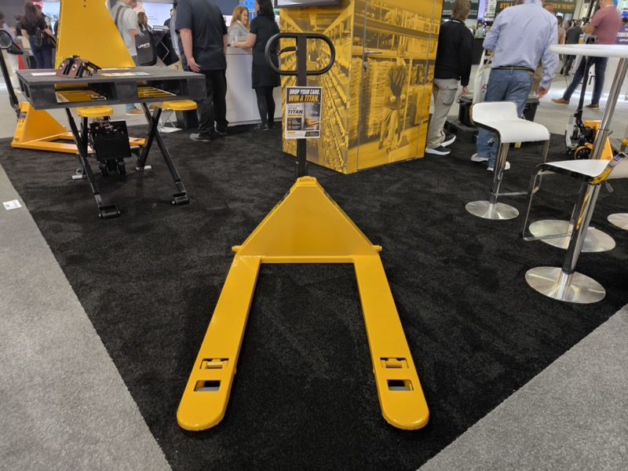

# 後方倒れ止め（手動ハンドパレット用）

## 概要

MODEX 2026 にて、手動ハンドパレットジャックに後方倒れ止めの柵を取り付けただけのシンプルな安全装置が出展されていた。
Nippou に「ものすごく単純な装置だが、安全思考の高まりは間違いのない流れ」と記述されている。

Titan（米国）の手動パレットジャック。剛性と安さを売りにする設計で、日本の手動ハンドと方向性が近い。後方倒れ止めが取り付けられた同種のモデルが MODEX で確認された（<a href="../../../Reports/202604-MODEX/Report.md">MODEX 2026 Report.md</a>）

## 観察内容

 

Titan（米国）の手動パレットジャック。剛性と安さを売りにする設計。後方倒れ止めが取り付けられた同種のモデルが MODEX で確認された。（左）カウンター越しのアングル。（右）正面アングル（<a href="../../../Reports/202604-MODEX/Report.md">MODEX 2026 Report.md</a>）

 

Bishamon（日系）の手動パレットジャック（青・Piston Hydraulic）。このようなハンドのボディプレートに後方倒れ止め柵を後付けするシンプルな安全装置が MODEX で出展されていた（<a href="../../../Reports/202604-MODEX/Report.md">MODEX 2026 Report.md</a>）

- 手動ハンドのボディプレートに後方倒れ止めの柵を取り付けたもの
- 構造は極めてシンプル
- 橋本 GM が注目し、正式提案予定とされている

## 市場背景

- 安全思考の高まりは北米・欧州でも確実なトレンド
- パーキングブレーキ（既存の安全安心パック）に次ぐ単価引き上げ貢献商品になりえる

## スギヤスへの示唆

- 「安全安心パック」の次のアイテムとして有望
- 開発コストが低い（シンプルな構造）
- 北米での訴求ポイントを日本市場に転用できる

## アクション

- 橋本 GM が正式提案予定
- 既存パーキングブレーキの販売状況を参考に規模感を試算する

## 関連レポート

- [MODEX 2026 Report.md](../../../Reports/202604-MODEX/Report.md)
- [MODEX 2026 Nippou.txt](../../../Reports/202604-MODEX/Nippou.tt)

## 更新履歴

| 日付 | 内容 |
|---|---|
| 2026-07-02 | MODEX 2026 Nippou.txt・Report.md から初期作成 |
| 2026-07-03 | MODEX 写真を2枚追加（Titan 正面・Bishamon パレットジャック）|
