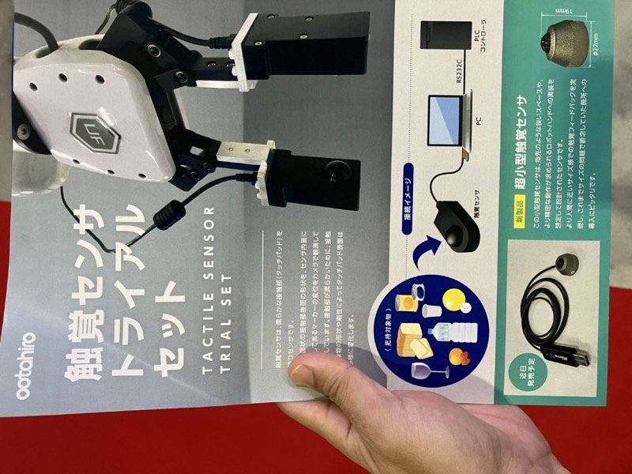
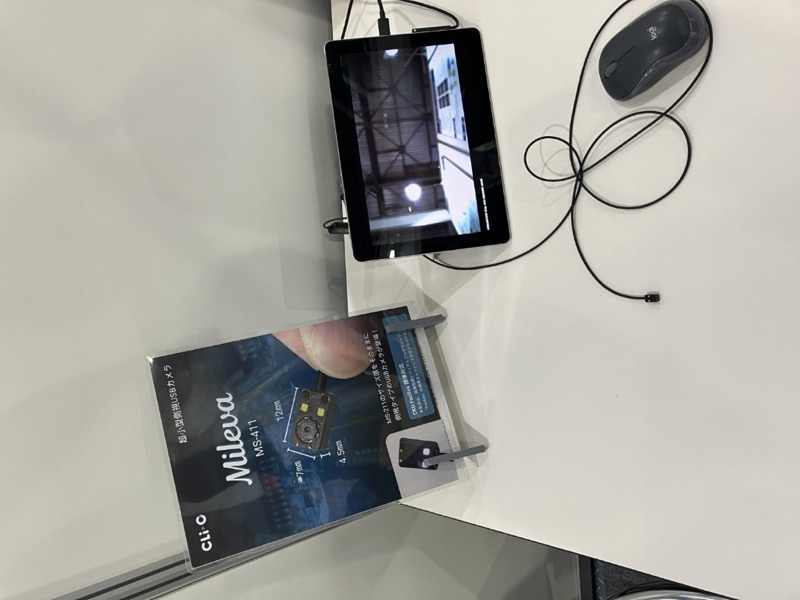
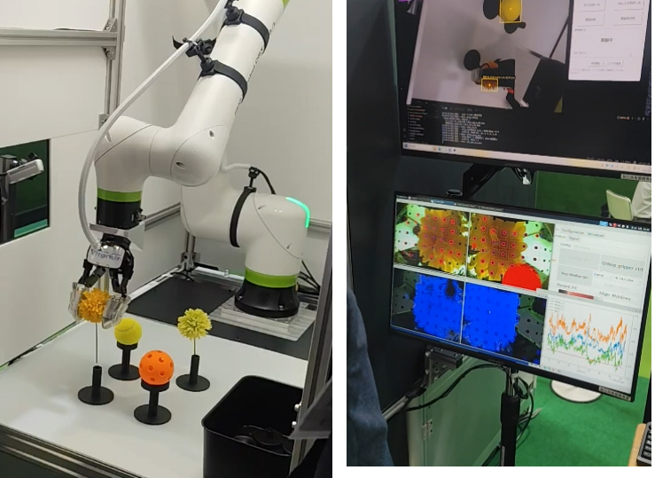
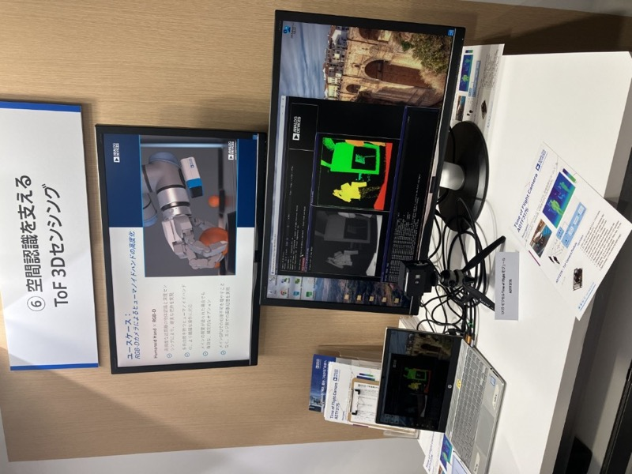

# 触覚センシング技術

> 作成日：2026-07-10　最終更新日：2026-07-10

## 概要

ロボットハンド・グリッパの「力加減」を制御するための触覚センシング技術。ひずみゲージに頼らず、画像処理でワークとの接触・滑りを判定する方式が新しい潮流として登場している。Robot Technology Japan 2026では、複数のブースでこの分野の展示が見られた。

太田廣ブースの触覚センサトライアルセット。柔らかな接触部（タッチパッド）表面の変位をカメラで計測する原理（Robot Technology Japan 2026）

## 観察された展示・技術

### 太田廣

- 触覚センサに採用されている超小型カメラと画像処理技術が要注目。カメラは7mm×12mmという小型サイズでありながら鮮明な画像を取得
- カメラはクリオ社（愛知県一宮市）が開発。指先サイズの超小型触覚センサも近日発売予定とのこと

 

 

（左）太田廣の触覚センサ。（右）FingerVision — 花びらを潰さずに把持できる透明パッド型グリッパ（Robot Technology Japan 2026）

### FingerVision — 触覚センサ内蔵グリッパ

展示の中で最も印象的だったグリッパ技術。**花びらを潰さずに把持**できるデモに驚かされた。

**動作原理：**
1. 透明な柔軟パッドに等間隔でドットをプリント
2. カメラでドットの移動と対象ワークとの位置関係を追跡
3. ワークが触れているか・滑っているかをリアルタイム判定
4. 滑らないギリギリの力でつかむ

| 項目 | 内容 |
|------|------|
| 力の検出方式 | 画像ベース（ひずみゲージ不使用） |
| 価格 | 50万円以上 |
| 将来性 | 画像で力を判断する新トレンドの先駆け |

太田廣ブースの類似製品と原理は近いが、**ひずみではなく画像で力を判断**するのが新しい潮流。高額ながら将来的に主流になる可能性あり。

### Analog Devices — ToF 3Dセンシング

Analog Devices Time of FlightカメラモジュールADTF3175。ヒューマノイドハンドの高度化など空間認識を支える距離画像センサーとして紹介（Robot Technology Japan 2026）

- Time of Flight方式の距離画像センサー。ヒューマノイドハンドの高度化（RGB-Dカメラによる把持対象物の位置・姿勢推定）をユースケースとして紹介
- 触覚センシング（接触面の変位・滑り検出）とは異なるアプローチだが、「ロボットハンドが対象物をどう認識するか」という同じ課題への回答という点で関連が深い

## 技術的示唆

- ロボットハンド・グリッパの高度化には、力覚（触覚）・視覚（ToF/RGB-D）の両輪が必要になりつつある
- 画像ベースの力検出（FingerVision方式）はひずみゲージ方式より高額だが、精度・柔軟物対応で優位性がある
- 超小型カメラ×画像処理という組み合わせが、複数社（太田廣×クリオ、FingerVision）で独立に発展している

## 実生活・仕事への応用可能性

- 直接の関連は薄いが、柔軟物・精密把持が必要な用途（食品・部品の選別搬送）への応用可能性は継続観察の価値あり
- クリオ社（愛知県一宮市、地理的に近い）は今後の接点候補

## 関連レポート

- [Robot Technology Japan 2026 Report.md](../../../Reports/202606-RobotTechJapan/RobotTechnologyJapan2606-Report.md)

## 更新履歴

| 日付 | 内容 |
|---|---|
| 2026-07-10 | Robot Technology Japan 2026 から初期作成（太田廣・FingerVision・Analog Devices） |
