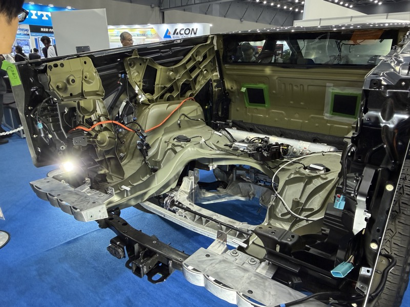
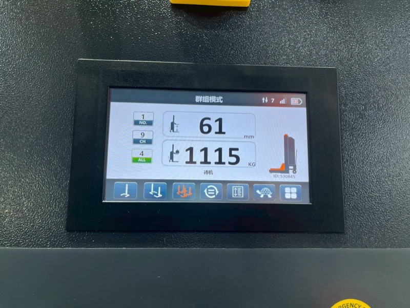
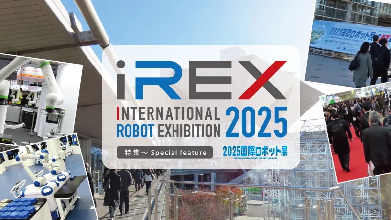

# 2025年 物流・製造 テクノロジートレンド

> 作成日：2026-07-06　最終更新日：2026-07-16

## 概要

2025年の現地視察・工場訪問から抽出したトレンド。

---

## LogiMAT 2025（シュトゥットガルト、2025年3月）

 

ドライブユニット（CDRシリーズ）各種。モーター内蔵の赤いホイールとコントローラーのセットが複数サイズで展示（<a href="../../Reports/202503-LogiMat/Report.md">LogiMAT 2025 Report.md</a>）

### 主要トレンド

#### 1. AMR/AGVの多様化・普及化（「展示」から「選択」の段階へ）

もはや「AMRを展示する」のではなく、「どのAMRを選ぶか」という選択の段階に欧州は入っている。棚上りAMR・パレット搬送AMR・マニピュレーター付AMR・自律型フォーク・牽引型AMR・配送清掃ロボットまで多様化が進んだ。

#### 2. ドライブユニットのオープンモジュール化

モーター＋コントローラー＋バッテリーを一体供給するベンダーが複数存在し、部品として調達可能な「モジュール」として成立。AGV/AMR業界の分業構造（部品メーカー→システムインテグレーター→機械メーカー）を根本から変える動き（詳細は[ドライブユニットのオープンモジュール化](../Knowledge/Manufacturing/DriveUnit_OpenModularization.md)）。

#### 3. 中国メーカーの欧州進出加速

EP社・HUAGANG・STAXX・SEER ROBOTICS・Yi-Liftなど、ローテク（ハンドパレット・スタッカー）からハイテク（AMR）まで、中国メーカーが品質と価格競争力の両面で存在感を拡大。

#### 4. エルゴノミクス機器への需要拡大

労働力の高齢化・多様化対応として、傾斜・高さ調整テーブル、スケール付き電動パレット、コンパクト垂直リフト等への需要が欧州で高まっている。

#### 5. AMRトップモジュールの標準化（Nord Modules）

AMR本体でなく「上物（トップモジュール）」を標準化するアプローチが登場。AMR本体ベンダーとは独立してアタッチメントを選択・交換できる。

### 技術変化

- ドライブユニットが部品として単体調達可能に（業界構造の3層再編）
- 牽引台車の複数軸ピボット機構によるカーブ追従（詳細は[牽引台車のカーブ追従機構](../Knowledge/Logistics/TowCart_CurveTracking.md)）
- 欧州と日本の物流機器価格が、人件費差（2〜3倍）に反して大きく乖離しない構造（量産効果・補助金・価格転嫁文化・製品ミックスが要因）

### 新商品開発への示唆

- 小型フォークリフト対応移動型整備リフト（雷電タイプ）：[詳細](../Ideas/RaidenLift_MobileServiceLift.md)
- 傾斜テーブルリフト：[詳細](../Ideas/TiltTableLift.md)
- BX輸送想定の高さ可変サスペンション式牽引台車：[詳細](../Ideas/AdjustableSuspension_TowCart_BX.md)
- 磁気テープ式AMRへの自社ドライブユニット搭載：[詳細](../Ideas/DriveUnit_MagneticTapeAMR.md)
- AMRトップモジュールとしてのリフト機器展開：[詳細](../Ideas/AMR_TopModule_LiftDeployment.md)

### 継続観察すべきテーマ

- Stellana社（ステアリングホイール）との直接取引の進捗
- ドイツ製ドライブユニットのサンプル評価結果
- LogiMAT出展という長期目標の実現可能性

### 関連レポート

- [LogiMAT 2025 Report.md](../../Reports/202503-LogiMat/Report.md)

---

## Electric China 2025（electronica China、上海・天津、2025年4月）

 

NIDECドライブ・テクノロジー（中国）のショールーム。遊星歯車減速機のラインナップ展示（<a href="../../Reports/202504-ElectricChina/Report.md">Electric China 2025 Report.md</a>）

### 主要トレンド

#### 1. 「モーターの一段下」が中国電子部品サプライチェーンの強み

現地に行けば駆動部品（モーター・ドライブユニット）そのものの展示があるだろうという想定は外れ、実際は基板・トランジスタ・マイコン・抵抗・コンデンサ等、一段下のレベルの部品展示が中心だった。ドライブユニットはこれらの部品を「インテグレーション」することで成立する商品であるという理解が、現地で得られた最大の収穫。

#### 2. NIDECドライブ・テクノロジー：Amazon実績の裏にある工程ノウハウ

NIDEC中国法人（浙江省）は遊星歯車減速機の一貫生産で売上高100億円超。Amazonの棚運搬型自動搬送機にギヤードモータードライブホイールを納入した実績があり、採用理由は「ドライブホイールの停止精度」。競争力の源泉は設備規模ではなく、誘導加熱焼き嵌め・歯車軸圧入という工程精度管理ノウハウにある（詳細は[NIDECドライブ・テクノロジー](../Companies/NIDEC_DriveTechnology.md)）。

#### 3. 防水ナノコーティング技術（HZO）

基板・デバイスを目に見えないほど薄い皮膜で完全防水にする技術。楽天koboデバイスを水槽に沈めてもタッチパネルが正常動作する実演は説得力があった（詳細は[HZO](../Companies/HZO.md)）。

#### 4. 天津の都市規模・EV普及構造

天津だけで東京並みの経済規模。EVはブランド忠誠度が低く、価格とデザイン重視で普及。ガソリン車・古い車がほとんど走っていない点は、自動車整備・周辺機器市場の構造変化（バッテリー搭載位置・車体下部センサー配置の変化）を示唆する。

### 技術変化

- 電子部品サプライチェーンの厚みが「モーター内製」を部品組み合わせレベルで現実的な選択肢にしている
- 中国EV市場では「擦り合わせ技術＋メンテナンスが参入障壁」という従来の自動車業界の常識が当てはまらない

### 新商品開発への示唆

- モーター・コントローラーの内製化検討：[詳細](../Ideas/DriveUnit_InHouseProduction.md)
- HZOの防水コーティング技術のIoTセンサーへの応用検討

### 継続観察すべきテーマ

- Artery Technology・Cmsemicon（電動車用コントローラー）との小ロット取引条件
- NIDECドライブホイール・コントローラーセットのサンプル評価結果

### 関連レポート

- [Electric China 2025 Report.md](../../Reports/202504-ElectricChina/Report.md)

---

## 生成AI World・ロボット展示会（名古屋、2025年10月）

 

テスラ・サイバートラックの完全分解展示。スペースフレーム構造・大電流配線が剥き出しで公開されていた（ポートメッセなごや / 2025年10月30日）

### 主要トレンド

#### 1. 国内展示会でもAMRが「当たり前」に

ソフトバンクロボティクスのAMRデモに黒山の人だかり。センサーメーカーのHOKUYOでさえAMR活用事例をこともなげに展示しており、コンポーネントサプライヤーレベルでAMR前提の展示が定着した（詳細は[AMRのコモディティ化](../Knowledge/AMR/Commoditization.md)）。

#### 2. テスラ・サイバートラックの完全分解展示

EV技術の透明性と部品点数の少なさが印象的だった。スペースフレーム構造・ハーネス取り回し・電池パック・インバーター回路まで、8枚の写真で詳細に記録。

#### 3. 新規サプライヤー候補の発掘

昭立電気（基板実装、大電流対応、少ロット可）、アドバンテック（AMR自社開発、ソニーカメラ×ニデックドライブユニット構想）と、有望な商談の種を複数発見。

### 技術変化

- コンポーネントサプライヤー（センサーメーカー等）までAMR活用事例を持つのが当然に
- EVの完全分解展示という手法が、技術の透明性を訴求する新しい展示スタイルとして定着

### 新商品開発への示唆

- ニデックのドライブユニットを使ったAMR試作を前川TL・奥村へ指示（アドバンテックとの連携）
- 大電流基板は昭立電気、弱電はNNPという仕入れの棲み分け候補

### 継続観察すべきテーマ

- 昭立電気との取引条件確認
- アドバンテックのAMR試作進捗
- HOKUYOのエリアセンサー活用の再検討（現状価格が高く「もったいない」使い方）

### 関連レポート

- [生成AI World・ロボット展示会 2025 Report.md](../../Reports/202510-GenerativeAI/Report.md)

---

## EP Equipment 社内AMR実稼働（2025年11月）

 

EP社（浙江中力機械）の自社工場内でAMR 150台が実稼働中。鉄製箱型パレットをフリーロケーションで自律段積みしている。（浙江省 / 2025年11月26日）

### 主要トレンド

#### 1. AMRが「展示」から「実工場稼働」へ移行

「展示会のサンプルはさんざん見てきたが、現実には初めて見た」（山崎 Nippou）

EP Equipment（浙江中力機械）が自社工場でAMR 150台を実稼働。鉄製箱型パレットをフリーロケーションで段積みする完全自律システムが商用運用中だ。日本の展示会の「デモ」レベルとは一線を画す現実がある。

#### 2. 中国電動フォークリフトメーカーのAMR内製化

EP社は電動フォークリフト専業から、自社AMR開発・運用まで展開した。開発者400名のうち200名がロボティクス担当。フォークリフトメーカーがAMRを内製・自社活用することで、製品としての信頼性検証を並行して行う構造だ。

#### 3. Ubuntuベースのロボティクス開発が主流化

EP社AMRの制御ユニットはUbuntuを採用。ROS2との親和性から、世界のロボティクス開発標準はLinuxに収斂しつつある。

#### 4. 中国電動フォークリフト市場の量産体制確立

EP社の年間30万台超・7工場体制は、日本サプライヤーとは桁違いのスケール。バッテリー・油圧シリンダーまで完全内製し、OEM製造まで請け負う。電動フォークリフトの量産コスト競争は中国メーカーがリードしている。

### 技術変化

- フリーロケーション段積みAMRが実用フェーズへ
- AMR×フォークリフトのハイブリッド製品（スタッカー型AMR）が量産段階
- Ubuntu/ROS2ベースのロボティクス制御が事実上のスタンダードに

### 新商品開発への示唆

- 簡易ティーチング式電動車：EP社が展示していた製品。スギヤス製品との組み合わせや代替として検討価値がある
- 両シリンダークリアビュースタッカー：視野確保と二軸制御の両立。スギヤス製品への応用検討
- フリーロケーションAMRとの連携を前提にした製品設計が次の要件になる

### 継続観察すべきテーマ

- EP社ロボティクス専用開発センターの動向（2026年開設予定）
- フォークリフトメーカーによるAMR内製化の他社展開（中国他社）
- 簡易ティーチング式電動車の詳細仕様・市場展開

### 関連レポート

- [EP Equipment 工場訪問 2025年11月 Report.md](../../Reports/202511-EP/Report.md)

---

## Automechanika Shanghai 2025（上海、2025年11月）

 

EAEブースの制御盤。「群組模式（グループモード）」で7台の移動柱リフトをリンクし、位置61mm・荷重1115KGをリアルタイム表示する。（上海 / 2025年11月28日）

### 主要トレンド

#### 1. 自動車整備リフトの中国メーカー乱立と価格勝負

出展社は約50社（廣田GM集計では46社）にのぼり、柱物・シザーの2形式が外観も価格帯も似通ったまま乱立している。「とにかくメーカーが多すぎる」（山崎 Nippou）状態で、価格勝負が基本線。ただしEAE・SHUNLIのような大手は品質・電子制御で明確に差別化している。

#### 2. 電子的同調・重量計測の民主化

EAEの移動柱リフトは、無線グループモードで最大7台以上をリンクし、各台の位置（mm単位）・総荷重（kg単位）をタッチパネルにリアルタイム表示する。ワイヤーエンコーダーやWi-Fi同調による電気的な同調機構は複数社で確認でき、「FRZなどの初期コンセプトにあった左右独立で動くという発想を、既に実現している」（山崎 Nippou）水準にある。

#### 3. EVシフトを見据えたリフト開発

TCEの「E-VEHICLE BATTERY LIFTING TABLE」のように、EVバッテリー・エンジン・ギヤボックスそれぞれに対応したアダプターを備えるリフト専用機が登場している。市街地の自動車・バイクは走行音が無音に近いレベルでEV化が進んでおり、「EVの進化に合わせたリフトの開発が必要」（淵田 Nippou）という認識は、現地の交通量からも裏付けられる。

#### 4. 車検制度の違いが整備インフラ需要を規定する

「車検的なものは、新車購入後6年経過後とのことで、車検を中心とした制度ビジネスは存在しない」（山崎 Nippou）。日本のような整備工場・ガソリンスタンドの密度は市街地でも郊外でも見られず、各国の車検・法定点検制度の違いが、整備リフト需要の構造そのものを左右することが確認された。

### 技術変化

- 移動柱リフトの無線グループ同調＋荷重表示が実用レベルで普及
- リンク結合部はキープレート・ナット止めが主流で、ラグの1点締めは少数派
- シザーリフトは直列2気筒×2セット（計4本）構成で薄型化を図る設計が広がる
- EVバッテリー脱着専用のアダプター付きリフティングテーブルが製品化

### 新商品開発への示唆

- 電子的同調・重量計測機構をスギヤス製品へ応用できないか検討する余地がある
- EV普及を見据えたバッテリー・モジュール脱着対応リフトのアダプター展開
- 大型ドライブオン・コラムリフトはビシャモンで取り扱いを検討する価値がある（廣田GM）
- 「形鋼の存在感や差別化は明白」（山崎 Nippou）という強みを、価格勝負一辺倒の中国市場でどう訴求するかが課題

### 継続観察すべきテーマ

- EAE・SHUNLIの電子的同調機構の詳細スペック・調達可能性
- 中国製リフトの「中国製との違いは何か」問題（MANUVIT視察でも同種の課題が浮上済み）
- 各国の車検・法定点検制度と整備インフラ需要の相関

### 関連レポート

- [Automechanika Shanghai 2025 Report.md](../../Reports/202511-Automechanika-Shanghai/Report.md)

---

## iREX2025（2025国際ロボット展、東京ビッグサイト、2025年12月）

 

iREX2025 公式バナー。第26回・過去最多673社・3,334小間が出展（出典：robot digest、https://www.robot-digest.com、2025年12月）

2年に1度開催の国際ロボット展。過去最多の規模で、視察者が「今年視察した展示会の中で最高の熱量」と評した。

### 主要トレンド

#### 1. 中国製ヒューマノイドの圧倒的完成度と10年以上の技術差

会場で最も人を集めていたGMO AI&ロボティクス商事ブースに、中国製ヒューマノイド2台が展示された。動画では半信半疑だったが、実物の滑らかなダンスを見て「絶望的な差」を実感。日本の有名メーカーは相変わらずの6軸・双腕にとどまり、「対抗しようとする意味すら薄い」水準の差がついている（詳細は[ヒューマノイドロボットの物流展示](../Knowledge/Humanoid/Humanoid_Logistics.md)）。

#### 2. AMRコントローラーのコモディティ化（SEER = 「インテル入ってる？」)

中国AMR市場ではSEER製WLR-719コントローラーが事実上の標準。基礎知識のあるエンジニアであれば同コントローラーでAMRを構築できる水準まで部品化が進んでいる（詳細は[AMRのコモディティ化](../Knowledge/AMR/Commoditization.md)）。廣田GMのSEERショールーム見学（2026年3月）が確約された。

#### 3. GMOグループの「ロボティクス商事」本格参入

GMOが中国製ヒューマノイド・AMRの国内販売代理店ポジションを確立し、YouTuberとのコラボで集客する新しいマーケティング手法を見せた（詳細は[GMO AI&ロボティクス商事](../Companies/GMO_AI_Robotics.md)）。

#### 4. IAIの新しい導入モデル：シミュレーション先行公開

IAIのロボットコンベヤ事業は、自社シミュレーションソフトを事前公開して顧客が十分検討できる仕組みを整え、見積もりは代理店経由、設置はユーザー自身が行うという新しい導入フロー。防塵・防滴のロボシリンダーも水場現場への提案可能性を示した（詳細は[IAI](../Companies/IAI.md)）。

#### 5. DMP商社経由の台湾・中国情報網

数ヶ月前に接触したDMP（パチンコ関連半導体に強み、搬送装置を成長の柱に検討中）から継続的に有益な情報を得ている。SEER Roboticsとの接点もDMP経由（詳細は[DMP](../Companies/DMP.md)）。

### 技術変化

- 中国製ヒューマノイド・四足歩行ロボットの実用アプリケーション訴求（警備・点検用途のUnitree Go2-W等）が国内展示会にも波及
- AMRコア技術（コントローラー・制御ソフト）の部品化・コモディティ化が加速。差別化はシステム統合フェーズへ移行
- 「シミュレーション先行 → 代理店見積 → ユーザー設置」という新しい機器導入モデルの登場

### 新商品開発への示唆

- 水場対応の防塵防滴ロボシリンダー（IAI）の考え方は、スギヤス製品の水場現場向け提案の参考になる
- 中国製ロボティクス製品の国内販売代理店（GMO型）というビジネスモデルは、購買・調達戦略上の選択肢として観察継続の価値

### 継続観察すべきテーマ

- 廣田GMによるSEERショールーム見学（2026年3月）の結果
- DMPとの取引・協業の具体的展開
- GMO AI&ロボティクス商事の代理店展開・Gemini Robotics統合の進捗

### 関連レポート

- [iREX2025（2025国際ロボット展）Report.md](../../Reports/202512-InterRobot/Report.md)

## 更新履歴

| 日付 | 内容 |
|---|---|
| 2026-07-03 | EP Equipment 2025年11月工場訪問から初期作成 |
| 2026-07-08 | LogiMAT 2025（3月）のトレンドを追記 |
| 2026-07-08 | 生成AI World・ロボット展示会 2025（10月・名古屋）のトレンドを追記 |
| 2026-07-09 | iREX2025（12月・東京）のトレンドを追記 |
| 2026-07-10 | Electric China 2025（4月・上海天津）のトレンドを追記 |
