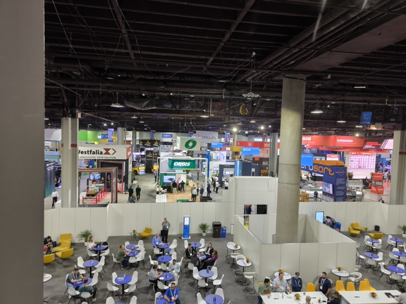
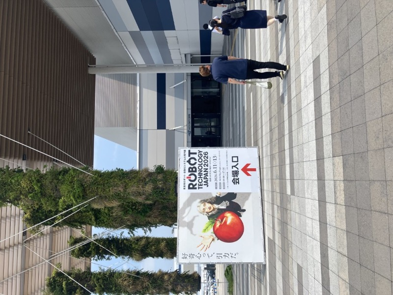

# 2026年 物流・製造 テクノロジートレンド

> 作成日：2026-07-02　最終更新日：2026-07-10

## 概要

2026年の北米・欧州展示会（[MODEX 2026 Report.md](../../Reports/202604-MODEX/Report.md)）から抽出したトレンド。

---

MODEX 2026 初日（4/14）のアトランタ会場。AMR・ASRS・ヒューマノイドから安全機器まで、物流自動化の全カテゴリが集結した

## MODEX 2026（アトランタ・4月）

### 主要トレンド

#### 1. AMR のコモディティ化が完成段階へ

「AMR は既にコモディティ。設計力・信頼性・コスト以外で差別化できなければ市場に残れない」（山崎）

- 中国・インド・韓国・米国・オランダが同一土俵
- 機能での差別化よりも「導入障壁の低さ」「保守性」「既存設備との統合」に競争軸が移行
- 日本の展示会で見えていた世界観は 3〜5 年遅れだった

#### 2. 中国勢の安全性への自信が突出

- 無人フォークが来場者の真横で 5〜6m の高さにパレットを積み上げるデモを実施
- 「安全性への絶対的な自信がないとできない芸当」
- 日本メーカーではまず見られない胆力

#### 3. ヒューマノイドが物流展に登場

- Apptronik・Hyundai / Boston Dynamics が出展
- まだ実用段階ではないが、物流会社への訴求を開始
- 「機能を誇る凝った展示」として印象を残す

#### 4. 「最後のフィート」の自動化が浮上

- トレーラー積み降ろし（Slip Robotics：5分で全荷役）
- コンテナへのフォーク乗り入れ（LIFTPOINT）
- バースと荷台のギャップ（Superior Lifts：The Last Four Feet）
- 倉庫内部だけでなく「倉庫と外部輸送の接続部分」が次の自動化フロンティア

#### 5. 在庫可視化・デジタルツイン連携

- DEXORY（英国）：8m マストで棚全体をスキャンし「Storage Health」を可視化
- Raymond WMS との一体提案が増加
- データ収集・デジタルツインへの統合が標準化しつつある

#### 6. サブスクリプション型設備販売

- Ballymore（米国）が工場向け設備を月額 $114〜$395 で提供
- 購入ではなくオペレーティングコストとして設備を位置づける
- 日本市場への展開可能性

#### 7. 安全機能の高付加価値化

- 後方倒れ止め（手動ハンド用）のシンプルな安全装置が出展
- 安全思考の高まりは「確実な流れ」（Nippou）
- パーキングブレーキに次ぐ単価引き上げ貢献商品としてポテンシャルあり

#### 8. SitePrint（床印刷ロボット）というユニーク発想

- 床面に ±2mm の精度でレイアウト線を直接プリントする自走ロボット
- 設備導入の前工程（レイアウト確定）を自動化
- 日本の展示会では見られない切り口

### 継続観察すべきテーマ

1. SEER Robotics との連携動向（DMP 名義での接触済み）
2. ヒューマノイドの物流実用化スケジュール
3. サブスクリプション型設備販売の日本市場適合性
4. ProMat 2027（Chicago）でのトレンド変化

### 新商品開発への示唆

| テーマ | 示唆 |
|---|---|
| AMR 連携リフト | AMR と連動するリフト・テーブル設計が次の要件 |
| 後方倒れ止め | 安全安心パック追加候補。橋本GM正式提案予定 |
| サブスク提供 | 設備のオペレーティングコスト化。国内試験的導入を検討 |
| DR 自動搬送 | ゴミ箱反転搬送システムの DR 購入顧客への応用 |

## ハノーバーメッセ 2026（ドイツ・ハノーバー・4月）

ハノーバーメッセ 2026 会場入り口。パートナー国のブラジル政府が入口を飾る。（2026年4月）

### 主要トレンド

#### 1. AMRは「当たり前」になった

- 1300kgを牽引するAMRが通路を監視員なしで走る。誰も驚かない
- 「AMRは人混みの影を誤認識してまともに使えない」は完全に過去の話
- 日本の感覚とは10年以上のギャップがある（山崎）

#### 2. IT・コンサルが製造現場の「中身」を取りにきている

- Palantir「エンタープライズのための自律型OS」、AWS「Industrial AI専用」、アクセンチュアが製造ラインに直接ブース
- Wandelbots NOVA「Physical AI – Not just a Buzzword」。Yaskawa・KUKA・NVIDIA・Microsoftと共同展示
- 製造業とITの境界線は、もはや存在しない

#### 3. 欧州の安全保障変化が産業展に侵入

- 新設「Defense Production」エリアにドイツ連邦軍が実機ヘリコプターを持ち込み出展
- ドイツ連邦国防大臣が開会式に登壇。製造業の見本市に軍が入ってきた
- 民需と軍需の技術が同一会場に並ぶ新しい時代

#### 4. テレスコシリンダーによるピット浅化（最重要技術発見）

- NEFF Gewindetriebe（ドイツ）の3段台形ネジシリンダー2本同調
- 推力片側2トン、ピット深さを極限まで浅くできる
- 埋め込みリフトの根本的革新につながる可能性（山崎 2日間再訪）

#### 5. 中国製品が欧州産業展に直接参入

- GRADIN（シザーリフト）：CE・AAA認証取得済みで欧州に直販
- ZeroErr（ヒューマノイド関節アクチュエータ）：「インテル入ってる」を狙う
- CHANGRUI（精密鋳造）：BMW・COGNEX・FIATへの納品実績
- 価格・品質・認証・速度。全方位で攻めてきている

#### 6. マテハン・物流機器はロジマットに流れている

- 橋本GM：「以前はハノーバーメッセにもマテハン系が多かったが、ロジマットに移っている」
- 次の視察先候補はロジマット（欧州最大の物流展）

### 継続観察すべきテーマ

1. NEFFテレスコシリンダーの技術検証・内製可能性
2. 欧州防衛産業と民間製造の融合動向
3. Physical AI（Wandelbots NOVA等）の普及スピード
4. ロジマット 2027 への視察計画

### 新商品開発への示唆

| テーマ | 示唆 |
|---|---|
| テレスコシリンダー埋め込みリフト | NEFFの3段台形ネジを研究。ピット浅化で後付け設置案件を広げる |
| AMR連携リフト | AMR×ヒューマノイド融合時代の「作業ステーション」としてのリフト設計 |
| 中国競合モニタリング | GRADIN・ZeroErrの動向を継続追跡 |

## 九州国際物流総合展 INNOVATION EXPO 2026（福岡・6月）

マリンメッセ福岡。INNOVATION EXPO 2026 会場。物流全般＋防災展・猛暑対策展との同時開催。（2026年6月25日）

### 主要トレンド

#### 1. Floor SLAM ― インフラ不要の AGV 誘導方式

- 四恩システム（久留米・40名）が実用化。スバルに30台導入済み
- 磁気テープもQRコードも不要。床面の傷・汚れを特徴点として走行しながらマップ更新
- ヨーロッパ発技術を九州の中小が製品化。日本のAGVメーカーが目を向けていない方式
- ABMシリーズへの誘導方式追加オプションとして技術提携を検討価値あり

#### 2. 電動アシスト台車の急拡大 ― 腰痛対策という強い切り口

- ナブテスコ アシストユニット：後付け型・1トン対応・70万円。自動車業界で急成長
- ヤマハ発動機 PAXIS：車いす用インホイールモータを物流転用。コア技術横展開の好例
- 「自社台車に取り付けられる」が最大の差別化。取り付け工賃込みの総コスト比較で勝機あり

#### 3. AI 在庫管理の現場実装

- infonerv（東大発スタートアップ）が ON SEVEN DAYS（ファッション雑貨）に導入済み
- AIエンジンはClaude（Anthropic）。トレンドが大きい雑貨業態で特に効く
- 在庫適正化・需要予測 AI の物流現場への浸透が確実に進んでいる

#### 4. 地場メーカーの技術レベルの高さ

- 九州・福岡の地場ベンチャーが欧州最先端技術を製品化
- 「九州の中小メーカーがここまでやっている」（山崎）
- 大手展示会を補完する地方展示会に、見逃せないプレイヤーが出展している

### 継続観察すべきテーマ

1. 四恩システムとの技術提携・再面談（山崎部長・東京）
2. 電動アシスト台車市場の拡大速度（ナブテスコ・IMS の位置づけ）
3. 2027年4月の INNOVATION EXPO（名古屋・ポートメッセなごや）への視察計画

### 新商品開発への示唆

| テーマ | 示唆 |
|---|---|
| Floor SLAM 搭載 ABM | 磁気テープ不要の誘導方式を追加オプション化。農場・旧設備環境への対応力 |
| 電動アシスト提案パッケージ | IMS 牽引車を「取り付け不要・6トン能力」で差別化。腰痛対策の切り口 |
| AI在庫管理との連携提案 | 台車・リフト納入先に infonerv 等の AI 在庫管理を紹介。ソフト×ハード提案 |

## BIC（Bishamon Industries Corporation）本社訪問（カリフォルニア・4月）

Ontario, CA を拠点とする1986年創業の老舗リフトメーカー。約20名。

BIC 本社（Ontario, CA）外観。1986年創業・リフトテーブル・パレットポジショナー専業。Bishamon ブランドを40年間維持してきた（2026年4月17日）

### 北米産業機器市場への示唆

#### 1. 「ブランド力」と「リソース」は別物である

- Bishamon ブランドは Amazon・Walmart・Tesla から直接引き合いを受けるほど認知されている
- 従業員は約20名。エンジニア1名・専任営業1名という体制
- 大手顧客の案件をすべてリソース不足で断っている
- 「強いブランド × 薄いリソース」という構造は、外部協業で解決できる

#### 2. 中小専業メーカーが大手サプライチェーンの直接候補に入っている

- Amazon・Walmart・Tesla が20名規模の中小メーカーに直接接触している
- 品質・ブランドを持った企業であれば、規模に関係なく引き合いが来る
- 日本型の「代理店経由でしか大手に入れない」構造とは異なる

#### 3. 工場設備とブランド価値の乖離

- 工場の状態は「お世辞にも良いとは言えない」（山崎）
- にもかかわらず Bishamon ブランドは40年・Chrysler 等との大型実績もある
- 製品品質とブランドは工場設備投資額に比例しない

### 継続観察すべきテーマ

1. BIC との協業交渉の進捗（複数代理店化・共同開発）
2. Amazon・Walmart 等大手のリフト機器調達動向
3. 北米中小リフトメーカーの後継者・M&A 動向

### 新商品開発への示唆

| テーマ | 示唆 |
|---|---|
| BIC 協業テーブルリフト | BIC Bishamon ブランド × スギヤス技術力で Amazon 案件に共同参画 |
| 複数代理店化スキーム | スギヤスが北米 BIC 代理店として Bishamon 製品を拡販 |
| 英文カタログ・認証整備 | Walmart・Tesla からの直接引き合いに備えた対応体制構築 |

## Robot Technology Japan 2026（愛知・Aichi Sky Expo・6月）

Robot Technology Japan 2026 会場入口。「好奇心って、引力だ。」がテーマ（2026年6月12日）

### 主要トレンド

#### 1. ヒューマノイド展示が「大多数」に。ただし日本製は少数派

- 近年のトレンドであるヒューマノイドが大多数展示。日本製は2社のみで他はすべて中国製
- AGiBOT（5000台生産実績）等、中国メーカーの商用化スピードが際立つ
- 一方でAGIRobots（名古屋発）等、国産ヒューマノイドスタートアップの動きも出始めている

#### 2. AI×ロボットアームが標準機能化

- ファナック・安川・Denso・ダイヘンなどの大手が、ティーチングによるトレースではなくカメラ映像から判断して自律動作するデモを多数展示
- ファナック×NVIDIAの音声認識ロボットは、来場者の音声指示をAIが解釈し実行する実演で人だかりを作っていた
- 「フィジカルAI」という言葉が複数ブースで使われており、業界共通のキーワードになりつつある

#### 3. AMRは「要素技術」勝負のフェーズへ

- AMR単体としてではなく、自動化ラインを構成する一部として展示されるケースが多く、大々的には押し出されていない
- 一方で、駆動輪（NSKアクティブキャスター・UXiMO）、コントローラー（ベッコフ）、リフト機構（DAIHEN AiTran）など要素技術の専業メーカーが多数出展
- 数社がメカナムホイールによる全方向移動を前面に押し出す一方、箱型AMRは差別化が難しくなっている様子

#### 4. 「力覚を画像で判断する」グリッパ技術の潮流

- FingerVision・太田廣など、ひずみゲージではなく画像処理で接触・滑りを判定するグリッパ技術が複数ブースで見られた
- 「出展の半分がロボットハンドと感じるほど」（奥村所感）、ワークの確実な把持が技術競争の焦点になっている

#### 5. 水圧・機構系のニッチ技術にも根強い開発

- NACOL（水圧駆動）、キトー（電動バランサのロールクランプ機構）、山形大学多田隈研究室×Nisseiの「球状歯車機構」など、モーター・空圧に頼らないニッチな駆動・機構技術も健在

### 継続観察すべきテーマ

1. Doog（3D LiDAR人追従AMR）のパレット・ワーク識別への応用検討（社内優先度：高）
2. 椿本ZIPチェーンによるテーブル昇降装置の実装検討（社内優先度：高）
3. ベッコフとの技術相談（AMR制御アーキテクチャ）
4. クリオ社（触覚センサ用超小型カメラ、愛知県一宮市）への来社打診

### 新商品開発への示唆

| テーマ | 示唆 |
|---|---|
| ZIPチェーン昇降装置 | 薄いテーブルを高く持ち上げる用途に適した省スペース昇降機構。社内優先度：高 |
| 3D LiDARワーク識別 | Doogサウザーのパレット・ワーク識別への応用。社内優先度：高 |
| 小型ブラシレスモータ内製装置 | マブチThumbelina等、超小型モータを使った製品内部の駆動装置。社内優先度：中 |

---

## 関連レポート

- [MODEX 2026 Report.md](../../Reports/202604-MODEX/Report.md)
- [BIC 訪問・エンジェルス観戦 Report.md](../../Reports/202604-BIC/Report.md)
- [ハノーバーメッセ 2026 Report.md](../../Reports/202604-HANNOVER/Report.md)
- [INNOVATION EXPO 2026 Report.md](../../Reports/202606-InnovationEXPO/Report.md)
- [Robot Technology Japan 2026 Report.md](../../Reports/202606-RobotTechJapan/RobotTechnologyJapan2606-Report.md)

## 更新履歴

| 日付 | 展示会・訪問 | 内容 |
|---|---|---|
| 2026-07-02 | MODEX 2026 | 初期作成 |
| 2026-07-02 | ハノーバーメッセ 2026 | 追記 |
| 2026-07-03 | INNOVATION EXPO 2026 | 追記 |
| 2026-07-06 | BIC 本社工場訪問 | 北米産業機器市場への示唆を追記 |
| 2026-07-10 | Robot Technology Japan 2026 | 愛知展示会の5トレンドを追記 |
